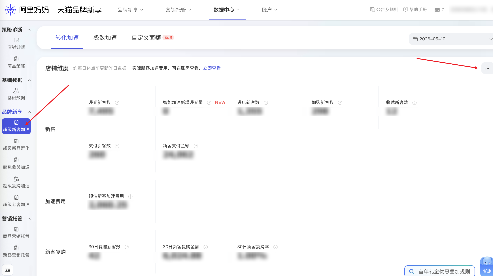

| 属性             | 值                                                                          |
| ---------------- | --------------------------------------------------------------------------- |
| **连接器类型**   | `RPA 连接器`|
| **连接器名称**   | `ODS_品牌新享超级新客加速数据导出明细表(阿里妈妈RPA)`|
| **连接器代码**   | `rpa.conn.alimm.ppxx.data.center.tyroacc.index`|
| **操作类型**     | `文件导出`|
| **目标网页**     | `https://ppxk.tmall.com/new/index.htm#!/data-center/tyroacc/index`|
| **适用场景**     | 采集阿里妈妈品牌新享数据中心「超级新客加速」模块的新客数据指标|
| **数据表名**     | `ods_rpa_alimm_ppxx_data_center_tyroacc_index_du`|
| **业务表名**     | `ODS_品牌新享超级新客加速数据导出明细表(阿里妈妈RPA)`|

### 目标页面

> **取数路径**：阿里妈妈—品牌新享—数据中心—超级新客加速
>
> **取数链接**：[https://ppxk.tmall.com/new/index.htm#!/data-center/tyroacc/index](https://ppxk.tmall.com/new/index.htm#!/data-center/tyroacc/index)



### 业务入参

| 字段 | 中文释义 | 数据类型 | 必填 | 默认值 | 说明 |
| ---- | -------- | -------- | ---- | ------ | ---- |
| `custom_start_date` | 起始日期 | `string` | 否 | 昨天 | 支持格式：`YYYYMMDD` / `YYYY-MM-DD`；须与 `custom_end_date` 同时提供或同时缺省 |
| `custom_end_date` | 结束日期 | `string` | 否 | 昨天 | 支持格式：`YYYYMMDD` / `YYYY-MM-DD`；须与 `custom_start_date` 同时提供或同时缺省；不能超过今天 |

### 入参样例

`YYYYMMDD`：

```json
{
    "custom_start_date": "20260501",
    "custom_end_date": "20260510"
}
```

`YYYY-MM-DD`：

```json
{
    "custom_start_date": "2026-05-01",
    "custom_end_date": "2026-05-10"
}
```

### 入参校验

```json-schema collapsed
{
  "$schema": "https://json-schema.org/draft/2020-12/schema",
  "title": "品牌新享-超级新客加速-数据导出 - 查询入参",
  "description": "采集阿里妈妈品牌新享数据中心「超级新客加速」模块的新客数据指标",
  "type": "object",
  "properties": {
    "custom_start_date": {
      "type": "string",
      "description": "起始日期，支持 YYYYMMDD 或 YYYY-MM-DD；与结束日期同时缺省时默认昨天",
      "pattern": "^(?:\\d{8}|\\d{4}-\\d{2}-\\d{2})$"
    },
    "custom_end_date": {
      "type": "string",
      "description": "结束日期，支持 YYYYMMDD 或 YYYY-MM-DD；不能早于起始日期或晚于今天；与起始日期同时缺省时默认昨天",
      "pattern": "^(?:\\d{8}|\\d{4}-\\d{2}-\\d{2})$"
    }
  },
  "required": [],
  "dependentRequired": {
    "custom_start_date": ["custom_end_date"],
    "custom_end_date": ["custom_start_date"]
  },
  "additionalProperties": false
}
```

### 数据字段

| 字段 | 中文释义 | 数据类型 | 可为空 | 取数路径 | 示例 |
| ---- | -------- | -------- | ------ | -------- | ---- |
| `exposureNewCustomerCnt` | 曝光新客数 | `number` | 否 | `XLSX.0.曝光新客数` | `6507` |
| `smartBoostExposureCnt` | 智能加速新增曝光量 | `number` | 否 | `XLSX.0.智能加速新增曝光量` | `0` |
| `visitNewCustomerCnt` | 进店新客数 | `number` | 否 | `XLSX.0.进店新客数` | `1076` |
| `cartNewCustomerCnt` | 加购新客数 | `number` | 否 | `XLSX.0.加购新客数` | `159` |
| `favorNewCustomerCnt` | 收藏新客数 | `number` | 否 | `XLSX.0.收藏新客数` | `9` |
| `payNewCustomerCnt` | 支付新客数 | `number` | 否 | `XLSX.0.支付新客数` | `78` |
| `newCustomerPayAmount` | 新客支付金额 | `number` | 否 | `XLSX.0.新客支付金额` | `4868.33` |
| `estimatedBoostCost` | 预估新客加速费用 | `number` | 否 | `XLSX.0.预估新客加速费用` | `448.37` |
| `repurchase30dNewCustomerCnt` | 30日复购新客数 | `number` | 否 | `XLSX.0.30日复购新客数` | `47` |
| `repurchase30dAmount` | 30日新客复购金额 | `number` | 否 | `XLSX.0.30日新客复购金额` | `3855.59` |
| `repurchase30dRate` | 30日新客复购率 | `number` | 否 | `XLSX.0.30日新客复购率` | `0.0074` |
| `statDate` | 日期 | `number` | 否 | `XLSX.0.日期` | `20260501` |
| `bizDate` | 业务日期 | `string` | 否 | 附加 |  |
| `accountId` | 授权 ID | `string` | 否 | 附加 |  |
| `taskId` | 任务 ID | `string` | 否 | 附加 |  |

### 数据样例

```json
{
    "exposureNewCustomerCnt": 6507,
    "smartBoostExposureCnt": 0,
    "visitNewCustomerCnt": 1076,
    "cartNewCustomerCnt": 159,
    "favorNewCustomerCnt": 9,
    "payNewCustomerCnt": 78,
    "newCustomerPayAmount": 4868.3279856118,
    "estimatedBoostCost": 448.37,
    "repurchase30dNewCustomerCnt": 47,
    "repurchase30dAmount": 3855.59,
    "repurchase30dRate": 0.0074343562,
    "statDate": 20260501,
    "bizDate": "20260512",
    "accountId": "***",
    "taskId": "dev-0-872d96c9"
}
```

---
