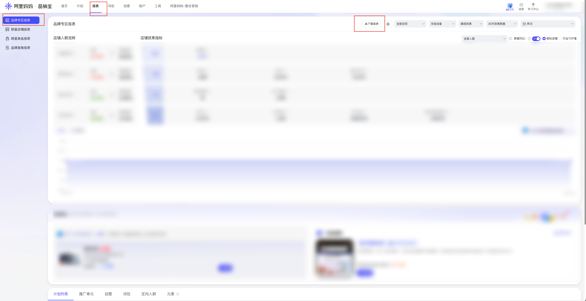

| 属性             | 值                                                                                                                                    |
| ---------------- | ------------------------------------------------------------------------------------------------------------------------------------- |
| **连接器类型**   | `RPA 连接器`|
| **连接器名称**   | `ODS_品销宝品牌专区报表下载明细表(阿里妈妈RPA)`|
| **连接器代码**   | `rpa.conn.alimm.pxb.brand.zone.report`|
| **操作类型**     | `文件导出`|
| **目标网页**     | `https://branding.taobao.com/#!/report/index`|
| **适用场景**     | 下载品销宝品牌专区报表 XLSX，解析账户/推广计划/推广单元/创意/品牌流量包/定向人群六个维度数据并合并返回|
| **数据表名**     | `ods_rpa_alimm_pxb_brand_zone_report_du`|
| **业务表名**     | `ODS_品销宝品牌专区报表下载明细表(阿里妈妈RPA)`|

### 目标页面

> **取数路径**：阿里妈妈—品销宝—报表—品牌专区报表
>
> **取数链接**：[https://branding.taobao.com/#!/report/index](https://branding.taobao.com/#!/report/index)



### 业务入参

| 字段 | 中文释义 | 数据类型 | 必填 | 默认值 | 说明 |
| ---- | -------- | -------- | ---- | ------ | ---- |
| `date_type` | 日期快捷选项 | `String` | 是 | — | 可选值：`today`（今日）、`yesterday`（昨日）、`last_week`（上周）、`this_week`（本周）、`last_month`（上月）、`this_month`（本月）、`last_30_days`（最近30天，含昨日共30天）、`custom`（自定义） |
| `custom_start_date` | 自定义起始日期 | `String` | `date_type = custom` 时必填 | — | 支持格式：`YYYYMMDD`、`YYYY-MM-DD`；须不晚于 `custom_end_date`；须落在可查询窗口内（约今天往前 401 天至今天） |
| `custom_end_date` | 自定义结束日期 | `String` | `date_type = custom` 时必填 | — | 支持格式：`YYYYMMDD`、`YYYY-MM-DD`；最晚为今天；须落在可查询窗口内（约今天往前 401 天至今天） |
| `platform` | 设备平台 | `String` | 否 | `all` | 可选值：`all`（汇总设备）、`wireless`（无线）、`pc`（计算机） |
| `metric_type` | 效果类型 | `String` | 否 | `click` | 可选值：`click`（点击效果）、`impression`（展现效果） |
| `conversion_days` | 转化数据窗口 | `String` | 否 | `days_30` | 可选值：`days_3`（3天转化数据）、`days_7`（7天转化数据）、`days_15`（15天转化数据）、`days_30`（30天转化数据） |

### 入参样例

```json
{
  "date_type": "yesterday"
}
```

```json
{
  "date_type": "custom",
  "custom_start_date": "2026-07-01",
  "custom_end_date": "2026-07-07",
  "platform": "wireless",
  "metric_type": "impression",
  "conversion_days": "days_15"
}
```

```json
{
  "date_type": "last_week",
  "platform": "all",
  "metric_type": "click",
  "conversion_days": "days_7"
}
```

### 入参校验

```json-schema collapsed
{
  "$schema": "https://json-schema.org/draft/2020-12/schema",
  "title": "阿里妈妈-品牌专区报表 - 查询入参",
  "description": "下载品销宝品牌专区报表 XLSX，解析账户/推广计划/推广单元/创意/品牌流量包/定向人群六个维度数据并合并返回",
  "type": "object",
  "properties": {
    "date_type": {
      "type": "string",
      "description": "日期快捷选项。可选值：today（今日）、yesterday（昨日）、last_week（上周）、this_week（本周）、last_month（上月）、this_month（本月）、last_30_days（最近30天）、custom（自定义）",
      "enum": ["today", "yesterday", "last_week", "this_week", "last_month", "this_month", "last_30_days", "custom"]
    },
    "custom_start_date": {
      "type": "string",
      "description": "自定义起始日期，date_type=custom 时必填。支持格式：YYYYMMDD、YYYY-MM-DD；须不晚于 custom_end_date；须落在可查询窗口内（约今天往前 401 天至今天）"
    },
    "custom_end_date": {
      "type": "string",
      "description": "自定义结束日期，date_type=custom 时必填。支持格式：YYYYMMDD、YYYY-MM-DD；最晚为今天；须落在可查询窗口内（约今天往前 401 天至今天）"
    },
    "platform": {
      "type": "string",
      "description": "设备平台。可选值：all（汇总设备）、wireless（无线）、pc（计算机）",
      "enum": ["all", "wireless", "pc"],
      "default": "all"
    },
    "metric_type": {
      "type": "string",
      "description": "效果类型。可选值：click（点击效果）、impression（展现效果）",
      "enum": ["click", "impression"],
      "default": "click"
    },
    "conversion_days": {
      "type": "string",
      "description": "转化数据窗口。可选值：days_3（3天转化数据）、days_7（7天转化数据）、days_15（15天转化数据）、days_30（30天转化数据）",
      "enum": ["days_3", "days_7", "days_15", "days_30"],
      "default": "days_30"
    }
  },
  "required": ["date_type"],
  "allOf": [
    {
      "if": {
        "properties": {
          "date_type": { "const": "custom" }
        },
        "required": ["date_type"]
      },
      "then": {
        "required": ["custom_start_date", "custom_end_date"]
      }
    }
  ],
  "additionalProperties": false
}
```

### 数据字段

输出为单条记录数组。六个 Sheet 解析后合并为同一结构：**每条记录均包含下表全部字段**（元数据 + 维度 + 效果指标），通过 `reportType` 标识来源 Sheet。不属于当前 Sheet 的**维度字段**值为 `null`；**效果指标**各 Sheet 共用同一套字段名，有数据时填充、无数据时为 `null`。

#### 各 Sheet 字段说明

**元数据字段**（六个 Sheet 均有值）：

| 字段 | 中文释义 |
| ---- | -------- |
| `reportType` | 报表维度类型 |
| `bizDate` | 业务日期 |
| `accountId` | 授权 ID |

**效果指标字段**（六个 Sheet 均输出，字段名一致，见下方「数据字段」表中 `searchVolume` 至 `actionTransactionRate`；取数路径为 `XLSX.<Sheet名称>.<中文列名>`）：

`searchVolume`、`impression`、`naturalTrafficExtraImpression`、`reachVisitors`、`searchVisitors`、`researchImpression`、`researchReachVisitors`、`click`、`shopClick`、`clickVisitors`、`ctr`、`storeVisitors`、`interactClick`、`shopCtr`、`researchClick`、`researchClickVisitors`、`shopFavorite`、`itemFavorite`、`itemCart`、`itemView`、`shopView`、`visitDuration`、`shopFavoriteVisitors`、`itemFavoriteVisitors`、`itemCartVisitors`、`itemViewVisitors`、`transactionCount`、`transactionAmount`、`conversionRate`、`presaleTransactionCount`、`transactionVisitors`、`naturalTrafficExtraTransaction`、`presaleTransactionAmount`、`searchStoreEntryRate`、`storeActionRate`、`actionTransactionRate`

**维度字段**（按 Sheet 区分；未列出的维度字段在该 Sheet 下为 `null`）：

| `reportType` | 对应 Sheet | 本 Sheet 有值的维度字段 | 本 Sheet 为 `null` 的维度字段 |
| ------------ | ---------- | ----------------------- | ----------------------------- |
| `account` | 账户 | `date`、`visitorReachRate` | `campaignName`、`adgroupName`、`creativeName`、`keywordPackageName`、`targetAudienceName` |
| `campaign` | 推广计划 | `date`、`campaignName` | `visitorReachRate`、`adgroupName`、`creativeName`、`keywordPackageName`、`targetAudienceName` |
| `adgroup` | 推广单元 | `date`、`campaignName`、`adgroupName` | `visitorReachRate`、`creativeName`、`keywordPackageName`、`targetAudienceName` |
| `creative` | 创意 | `date`、`campaignName`、`adgroupName`、`creativeName` | `visitorReachRate`、`keywordPackageName`、`targetAudienceName` |
| `brand_package` | 品牌流量包 | `date`、`campaignName`、`adgroupName`、`keywordPackageName` | `visitorReachRate`、`creativeName`、`targetAudienceName` |
| `target_audience` | 定向人群 | `date`、`campaignName`、`adgroupName`、`creativeName`、`targetAudienceName` | `visitorReachRate`、`keywordPackageName` |

| 字段 | 中文释义 | 数据类型 | 可为空 | 取数路径 | 示例 |
| ---- | -------- | -------- | ------ | -------- | ---- |
| `reportType` | 报表维度类型 | `String` | 否 | 附加 | `account` |
| `date` | 日期 | `String` | 否 | `XLSX.账户.日期` / `XLSX.推广计划.日期` / `XLSX.推广单元.日期` / `XLSX.创意.日期` / `XLSX.品牌流量包.日期` / `XLSX.定向人群.日期` | `2026-08-06` |
| `visitorReachRate` | 访客触达率 | `Number` | 是 | `XLSX.账户.访客触达率` | `0.977905` |
| `campaignName` | 推广计划名称 | `String` | 是 | `XLSX.推广计划.计划名称` / `XLSX.推广单元.计划名称` / `XLSX.创意.计划名称` / `XLSX.品牌流量包.计划名称` / `XLSX.定向人群.计划名称` | — |
| `adgroupName` | 推广单元名称 | `String` | 是 | `XLSX.推广单元.单元名称` / `XLSX.创意.单元名称` / `XLSX.品牌流量包.单元名称` / `XLSX.定向人群.单元名称` | — |
| `creativeName` | 创意名称 | `String` | 是 | `XLSX.创意.创意名称` / `XLSX.定向人群.创意名称` | — |
| `keywordPackageName` | 品牌流量包/词包名称 | `String` | 是 | `XLSX.品牌流量包.词包名称` | — |
| `targetAudienceName` | 定向人群名称 | `String` | 是 | `XLSX.定向人群.定向人群名称` | — |
| `searchVolume` | 搜索量 | `Number` | 是 | `XLSX.*.搜索量` | `9729` |
| `impression` | 展现量 | `Number` | 是 | `XLSX.*.展现量` | `8974` |
| `naturalTrafficExtraImpression` | 自然流量增量曝光 | `Number` | 是 | `XLSX.*.自然流量增量曝光` | `781` |
| `reachVisitors` | 触达访客数 | `Number` | 是 | `XLSX.*.触达访客数` | `5966` |
| `searchVisitors` | 搜索访客数 | `Number` | 是 | `XLSX.*.搜索访客数` | `6246` |
| `researchImpression` | 回搜展现量 | `Number` | 是 | `XLSX.*.回搜展现量` | `4275` |
| `researchReachVisitors` | 回搜触达访客数 | `Number` | 是 | `XLSX.*.回搜触达访客数` | `2988` |
| `click` | 点击量 | `Number` | 是 | `XLSX.*.点击量` | `2002` |
| `shopClick` | 跳转点击量 | `Number` | 是 | `XLSX.*.跳转点击量` | `2002` |
| `clickVisitors` | 点击访客数 | `Number` | 是 | `XLSX.*.点击访客数` | `1851` |
| `ctr` | 点击率 | `Number` | 是 | `XLSX.*.点击率` | `0.223088` |
| `storeVisitors` | 进店访客数 | `Number` | 是 | `XLSX.*.进店访客数` | `4625` |
| `interactClick` | 互动点击量 | `Number` | 是 | `XLSX.*.互动点击量` | `0` |
| `shopCtr` | 跳转点击率 | `Number` | 是 | `XLSX.*.跳转点击率` | `0.223088` |
| `researchClick` | 回搜点击量 | `Number` | 是 | `XLSX.*.回搜点击量` | `3043` |
| `researchClickVisitors` | 回搜点击访客数 | `Number` | 是 | `XLSX.*.回搜点击访客数` | `2583` |
| `shopFavorite` | 店铺收藏数 | `Number` | 是 | `XLSX.*.店铺收藏数` | `59` |
| `itemFavorite` | 宝贝收藏数 | `Number` | 是 | `XLSX.*.宝贝收藏数` | `91` |
| `itemCart` | 宝贝加购数 | `Number` | 是 | `XLSX.*.宝贝加购数` | `1959` |
| `itemView` | 宝贝浏览数 | `Number` | 是 | `XLSX.*.宝贝浏览数` | `19407` |
| `shopView` | 店铺浏览数 | `Number` | 是 | `XLSX.*.店铺浏览数` | `10077` |
| `visitDuration` | 访问时长 | `Number` | 是 | `XLSX.*.访问时长` | `738815` |
| `shopFavoriteVisitors` | 店铺收藏访客数 | `Number` | 是 | `XLSX.*.店铺收藏访客数` | `60` |
| `itemFavoriteVisitors` | 宝贝收藏访客数 | `Number` | 是 | `XLSX.*.宝贝收藏访客数` | `82` |
| `itemCartVisitors` | 宝贝加购访客数 | `Number` | 是 | `XLSX.*.宝贝加购访客数` | `1365` |
| `itemViewVisitors` | 宝贝浏览访客数 | `Number` | 是 | `XLSX.*.宝贝浏览访客数` | `4409` |
| `transactionCount` | 成交笔数 | `Number` | 是 | `XLSX.*.成交笔数` | `1105` |
| `transactionAmount` | 成交金额 | `Number` | 是 | `XLSX.*.成交金额` | `50804.53` |
| `conversionRate` | 转化率 | `Number` | 是 | `XLSX.*.转化率` | `0.123133` |
| `presaleTransactionCount` | 预售成交笔数 | `Number` | 是 | `XLSX.*.预售成交笔数` | `8` |
| `transactionVisitors` | 成交访客数 | `Number` | 是 | `XLSX.*.成交访客数` | `917` |
| `naturalTrafficExtraTransaction` | 自然流量增量成交 | `Number` | 是 | `XLSX.*.自然流量增量成交` | `1082.587069` |
| `presaleTransactionAmount` | 预售成交金额 | `Number` | 是 | `XLSX.*.预售成交金额` | `1218.9` |
| `searchStoreEntryRate` | 搜索进店率 | `Number` | 是 | `XLSX.*.搜索进店率` | `0.775226` |
| `storeActionRate` | 进店行动率 | `Number` | 是 | `XLSX.*.进店行动率` | `0.431351` |
| `actionTransactionRate` | 行动成交率 | `Number` | 是 | `XLSX.*.行动成交率` | `0.459649` |
| `bizDate` | 业务日期 | `String` | 否 | 附加 | `20260807` |
| `accountId` | 授权 ID | `String` | 否 | 附加 | `1****8` (已脱敏) |

### 数据样例

每条记录均包含全部字段；以下为真实运行输出中账户维度首行（已脱敏）。其他 `reportType` 字段结构相同，非本 Sheet 维度字段为 `null`。

```json
[
  {
    "reportType": "account",
    "bizDate": "20260807",
    "accountId": "1****8",
    "date": "2026-08-06",
    "visitorReachRate": 0.977905,
    "campaignName": null,
    "adgroupName": null,
    "creativeName": null,
    "keywordPackageName": null,
    "targetAudienceName": null,
    "searchVolume": 9729,
    "impression": 8974,
    "naturalTrafficExtraImpression": 781,
    "reachVisitors": 5966,
    "searchVisitors": 6246,
    "researchImpression": 4275,
    "researchReachVisitors": 2988,
    "click": 2002,
    "shopClick": 2002,
    "clickVisitors": 1851,
    "ctr": 0.223088,
    "storeVisitors": 4625,
    "interactClick": 0,
    "shopCtr": 0.223088,
    "researchClick": 3043,
    "researchClickVisitors": 2583,
    "shopFavorite": 59,
    "itemFavorite": 91,
    "itemCart": 1959,
    "itemView": 19407,
    "shopView": 10077,
    "visitDuration": 738815,
    "shopFavoriteVisitors": 60,
    "itemFavoriteVisitors": 82,
    "itemCartVisitors": 1365,
    "itemViewVisitors": 4409,
    "transactionCount": 1105,
    "transactionAmount": 50804.53,
    "conversionRate": 0.123133,
    "presaleTransactionCount": 8,
    "transactionVisitors": 917,
    "naturalTrafficExtraTransaction": 1082.587069,
    "presaleTransactionAmount": 1218.9,
    "searchStoreEntryRate": 0.775226,
    "storeActionRate": 0.431351,
    "actionTransactionRate": 0.459649
  }
]
```

---
