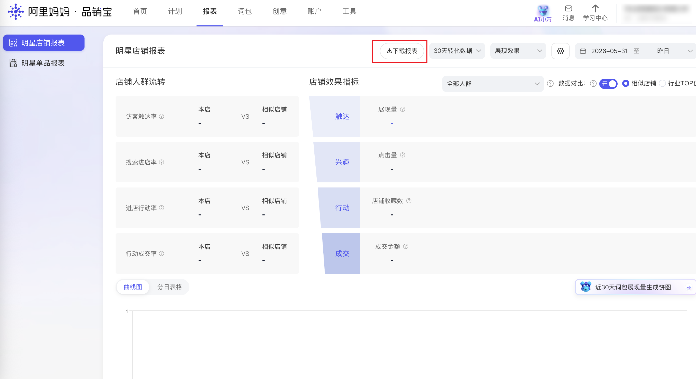

| 属性             | 值                                                                                                                                    |
| ---------------- | ------------------------------------------------------------------------------------------------------------------------------------- |
| **连接器类型**   | `RPA 连接器`|
| **连接器名称**   | `ODS_品销宝明星店铺报表下载明细表(阿里妈妈RPA)`|
| **连接器代码**   | `rpa.conn.alimm.pxb.star.shop.report`|
| **操作类型**     | `文件导出`|
| **目标网页**     | `https://branding.taobao.com/#!/report/index`|
| **适用场景**     | 下载品销宝明星店铺报表 XLSX，解析账户/推广计划/推广单元/创意/品牌流量包/定向人群六个维度数据并合并返回|
| **数据表名**     | `ods_rpa_alimm_pxb_star_shop_report_du`|
| **业务表名**     | `ODS_品销宝明星店铺报表下载明细表(阿里妈妈RPA)`|

### 目标页面

> **取数路径**：阿里妈妈—品销宝—报表中心—明星店铺
>
> **取数链接**：[https://branding.taobao.com/#!/report/index](https://branding.taobao.com/#!/report/index)



### 业务入参

| 字段 | 中文释义 | 数据类型 | 必填 | 默认值 | 说明 |
| ---- | -------- | -------- | ---- | ------ | ---- |
| `conversion_days` | 转化数据窗口 | `String` | 否 | `days_7` | 可选值：`days_3`（3天转化数据）、`days_7`（7天转化数据）、`days_15`（15天转化数据）、`days_30`（30天转化数据） |
| `metric_type` | 效果类型 | `String` | 否 | `impression` | 可选值：`impression`（展现效果）、`click`（点击效果） |
| `date_type` | 日期快捷选项 | `String` | 否 | `yesterday` | 可选值：`today`（今日）、`yesterday`（昨日）、`last_week`（上周）、`this_week`（本周）、`last_month`（上月）、`this_month`（本月）、`custom`（自定义） |
| `custom_start_date` | 自定义起始日期 | `String` | `date_type = custom` 时必填 | — | 支持格式：`YYYYMMDD`、`YYYY-MM-DD` |
| `custom_end_date` | 自定义结束日期 | `String` | `date_type = custom` 时必填 | — | 支持格式：`YYYYMMDD`、`YYYY-MM-DD`；最晚为今天；与 `custom_start_date` 天差须小于 180 天 |

### 入参样例

```json
{
  "date_type": "yesterday"
}
```

```json
{
  "conversion_days": "days_15",
  "metric_type": "click",
  "date_type": "last_week"
}
```

```json
{
  "date_type": "custom",
  "custom_start_date": "2026-06-01",
  "custom_end_date": "2026-06-29"
}
```

### 入参校验

```json-schema collapsed
{
  "$schema": "https://json-schema.org/draft/2020-12/schema",
  "title": "阿里妈妈-明星店铺报表 - 查询入参",
  "description": "下载品销宝明星店铺报表 XLSX，解析账户/推广计划/推广单元/创意/品牌流量包/定向人群六个维度数据并合并返回",
  "type": "object",
  "properties": {
    "conversion_days": {
      "type": "string",
      "description": "转化数据窗口。可选值：days_3（3天转化数据）、days_7（7天转化数据）、days_15（15天转化数据）、days_30（30天转化数据）",
      "enum": ["days_3", "days_7", "days_15", "days_30"],
      "default": "days_7"
    },
    "metric_type": {
      "type": "string",
      "description": "效果类型。可选值：impression（展现效果）、click（点击效果）",
      "enum": ["impression", "click"],
      "default": "impression"
    },
    "date_type": {
      "type": "string",
      "description": "日期快捷选项。可选值：today（今日）、yesterday（昨日）、last_week（上周）、this_week（本周）、last_month（上月）、this_month（本月）、custom（自定义）",
      "enum": ["today", "yesterday", "last_week", "this_week", "last_month", "this_month", "custom"],
      "default": "yesterday"
    },
    "custom_start_date": {
      "type": "string",
      "description": "自定义起始日期，date_type=custom 时必填。支持格式：YYYYMMDD、YYYY-MM-DD"
    },
    "custom_end_date": {
      "type": "string",
      "description": "自定义结束日期，date_type=custom 时必填。支持格式：YYYYMMDD、YYYY-MM-DD；最晚为今天；与 custom_start_date 天差须小于 180 天"
    }
  },
  "required": [],
  "allOf": [
    {
      "if": {
        "properties": {
          "date_type": { "const": "custom" }
        },
        "required": ["date_type"]
      },
      "then": {
        "required": ["custom_start_date", "custom_end_date"]
      }
    }
  ],
  "additionalProperties": false
}
```

### 数据字段

输出为单条记录数组。六个 Sheet 解析后合并为同一结构：**每条记录均包含下表全部字段**（元数据 + 维度 + 效果指标），通过 `reportType` 标识来源 Sheet。不属于当前 Sheet 的**维度字段**值为 `null`；**效果指标**各 Sheet 共用同一套字段名，有数据时填充、无数据时为 `null`。

#### 各 Sheet 字段说明

**元数据字段**（六个 Sheet 均有值）：

| 字段 | 中文释义 |
| ---- | -------- |
| `reportType` | 报表维度类型 |
| `bizDate` | 业务日期 |
| `accountId` | 授权 ID |

**效果指标字段**（六个 Sheet 均输出，字段名一致，见下方「数据字段」表中 `searchVolume` 至 `actionTransactionRate` 共 35 项；取数路径为 `XLSX.<Sheet名称>.<中文列名>`）：

`searchVolume`、`searchVisitors`、`impression`、`naturalTrafficExtraImpression`、`cost`、`reachVisitors`、`cpm`、`cpc`、`shopCpc`、`click`、`shopClick`、`clickVisitors`、`interactClick`、`ctr`、`shopCtr`、`storeVisitors`、`shopFavorite`、`itemFavorite`、`itemCart`、`actionVisitors`、`shopFavoriteVisitors`、`itemFavoriteVisitors`、`itemCartVisitors`、`transactionCount`、`transactionAmount`、`roi`、`conversionRate`、`naturalTrafficExtraTransaction`、`presaleTransactionCount`、`presaleTransactionAmount`、`transactionVisitors`、`searchStoreEntryRate`、`storeActionRate`、`actionTransactionRate`

**维度字段**（按 Sheet 区分；未列出的维度字段在该 Sheet 下为 `null`）：

| `reportType` | 对应 Sheet | 本 Sheet 有值的维度字段 | 本 Sheet 为 `null` 的维度字段 |
| ------------ | ---------- | ----------------------- | ----------------------------- |
| `account` | 账户 | `date`、`visitorReachRate` | `campaignName`、`adgroupName`、`creativeName`、`keywordPackageName`、`targetAudienceName` |
| `campaign` | 推广计划 | `date`、`campaignName` | `visitorReachRate`、`adgroupName`、`creativeName`、`keywordPackageName`、`targetAudienceName` |
| `adgroup` | 推广单元 | `date`、`campaignName`、`adgroupName` | `visitorReachRate`、`creativeName`、`keywordPackageName`、`targetAudienceName` |
| `creative` | 创意 | `date`、`campaignName`、`adgroupName`、`creativeName` | `visitorReachRate`、`keywordPackageName`、`targetAudienceName` |
| `brand_package` | 品牌流量包 | `date`、`campaignName`、`adgroupName`、`keywordPackageName` | `visitorReachRate`、`creativeName`、`targetAudienceName` |
| `target_audience` | 定向人群 | `date`、`campaignName`、`adgroupName`、`creativeName`、`targetAudienceName` | `visitorReachRate`、`keywordPackageName` |

#### 完整字段列表

| 字段 | 中文释义 | 数据类型 | 可为空 | 取数路径 | 示例 |
| ---- | -------- | -------- | ------ | -------- | ---- |
| `reportType` | 报表维度类型 | `String` | 否 | 附加 | `account` |
| `date` | 日期 | `String` | 否 | `XLSX.账户.日期` / `XLSX.推广计划.日期` / `XLSX.推广单元.日期` / `XLSX.创意.日期` / `XLSX.品牌流量包.日期` / `XLSX.定向人群.日期` | `2026-06-29` |
| `visitorReachRate` | 访客触达率 | `Number / String` | 是 | `XLSX.账户.访客触达率` | `0.1256` |
| `campaignName` | 推广计划名称 | `String` | 是 | `XLSX.推广计划.计划名称` / `XLSX.推广单元.计划名称` / `XLSX.创意.计划名称` / `XLSX.品牌流量包.计划名称` / `XLSX.定向人群.计划名称` | `618明星店铺主推计划` |
| `adgroupName` | 推广单元名称 | `String` | 是 | `XLSX.推广单元.单元名称` / `XLSX.创意.单元名称` / `XLSX.品牌流量包.单元名称` / `XLSX.定向人群.单元名称` | `品牌词单元A` |
| `creativeName` | 创意名称 | `String` | 是 | `XLSX.创意.创意名称` / `XLSX.定向人群.创意名称` | `618主视觉创意01` |
| `keywordPackageName` | 品牌流量包名称 | `String` | 是 | `XLSX.品牌流量包.词包名称` | `品牌核心词包` |
| `targetAudienceName` | 定向人群名称 | `String` | 是 | `XLSX.定向人群.定向人群名称` | `高潜兴趣人群` |
| `searchVolume` | 搜索量 | `Number` | 是 | `XLSX.*.搜索量` | `12580` |
| `searchVisitors` | 搜索访客数 | `Number` | 是 | `XLSX.*.搜索访客数` | `8960` |
| `impression` | 展现量 | `Number` | 是 | `XLSX.*.展现量` | `256000` |
| `naturalTrafficExtraImpression` | 自然流量增量曝光 | `Number` | 是 | `XLSX.*.自然流量增量曝光` | `12800` |
| `cost` | 消耗 | `Number` | 是 | `XLSX.*.消耗` | `3580.50` |
| `reachVisitors` | 触达访客数 | `Number` | 是 | `XLSX.*.触达访客数` | `45200` |
| `cpm` | 千次展现成本 | `Number` | 是 | `XLSX.*.千次展现成本` | `13.98` |
| `cpc` | 点击单价 | `Number` | 是 | `XLSX.*.点击单价` | `1.25` |
| `shopCpc` | 跳转点击单价 | `Number` | 是 | `XLSX.*.跳转点击单价` | `0.98` |
| `click` | 点击量 | `Number` | 是 | `XLSX.*.点击量` | `2860` |
| `shopClick` | 跳转点击量 | `Number` | 是 | `XLSX.*.跳转点击量` | `2150` |
| `clickVisitors` | 点击访客数 | `Number` | 是 | `XLSX.*.点击访客数` | `1980` |
| `interactClick` | 互动点击量 | `Number` | 是 | `XLSX.*.互动点击量` | `320` |
| `ctr` | 点击率 | `Number / String` | 是 | `XLSX.*.点击率` | `0.0112` |
| `shopCtr` | 跳转点击率 | `Number / String` | 是 | `XLSX.*.跳转点击率` | `0.0084` |
| `storeVisitors` | 进店访客数 | `Number` | 是 | `XLSX.*.进店访客数` | `1680` |
| `shopFavorite` | 店铺收藏数 | `Number` | 是 | `XLSX.*.店铺收藏数` | `86` |
| `itemFavorite` | 宝贝收藏数 | `Number` | 是 | `XLSX.*.宝贝收藏数` | `142` |
| `itemCart` | 宝贝加购数 | `Number` | 是 | `XLSX.*.宝贝加购数` | `215` |
| `actionVisitors` | 行动访客数 | `Number` | 是 | `XLSX.*.行动访客数` | `520` |
| `shopFavoriteVisitors` | 店铺收藏访客数 | `Number` | 是 | `XLSX.*.店铺收藏访客数` | `72` |
| `itemFavoriteVisitors` | 宝贝收藏访客数 | `Number` | 是 | `XLSX.*.宝贝收藏访客数` | `118` |
| `itemCartVisitors` | 宝贝加购访客数 | `Number` | 是 | `XLSX.*.宝贝加购访客数` | `186` |
| `transactionCount` | 成交笔数 | `Number` | 是 | `XLSX.*.成交笔数` | `48` |
| `transactionAmount` | 成交金额 | `Number` | 是 | `XLSX.*.成交金额` | `28650.00` |
| `roi` | 回报率 | `Number / String` | 是 | `XLSX.*.回报率` | `8.00` |
| `conversionRate` | 转化率 | `Number / String` | 是 | `XLSX.*.转化率` | `0.0286` |
| `naturalTrafficExtraTransaction` | 自然流量增量成交 | `Number` | 是 | `XLSX.*.自然流量增量成交` | `3200.00` |
| `presaleTransactionCount` | 预售成交笔数 | `Number` | 是 | `XLSX.*.预售成交笔数` | `12` |
| `presaleTransactionAmount` | 预售成交金额 | `Number` | 是 | `XLSX.*.预售成交金额` | `5600.00` |
| `transactionVisitors` | 成交访客数 | `Number` | 是 | `XLSX.*.成交访客数` | `42` |
| `searchStoreEntryRate` | 搜索进店率 | `Number / String` | 是 | `XLSX.*.搜索进店率` | `0.1875` |
| `storeActionRate` | 进店行动率 | `Number / String` | 是 | `XLSX.*.进店行动率` | `0.3095` |
| `actionTransactionRate` | 行动成交率 | `Number / String` | 是 | `XLSX.*.行动成交率` | `0.0923` |
| `bizDate` | 业务日期 | `String` | 否 | 附加 |  |
| `accountId` | 授权 ID | `String` | 否 | 附加 |  |

### 数据样例

每条记录均包含全部字段，字段顺序与输出一致。维度字段中不属于该 Sheet 的为 `null`；效果指标各 Sheet 共用，均有值（单元格无数据时为 `null`）（因提供账号无数据，下方为mock数据）。

```json
[
  {
    "reportType": "account",
    "bizDate": "20250630",
    "accountId": "***",
    "date": "2026-06-29",
    "visitorReachRate": 0.1256,
    "campaignName": null,
    "adgroupName": null,
    "creativeName": null,
    "keywordPackageName": null,
    "targetAudienceName": null,
    "searchVolume": 12580,
    "searchVisitors": 8960,
    "impression": 256000,
    "naturalTrafficExtraImpression": 12800,
    "cost": 3580.50,
    "reachVisitors": 45200,
    "cpm": 13.98,
    "cpc": 1.25,
    "shopCpc": 0.98,
    "click": 2860,
    "shopClick": 2150,
    "clickVisitors": 1980,
    "interactClick": 320,
    "ctr": 0.0112,
    "shopCtr": 0.0084,
    "storeVisitors": 1680,
    "shopFavorite": 86,
    "itemFavorite": 142,
    "itemCart": 215,
    "actionVisitors": 520,
    "shopFavoriteVisitors": 72,
    "itemFavoriteVisitors": 118,
    "itemCartVisitors": 186,
    "transactionCount": 48,
    "transactionAmount": 28650.00,
    "roi": 8.00,
    "conversionRate": 0.0286,
    "naturalTrafficExtraTransaction": 3200.00,
    "presaleTransactionCount": 12,
    "presaleTransactionAmount": 5600.00,
    "transactionVisitors": 42,
    "searchStoreEntryRate": 0.1875,
    "storeActionRate": 0.3095,
    "actionTransactionRate": 0.0923
  },
  {
    "reportType": "campaign",
    "bizDate": "20250630",
    "accountId": "***",
    "date": "2026-06-29",
    "visitorReachRate": null,
    "campaignName": "618明星店铺主推计划",
    "adgroupName": null,
    "creativeName": null,
    "keywordPackageName": null,
    "targetAudienceName": null,
    "searchVolume": 8200,
    "searchVisitors": 6120,
    "impression": 168000,
    "naturalTrafficExtraImpression": 8400,
    "cost": 2150.00,
    "reachVisitors": 29800,
    "cpm": 12.80,
    "cpc": 1.16,
    "shopCpc": 0.92,
    "click": 1860,
    "shopClick": 1420,
    "clickVisitors": 1280,
    "interactClick": 210,
    "ctr": 0.0111,
    "shopCtr": 0.0085,
    "storeVisitors": 1120,
    "shopFavorite": 58,
    "itemFavorite": 96,
    "itemCart": 148,
    "actionVisitors": 360,
    "shopFavoriteVisitors": 48,
    "itemFavoriteVisitors": 82,
    "itemCartVisitors": 126,
    "transactionCount": 32,
    "transactionAmount": 19200.00,
    "roi": 8.93,
    "conversionRate": 0.0256,
    "naturalTrafficExtraTransaction": 2100.00,
    "presaleTransactionCount": 8,
    "presaleTransactionAmount": 3800.00,
    "transactionVisitors": 28,
    "searchStoreEntryRate": 0.1833,
    "storeActionRate": 0.3214,
    "actionTransactionRate": 0.0889
  },
  {
    "reportType": "creative",
    "bizDate": "20250630",
    "accountId": "***",
    "date": "2026-06-29",
    "visitorReachRate": null,
    "campaignName": "618明星店铺主推计划",
    "adgroupName": "品牌词单元A",
    "creativeName": "618主视觉创意01",
    "keywordPackageName": null,
    "targetAudienceName": null,
    "searchVolume": 3200,
    "searchVisitors": 2480,
    "impression": 56000,
    "naturalTrafficExtraImpression": 2800,
    "cost": 680.00,
    "reachVisitors": 9800,
    "cpm": 12.14,
    "cpc": 1.10,
    "shopCpc": 0.88,
    "click": 620,
    "shopClick": 480,
    "clickVisitors": 420,
    "interactClick": 68,
    "ctr": 0.0111,
    "shopCtr": 0.0086,
    "storeVisitors": 380,
    "shopFavorite": 18,
    "itemFavorite": 32,
    "itemCart": 48,
    "actionVisitors": 120,
    "shopFavoriteVisitors": 14,
    "itemFavoriteVisitors": 26,
    "itemCartVisitors": 40,
    "transactionCount": 8,
    "transactionAmount": 4800.00,
    "roi": 7.06,
    "conversionRate": 0.0211,
    "naturalTrafficExtraTransaction": 520.00,
    "presaleTransactionCount": 2,
    "presaleTransactionAmount": 960.00,
    "transactionVisitors": 7,
    "searchStoreEntryRate": 0.1532,
    "storeActionRate": 0.3158,
    "actionTransactionRate": 0.0583
  }
]
```

---
