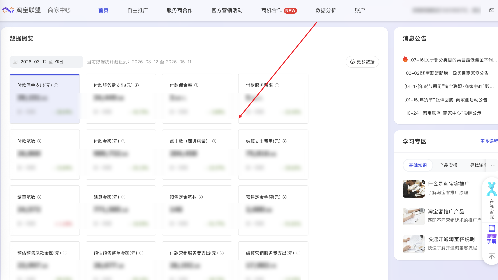

| 属性             | 值                                                                                       |
| ---------------- | ---------------------------------------------------------------------------------------- |
| **连接器类型**   | `RPA 连接器`|
| **连接器名称**   | `ODS_淘宝联盟商家中心数据概览(阿里妈妈RPA)`|
| **连接器代码**   | `rpa.conn.alimm.tblm.home.overview`|
| **操作类型**     | `页面解析`|
| **目标网页**     | `https://ad.alimama.com/portal/v2/dashboard.htm`|
| **适用场景**     | 采集淘宝联盟商家中心 Dashboard 数据概览指标，支持快捷日期与自定义日期范围|
| **数据表名**     | `ods_rpa_alimm_tblm_home_overview_du`|
| **业务表名**     | `ODS_淘宝联盟商家中心数据概览(阿里妈妈RPA)`|

### 目标页面

> **取数路径**：阿里妈妈—淘宝联盟—商家中心—数据概览
>
> **取数链接**：[https://ad.alimama.com/portal/v2/dashboard.htm](https://ad.alimama.com/portal/v2/dashboard.htm)



### 业务入参

| 字段 | 中文释义 | 数据类型 | 必填 | 默认值 | 说明 |
| ---- | -------- | -------- | ---- | ------ | ---- |
| `date_type` | 时间类型 | `string` | 是 | — | 可选值：`today_realtime` / `yesterday` / `last_7_days` / `last_15_days` / `last_30_days` / `last_60_days` / `last_90_days` / `custom` |
| `custom_start_date` | 自定义起始日期 | `string` | 否 | — | 支持格式：`YYYYMMDD` / `YYYY-MM-DD`；仅 `date_type=custom` 时必填 |
| `custom_end_date` | 自定义结束日期 | `string` | 否 | — | 支持格式：`YYYYMMDD` / `YYYY-MM-DD`；仅 `date_type=custom` 时必填；不能晚于昨天；自定义范围不超过 90 天 |

### 入参样例

```json
{
    "date_type": "last_7_days"
}
```

```json
{
    "date_type": "yesterday"
}
```

自定义日期（`YYYYMMDD`）：

```json
{
    "date_type": "custom",
    "custom_start_date": "20260501",
    "custom_end_date": "20260510"
}
```

自定义日期（`YYYY-MM-DD`）：

```json
{
    "date_type": "custom",
    "custom_start_date": "2026-05-01",
    "custom_end_date": "2026-05-10"
}
```

### 数据字段

| 字段 | 中文释义 | 数据类型 | 可为空 | 取数路径 | 示例 |
| ---- | -------- | -------- | ------ | -------- | ---- |
| `payOrdCfee` | 付款佣金支出(元) | `number` | 是 | `pay_ord_cfee_8` | `39151.4099` |
| `payOrdSfee` | 付款服务费支出(元) | `number` | 是 | `pay_ord_sfee_8` | `34449.98` |
| `payOrdCfeeRt` | 付款佣金率 | `number` | 是 | `pay_ord_cfee_rt_8` | `0.0395` |
| `paySerOrdSfeeRt` | 付款服务费率 | `number` | 是 | `pay_ser_ord_sfee_rt_8` | `0.0512` |
| `payOrdNum` | 付款笔数 | `number` | 是 | `pay_ord_num_8` | `26860.0` |
| `payOrdAmt` | 付款金额(元) | `number` | 是 | `pay_ord_amt_8` | `989732.9899` |
| `uclkPv` | 点击数(进店量) | `number` | 是 | `uclk_pv_8` | `204458` |
| `settOrdTotalFee` | 结算支出费用(元) | `number` | 是 | `sett_ord_total_fee_8` | `75816.46` |
| `settOrdNum` | 结算笔数 | `number` | 是 | `sett_ord_num_8` | `24572` |
| `settOrdAmt` | 结算金额(元) | `number` | 是 | `sett_ord_amt_8` | `771585.18` |
| `depOrdNum` | 预售定金笔数 | `number` | 是 | `dep_ord_num_8` | `146` |
| `depOrdTotalAmt` | 预售定金金额(元) | `number` | 是 | `dep_ord_total_amt_8` | `26677.1999` |
| `depOrdDepAmt` | 预估预售尾款金额(元) | `number` | 是 | `dep_ord_dep_amt_8` | `2680.0` |
| `depOrdRestAmt` | 预估预售整单金额(元) | `number` | 是 | `dep_ord_rest_amt_8` | `23997.1999` |
| `payBmktFee` | 付款营销服务费支出(元) | `number` | 是 | `pay_bmkt_fee_8` | `26192.2` |
| `settBmktFee` | 结算营销服务费支出(元) | `number` | 是 | `sett_bmkt_fee_8` | `17983.79` |
| `payOrdTotalFee` | 付款总支出(元) | `number` | 是 | `pay_ord_total_fee_8` | `99793.5899` |
| `settOrdCfee` | 结算佣金(元) | `number` | 是 | `sett_ord_cfee_8` | `28496.55` |
| `settOrdSfee` | 结算服务费(元) | `number` | 是 | `sett_ord_sfee_8` | `29336.12` |
| `settOrdCfeeRt` | 结算佣金率 | `number` | 是 | `sett_ord_cfee_rt_8` | `0.0369` |
| `paySerOrdAmt` | 付款服务费金额(元) | `number` | 是 | `pay_ser_ord_amt_8` | `671571.2099` |
| `settSerOrdAmt` | 结算服务费金额(元) | `number` | 是 | `sett_ser_ord_amt_8` | `471440.88` |
| `uclkUv` | 访客数 | `number` | 是 | `uclk_uv_8` | `108860.0` |
| `confOrdNum` | 确认订单数 | `number` | 是 | `conf_ord_num_8` | `25533` |
| `confOrdAmt` | 确认订单金额(元) | `number` | 是 | `conf_ord_amt_8` | `771528.6` |
| `confOrdUv` | 确认订单UV | `number` | 是 | `conf_ord_uv_8` | `17565` |
| `payOrdUv` | 付款订单UV | `number` | 是 | `pay_ord_uv_8` | `17234` |
| `settOrdUv` | 结算订单UV | `number` | 是 | `sett_ord_uv_8` | `17537` |
| `payItmQty` | 付款商品件数 | `number` | 是 | `pay_itm_qty_8` | `31177` |
| `payPitmQtyTfee` | 付款件单价(元) | `number` | 是 | `pay_pitm_qty_tfee_8` | `2.3607` |
| `unionCvr` | 转化率 | `number` | 是 | `union_cvr_8` | `0.1313` |
| `uclkItmNum` | 点击商品数 | `number` | 是 | `uclk_itm_num_8` | `7196` |
| `sendCpnPv` | 发放优惠券数 | `number` | 是 | `send_cpn_pv_8` | `53313` |
| `cartItmQty` | 加购件数 | `number` | 是 | `cart_itm_qty_8` | `31965` |
| `cltItmPv` | 收藏商品数 | `number` | 是 | `clt_itm_pv_8` | `1690.0` |
| `depOrdTotalCfee` | 预售定金佣金(元) | `number` | 是 | `dep_ord_total_cfee_8` | `1361.384` |
| `depOrdTotalCfeeRt` | 预售定金佣金率 | `number` | 是 | `dep_ord_total_cfee_rt_8` | `0.051` |
| `sellerId` | 卖家ID | `number` | 是 | `seller_id` | `2208761467628` |
| `bizDate` | 业务日期 | `string` | 否 | 附加 |  |
| `accountId` | 授权 ID | `string` | 否 | 附加 |  |
| `taskId` | 任务 ID | `string` | 否 | 附加 |  |

### 数据样例

```json
{
    "payOrdCfee": 39151.4099,
    "payOrdSfee": 34449.98,
    "payOrdCfeeRt": 0.0395,
    "paySerOrdSfeeRt": 0.0512,
    "payOrdNum": 26860.0,
    "payOrdAmt": 989732.9899,
    "uclkPv": 204458,
    "settOrdTotalFee": 75816.46,
    "settOrdNum": 24572,
    "settOrdAmt": 771585.18,
    "depOrdNum": 146,
    "depOrdTotalAmt": 26677.1999,
    "depOrdDepAmt": 2680.0,
    "depOrdRestAmt": 23997.1999,
    "payBmktFee": 26192.2,
    "settBmktFee": 17983.79,
    "payOrdTotalFee": 99793.5899,
    "settOrdCfee": 28496.55,
    "settOrdSfee": 29336.12,
    "settOrdCfeeRt": 0.0369,
    "paySerOrdAmt": 671571.2099,
    "settSerOrdAmt": 471440.88,
    "uclkUv": 108860.0,
    "confOrdNum": 25533,
    "confOrdAmt": 771528.6,
    "confOrdUv": 17565,
    "payOrdUv": 17234,
    "settOrdUv": 17537,
    "payItmQty": 31177,
    "payPitmQtyTfee": 2.3607,
    "unionCvr": 0.1313,
    "uclkItmNum": 7196,
    "sendCpnPv": 53313,
    "cartItmQty": 31965,
    "cltItmPv": 1690.0,
    "depOrdTotalCfee": 1361.384,
    "depOrdTotalCfeeRt": 0.051,
    "sellerId": 2208761467628,
    "bizDate": "20260512",
    "accountId": "***",
    "taskId": "dev-0-3f97cf39"
}
```

---
