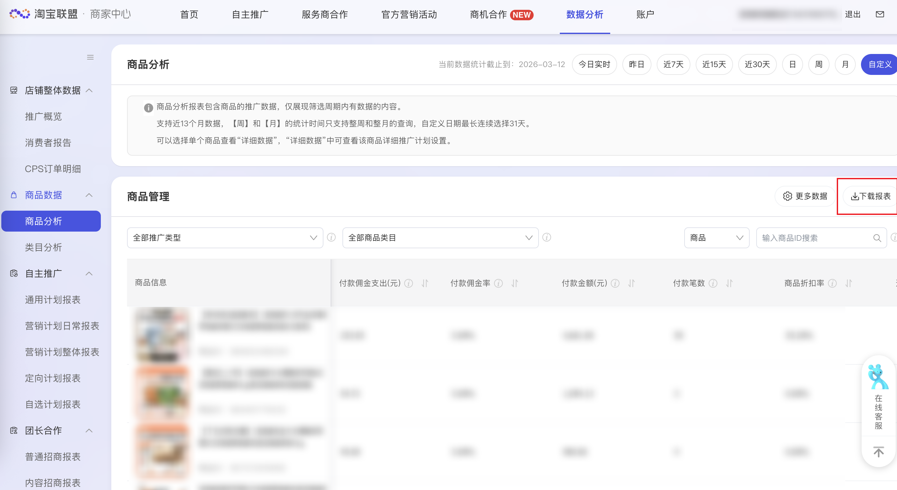

| 属性             | 值                                                                                       |
| ---------------- | ---------------------------------------------------------------------------------------- |
| **连接器类型**   | `RPA 连接器`|
| **连接器名称**   | `ODS_淘宝联盟商家中心商品分析明细表(阿里妈妈RPA)`|
| **连接器代码**   | `rpa.conn.alimm.tblm.item.analysis`|
| **操作类型**     | `页面解析` + `文件导出`|
| **目标网页**     | `https://ad.alimama.com/portal/v2/report/item/list.htm`|
| **适用场景**     | 采集淘宝联盟商家中心商品分析报表，按商品维度导出付款、结算、预售及进店转化等指标，支持快捷日期与自定义日期范围|
| **数据表名**     | `ods_rpa_alimm_tblm_item_analysis_du`|
| **业务表名**     | `ODS_淘宝联盟商家中心商品分析明细表(阿里妈妈RPA)`|

### 目标页面

> **取数路径**：阿里妈妈—淘宝联盟—商家中心—商品分析
>
> **取数链接**：[https://ad.alimama.com/portal/v2/report/item/list.htm](https://ad.alimama.com/portal/v2/report/item/list.htm)



### 业务入参

| 字段 | 中文释义 | 数据类型 | 必填 | 默认值 | 说明 |
| ---- | -------- | -------- | ---- | ------ | ---- |
| `date_type` | 时间类型 | `String` | 是 | — | 可选值：`TODAY_REALTIME`（今日实时）、`YESTERDAY`（昨日）、`LAST_7_DAYS`（近7天）、`LAST_15_DAYS`（近15天）、`LAST_30_DAYS`（近30天）、`CUSTOM`（自定义） |
| `custom_start_date` | 自定义起始日期 | `String` | 否 | — | 仅 `date_type=CUSTOM` 时必填；支持格式：YYYYMMDD、YYYY-MM-DD；不能早于近一年；不能晚于 `custom_end_date`；与结束日期跨度不超过 31 天；选定时间后，连接器会读取页面「当前数据统计截止到」所示的实际统计日期进行回验；若与所选时间不一致，任务判定为失败。 |
| `custom_end_date` | 自定义结束日期 | `String` | 否 | — | 仅 `date_type=CUSTOM` 时必填；支持格式：YYYYMMDD、YYYY-MM-DD；不能晚于当天；`CUSTOM` 模式下须与页面实际统计日期一致，否则任务失败 |

### 入参样例

```json
{
  "date_type": "LAST_7_DAYS"
}
```

```json
{
  "date_type": "YESTERDAY"
}
```

```json
{
  "date_type": "CUSTOM",
  "custom_start_date": "2026-03-12",
  "custom_end_date": "2026-03-12"
}
```

### 入参校验

```json-schema collapsed
{
  "$schema": "https://json-schema.org/draft/2020-12/schema",
  "title": "淘宝联盟-商品分析 - 查询入参",
  "description": "采集淘宝联盟商家中心商品分析报表，按商品维度导出付款、结算、预售及进店转化等指标，支持快捷日期与自定义日期范围",
  "type": "object",
  "properties": {
    "date_type": {
      "type": "string",
      "description": "时间类型。可选值：TODAY_REALTIME（今日实时）、YESTERDAY（昨日）、LAST_7_DAYS（近7天）、LAST_15_DAYS（近15天）、LAST_30_DAYS（近30天）、CUSTOM（自定义）",
      "enum": [
        "TODAY_REALTIME",
        "YESTERDAY",
        "LAST_7_DAYS",
        "LAST_15_DAYS",
        "LAST_30_DAYS",
        "CUSTOM"
      ]
    },
    "custom_start_date": {
      "type": "string",
      "description": "自定义起始日期，仅 date_type=CUSTOM 时必填；支持格式 YYYYMMDD 或 YYYY-MM-DD；不能早于近一年；不能晚于 custom_end_date；与结束日期跨度不超过 31 天；须与页面实际统计日期一致",
      "anyOf": [
        { "pattern": "^\\d{8}$" },
        { "pattern": "^\\d{4}-\\d{2}-\\d{2}$" }
      ]
    },
    "custom_end_date": {
      "type": "string",
      "description": "自定义结束日期，仅 date_type=CUSTOM 时必填；支持格式 YYYYMMDD 或 YYYY-MM-DD；不能晚于当天；CUSTOM 模式下须与页面实际统计日期一致",
      "anyOf": [
        { "pattern": "^\\d{8}$" },
        { "pattern": "^\\d{4}-\\d{2}-\\d{2}$" }
      ]
    }
  },
  "required": ["date_type"],
  "if": {
    "properties": {
      "date_type": { "const": "CUSTOM" }
    }
  },
  "then": {
    "required": ["custom_start_date", "custom_end_date"]
  },
  "additionalProperties": false
}
```

### 数据字段

| 字段 | 中文释义 | 数据类型 | 可为空 | 取数路径 | 示例 |
| ---- | -------- | -------- | ------ | -------- | ---- |
| `item_id` | 商品 ID | `Number` | 否 | `CSV.商品ID` | `895832466294` |
| `item_title` | 商品标题 | `String` | 否 | `CSV.商品标题` | `【林依轮直播间】连咖啡12杯金奖鲜萃咖啡意式浓缩黑咖啡美式拿铁` |
| `item_url` | 商品链接 | `String` | 否 | `CSV.商品链接` | `http://item.taobao.com/item.htm?id=895832466294` |
| `pay_commission_fee` | 付款佣金支出(元) | `Number` | 是 | `CSV.付款佣金支出(元)` | `233.05` |
| `pay_commission_rate` | 付款佣金率 | `String` | 是 | `CSV.付款佣金率` | `5.00%` |
| `pay_amount` | 付款金额(元) | `Number` | 是 | `CSV.付款金额(元)` | `4661.0` |
| `pay_order_count` | 付款笔数 | `Number` | 是 | `CSV.付款笔数` | `59` |
| `item_discount_rate` | 商品折扣率 | `String` | 是 | `CSV.商品折扣率` | `35.20%` |
| `enter_shop_pv` | 进店量 | `Number` | 是 | `CSV.进店量` | `821` |
| `favorite_item_count` | 收藏宝贝量 | `Number` | 是 | `CSV.收藏宝贝量` | `1` |
| `cart_add_count` | 添加购物车量 | `Number` | 是 | `CSV.添加购物车量` | `26` |
| `presale_deposit_count` | 预售定金笔数 | `Number` | 是 | `CSV.预售定金笔数` | `0` |
| `presale_deposit_amount` | 预售定金金额(元) | `Number` | 是 | `CSV.预售定金金额(元)` | `0.0` |
| `presale_est_rest_amount` | 预估预售尾款金额(元) | `Number` | 是 | `CSV.预估预售尾款金额(元)` | `0.0` |
| `presale_est_total_amount` | 预估预售整单金额(元) | `Number` | 是 | `CSV.预估预售整单金额(元)` | `0.0` |
| `pay_service_fee` | 付款服务费支出(元) | `Number` | 是 | `CSV.付款服务费支出(元)` | `699.15` |
| `pay_total_fee` | 付款支出费用(元) | `Number` | 是 | `CSV.付款支出费用(元)` | `932.2` |
| `pay_per_item_fee` | 单件商品付款支出费用(元) | `Number` | 是 | `CSV.单件商品付款支出费用(元)` | `15.8` |
| `pay_service_rate` | 付款服务费率 | `String` | 是 | `CSV.付款服务费率` | `15.00%` |
| `settle_commission_fee` | 结算佣金支出(元) | `Number` | 是 | `CSV.结算佣金支出(元)` | `0.0` |
| `settle_service_fee` | 结算服务费支出(元) | `Number` | 是 | `CSV.结算服务费支出(元)` | `0.0` |
| `settle_total_fee` | 结算支出费用(元) | `Number` | 是 | `CSV.结算支出费用(元)` | `0.0` |
| `presale_est_total_commission` | 预估预售整单佣金 | `Number` | 是 | `CSV.预估预售整单佣金` | `0.0` |
| `settle_service_rate` | 结算服务费率 | `String` | 是 | `CSV.结算服务费率` | `0.00%` |
| `settle_commission_rate` | 结算佣金率 | `String` | 是 | `CSV.结算佣金率` | `0.00%` |
| `presale_est_total_commission_rate` | 预估预售整单佣金率 | `String` | 是 | `CSV.预估预售整单佣金率` | `0.00%` |
| `enter_shop_uv` | 进店人数 | `Number` | 是 | `CSV.进店人数` | `318` |
| `avg_coupon_amount` | 平均优惠券面额(元) | `Number` | 是 | `CSV.平均优惠券面额(元)` | `43.0` |
| `pay_buyer_count` | 付款人数 | `Number` | 是 | `CSV.付款人数` | `57` |
| `pay_item_count` | 付款件数 | `Number` | 是 | `CSV.付款件数` | `59` |
| `confirm_receipt_amount` | 确认收货金额(元) | `Number` | 是 | `CSV.确认收货金额(元)` | `0.0` |
| `pay_conversion_rate` | 付款转化率 | `String` | 是 | `CSV.付款转化率` | `7.19%` |
| `confirm_receipt_count` | 确认收货笔数 | `Number` | 是 | `CSV.确认收货笔数` | `0` |
| `settle_buyer_count` | 结算人数 | `Number` | 是 | `CSV.结算人数` | `0` |
| `confirm_receipt_uv` | 确认收货人数 | `Number` | 是 | `CSV.确认收货人数` | `0` |
| `settle_amount` | 结算金额(元) | `Number` | 是 | `CSV.结算金额(元)` | `0.0` |
| `settle_order_count` | 结算笔数 | `Number` | 是 | `CSV.结算笔数` | `0` |
| `statStartDate` | 页面实际统计开始日期 | `String` | 否 | 页面「当前数据统计截止到」实际开始日期 | `2026-03-12` |
| `statEndDate` | 页面实际统计结束日期 | `String` | 否 | 页面「当前数据统计截止到」实际结束日期 | `2026-03-12` |
| `taskId` | 任务 ID | `String` | 否 | 附加 |  |
| `bizDate` | 业务日期 | `String` | 否 | 附加 |  |
| `accountId` | 授权 ID | `String` | 否 | 附加 |  |

### 数据样例

```json
{
  "item_id": 895832466294,
  "item_title": "【林依轮直播间】连咖啡12杯金奖鲜萃咖啡意式浓缩黑咖啡美式拿铁",
  "item_url": "http://item.taobao.com/item.htm?id=895832466294",
  "pay_commission_fee": 233.05,
  "pay_commission_rate": "5.00%",
  "pay_amount": 4661.0,
  "pay_order_count": 59,
  "item_discount_rate": "35.20%",
  "enter_shop_pv": 821,
  "favorite_item_count": 1,
  "cart_add_count": 26,
  "presale_deposit_count": 0,
  "presale_deposit_amount": 0.0,
  "presale_est_rest_amount": 0.0,
  "presale_est_total_amount": 0.0,
  "pay_service_fee": 699.15,
  "pay_total_fee": 932.2,
  "pay_per_item_fee": 15.8,
  "pay_service_rate": "15.00%",
  "settle_commission_fee": 0.0,
  "settle_service_fee": 0.0,
  "settle_total_fee": 0.0,
  "presale_est_total_commission": 0.0,
  "settle_service_rate": "0.00%",
  "settle_commission_rate": "0.00%",
  "presale_est_total_commission_rate": "0.00%",
  "enter_shop_uv": 318,
  "avg_coupon_amount": 43.0,
  "pay_buyer_count": 57,
  "pay_item_count": 59,
  "confirm_receipt_amount": 0.0,
  "pay_conversion_rate": "7.19%",
  "confirm_receipt_count": 0,
  "settle_buyer_count": 0,
  "confirm_receipt_uv": 0,
  "settle_amount": 0.0,
  "settle_order_count": 0,
  "statStartDate": "2026-03-12",
  "statEndDate": "2026-03-12",
  "bizDate": "20260704",
  "accountId": "106"
}
```

---
