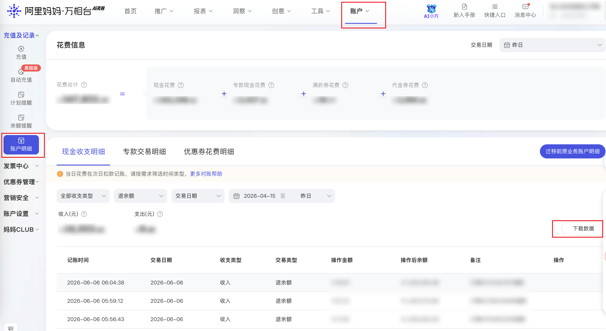

| 属性             | 值                                                                 |
| ---------------- | ------------------------------------------------------------------ |
| **连接器类型**   | `RPA 连接器`|
| **连接器名称**   | `ODS_万相台账户明细表(阿里妈妈RPA)`|
| **连接器代码**   | `rpa.conn.alimm.wxt.account.detail`|
| **操作类型**     | `文件导出`|
| **目标网页**     | `https://one.alimama.com/index.html#!/account/detail`|
| **适用场景**     | 导出阿里妈妈万相台账户明细（现金收支）数据，支持按收支类型、交易类型及日期范围筛选|
| **数据表名**     | `ods_rpa_alimm_wxt_account_detail_du`|
| **业务表名**     | `ODS_万相台账户明细表(阿里妈妈RPA)`|

### 目标页面

> **取数路径**：万相台—账户—账户明细—现金收支明细
>
> **取数链接**：[https://one.alimama.com/index.html#!/account/detail](https://one.alimama.com/index.html#!/account/detail)



### 业务入参

| 字段 | 中文释义 | 数据类型 | 必填 | 默认值 | 说明 |
| ---- | -------- | -------- | ---- | ------ | ---- |
| `fin_type` | 收支类型 | `String` | 否 | `-` | 允许值：`ALL`（全部）/ `EXPENSE`（支出）/ `INCOME`（收入） |
| `trade_type` | 交易类型 | `String` | 否 | `-` | 允许值：`ALL`（全部）/ `RECHARGE`（充值）/ `REFUND`（退款）/ `DEDUCT`（扣款）/ `TRANSFER`（转账）/ `COMPEN`（赔付）/ `FREEZE`（冻结）/ `UNFREEZE`（解冻）/ `PAY`（付款）/ `UNPAY`（退余额） |
| `time_type` | 时间维度 | `String` | 否 | `ACCOUNT_TIME` | 允许值：`ACCOUNT_TIME`（记账时间）/ `TRADE_DATE`（交易日期） |
| `date_type` | 日期快捷选项 | `String` | 是 | `-` | 允许值：`TODAY`（今日）/ `YESTERDAY`（昨日）/ `LAST_WEEK`（上周）/ `THIS_MONTH`（本月）/ `LAST_MONTH`（上月）/ `LAST_7_DAYS`（近 7 天）/ `LAST_15_DAYS`（近 15 天）/ `LAST_30_DAYS`（近 30 天）/ `LAST_90_DAYS`（近 90 天）/ `LAST_180_DAYS`（近 180 天）/ `CUSTOM`（自定义区间） |
| `custom_start_date` | 自定义起始日期 | `String` | 条件必填 | `-` | `date_type` 为 `CUSTOM` 时必填；格式 `YYYYMMDD` 或 `YYYY-MM-DD` |
| `custom_end_date` | 自定义结束日期 | `String` | 条件必填 | `-` | `date_type` 为 `CUSTOM` 时必填；格式 `YYYYMMDD` 或 `YYYY-MM-DD`；最晚为今天 |

### 入参样例

`YYYYMMDD`：

```json
{
    "fin_type": "ALL",
    "trade_type": "UNPAY",
    "time_type": "TRADE_DATE",
    "date_type": "CUSTOM",
    "custom_start_date": "20260415",
    "custom_end_date": "20260610"
}
```

`YYYY-MM-DD`：

```json
{
    "fin_type": "",
    "trade_type": "",
    "time_type": "",
    "date_type": "CUSTOM",
    "custom_start_date": "2026-04-15",
    "custom_end_date": "2026-06-10"
}
```

### 入参校验

```json-schema collapsed
{
  "$schema": "https://json-schema.org/draft/2020-12/schema",
  "title": "账户-账户明细-现金收支明细 - 查询入参",
  "description": "导出阿里妈妈万相台账户明细（现金收支）数据，支持按收支类型、交易类型及日期范围筛选",
  "type": "object",
  "properties": {
    "fin_type": {
      "type": "string",
      "description": "收支类型，允许值 ALL（全部）/ EXPENSE（支出）/ INCOME（收入）"
    },
    "trade_type": {
      "type": "string",
      "description": "交易类型，允许值 ALL / RECHARGE / REFUND / DEDUCT / TRANSFER / COMPEN / FREEZE / UNFREEZE / PAY / UNPAY"
    },
    "time_type": {
      "type": "string",
      "description": "时间维度，允许值 ACCOUNT_TIME（记账时间）/ TRADE_DATE（交易日期）",
      "default": "ACCOUNT_TIME"
    },
    "date_type": {
      "type": "string",
      "description": "日期快捷选项，允许值 TODAY / YESTERDAY / LAST_WEEK / THIS_MONTH / LAST_MONTH / LAST_7_DAYS（近 7 天）/ LAST_15_DAYS / LAST_30_DAYS / LAST_90_DAYS / LAST_180_DAYS / CUSTOM",
      "enum": ["TODAY", "YESTERDAY", "LAST_WEEK", "THIS_MONTH", "LAST_MONTH", "LAST_7_DAYS", "LAST_15_DAYS", "LAST_30_DAYS", "LAST_90_DAYS", "LAST_180_DAYS", "CUSTOM"]
    },
    "custom_start_date": {
      "type": "string",
      "description": "自定义起始日期，date_type=CUSTOM 时必填，格式 YYYYMMDD 或 YYYY-MM-DD",
      "pattern": "^(?:\\d{8}|\\d{4}-\\d{2}-\\d{2})$"
    },
    "custom_end_date": {
      "type": "string",
      "description": "自定义结束日期，date_type=CUSTOM 时必填，格式 YYYYMMDD 或 YYYY-MM-DD；最晚为今天",
      "pattern": "^(?:\\d{8}|\\d{4}-\\d{2}-\\d{2})$"
    }
  },
  "required": ["date_type"],
  "allOf": [
    {
      "if": {
        "properties": { "date_type": { "const": "CUSTOM" } },
        "required": ["date_type"]
      },
      "then": {
        "required": ["custom_start_date", "custom_end_date"]
      }
    }
  ],
  "additionalProperties": false
}
```

### 数据字段

| 字段 | 中文释义 | 数据类型 | 可为空 | 取数路径 | 示例 |
| ---- | -------- | -------- | ------ | -------- | ---- |
| `accountTime` | 记账时间 | `string` | 否 | `CSV.0.记账时间` | `2026-06-06 06:04:38` |
| `tradeDate` | 交易日期 | `string` | 否 | `CSV.0.交易日期` | `2026-06-06` |
| `finType` | 收支类型 | `string` | 否 | `CSV.0.收支类型` | `收入` |
| `tradeType` | 交易类型 | `string` | 否 | `CSV.0.交易类型` | `付款退回` |
| `amount` | 操作金额（元） | `number` | 否 | `CSV.0.操作金额(元)` | `18.97` |
| `balanceAfter` | 操作后余额（元） | `number` | 否 | `CSV.0.操作后余额(元)` | `1420592.66` |
| `remark` | 备注 | `string` | 是 | `CSV.0.备注` | `订单81112325767退款` |
| `bizDate` | 业务日期 | `string` | 否 | 附加 |  |
| `accountId` | 授权 ID | `string` | 否 | 附加 |  |

### 数据样例

```json
{
  "accountTime": "2026-06-06 06:04:38",
  "tradeDate": "2026-06-06",
  "finType": "收入",
  "tradeType": "付款退回",
  "amount": 18.97,
  "balanceAfter": 1420592.66,
  "remark": "订单81112325767退款",
  "bizDate": "20260611",
  "accountId": "108"
}
```

---
