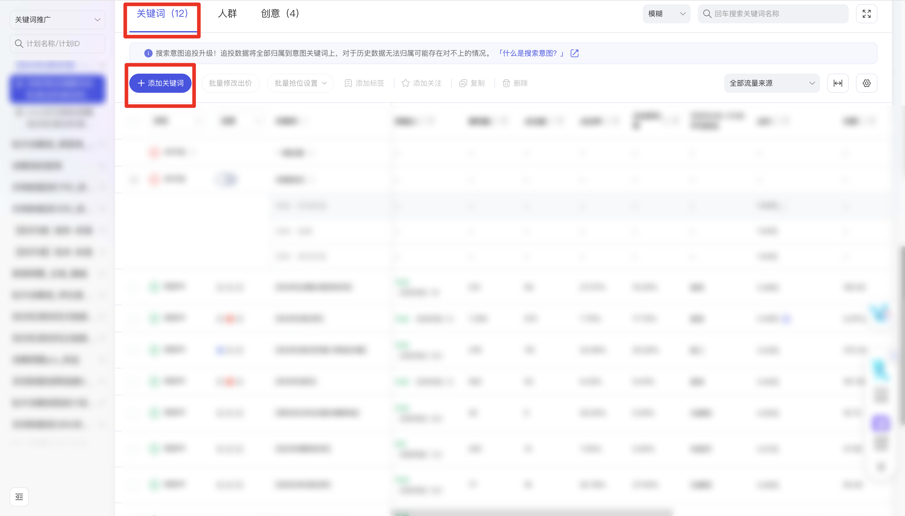
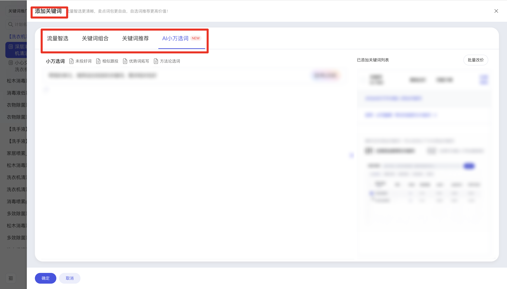

| 属性             | 值                                                                 |
| ---------------- | ------------------------------------------------------------------ |
| **连接器类型**   | `RPA 连接器`                                                       |
| **连接器名称**   | `ODS_万相台关键词推广明细表(阿里妈妈RPA)`                          |
| **连接器代码**   | `rpa.conn.alimm.wxt.keyword.promotion.detail`                      |
| **操作类型**     | `页面解析`                                                         |
| **目标网页**     | `https://one.alimama.com/index.html#!/manage/search-detail?bizCode=onebpSearch&tab=bidword` |
| **适用场景**     | 按统计周期、计划与单元采集万相台关键词推广详情页添加关键词侧栏的推荐词 |
| **数据表名**     | `ods_rpa_alimm_wxt_keyword_promotion_detail_du`                    |
| **业务表名**     | `ODS_万相台关键词推广明细表(阿里妈妈RPA)`                          |

### 目标页面

> **取数路径**：万相台—关键词推广—关键词—添加关键词
>
> **取数链接**：[https://one.alimama.com/index.html#!/manage/search-detail?bizCode=onebpSearch&tab=bidword](https://one.alimama.com/index.html#!/manage/search-detail?bizCode=onebpSearch&tab=bidword)





### 业务入参

| 字段 | 中文释义 | 数据类型 | 必填 | 默认值 | 说明 |
| ---- | -------- | -------- | ---- | ------ | ---- |
| `date_type` | 统计周期 | `String` | 是 | — | 写入详情页日期区间。可选值：`TODAY`（今天）/ `YESTERDAY`（昨天）/ `LAST_7_DAYS`（近 7 天，不含今天）/ `LAST_15_DAYS`（近 15 天，不含今天）/ `LAST_30_DAYS`（近 30 天，不含今天）/ `LAST_WEEK`（上周，上周一至周日）/ `THIS_MONTH`（本月，1 号至今天）/ `LAST_MONTH`（上月整月）/ `CUSTOM`（自定义）。自定义时须同时传开始、结束日期；起止可同一天；跨度不超过 91 天（含首尾）；结束日不能晚于今天 |
| `custom_start_date` | 自定义开始日期 | `String` | 条件必填 | — | 仅 `date_type=CUSTOM` 时必填。支持格式：`YYYYMMDD`、`YYYY-MM-DD` |
| `custom_end_date` | 自定义结束日期 | `String` | 条件必填 | — | 仅 `date_type=CUSTOM` 时必填。支持格式：`YYYYMMDD`、`YYYY-MM-DD` |
| `plan_id` | 计划 ID | `String` | 是 | — | 须为 10～25 位数字 |
| `unit_id` | 单元 ID | `String` / `List[String]` | 是 | — | 每个单元 ID 须为 10～25 位数字，最多 5 个。 |
| `keyword_source` | 选词来源 | `String` / `List[String]` | 否 | — | 可选值：`TRAFFIC_SMART`（流量智选）/ `KEYWORD_COMBINATION`（关键词组合）/ `KEYWORD_RECOMMEND`（关键词推荐，并采集全部 5 个子 Tab）/ `AI_XIAOWAN`（AI 小万选词）。不传时只采集侧栏默认的 AI 小万选词 |

### 入参样例

```json
{
  "date_type": "LAST_7_DAYS",
  "plan_id": "68774644488",
  "unit_id": "68809224944"
}
```

```json
{
  "date_type": "CUSTOM",
  "custom_start_date": "20260901",
  "custom_end_date": "20260910",
  "plan_id": "68774644488",
  "unit_id": ["68809224944", "80260904225"],
  "keyword_source": "AI_XIAOWAN"
}
```

```json
{
  "date_type": "CUSTOM",
  "custom_start_date": "2026-09-03",
  "custom_end_date": "2026-09-09",
  "plan_id": "68774644488",
  "unit_id": "68809224944",
  "keyword_source": ["AI_XIAOWAN", "KEYWORD_RECOMMEND", "KEYWORD_COMBINATION", "TRAFFIC_SMART"]
}
```

### 入参校验

```json-schema collapsed
{
  "$schema": "https://json-schema.org/draft/2020-12/schema",
  "title": "万相台-关键词推广-推荐词明细 - 查询入参",
  "description": "按统计周期、计划与单元采集万相台关键词推广详情页添加关键词侧栏的推荐词与词包，支持指定选词来源",
  "type": "object",
  "properties": {
    "date_type": {
      "type": "string",
      "description": "统计周期，必填。可选值：TODAY（今天）/ YESTERDAY（昨天）/ LAST_7_DAYS（近7天，不含今天）/ LAST_15_DAYS（近15天，不含今天）/ LAST_30_DAYS（近30天，不含今天）/ LAST_WEEK（上周，上周一至周日）/ THIS_MONTH（本月，1号至今天）/ LAST_MONTH（上月整月）/ CUSTOM（自定义）。CUSTOM 时须同时传 custom_start_date、custom_end_date；起止可同一天；跨度不超过 91 天；结束日不能晚于今天",
      "enum": ["TODAY", "YESTERDAY", "LAST_7_DAYS", "LAST_15_DAYS", "LAST_30_DAYS", "LAST_WEEK", "THIS_MONTH", "LAST_MONTH", "CUSTOM"]
    },
    "custom_start_date": {
      "type": "string",
      "description": "自定义开始日期，仅 date_type=CUSTOM 时必填。支持 YYYYMMDD 或 YYYY-MM-DD",
      "pattern": "^(\\d{8}|\\d{4}-\\d{2}-\\d{2})$"
    },
    "custom_end_date": {
      "type": "string",
      "description": "自定义结束日期，仅 date_type=CUSTOM 时必填。支持 YYYYMMDD 或 YYYY-MM-DD",
      "pattern": "^(\\d{8}|\\d{4}-\\d{2}-\\d{2})$"
    },
    "plan_id": {
      "type": "string",
      "description": "计划 ID，必填，10～25 位数字",
      "pattern": "^\\d{10,25}$"
    },
    "unit_id": {
      "description": "单元 ID，必填。每个须为 10～25 位数字，最多 5 个。支持英文/中文逗号分隔字符串或字符串数组",
      "oneOf": [
        {
          "type": "string",
          "minLength": 1,
          "pattern": "^\\d{10,25}([,，]\\d{10,25}){0,4}$"
        },
        {
          "type": "array",
          "items": {
            "type": "string",
            "pattern": "^\\d{10,25}$"
          },
          "minItems": 1,
          "maxItems": 5
        }
      ]
    },
    "keyword_source": {
      "description": "选词来源，可选。可选值：TRAFFIC_SMART（流量智选）/ KEYWORD_COMBINATION（关键词组合）/ KEYWORD_RECOMMEND（关键词推荐）/ AI_XIAOWAN（AI小万选词）。支持英文/中文逗号分隔字符串或字符串数组；不传只采集默认 AI 小万选词",
      "oneOf": [
        {
          "type": "string",
          "minLength": 1
        },
        {
          "type": "array",
          "items": {
            "type": "string",
            "enum": ["TRAFFIC_SMART", "KEYWORD_COMBINATION", "KEYWORD_RECOMMEND", "AI_XIAOWAN"]
          },
          "uniqueItems": true
        }
      ]
    }
  },
  "required": ["date_type", "plan_id", "unit_id"],
  "additionalProperties": false,
  "allOf": [
    {
      "if": {
        "properties": {
          "date_type": {
            "const": "CUSTOM"
          }
        },
        "required": ["date_type"]
      },
      "then": {
        "required": ["custom_start_date", "custom_end_date"]
      }
    }
  ]
}
```

### 数据字段

:::field-tree
@define 推荐理由标签
| `code` | 标签编码 | `String` | 是 | 页面解析 | `ACCELERATION` |
| `color` | 标签颜色 | `String` | 是 | 页面解析 | `#FF4D4D` |
| `bizCode` | 业务码 | `String` | 是 | 页面解析 | — |
| `iconType` | 图标类型 | `String` | 是 | 页面解析 | — |
| `icon` | 图标 | `String` | 是 | 页面解析 | — |
| `name` | 标签名称 | `String` | 是 | 页面解析 | `节促热搜` |
| `tipWidth` | 提示宽度 | `Number` | 是 | 页面解析 | — |
| `type` | 标签类型 | `String` | 是 | 页面解析 | `HOT` |
| `tips` | 提示文案 | `String` | 是 | 页面解析 | `节促期飙升的热搜词` |
| `properties` | 扩展属性 | `Dict` | 是 | 页面解析 | — |

@define 词包策略
| `strategyName` | 策略名称 | `String` | 是 | 页面解析 | `好词优选` |
| `peerPrice` | 同行出价 | `Number` | 是 | 页面解析 | `2.42` |
| `campaignId` | 计划 ID | `String` | 是 | 页面解析 | — |
| `bizCode` | 业务码 | `String` | 是 | 页面解析 | — |
| `onlineStatus` | 在线状态 | `Number` | 是 | 页面解析 | `1` |
| `wordPackageType` | 词包类型 | `Number` | 是 | 页面解析 | — |
| `specialCategory` | 特殊类目 | `String` | 是 | 页面解析 | — |
| `bidPrice` | 建议出价 | `Number` | 是 | 页面解析 | `2.42` |
| `hide` | 是否隐藏 | `Boolean` | 是 | 页面解析 | — |
| `wordScope` | 圈词范围 | `String` | 是 | 页面解析 | `实时优选强相关、高投产的店铺专有词和类目精准词` |
| `reasonTagList` @推荐理由标签 | 推荐理由标签 | `List[Dict]` | 是 | 页面解析 | 见数据样例 |
| `adgroupId` | 单元 ID | `String` | 是 | 页面解析 | — |
| `strategyId` | 策略 ID | `Number` | 是 | 页面解析 | `1` |
| `reportInfoMap` | 报表信息 | `Dict` | 是 | 页面解析 | — |
| `reportInfoList` | 报表信息列表 | `List` | 是 | 页面解析 | — |

@define 推荐词
| `mtaRoi` | MTA 投产 | `Number` | 是 | 页面解析 | `0` |
| `presentMPenetrationRateRank` | 展现渗透排名 | `String` / `Number` | 是 | 页面解析 | `数据量过小` |
| `transactionShippingTotal` | 成交运费 | `Number` | 是 | 页面解析 | — |
| `avgPrice` | 均价 | `Number` | 是 | 页面解析 | — |
| `wordPackageId` | 词包 ID | `Number` | 是 | 页面解析 | — |
| `bizCode` | 业务码 | `String` | 是 | 页面解析 | — |
| `cvrIndex` | 转化指数 | `Number` | 是 | 页面解析 | — |
| `type` | 类型 | `Number` | 是 | 页面解析 | `0` |
| `marketClickRate` | 市场点击率 | `Number` | 是 | 页面解析 | `0.0208` |
| `mPenetrationRateRank` | 渗透率排名 | `Number` | 是 | 页面解析 | `0` |
| `itemClickCoverage` | 商品点击覆盖 | `Number` | 是 | 页面解析 | — |
| `predictClick` | 预估点击 | `Number` | 是 | 页面解析 | `1.2535604` |
| `competitionIndex` | 竞争指数 | `Number` | 是 | 页面解析 | `11313.8324` |
| `clickIndex` | 点击指数 | `Number` | 是 | 页面解析 | — |
| `trendIndex` | 飙升度 | `Number` | 是 | 页面解析 | `-0.0853` |
| `ctrIndex` | 点击率指数 | `Number` | 是 | 页面解析 | — |
| `marketAverageBid` | 市场平均出价 | `Number` | 是 | 页面解析 | `0.6268` |
| `reasonTagList` @推荐理由标签 | 推荐理由标签 | `List[Dict]` | 是 | 页面解析 | 见数据样例 |
| `qscore` | 质量分 | `String` | 是 | 页面解析 | `6` |
| `mobilePrice` | 移动出价 | `Number` | 是 | 页面解析 | — |
| `cvr` | 转化率 | `Number` | 是 | 页面解析 | — |
| `ctr` | 点击率 | `Number` | 是 | 页面解析 | — |
| `marketClickConversionRate` | 市场点击转化率 | `Number` | 是 | 页面解析 | `0.0339` |
| `presentMPenetrationRate` | 展现渗透率 | `String` | 是 | 页面解析 | `数据量过小` |
| `convRatio` | 转化占比 | `Number` | 是 | 页面解析 | — |
| `relevanceType` | 相关类型 | `Number` | 是 | 页面解析 | `3` |
| `itemClick` | 商品点击 | `Number` | 是 | 页面解析 | — |
| `impressionIndex` | 展现指数 | `Number` | 是 | 页面解析 | — |
| `searchIndex` | 搜索热度 | `Number` | 是 | 页面解析 | `58132` |
| `wordStatusList` | 词状态列表 | `List` | 是 | 页面解析 | — |
| `bidPrice` | 建议出价 | `Number` | 是 | 页面解析 | `0.45` |
| `adgroupCnt` | 单元数 | `Number` | 是 | 页面解析 | — |
| `firstSlotImpressionRate` | 首位展现率 | `Number` | 是 | 页面解析 | `0` |
| `matchScope` | 匹配范围 | `Number` | 是 | 页面解析 | `4` |
| `sePvCnt` | 搜索 PV | `Number` | 是 | 页面解析 | — |
| `wordTotalPermeabilityUv` | 词总渗透 UV | `Number` | 是 | 页面解析 | — |
| `mPenetrationRate` | 渗透率 | `Number` | 是 | 页面解析 | `0` |
| `recReason` | 推荐原因 | `String` | 是 | 页面解析 | `aiRecWord` |
| `shopWordPermeabilityUv` | 店铺词渗透 UV | `Number` | 是 | 页面解析 | — |
| `impression` | 展现 | `String` | 是 | 页面解析 | `30-40` |
| `leadAdGmvRate` | 广告GMV占比 | `Number` | 是 | 页面解析 | `0` |
| `word` | 关键词 | `String` | 是 | 页面解析 | `****` (已脱敏) |

@define 词包
| `themeWordList` | 主题词列表 | `List[String]` | 是 | 页面解析 | `["****","****","****"]` (已脱敏) |
| `convRatio` | 转化占比 | `Number` | 是 | 页面解析 | — |
| `wordPackageId` | 词包 ID | `Number` | 是 | 页面解析 | `124****226` (已脱敏) |
| `relevanceType` | 相关类型 | `Number` | 是 | 页面解析 | `3` |
| `bizCode` | 业务码 | `String` | 是 | 页面解析 | — |
| `onlineStatus` | 在线状态 | `Number` | 是 | 页面解析 | `1` |
| `wordPackageType` | 词包类型 | `Number` | 是 | 页面解析 | `20` |
| `simpleWordList` | 简单词列表 | `List[String]` | 是 | 页面解析 | `["****"]` (已脱敏) |
| `bidPrice` | 建议出价 | `Number` | 是 | 页面解析 | `1.94` |
| `strategyList` @词包策略 | 策略列表 | `List[Dict]` | 是 | 页面解析 | 见数据样例 |
| `wordTotalPermeabilityUv` | 词总渗透 UV | `Number` | 是 | 页面解析 | — |
| `shopWordPermeabilityUv` | 店铺词渗透 UV | `Number` | 是 | 页面解析 | — |
| `reasonTagList` @推荐理由标签 | 推荐理由标签 | `List[Dict]` | 是 | 页面解析 | 见数据样例 |
| `multiFactor` | 多因子 | `String` | 是 | 页面解析 | `1.5` |
| `recReason` | 推荐原因 | `String` | 是 | 页面解析 | — |
| `mPenetrationRate` | 渗透率 | `Number` | 是 | 页面解析 | — |
| `impression` | 展现 | `String` | 是 | 页面解析 | `100-200` |
| `wordPackageName` | 词包名称 | `String` | 是 | 页面解析 | `****` (已脱敏) |
| `status` | 状态 | `Number` | 是 | 页面解析 | `1` |

@define 关键词推荐
| `overallRecommend` @推荐词 | 综合推荐词 | `List[Dict]` | 是 | 页面解析 | — |
| `shopExclusive` @推荐词 | 店铺专有词 | `List[Dict]` | 是 | 页面解析 | — |
| `categoryPrecise` @推荐词 | 类目精准词 | `List[Dict]` | 是 | 页面解析 | — |
| `industryHot` @推荐词 | 行业热门词 | `List[Dict]` | 是 | 页面解析 | — |
| `trendOpportunity` @推荐词 | 趋势机会词 | `List[Dict]` | 是 | 页面解析 | — |

@define 单元选词结果
| `aiXiaowan` @推荐词 | AI小万选词 | `List[Dict]` | 是 | 页面解析 | 见数据样例 |
| `keywordRecommend` @关键词推荐 | 关键词推荐 | `Dict` | 是 | 页面解析 | — |
| `keywordCombination` @词包 | 关键词组合 | `List[Dict]` | 是 | 页面解析 | — |
| `trafficSmart` @词包 | 流量智选 | `List[Dict]` | 是 | 页面解析 | — |

| 字段 | 中文释义 | 数据类型 | 可为空 | 取数路径 | 示例 |
| ---- | -------- | -------- | ------ | -------- | ---- |
| `startTime` | 开始日期 | `String` | 否 | 页面解析 | `2026-09-03` |
| `endTime` | 结束日期 | `String` | 否 | 页面解析 | `2026-09-09` |
| `campaignId` | 计划 ID | `String` | 否 | 页面解析 | `687****488` (已脱敏) |
| `unit_id` @单元选词结果 | 单元ID | `Dict` | 是 | 页面解析 | 见数据样例 |
| `bizDate` | 业务日期 | `String` | 否 | 附加 | `20260910` |
| `accountId` | 授权 ID | `String` | 否 | 附加 | `1****1` (已脱敏) |
:::

### 数据样例

```json
[
  {
    "bizDate": "20260910",
    "accountId": "1****1",
    "startTime": "2026-09-03",
    "endTime": "2026-09-09",
    "campaignId": "687****488",
    "688****944": {
      "aiXiaowan": [
        {
          "mtaRoi": 0.0,
          "presentMPenetrationRateRank": "数据量过小",
          "transactionShippingTotal": null,
          "avgPrice": null,
          "wordPackageId": null,
          "bizCode": null,
          "cvrIndex": null,
          "type": 0,
          "marketClickRate": 0.0208,
          "mPenetrationRateRank": 0.0,
          "itemClickCoverage": null,
          "predictClick": 1.2535604,
          "competitionIndex": 11313.8324,
          "clickIndex": null,
          "trendIndex": -0.0853,
          "ctrIndex": null,
          "marketAverageBid": 0.6268,
          "reasonTagList": [
            {
              "code": "ACCELERATION",
              "color": "#FF4D4D",
              "bizCode": null,
              "iconType": null,
              "icon": null,
              "name": "节促热搜",
              "tipWidth": null,
              "type": "HOT",
              "tips": "节促期飙升的热搜词",
              "properties": null
            }
          ],
          "qscore": "6",
          "mobilePrice": null,
          "cvr": null,
          "ctr": null,
          "marketClickConversionRate": 0.0339,
          "presentMPenetrationRate": "数据量过小",
          "convRatio": null,
          "relevanceType": 3,
          "itemClick": null,
          "impressionIndex": null,
          "searchIndex": 58132,
          "wordStatusList": null,
          "bidPrice": 0.45,
          "adgroupCnt": null,
          "firstSlotImpressionRate": 0.0,
          "matchScope": 4,
          "sePvCnt": null,
          "wordTotalPermeabilityUv": null,
          "mPenetrationRate": 0.0,
          "recReason": "aiRecWord",
          "shopWordPermeabilityUv": null,
          "impression": "30-40",
          "leadAdGmvRate": 0.0,
          "word": "****"
        },
        {
          "mtaRoi": 0.0,
          "presentMPenetrationRateRank": "数据量过小",
          "transactionShippingTotal": null,
          "avgPrice": null,
          "wordPackageId": null,
          "bizCode": null,
          "cvrIndex": null,
          "type": 0,
          "marketClickRate": 0.0332,
          "mPenetrationRateRank": 0.0,
          "itemClickCoverage": null,
          "predictClick": 5.4256,
          "competitionIndex": 2145.5079,
          "clickIndex": null,
          "trendIndex": -0.1665,
          "ctrIndex": null,
          "marketAverageBid": 2.3409,
          "reasonTagList": [
            {
              "code": "ACCELERATION",
              "color": "#FF4D4D",
              "bizCode": null,
              "iconType": null,
              "icon": null,
              "name": "节促热搜",
              "tipWidth": null,
              "type": "HOT",
              "tips": "节促期飙升的热搜词",
              "properties": null
            }
          ],
          "qscore": "6",
          "mobilePrice": null,
          "cvr": null,
          "ctr": null,
          "marketClickConversionRate": 0.1353,
          "presentMPenetrationRate": "数据量过小",
          "convRatio": null,
          "relevanceType": 3,
          "itemClick": null,
          "impressionIndex": null,
          "searchIndex": 31372,
          "wordStatusList": null,
          "bidPrice": 0.47,
          "adgroupCnt": null,
          "firstSlotImpressionRate": 0.0,
          "matchScope": 4,
          "sePvCnt": null,
          "wordTotalPermeabilityUv": null,
          "mPenetrationRate": 0.0,
          "recReason": "aiRecWord",
          "shopWordPermeabilityUv": null,
          "impression": "100-200",
          "leadAdGmvRate": 0.0,
          "word": "****"
        }
      ]
    }
  }
]
```
