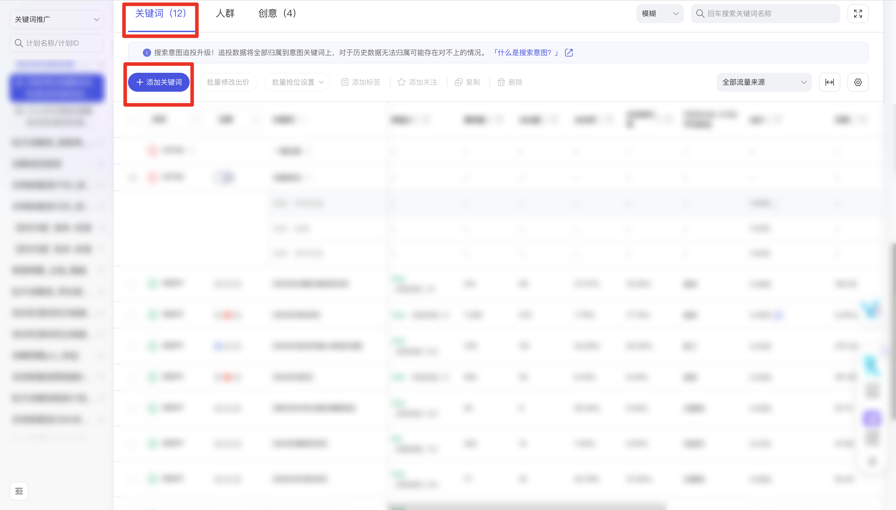
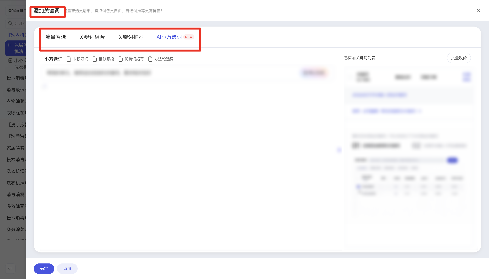

| 属性             | 值                                                                 |
| ---------------- | ------------------------------------------------------------------ |
| **连接器类型**   | `RPA 连接器`                                                       |
| **连接器名称**   | `ODS_万相台关键词推广明细表(阿里妈妈RPA)`                          |
| **连接器代码**   | `rpa.conn.alimm.wxt.keyword.promotion.detail`                      |
| **操作类型**     | `页面解析`                                                         |
| **目标网页**     | `https://one.alimama.com/index.html#!/manage/search-detail?bizCode=onebpSearch&tab=bidword` |
| **适用场景**     | 按统计周期、计划与单元采集万相台关键词推广详情页添加关键词侧栏的推荐词 |
| **数据表名**     | `ods_rpa_alimm_wxt_keyword_promotion_detail_du`                    |
| **业务表名**     | `ODS_万相台关键词推广明细表(阿里妈妈RPA)`                          |

### 目标页面

> **取数路径**：万相台—关键词推广—关键词—添加关键词
>
> **取数链接**：[https://one.alimama.com/index.html#!/manage/search-detail?bizCode=onebpSearch&tab=bidword](https://one.alimama.com/index.html#!/manage/search-detail?bizCode=onebpSearch&tab=bidword)
>
> **失败与重试**：某个单元采集失败则本轮任务失败并结束，不返回部分数据。已成功单元会写入缓存，框架重试时跳过这些单元，从未成功的那个单元继续。





### 业务入参

| 字段 | 中文释义 | 数据类型 | 必填 | 默认值 | 说明 |
| ---- | -------- | -------- | ---- | ------ | ---- |
| `date_type` | 统计周期 | `String` | 是 | — | 写入详情页日期区间。可选值：`TODAY`（今天）/ `YESTERDAY`（昨天）/ `LAST_7_DAYS`（近 7 天，不含今天）/ `LAST_15_DAYS`（近 15 天，不含今天）/ `LAST_30_DAYS`（近 30 天，不含今天）/ `LAST_WEEK`（上周，上周一至周日）/ `THIS_MONTH`（本月，1 号至今天）/ `LAST_MONTH`（上月整月）/ `CUSTOM`（自定义）。自定义时须同时传开始、结束日期；起止可同一天；跨度不超过 91 天（含首尾）；结束日不能晚于今天 |
| `custom_start_date` | 自定义开始日期 | `String` | 条件必填 | — | 仅 `date_type=CUSTOM` 时必填。支持格式：`YYYYMMDD`、`YYYY-MM-DD` |
| `custom_end_date` | 自定义结束日期 | `String` | 条件必填 | — | 仅 `date_type=CUSTOM` 时必填。支持格式：`YYYYMMDD`、`YYYY-MM-DD` |
| `plan_id` | 计划 ID | `String` | 是 | — | 须为 10～25 位数字 |
| `unit_id` | 单元 ID | `String` / `List[String]` | 是 | — | 每个单元 ID 须为 10～25 位数字，最多 10 个。 |
| `keyword_source` | 选词来源 | `String` / `List[String]` | 否 | — | 可选值：`TRAFFIC_SMART`（流量智选）/ `KEYWORD_COMBINATION`（关键词组合）/ `KEYWORD_RECOMMEND`（关键词推荐，并采集全部 5 个子 Tab）/ `AI_XIAOWAN`（AI 小万选词）。不传时只采集侧栏默认的 AI 小万选词 |

### 入参样例

近 7 天、单个单元；不传选词来源，只采集侧栏默认的 AI 小万选词：

```json
{
  "date_type": "LAST_7_DAYS",
  "plan_id": "68774644488",
  "unit_id": "68809224944"
}
```

自定义日期（`YYYYMMDD`）、多个单元；只采集 AI 小万选词：

```json
{
  "date_type": "CUSTOM",
  "custom_start_date": "20260901",
  "custom_end_date": "20260910",
  "plan_id": "68774644488",
  "unit_id": ["68809224944", "80260904225"],
  "keyword_source": "AI_XIAOWAN"
}
```

自定义日期（`YYYY-MM-DD`）、单个单元；采集全部 4 个选词来源（含关键词推荐的 5 个子 Tab）：

```json
{
  "date_type": "CUSTOM",
  "custom_start_date": "2026-09-07",
  "custom_end_date": "2026-09-13",
  "plan_id": "68774644488",
  "unit_id": "68809224944",
  "keyword_source": ["AI_XIAOWAN", "KEYWORD_RECOMMEND", "KEYWORD_COMBINATION", "TRAFFIC_SMART"]
}
```

### 入参校验

```json-schema collapsed
{
  "$schema": "https://json-schema.org/draft/2020-12/schema",
  "title": "万相台-关键词推广-推荐词明细 - 查询入参",
  "description": "按统计周期、计划与单元采集万相台关键词推广详情页添加关键词侧栏的推荐词与词包，支持指定选词来源",
  "type": "object",
  "properties": {
    "date_type": {
      "type": "string",
      "description": "统计周期，必填。可选值：TODAY（今天）/ YESTERDAY（昨天）/ LAST_7_DAYS（近7天，不含今天）/ LAST_15_DAYS（近15天，不含今天）/ LAST_30_DAYS（近30天，不含今天）/ LAST_WEEK（上周，上周一至周日）/ THIS_MONTH（本月，1号至今天）/ LAST_MONTH（上月整月）/ CUSTOM（自定义）。CUSTOM 时须同时传 custom_start_date、custom_end_date；起止可同一天；跨度不超过 91 天；结束日不能晚于今天",
      "enum": ["TODAY", "YESTERDAY", "LAST_7_DAYS", "LAST_15_DAYS", "LAST_30_DAYS", "LAST_WEEK", "THIS_MONTH", "LAST_MONTH", "CUSTOM"]
    },
    "custom_start_date": {
      "type": "string",
      "description": "自定义开始日期，仅 date_type=CUSTOM 时必填。支持 YYYYMMDD 或 YYYY-MM-DD",
      "pattern": "^(\\d{8}|\\d{4}-\\d{2}-\\d{2})$"
    },
    "custom_end_date": {
      "type": "string",
      "description": "自定义结束日期，仅 date_type=CUSTOM 时必填。支持 YYYYMMDD 或 YYYY-MM-DD",
      "pattern": "^(\\d{8}|\\d{4}-\\d{2}-\\d{2})$"
    },
    "plan_id": {
      "type": "string",
      "description": "计划 ID，必填，10～25 位数字",
      "pattern": "^\\d{10,25}$"
    },
    "unit_id": {
      "description": "单元 ID，必填。每个须为 10～25 位数字，最多 10 个。支持英文/中文逗号分隔字符串或字符串数组",
      "oneOf": [
        {
          "type": "string",
          "minLength": 1,
          "pattern": "^\\d{10,25}([,，]\\d{10,25}){0,9}$"
        },
        {
          "type": "array",
          "items": {
            "type": "string",
            "pattern": "^\\d{10,25}$"
          },
          "minItems": 1,
          "maxItems": 10
        }
      ]
    },
    "keyword_source": {
      "description": "选词来源，可选。可选值：TRAFFIC_SMART（流量智选）/ KEYWORD_COMBINATION（关键词组合）/ KEYWORD_RECOMMEND（关键词推荐）/ AI_XIAOWAN（AI小万选词）。支持英文/中文逗号分隔字符串或字符串数组；不传只采集默认 AI 小万选词",
      "oneOf": [
        {
          "type": "string",
          "minLength": 1
        },
        {
          "type": "array",
          "items": {
            "type": "string",
            "enum": ["TRAFFIC_SMART", "KEYWORD_COMBINATION", "KEYWORD_RECOMMEND", "AI_XIAOWAN"]
          },
          "uniqueItems": true
        }
      ]
    }
  },
  "required": ["date_type", "plan_id", "unit_id"],
  "additionalProperties": false,
  "allOf": [
    {
      "if": {
        "properties": {
          "date_type": {
            "const": "CUSTOM"
          }
        },
        "required": ["date_type"]
      },
      "then": {
        "required": ["custom_start_date", "custom_end_date"]
      }
    }
  ]
}
```

### 数据字段

:::field-tree
@define 推荐理由标签
| `code` | 标签编码 | `String` | 是 | 页面解析 | `ACCELERATION` |
| `color` | 标签颜色 | `String` | 是 | 页面解析 | `#FF4D4D` |
| `bizCode` | 业务码 | `String` | 是 | 页面解析 | — |
| `iconType` | 图标类型 | `String` | 是 | 页面解析 | — |
| `icon` | 图标 | `String` | 是 | 页面解析 | — |
| `name` | 标签名称 | `String` | 是 | 页面解析 | `节促热搜` |
| `tipWidth` | 提示宽度 | `Number` | 是 | 页面解析 | — |
| `type` | 标签类型 | `String` | 是 | 页面解析 | `HOT` |
| `tips` | 提示文案 | `String` | 是 | 页面解析 | `节促期飙升的热搜词` |
| `properties` | 扩展属性 | `Dict` | 是 | 页面解析 | — |

@define 词包策略
| `strategyName` | 策略名称 | `String` | 是 | 页面解析 | `好词优选` |
| `peerPrice` | 同行出价 | `Number` | 是 | 页面解析 | `2.26` |
| `campaignId` | 计划 ID | `String` | 是 | 页面解析 | — |
| `bizCode` | 业务码 | `String` | 是 | 页面解析 | — |
| `onlineStatus` | 在线状态 | `Number` | 是 | 页面解析 | `1` |
| `wordPackageType` | 词包类型 | `Number` | 是 | 页面解析 | — |
| `specialCategory` | 特殊类目 | `String` | 是 | 页面解析 | — |
| `bidPrice` | 建议出价 | `Number` | 是 | 页面解析 | `2.26` |
| `hide` | 是否隐藏 | `Boolean` | 是 | 页面解析 | — |
| `wordScope` | 圈词范围 | `String` | 是 | 页面解析 | `实时优选强相关、高投产的店铺专有词和类目精准词` |
| `reasonTagList` @推荐理由标签 | 推荐理由标签 | `List[Dict]` | 是 | 页面解析 | 见数据样例 |
| `adgroupId` | 单元 ID | `String` | 是 | 页面解析 | — |
| `strategyId` | 策略 ID | `Number` | 是 | 页面解析 | `1` |
| `reportInfoMap` | 报表信息 | `Dict` | 是 | 页面解析 | — |
| `reportInfoList` | 报表信息列表 | `List` | 是 | 页面解析 | — |

@define 推荐词
| `mtaRoi` | MTA 投产 | `Number` | 是 | 页面解析 | `0.0` |
| `presentMPenetrationRateRank` | 展现渗透排名 | `String` / `Number` | 是 | 页面解析 | `数据量过小` |
| `transactionShippingTotal` | 成交运费 | `Number` | 是 | 页面解析 | — |
| `avgPrice` | 均价 | `Number` | 是 | 页面解析 | — |
| `wordPackageId` | 词包 ID | `Number` | 是 | 页面解析 | — |
| `bizCode` | 业务码 | `String` | 是 | 页面解析 | — |
| `cvrIndex` | 转化指数 | `Number` | 是 | 页面解析 | — |
| `type` | 类型 | `Number` | 是 | 页面解析 | `0` |
| `marketClickRate` | 市场点击率 | `Number` | 是 | 页面解析 | `0.0211` |
| `mPenetrationRateRank` | 渗透率排名 | `Number` | 是 | 页面解析 | `0` |
| `itemClickCoverage` | 商品点击覆盖 | `Number` | 是 | 页面解析 | — |
| `predictClick` | 预估点击 | `Number` | 是 | 页面解析 | `1.229771` |
| `competitionIndex` | 竞争指数 | `Number` | 是 | 页面解析 | `11458.3432` |
| `clickIndex` | 点击指数 | `Number` | 是 | 页面解析 | — |
| `trendIndex` | 飙升度 | `Number` | 是 | 页面解析 | `-0.0961` |
| `ctrIndex` | 点击率指数 | `Number` | 是 | 页面解析 | — |
| `marketAverageBid` | 市场平均出价 | `Number` | 是 | 页面解析 | `0.6517` |
| `reasonTagList` @推荐理由标签 | 推荐理由标签 | `List[Dict]` | 是 | 页面解析 | 见数据样例 |
| `qscore` | 质量分 | `String` | 是 | 页面解析 | `6` |
| `mobilePrice` | 移动出价 | `Number` | 是 | 页面解析 | — |
| `cvr` | 转化率 | `Number` | 是 | 页面解析 | — |
| `ctr` | 点击率 | `Number` | 是 | 页面解析 | — |
| `marketClickConversionRate` | 市场点击转化率 | `Number` | 是 | 页面解析 | `0.035` |
| `presentMPenetrationRate` | 展现渗透率 | `String` | 是 | 页面解析 | `数据量过小` |
| `convRatio` | 转化占比 | `Number` | 是 | 页面解析 | — |
| `relevanceType` | 相关类型 | `Number` | 是 | 页面解析 | `3` |
| `itemClick` | 商品点击 | `Number` | 是 | 页面解析 | — |
| `impressionIndex` | 展现指数 | `Number` | 是 | 页面解析 | — |
| `searchIndex` | 搜索热度 | `Number` | 是 | 页面解析 | `54702` |
| `wordStatusList` | 词状态列表 | `List` | 是 | 页面解析 | — |
| `bidPrice` | 建议出价 | `Number` | 是 | 页面解析 | `0.44` |
| `adgroupCnt` | 单元数 | `Number` | 是 | 页面解析 | — |
| `firstSlotImpressionRate` | 首位展现率 | `Number` | 是 | 页面解析 | `0` |
| `matchScope` | 匹配范围 | `Number` | 是 | 页面解析 | `4` |
| `sePvCnt` | 搜索 PV | `Number` | 是 | 页面解析 | — |
| `wordTotalPermeabilityUv` | 词总渗透 UV | `Number` | 是 | 页面解析 | — |
| `mPenetrationRate` | 渗透率 | `Number` | 是 | 页面解析 | `0` |
| `recReason` | 推荐原因 | `String` | 是 | 页面解析 | `aiRecWord` |
| `shopWordPermeabilityUv` | 店铺词渗透 UV | `Number` | 是 | 页面解析 | — |
| `impression` | 展现 | `String` | 是 | 页面解析 | `30-40` |
| `leadAdGmvRate` | 广告GMV占比 | `Number` | 是 | 页面解析 | `0` |
| `word` | 关键词 | `String` | 是 | 页面解析 | `****` (已脱敏) |

@define 词包
| `themeWordList` | 主题词列表 | `List[String]` | 是 | 页面解析 | `["****","****","****"]` (已脱敏) |
| `convRatio` | 转化占比 | `Number` | 是 | 页面解析 | — |
| `wordPackageId` | 词包 ID | `Number` | 是 | 页面解析 | `124****226` (已脱敏) |
| `relevanceType` | 相关类型 | `Number` | 是 | 页面解析 | `3` |
| `bizCode` | 业务码 | `String` | 是 | 页面解析 | — |
| `onlineStatus` | 在线状态 | `Number` | 是 | 页面解析 | `1` |
| `wordPackageType` | 词包类型 | `Number` | 是 | 页面解析 | `20` |
| `simpleWordList` | 简单词列表 | `List[String]` | 是 | 页面解析 | `["****","****"]` (已脱敏) |
| `bidPrice` | 建议出价 | `Number` | 是 | 页面解析 | `2.02` |
| `strategyList` @词包策略 | 策略列表 | `List[Dict]` | 是 | 页面解析 | 见数据样例 |
| `wordTotalPermeabilityUv` | 词总渗透 UV | `Number` | 是 | 页面解析 | — |
| `shopWordPermeabilityUv` | 店铺词渗透 UV | `Number` | 是 | 页面解析 | — |
| `reasonTagList` @推荐理由标签 | 推荐理由标签 | `List[Dict]` | 是 | 页面解析 | 见数据样例 |
| `multiFactor` | 多因子 | `String` | 是 | 页面解析 | `1.5` |
| `recReason` | 推荐原因 | `String` | 是 | 页面解析 | — |
| `mPenetrationRate` | 渗透率 | `Number` | 是 | 页面解析 | — |
| `impression` | 展现 | `String` | 是 | 页面解析 | `100-200` |
| `wordPackageName` | 词包名称 | `String` | 是 | 页面解析 | `****` (已脱敏) |
| `status` | 状态 | `Number` | 是 | 页面解析 | `1` |

@define 关键词推荐
| `overallRecommend` @推荐词 | 综合推荐词 | `List[Dict]` | 是 | 页面解析 | 见数据样例 |
| `shopExclusive` @推荐词 | 店铺专有词 | `List[Dict]` | 是 | 页面解析 | 见数据样例 |
| `categoryPrecise` @推荐词 | 类目精准词 | `List[Dict]` | 是 | 页面解析 | 见数据样例 |
| `industryHot` @推荐词 | 行业热门词 | `List[Dict]` | 是 | 页面解析 | 见数据样例 |
| `trendOpportunity` @推荐词 | 趋势机会词 | `List[Dict]` | 是 | 页面解析 | 见数据样例 |

| 字段 | 中文释义 | 数据类型 | 可为空 | 取数路径 | 示例 |
| ---- | -------- | -------- | ------ | -------- | ---- |
| `startTime` | 开始日期 | `String` | 否 | 页面解析 | `2026-09-07` |
| `endTime` | 结束日期 | `String` | 否 | 页面解析 | `2026-09-13` |
| `campaignId` | 计划 ID | `String` | 否 | 页面解析 | `687****488` (已脱敏) |
| `unitId` | 单元 ID | `String` | 否 | 根据输入单元 ID 取值 | `688****944` (已脱敏) |
| `aiXiaowan` @推荐词 | AI小万选词 | `List[Dict]` | 是 | 页面解析 | 见数据样例 |
| `keywordRecommend` @关键词推荐 | 关键词推荐 | `Dict` | 是 | 页面解析 | 见数据样例 |
| `keywordCombination` @词包 | 关键词组合 | `List[Dict]` | 是 | 页面解析 | 见数据样例 |
| `trafficSmart` @词包 | 流量智选 | `List[Dict]` | 是 | 页面解析 | 见数据样例 |
| `bizDate` | 业务日期 | `String` | 否 | 附加 | `20260914` |
| `accountId` | 授权 ID | `String` | 否 | 附加 | `1****1` (已脱敏) |
:::

### 数据样例

```json
[
  {
    "bizDate": "20260914",
    "accountId": "1****1",
    "startTime": "2026-09-07",
    "endTime": "2026-09-13",
    "campaignId": "687****488",
    "unitId": "688****944",
    "aiXiaowan": [
      {
        "mtaRoi": 0.0,
        "presentMPenetrationRateRank": "数据量过小",
        "transactionShippingTotal": null,
        "avgPrice": null,
        "wordPackageId": null,
        "bizCode": null,
        "cvrIndex": null,
        "type": 0,
        "marketClickRate": 0.0211,
        "mPenetrationRateRank": 0.0,
        "itemClickCoverage": null,
        "predictClick": 1.229771,
        "competitionIndex": 11458.3432,
        "clickIndex": null,
        "trendIndex": -0.0961,
        "ctrIndex": null,
        "marketAverageBid": 0.6517,
        "reasonTagList": [
          {
            "code": "ACCELERATION",
            "color": "#FF4D4D",
            "bizCode": null,
            "iconType": null,
            "icon": null,
            "name": "节促热搜",
            "tipWidth": null,
            "type": "HOT",
            "tips": "节促期飙升的热搜词",
            "properties": null
          }
        ],
        "qscore": "6",
        "mobilePrice": null,
        "cvr": null,
        "ctr": null,
        "marketClickConversionRate": 0.035,
        "presentMPenetrationRate": "数据量过小",
        "convRatio": null,
        "relevanceType": 3,
        "itemClick": null,
        "impressionIndex": null,
        "searchIndex": 54702,
        "wordStatusList": null,
        "bidPrice": 0.44,
        "adgroupCnt": null,
        "firstSlotImpressionRate": 0.0,
        "matchScope": 4,
        "sePvCnt": null,
        "wordTotalPermeabilityUv": null,
        "mPenetrationRate": 0.0,
        "recReason": "aiRecWord",
        "shopWordPermeabilityUv": null,
        "impression": "30-40",
        "leadAdGmvRate": 0.0,
        "word": "****"
      },
      {
        "mtaRoi": 0.0,
        "presentMPenetrationRateRank": null,
        "transactionShippingTotal": null,
        "avgPrice": null,
        "wordPackageId": null,
        "bizCode": null,
        "cvrIndex": null,
        "type": 0,
        "marketClickRate": 0.0217,
        "mPenetrationRateRank": null,
        "itemClickCoverage": null,
        "predictClick": 3.873842,
        "competitionIndex": 2381.9028,
        "clickIndex": null,
        "trendIndex": -0.1206,
        "ctrIndex": null,
        "marketAverageBid": 1.6079,
        "reasonTagList": [],
        "qscore": "6",
        "mobilePrice": null,
        "cvr": null,
        "ctr": null,
        "marketClickConversionRate": 0.0834,
        "presentMPenetrationRate": null,
        "convRatio": null,
        "relevanceType": 3,
        "itemClick": null,
        "impressionIndex": null,
        "searchIndex": 12557,
        "wordStatusList": null,
        "bidPrice": 1.0,
        "adgroupCnt": null,
        "firstSlotImpressionRate": null,
        "matchScope": 4,
        "sePvCnt": null,
        "wordTotalPermeabilityUv": null,
        "mPenetrationRate": null,
        "recReason": "aiRecWord",
        "shopWordPermeabilityUv": null,
        "impression": "100-200",
        "leadAdGmvRate": null,
        "word": "****"
      }
    ],
    "keywordRecommend": {
      "overallRecommend": [
        {
          "mtaRoi": 0.0,
          "presentMPenetrationRateRank": null,
          "transactionShippingTotal": null,
          "avgPrice": null,
          "wordPackageId": null,
          "bizCode": null,
          "cvrIndex": null,
          "type": 0,
          "marketClickRate": 0.0407,
          "mPenetrationRateRank": null,
          "itemClickCoverage": null,
          "predictClick": 3.873842,
          "competitionIndex": 18.758,
          "clickIndex": null,
          "trendIndex": -0.7231,
          "ctrIndex": null,
          "marketAverageBid": 1.182,
          "reasonTagList": [
            {
              "code": "T",
              "color": "#4554E5",
              "bizCode": null,
              "iconType": null,
              "icon": null,
              "name": "机会词扩量",
              "tipWidth": null,
              "type": "BEST",
              "tips": "趋势机会词是和您相关的节促、潮流机会词，能够帮您拿到趋势上涨的红利",
              "properties": null
            }
          ],
          "qscore": "10",
          "mobilePrice": null,
          "cvr": null,
          "ctr": null,
          "marketClickConversionRate": 0.2,
          "presentMPenetrationRate": null,
          "convRatio": null,
          "relevanceType": 3,
          "itemClick": null,
          "impressionIndex": null,
          "searchIndex": 22,
          "wordStatusList": null,
          "bidPrice": 1.0,
          "adgroupCnt": null,
          "firstSlotImpressionRate": null,
          "matchScope": 4,
          "sePvCnt": null,
          "wordTotalPermeabilityUv": null,
          "mPenetrationRate": null,
          "recReason": null,
          "shopWordPermeabilityUv": null,
          "impression": "100-200",
          "leadAdGmvRate": null,
          "word": "****"
        },
        {
          "mtaRoi": 0.0,
          "presentMPenetrationRateRank": "数据量过小",
          "transactionShippingTotal": null,
          "avgPrice": null,
          "wordPackageId": null,
          "bizCode": null,
          "cvrIndex": null,
          "type": 0,
          "marketClickRate": 0.0306,
          "mPenetrationRateRank": 0.0,
          "itemClickCoverage": null,
          "predictClick": 5.212894,
          "competitionIndex": 2123.72,
          "clickIndex": null,
          "trendIndex": -0.0744,
          "ctrIndex": null,
          "marketAverageBid": 1.7396,
          "reasonTagList": [
            {
              "code": "T",
              "color": "#4554E5",
              "bizCode": null,
              "iconType": null,
              "icon": null,
              "name": "机会词扩量",
              "tipWidth": null,
              "type": "BEST",
              "tips": "趋势机会词是和您相关的节促、潮流机会词，能够帮您拿到趋势上涨的红利",
              "properties": null
            },
            {
              "code": "ACCELERATION",
              "color": "#FF4D4D",
              "bizCode": null,
              "iconType": null,
              "icon": null,
              "name": "节促热搜",
              "tipWidth": null,
              "type": "HOT",
              "tips": "节促期飙升的热搜词",
              "properties": null
            }
          ],
          "qscore": "9",
          "mobilePrice": null,
          "cvr": null,
          "ctr": null,
          "marketClickConversionRate": 0.1129,
          "presentMPenetrationRate": "数据量过小",
          "convRatio": null,
          "relevanceType": 3,
          "itemClick": null,
          "impressionIndex": null,
          "searchIndex": 30301,
          "wordStatusList": null,
          "bidPrice": 0.35,
          "adgroupCnt": null,
          "firstSlotImpressionRate": 0.0,
          "matchScope": 4,
          "sePvCnt": null,
          "wordTotalPermeabilityUv": null,
          "mPenetrationRate": 0.0,
          "recReason": null,
          "shopWordPermeabilityUv": null,
          "impression": "100-200",
          "leadAdGmvRate": 0.0,
          "word": "****"
        }
      ],
      "shopExclusive": [
        {
          "mtaRoi": 0.0,
          "presentMPenetrationRateRank": null,
          "transactionShippingTotal": null,
          "avgPrice": null,
          "wordPackageId": null,
          "bizCode": null,
          "cvrIndex": null,
          "type": 0,
          "marketClickRate": null,
          "mPenetrationRateRank": null,
          "itemClickCoverage": null,
          "predictClick": 1.1384154,
          "competitionIndex": 0.0,
          "clickIndex": null,
          "trendIndex": 0.0,
          "ctrIndex": null,
          "marketAverageBid": 1.0,
          "reasonTagList": [
            {
              "code": "B",
              "color": "#4554E5",
              "bizCode": null,
              "iconType": null,
              "icon": null,
              "name": "专有词卡位",
              "tipWidth": null,
              "type": "BEST",
              "tips": "店铺专有词是您店铺最精准的引流关键词，助推宝贝在首坑展现，防止核心消费者被抢夺分流",
              "properties": null
            }
          ],
          "qscore": "9",
          "mobilePrice": null,
          "cvr": null,
          "ctr": null,
          "marketClickConversionRate": null,
          "presentMPenetrationRate": null,
          "convRatio": null,
          "relevanceType": 3,
          "itemClick": null,
          "impressionIndex": null,
          "searchIndex": 0,
          "wordStatusList": null,
          "bidPrice": 1.0,
          "adgroupCnt": null,
          "firstSlotImpressionRate": null,
          "matchScope": 4,
          "sePvCnt": null,
          "wordTotalPermeabilityUv": null,
          "mPenetrationRate": null,
          "recReason": null,
          "shopWordPermeabilityUv": null,
          "impression": "10-20",
          "leadAdGmvRate": null,
          "word": "****"
        }
      ],
      "categoryPrecise": [
        {
          "mtaRoi": 0.0,
          "presentMPenetrationRateRank": "数据量过小",
          "transactionShippingTotal": null,
          "avgPrice": null,
          "wordPackageId": null,
          "bizCode": null,
          "cvrIndex": null,
          "type": 0,
          "marketClickRate": 0.0159,
          "mPenetrationRateRank": 0.0,
          "itemClickCoverage": null,
          "predictClick": 1.995668,
          "competitionIndex": 276.7441,
          "clickIndex": null,
          "trendIndex": 0.2943,
          "ctrIndex": null,
          "marketAverageBid": 0.5671,
          "reasonTagList": [
            {
              "code": "E",
              "color": "#4554E5",
              "bizCode": null,
              "iconType": null,
              "icon": null,
              "name": "精准词拿量",
              "tipWidth": null,
              "type": "BEST",
              "tips": "类目精准词包含宝贝的核心属性、卖点，关注市场份额情况，扩大拿量抢占更多高意图消费者",
              "properties": null
            },
            {
              "code": "ACCELERATION",
              "color": "#FF4D4D",
              "bizCode": null,
              "iconType": null,
              "icon": null,
              "name": "节促热搜",
              "tipWidth": null,
              "type": "HOT",
              "tips": "节促期飙升的热搜词",
              "properties": null
            }
          ],
          "qscore": "8",
          "mobilePrice": null,
          "cvr": null,
          "ctr": null,
          "marketClickConversionRate": 0.0191,
          "presentMPenetrationRate": "数据量过小",
          "convRatio": null,
          "relevanceType": 3,
          "itemClick": null,
          "impressionIndex": null,
          "searchIndex": 838,
          "wordStatusList": null,
          "bidPrice": 0.94,
          "adgroupCnt": null,
          "firstSlotImpressionRate": 0.0,
          "matchScope": 4,
          "sePvCnt": null,
          "wordTotalPermeabilityUv": null,
          "mPenetrationRate": 0.0,
          "recReason": null,
          "shopWordPermeabilityUv": null,
          "impression": "80-90",
          "leadAdGmvRate": 0.0,
          "word": "****"
        }
      ],
      "industryHot": [
        {
          "mtaRoi": 0.0,
          "presentMPenetrationRateRank": "数据量过小",
          "transactionShippingTotal": null,
          "avgPrice": null,
          "wordPackageId": null,
          "bizCode": null,
          "cvrIndex": null,
          "type": 0,
          "marketClickRate": 0.0324,
          "mPenetrationRateRank": 0.0,
          "itemClickCoverage": null,
          "predictClick": 2.095442,
          "competitionIndex": 6116.2122,
          "clickIndex": null,
          "trendIndex": -0.044,
          "ctrIndex": null,
          "marketAverageBid": 1.4823,
          "reasonTagList": [
            {
              "code": "S",
              "color": "#4554E5",
              "bizCode": null,
              "iconType": null,
              "icon": null,
              "name": "热门词渗透",
              "tipWidth": null,
              "type": "BEST",
              "tips": "行业热门词数量少但流量大，关注关键词下目标人群的渗透，有较好的拉新效果",
              "properties": null
            },
            {
              "code": "ACCELERATION",
              "color": "#FF4D4D",
              "bizCode": null,
              "iconType": null,
              "icon": null,
              "name": "节促热搜",
              "tipWidth": null,
              "type": "HOT",
              "tips": "节促期飙升的热搜词",
              "properties": null
            }
          ],
          "qscore": "7",
          "mobilePrice": null,
          "cvr": null,
          "ctr": null,
          "marketClickConversionRate": 0.068,
          "presentMPenetrationRate": "数据量过小",
          "convRatio": null,
          "relevanceType": 3,
          "itemClick": null,
          "impressionIndex": null,
          "searchIndex": 24034,
          "wordStatusList": null,
          "bidPrice": 1.05,
          "adgroupCnt": null,
          "firstSlotImpressionRate": 0.0,
          "matchScope": 4,
          "sePvCnt": null,
          "wordTotalPermeabilityUv": null,
          "mPenetrationRate": 0.0,
          "recReason": null,
          "shopWordPermeabilityUv": null,
          "impression": "60-70",
          "leadAdGmvRate": 0.0,
          "word": "****"
        }
      ],
      "trendOpportunity": [
        {
          "mtaRoi": 0.0,
          "presentMPenetrationRateRank": null,
          "transactionShippingTotal": null,
          "avgPrice": null,
          "wordPackageId": null,
          "bizCode": null,
          "cvrIndex": null,
          "type": 0,
          "marketClickRate": 0.014,
          "mPenetrationRateRank": null,
          "itemClickCoverage": null,
          "predictClick": 1.2656506,
          "competitionIndex": 189.9935,
          "clickIndex": null,
          "trendIndex": 0.0512,
          "ctrIndex": null,
          "marketAverageBid": 0.3306,
          "reasonTagList": [
            {
              "code": "T",
              "color": "#4554E5",
              "bizCode": null,
              "iconType": null,
              "icon": null,
              "name": "机会词扩量",
              "tipWidth": null,
              "type": "BEST",
              "tips": "趋势机会词是和您相关的节促、潮流机会词，能够帮您拿到趋势上涨的红利",
              "properties": null
            },
            {
              "code": "COMPETITION",
              "color": "#F5714D",
              "bizCode": null,
              "iconType": null,
              "icon": null,
              "name": "竞对热买",
              "tipWidth": null,
              "type": "HOT",
              "tips": "同行业高频购买词",
              "properties": null
            }
          ],
          "qscore": "5",
          "mobilePrice": null,
          "cvr": null,
          "ctr": null,
          "marketClickConversionRate": 0.0111,
          "presentMPenetrationRate": null,
          "convRatio": null,
          "relevanceType": 3,
          "itemClick": null,
          "impressionIndex": null,
          "searchIndex": 181,
          "wordStatusList": null,
          "bidPrice": 0.28,
          "adgroupCnt": null,
          "firstSlotImpressionRate": null,
          "matchScope": 4,
          "sePvCnt": null,
          "wordTotalPermeabilityUv": null,
          "mPenetrationRate": null,
          "recReason": null,
          "shopWordPermeabilityUv": null,
          "impression": "30-40",
          "leadAdGmvRate": null,
          "word": "****"
        }
      ]
    },
    "keywordCombination": [
      {
        "themeWordList": [
          "****",
          "****",
          "****"
        ],
        "convRatio": null,
        "wordPackageId": "124****226",
        "relevanceType": 3,
        "bizCode": null,
        "onlineStatus": 1,
        "wordPackageType": 20,
        "simpleWordList": [
          "****",
          "****"
        ],
        "bidPrice": 2.02,
        "strategyList": [],
        "wordTotalPermeabilityUv": null,
        "shopWordPermeabilityUv": null,
        "reasonTagList": [
          {
            "code": "high_cvr",
            "color": "#FF4D4D",
            "bizCode": null,
            "iconType": null,
            "icon": null,
            "name": "高转化率",
            "tipWidth": null,
            "type": null,
            "tips": null,
            "properties": null
          }
        ],
        "multiFactor": "1.5",
        "recReason": null,
        "mPenetrationRate": null,
        "impression": "100-200",
        "wordPackageName": "****",
        "status": 1
      }
    ],
    "trafficSmart": [
      {
        "themeWordList": null,
        "convRatio": null,
        "wordPackageId": 0,
        "relevanceType": null,
        "bizCode": null,
        "onlineStatus": 1,
        "wordPackageType": 0,
        "simpleWordList": null,
        "bidPrice": 1.0,
        "strategyList": [
          {
            "strategyName": "好词优选",
            "peerPrice": 2.26,
            "campaignId": null,
            "bizCode": null,
            "onlineStatus": 1,
            "wordPackageType": null,
            "specialCategory": null,
            "bidPrice": 2.26,
            "hide": null,
            "adgroupId": null,
            "wordScope": "实时优选强相关、高投产的店铺专有词和类目精准词",
            "reasonTagList": [
              {
                "code": null,
                "color": null,
                "bizCode": null,
                "iconType": null,
                "icon": null,
                "name": "精准词拿量",
                "tipWidth": null,
                "type": "BEST",
                "tips": null,
                "properties": null
              }
            ],
            "strategyId": 1,
            "reportInfoMap": null,
            "reportInfoList": null
          },
          {
            "strategyName": "捡漏",
            "peerPrice": 2.26,
            "campaignId": null,
            "bizCode": null,
            "onlineStatus": 1,
            "wordPackageType": null,
            "specialCategory": null,
            "bidPrice": 2.26,
            "hide": null,
            "adgroupId": null,
            "wordScope": "实时捕捉低竞争、高性价比的趋势机会词",
            "reasonTagList": [
              {
                "code": null,
                "color": null,
                "bizCode": null,
                "iconType": null,
                "icon": null,
                "name": "机会词扩量",
                "tipWidth": null,
                "type": "BEST",
                "tips": null,
                "properties": null
              }
            ],
            "strategyId": 2,
            "reportInfoMap": null,
            "reportInfoList": null
          }
        ],
        "wordTotalPermeabilityUv": null,
        "shopWordPermeabilityUv": null,
        "reasonTagList": null,
        "multiFactor": null,
        "recReason": null,
        "mPenetrationRate": null,
        "impression": null,
        "wordPackageName": "流量智选",
        "status": 1
      }
    ]
  }
]
```
