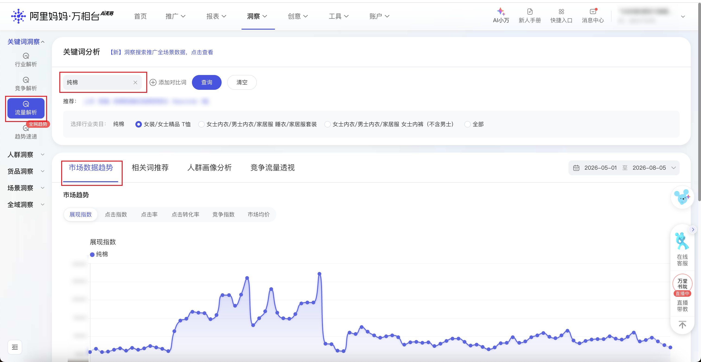

| 属性             | 值                                                                 |
| ---------------- | ------------------------------------------------------------------ |
| **连接器类型**   | `RPA 连接器`                                                       |
| **连接器名称**   | `ODS_万相台关键词市场趋势明细表(阿里妈妈RPA)`                      |
| **连接器代码**   | `rpa.conn.alimm.wxt.traffic.analysis.market.trend`                 |
| **操作类型**     | `页面解析`                                                         |
| **目标网页**     | `https://one.alimama.com/index.html#!/insight/search/traffic-analysis/index` |
| **适用场景**     | 按关键词、行业类目序号和统计周期采集万相台流量分析页市场数据趋势的按日指标 |
| **数据表名**     | `ods_rpa_alimm_wxt_traffic_analysis_market_trend_du`               |
| **业务表名**     | `ODS_万相台关键词市场趋势明细表(阿里妈妈RPA)`                      |

### 目标页面

> **取数路径**：万相台—洞察—流量解析—市场数据趋势
>
> **取数链接**：[https://one.alimama.com/index.html#!/insight/search/traffic-analysis/index](https://one.alimama.com/index.html#!/insight/search/traffic-analysis/index)



### 业务入参

| 字段 | 中文释义 | 数据类型 | 必填 | 默认值 | 说明 |
| ---- | -------- | -------- | ---- | ------ | ---- |
| `key_words` | 关键词 | `String` / `List[String]` | 是 | `-` | 支持英文逗号分隔字符串或字符串数组。多个时按顺序查询。最多 10 个 |
| `category_index` | 行业类目 | `String` / `List[String]` | 是 | `-` | 允许值：`1` / `2` / `3` / `4`。支持英文逗号分隔字符串或字符串数组。从左到右对应查询后的行业类目。`1` 为查询后已选中项；`4` 一般是「全部」。多个时按顺序采集 |
| `date_type` | 统计周期 | `String` | 是 | `-` | 允许值：`YESTERDAY`（昨日）/ `LAST_7_DAYS`（近 7 天）/ `LAST_14_DAYS`（近 14 天）/ `LAST_30_DAYS`（近 30 天）/ `LAST_1_YEAR`（近 1 年）/ `LAST_13_MONTHS`（近 13 个月）/ `CUSTOM`（自定义区间） |
| `custom_start_date` | 开始日期 | `String` | 条件必填 | `-` | `date_type` 为 `CUSTOM` 时必填。格式 `YYYYMMDD` 或 `YYYY-MM-DD`。不能晚于结束日期 |
| `custom_end_date` | 结束日期 | `String` | 条件必填 | `-` | `date_type` 为 `CUSTOM` 时必填。格式 `YYYYMMDD` 或 `YYYY-MM-DD` |

### 入参样例

单个关键词、第一个行业类目、近 30 天：

```json
{
  "key_words": "上衣",
  "category_index": "1",
  "date_type": "LAST_30_DAYS",
  "custom_start_date": "",
  "custom_end_date": ""
}
```

多个关键词与类目（数组）、昨日：

```json
{
  "key_words": ["短袖", "纯棉短袖松弛感穿搭女", "8seconds", "t恤", "上衣女"],
  "category_index": ["1", "2", "3", "4"],
  "date_type": "YESTERDAY",
  "custom_start_date": "",
  "custom_end_date": ""
}
```

自定义区间：

```json
{
  "key_words": "短袖,纯棉短袖松弛感穿搭女,8seconds,t恤,上衣女",
  "category_index": "1",
  "date_type": "CUSTOM",
  "custom_start_date": "2026-09-16",
  "custom_end_date": "2026-09-22"
}
```

### 入参校验

```json-schema collapsed
{
  "$schema": "https://json-schema.org/draft/2020-12/schema",
  "title": "洞察-流量分析-市场数据趋势 - 查询入参",
  "description": "按关键词、行业类目序号和统计周期采集万相台流量分析页市场数据趋势的按日指标",
  "type": "object",
  "properties": {
    "key_words": {
      "description": "关键词。支持英文逗号分隔字符串或字符串数组。多个时按顺序查询。最多 10 个",
      "oneOf": [
        {
          "type": "string",
          "minLength": 1
        },
        {
          "type": "array",
          "minItems": 1,
          "maxItems": 10,
          "items": {
            "type": "string",
            "minLength": 1
          }
        }
      ]
    },
    "category_index": {
      "description": "行业类目序号。允许值：1 / 2 / 3 / 4。支持英文逗号分隔字符串或字符串数组。从左到右对应查询后的行业类目。1 为查询后已选中项；4 一般是「全部」。多个时按顺序采集",
      "oneOf": [
        {
          "type": "string",
          "minLength": 1
        },
        {
          "type": "array",
          "minItems": 1,
          "items": {
            "type": "string",
            "enum": ["1", "2", "3", "4"]
          }
        }
      ]
    },
    "date_type": {
      "type": "string",
      "description": "统计周期。允许值：YESTERDAY（昨日）/ LAST_7_DAYS（近 7 天）/ LAST_14_DAYS（近 14 天）/ LAST_30_DAYS（近 30 天）/ LAST_1_YEAR（近 1 年）/ LAST_13_MONTHS（近 13 个月）/ CUSTOM（自定义区间）",
      "enum": [
        "YESTERDAY",
        "LAST_7_DAYS",
        "LAST_14_DAYS",
        "LAST_30_DAYS",
        "LAST_1_YEAR",
        "LAST_13_MONTHS",
        "CUSTOM"
      ]
    },
    "custom_start_date": {
      "type": "string",
      "description": "开始日期。date_type 为 CUSTOM 时必填。格式 YYYYMMDD 或 YYYY-MM-DD。不能晚于结束日期",
      "pattern": "^(\\d{8}|\\d{4}-\\d{2}-\\d{2})$"
    },
    "custom_end_date": {
      "type": "string",
      "description": "结束日期。date_type 为 CUSTOM 时必填。格式 YYYYMMDD 或 YYYY-MM-DD",
      "pattern": "^(\\d{8}|\\d{4}-\\d{2}-\\d{2})$"
    }
  },
  "required": ["key_words", "category_index", "date_type"],
  "allOf": [
    {
      "if": {
        "properties": {
          "date_type": { "const": "CUSTOM" }
        },
        "required": ["date_type"]
      },
      "then": {
        "required": ["custom_start_date", "custom_end_date"]
      }
    }
  ],
  "additionalProperties": false
}
```

### 数据字段

一行对应一个关键词、一个行业类目、一天。展现指数按四舍五入取整数。当日没有指标时，六个指标为空。

| 字段 | 中文释义 | 数据类型 | 可为空 | 取数路径 | 示例 |
| ---- | -------- | -------- | ------ | -------- | ---- |
| `keyWord` | 关键词 | `String` | 否 | 附加，来自入参 key_words | `上衣` |
| `categoryIndex` | 行业类目序号 | `String` | 否 | 附加，来自入参 category_index | `1` |
| `categoryName` | 行业类目 | `String` | 否 | 页面解析 | `女装/女士精品 T恤` |
| `dateType` | 统计周期 | `String` | 否 | 附加，来自入参 date_type | `LAST_30_DAYS` |
| `theDate` | 日期 | `String` | 否 | 页面解析 | `2026-08-24` |
| `impressionIndex` | 展现指数 | `Number` | 是 | 页面解析 | `2065264` |
| `clickIndex` | 点击指数 | `Number` | 是 | 页面解析 | `84896.39699469735` |
| `ctr` | 点击率 | `Number` | 是 | 页面解析 | `0.03851521463437806` |
| `cvr` | 点击转化率 | `Number` | 是 | 页面解析 | `0.01637935061901425` |
| `competitionIndex` | 竞争指数 | `Number` | 是 | 页面解析 | `122529.71687202062` |
| `avgPrice` | 市场均价 | `Number` | 是 | 页面解析 | `0.27811554364917596` |
| `bizDate` | 业务日期 | `String` | 否 | 附加 | `20260923` |
| `accountId` | 授权 ID | `String` | 否 | 附加 | `1****6` (已脱敏) |

### 数据样例

```json
[
  {
    "keyWord": "上衣",
    "categoryIndex": "1",
    "categoryName": "女装/女士精品 T恤",
    "dateType": "LAST_30_DAYS",
    "theDate": "2026-08-24",
    "impressionIndex": 2065264,
    "clickIndex": 84896.39699469735,
    "ctr": 0.03851521463437806,
    "cvr": 0.01637935061901425,
    "competitionIndex": 122529.71687202062,
    "avgPrice": 0.27811554364917596,
    "bizDate": "20260923",
    "accountId": "1****6"
  },
  {
    "keyWord": "上衣",
    "categoryIndex": "1",
    "categoryName": "女装/女士精品 T恤",
    "dateType": "LAST_30_DAYS",
    "theDate": "2026-08-25",
    "impressionIndex": 2002895,
    "clickIndex": 83073.80700661759,
    "ctr": 0.0388690650794417,
    "cvr": 0.01819814484003783,
    "competitionIndex": 123190.15735384253,
    "avgPrice": 0.2790290286740893,
    "bizDate": "20260923",
    "accountId": "1****6"
  }
]
```
