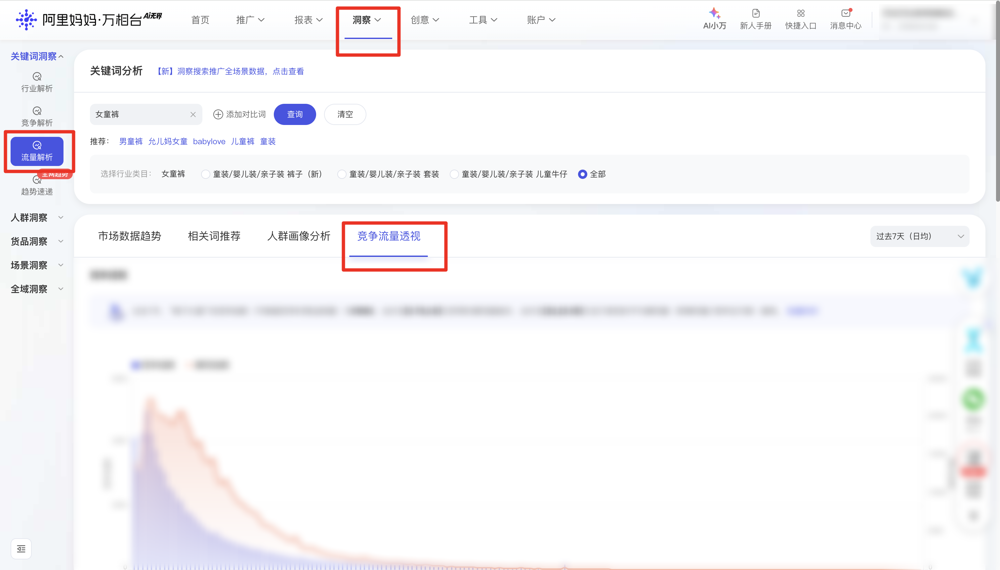

| 属性             | 值                                                                 |
| ---------------- | ------------------------------------------------------------------ |
| **连接器类型**   | `RPA 连接器`                                                       |
| **连接器名称**   | `ODS_万相台关键词流量分析透视明细(阿里妈妈RPA)`                    |
| **连接器代码**   | `rpa.conn.alimm.wxt.traffic.analysis.perspective.detail`           |
| **操作类型**     | `页面解析`                                                         |
| **目标网页**     | `https://one.alimama.com/index.html#!/insight/search/traffic-analysis/index` |
| **适用场景**     | 按关键词与统计周期采集万相台流量分析页竞争流量透视、搜索时段分布、地域分布与流量透视数据，支持按行业类目全采或指定类目 |
| **数据表名**     | `ods_rpa_alimm_wxt_traffic_analysis_perspective_detail_du`         |
| **业务表名**     | `ODS_万相台关键词流量分析透视明细(阿里妈妈RPA)`                    |

### 目标页面

> **取数路径**：万相台—洞察—搜索流量分析—竞争流量透视
>
> **取数链接**：[https://one.alimama.com/index.html#!/insight/search/traffic-analysis/index](https://one.alimama.com/index.html#!/insight/search/traffic-analysis/index)




### 业务入参

| 字段 | 中文释义 | 数据类型 | 必填 | 默认值 | 说明 |
| ---- | -------- | -------- | ---- | ------ | ---- |
| `key_word` | 关键词 | `String` | 是 | — | 须与页面关键词输入框一致 |
| `date_type` | 统计周期 | `String` | 否 | `LAST_7_DAYS` | 可选值：`DAY_BEFORE_YESTERDAY`（前天）/ `LAST_7_DAYS`（过去7天（日均））/ `LAST_14_DAYS`（过去14天（日均）） |
| `category_names` | 行业类目名称 | `String` / `List[String]` | 否 | - | 须与页面行业类目文案精准一致。空=全采，支持英文逗号分隔字符串或字符串数组（兼容中文逗号）。空或不传=全采（排除页面「全部」）；未在页面出现的名称记「未找到类目」 |

### 入参样例

全采（默认过去 7 天）：

```json
{
  "key_word": "女童裤",
  "date_type": "LAST_7_DAYS",
  "category_names": ""
}
```

指定统计周期与多个类目（数组）：

```json
{
  "key_word": "女童裤",
  "date_type": "LAST_14_DAYS",
  "category_names": ["童装/婴儿装/亲子装 裤子 (新", "童装/婴儿装/亲子装 套装"]
}
```

指定类目（英文逗号分隔）：

```json
{
  "key_word": "女童裤",
  "date_type": "DAY_BEFORE_YESTERDAY",
  "category_names": "童装/婴儿装/亲子装 裤子 (新,童装/婴儿装/亲子装 套装"
}
```

### 入参校验

```json-schema collapsed
{
  "$schema": "https://json-schema.org/draft/2020-12/schema",
  "title": "万相台-流量分析-竞争透视明细 - 查询入参",
  "description": "按关键词与统计周期采集万相台流量分析页竞争流量透视、搜索时段分布、地域分布与流量透视数据，支持按行业类目全采或指定类目",
  "type": "object",
  "properties": {
    "key_word": {
      "type": "string",
      "description": "关键词，必填",
      "minLength": 1
    },
    "date_type": {
      "type": "string",
      "description": "统计周期，默认 LAST_7_DAYS。可选值：DAY_BEFORE_YESTERDAY（前天）/ LAST_7_DAYS（过去7天（日均））/ LAST_14_DAYS（过去14天（日均））",
      "enum": ["DAY_BEFORE_YESTERDAY", "LAST_7_DAYS", "LAST_14_DAYS"],
      "default": "LAST_7_DAYS"
    },
    "category_names": {
      "description": "行业类目名称，须与页面 radio 文案精准一致。支持英文逗号分隔字符串或字符串数组；空或不传=全采（排除「全部」）",
      "oneOf": [
        {
          "type": "string"
        },
        {
          "type": "array",
          "items": {
            "type": "string"
          }
        }
      ]
    }
  },
  "required": ["key_word"],
  "additionalProperties": false
}
```

### 数据字段

:::field-tree
@define 竞争透视指标
| `priceInterval` | 价格区间 | `String` | 是 | 页面解析 | `100-200` |
| `impressionIndex` | 展现指数 | `Number` | 是 | 页面解析 | `1234` |
| `competition` | 竞争指数 | `Number` | 是 | 页面解析 | `56` |
| `adgroupCntIndex` | 推广单元数指数 | `Number` | 是 | 页面解析 | `78` |

@define 搜索时段分布指标
| `time` | 小时 | `String` | 是 | 页面解析 | `08` |
| `visitorNum` | 访客指数 | `Number` | 是 | 页面解析 | `100` |
| `ctr` | 点击率 | `Number` | 是 | 页面解析 | `0.05` |

@define 地域分布指标
| `provinceName` | 省份 | `String` | 是 | 页面解析 | `浙江省` |
| `provinceId` | 省份 ID | `String` | 是 | 页面解析 | `330000` |
| `coordinate` | 坐标 | `String` | 是 | 页面解析 | `120.15,30.28` |
| `impressionIndex` | 展现指数 | `Number` | 是 | 页面解析 | `1234` |
| `clickIndex` | 点击指数 | `Number` | 是 | 页面解析 | `567` |
| `ctrIndex` | 点击率 | `Number` | 是 | 页面解析 | `0.05` |
| `cvrIndex` | 点击转化率 | `Number` | 是 | 页面解析 | `0.02` |
| `cpcIndex` | 平均点击单价 | `Number` | 是 | 页面解析 | `1.2` |
| `competition` | 竞争指数 | `Number` | 是 | 页面解析 | `56` |
| `cost` | 花费 | `Number` | 是 | 页面解析 | `100` |
| `alipayDirCnt` | 直接成交笔数 | `Number` | 是 | 页面解析 | `10` |
| `alipayDirAmt` | 直接成交金额 | `Number` | 是 | 页面解析 | `500` |
| `alipayIndirCnt` | 间接成交笔数 | `Number` | 是 | 页面解析 | `5` |
| `alipayIndirAmt` | 间接成交金额 | `Number` | 是 | 页面解析 | `200` |
| `itemcollCnt` | 收藏宝贝数 | `Number` | 是 | 页面解析 | `3` |
| `shopcollCnt` | 收藏店铺数 | `Number` | 是 | 页面解析 | `1` |

@define 流量透视指标
| `pvName` | 核心流量来源 | `String` | 是 | 页面解析 | `手淘搜索` |
| `pvtypeId` | 流量来源类型 ID | `String` | 是 | 页面解析 | `1` |
| `impressionIndex` | 展现指数 | `Number` | 是 | 页面解析 | `1234` |
| `clickIndex` | 点击指数 | `Number` | 是 | 页面解析 | `567` |
| `ctrIndex` | 点击率 | `Number` | 是 | 页面解析 | `0.05` |
| `cvrIndex` | 点击转化率 | `Number` | 是 | 页面解析 | `0.02` |
| `avgPrice` | 市场均价 | `Number` | 是 | 页面解析 | `99.9` |
| `competition` | 竞争指数 | `Number` | 是 | 页面解析 | `56` |
| `impression` | 展现量 | `Number` | 是 | 页面解析 | `10000` |
| `click` | 点击量 | `Number` | 是 | 页面解析 | `500` |

@define 类目指标
| `competitionPerspective` @竞争透视指标 | 竞争透视 | `List[Dict]` | 是 | 页面解析 | 见数据样例 |
| `searchTimeDistribution` @搜索时段分布指标 | 搜索时段分布 | `List[Dict]` | 是 | 页面解析 | 见数据样例 |
| `regionDistribution` @地域分布指标 | 地域分布 | `List[Dict]` | 是 | 页面解析 | 见数据样例 |
| `trafficPerspective` @流量透视指标 | 流量透视 | `List[Dict]` | 是 | 页面解析 | 见数据样例 |

| 字段 | 中文释义 | 数据类型 | 可为空 | 取数路径 | 示例 |
| ---- | -------- | -------- | ------ | -------- | ---- |
| `categoryName` | 行业类目名称 | `String` | 否 | 页面解析 | `童装/婴儿装/亲子装 裤子` |
| `keyWord` | 关键词 | `String` | 否 | 附加，来自入参 key_word | `女童裤` |
| `dateType` | 统计周期 | `String` | 否 | 附加，来自入参 date_type | `LAST_7_DAYS` |
| `value` @类目指标 | 该类目四块透视数据 | `Dict` 或 `String` | 否 | 页面解析；失败时为 `未找到类目` 或 `未获取到数据` | 见数据样例 |
| `bizDate` | 业务日期 | `String` | 否 | 附加 | `20260827` |
| `accountId` | 授权 ID | `String` | 否 | 附加 | `1****8` (已脱敏) |
:::

### 数据样例

```json
[
  {
    "categoryName": "童装/婴儿装/亲子装 裤子",
    "keyWord": "女童裤",
    "dateType": "LAST_7_DAYS",
    "value": {
      "competitionPerspective": [
        {
          "priceInterval": "100-200",
          "impressionIndex": 1234,
          "competition": 56,
          "adgroupCntIndex": 78
        }
      ],
      "searchTimeDistribution": [
        {
          "time": "08",
          "visitorNum": 100,
          "ctr": 0.05
        }
      ],
      "regionDistribution": [
        {
          "provinceName": "浙江省",
          "provinceId": "330000",
          "coordinate": "120.15,30.28",
          "impressionIndex": 1234,
          "clickIndex": 567,
          "ctrIndex": 0.05,
          "cvrIndex": 0.02,
          "cpcIndex": 1.2,
          "competition": 56,
          "cost": 100,
          "alipayDirCnt": 10,
          "alipayDirAmt": 500,
          "alipayIndirCnt": 5,
          "alipayIndirAmt": 200,
          "itemcollCnt": 3,
          "shopcollCnt": 1
        }
      ],
      "trafficPerspective": [
        {
          "pvName": "手淘搜索",
          "pvtypeId": "1",
          "impressionIndex": 1234,
          "clickIndex": 567,
          "ctrIndex": 0.05,
          "cvrIndex": 0.02,
          "avgPrice": 99.9,
          "competition": 56,
          "impression": 10000,
          "click": 500
        }
      ]
    },
    "bizDate": "20260827",
    "accountId": "1****8"
  }
]
```

---
