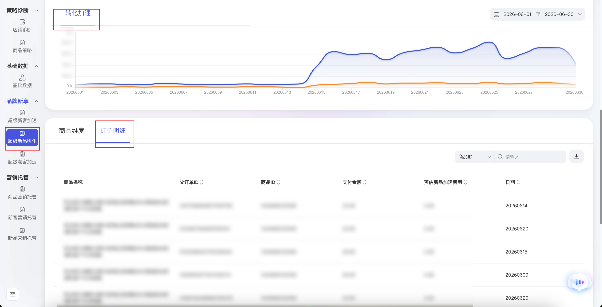

| 属性             | 值                                                                                                             |
| ---------------- | -------------------------------------------------------------------------------------------------------------- |
| **连接器类型**   | `RPA 连接器`                                                                                                   |
| **连接器名称**   | `ODS_品牌新享超级新品孵化订单明细表(阿里妈妈RPA)`                                                               |
| **连接器代码**   | `rpa.conn.alimm.ppxx.data.center.crowd.order`                                                                  |
| **操作类型**     | `文件导出`                                                                                                     |
| **目标网页**     | `https://ppxk.tmall.com/new/index.htm#!/data-center/crowd/index`                                               |
| **适用场景**     | 导出品牌新享数据中心「超级新品孵化」页面的订单明细，支持自定义日期范围；起始/结束日期均缺省时默认昨日单日       |
| **数据表名**     | `ods_rpa_alimm_ppxx_data_center_crowd_order_du`                                                                |
| **业务表名**     | `ODS_品牌新享超级新品孵化订单明细表(阿里妈妈RPA)`                                                               |

### 目标页面

> **取数路径**：品牌新享—数据中心—超级新品孵化—订单明细
>
> **取数链接**：[https://ppxk.tmall.com/new/index.htm#!/data-center/crowd/index](https://ppxk.tmall.com/new/index.htm#!/data-center/crowd/index)



### 业务入参

| 字段 | 中文释义 | 数据类型 | 必填 | 默认值 | 说明 |
| ---- | -------- | -------- | ---- | ------ | ---- |
| `custom_start_date` | 查询起始日期 | `String` | 否 | 昨天 | 与 `custom_end_date` **须同时提供或同时缺省**；均缺省时默认昨日单日；支持格式：YYYYMMDD、YYYY-MM-DD；不能晚于 `custom_end_date`；平台可选日期为滚动窗口（约最近半年，以页面日历 min/max 为准），越界返回明确失败 |
| `custom_end_date` | 查询结束日期 | `String` | 否 | 昨天 | 须与 `custom_start_date` 同时提供或同时缺省；支持格式：YYYYMMDD、YYYY-MM-DD；不能晚于今天；平台可选日期窗口规则同上 |

### 入参样例

**默认昨日单日** — 两日期均不传，走 t-1 默认值。

```json
{}
```

**自定义日期范围（横线格式）**

```json
{
  "custom_start_date": "2026-06-01",
  "custom_end_date": "2026-06-07"
}
```

**自定义单日（紧凑格式）**

```json
{
  "custom_start_date": "20260607",
  "custom_end_date": "20260607"
}
```

### 入参校验

```json-schema collapsed
{
  "$schema": "https://json-schema.org/draft/2020-12/schema",
  "title": "阿里妈妈-超级新品孵化订单明细 - 查询入参",
  "description": "导出品牌新享数据中心「超级新品孵化」页面的订单明细，支持自定义日期范围；起始/结束日期均缺省时默认昨日单日",
  "type": "object",
  "properties": {
    "custom_start_date": {
      "type": "string",
      "description": "查询起始日期；须与 custom_end_date 同时提供或同时缺省；均缺省时默认昨日单日；支持 YYYYMMDD 或 YYYY-MM-DD；不能晚于 custom_end_date；平台可选日期为滚动窗口（约最近半年），越界返回明确失败",
      "pattern": "^(\\d{8}|\\d{4}-\\d{2}-\\d{2})$"
    },
    "custom_end_date": {
      "type": "string",
      "description": "查询结束日期；须与 custom_start_date 同时提供或同时缺省；支持 YYYYMMDD 或 YYYY-MM-DD；不能晚于今天；平台可选日期窗口规则同上",
      "pattern": "^(\\d{8}|\\d{4}-\\d{2}-\\d{2})$"
    }
  },
  "required": [],
  "dependentRequired": {
    "custom_start_date": ["custom_end_date"],
    "custom_end_date": ["custom_start_date"]
  },
  "additionalProperties": false
}
```

### 数据字段

| 字段 | 中文释义 | 数据类型 | 可为空 | 取数路径 | 示例 |
| ---- | -------- | -------- | ------ | -------- | ---- |
| `itemName` | 商品名称 | `String` | 是 | `XLSX.0.商品名称` | `夏季户外凉拖鞋（示例商品）` |
| `parentOrderId` | 父订单 ID | `String` | 是 | `XLSX.0.父订单ID` | `3306185****7049390` |
| `itemId` | 商品 ID | `String` | 是 | `XLSX.0.商品ID` | `1040899****2599` |
| `payAmount` | 支付金额 | `Number / String` | 是 | `XLSX.0.支付金额` | `29.9` |
| `estimatedBoostCost` | 预估新品加速费用 | `Number / String` | 是 | `XLSX.0.预估新品加速费用` | `2.99` |
| `statDate` | 统计日期 | `String` | 是 | `XLSX.0.日期` | `20260601` |
| `taskId` | 任务 ID | `String` | 否 | 附加 | `dev-0-********` |
| `bizDate` | 业务日期 | `String` | 否 | 附加 |  |
| `accountId` | 授权 ID | `String` | 否 | 附加 | `***` |

### 数据样例

```json
[
  {
    "itemName": "夏季户外凉拖鞋（示例商品）",
    "parentOrderId": "3306185****7049390",
    "itemId": "1040899****2599",
    "payAmount": 29.9,
    "estimatedBoostCost": 2.99,
    "statDate": 20260601,
    "taskId": "dev-0-********",
    "bizDate": "20260708",
    "accountId": "***"
  }
]
```

---
