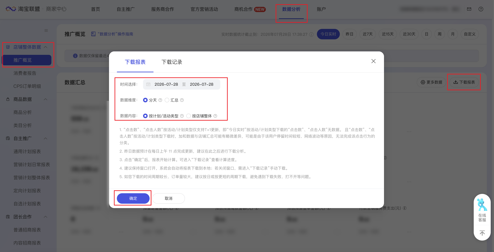

| 属性             | 值                                                                                                  |
| ---------------- | --------------------------------------------------------------------------------------------------- |
| **连接器类型**   | `RPA 连接器`                                                                                        |
| **连接器名称**   | `ODS_淘宝联盟数据分析推广概览信息表(阿里妈妈RPA)`                                                    |
| **连接器代码**   | `rpa.conn.alimm.tblm.data.analysis.promotion.overview`                                              |
| **操作类型**     | `文件导出`                                                                                          |
| **目标网页**     | `https://ad.alimama.com/portal/v2/report/promotionDataPage.htm`                                     |
| **适用场景**     | 按时间范围、数据维度与数据内容导出淘宝联盟推广概览报表，支持分天或汇总、按计划/活动类型或店铺整体维度采集推广效果指标 |
| **数据表名**     | `ods_rpa_alimm_tblm_data_analysis_promotion_overview_du`                                            |
| **业务表名**     | `ODS_淘宝联盟数据分析推广概览信息表(阿里妈妈RPA)`                                                    |

### 目标页面

> **取数路径**：阿里妈妈—淘宝联盟—报表—推广概览
>
> **取数链接**：[https://ad.alimama.com/portal/v2/report/promotionDataPage.htm](https://ad.alimama.com/portal/v2/report/promotionDataPage.htm)



### 业务入参

| 字段 | 中文释义 | 数据类型 | 必填 | 默认值 | 说明 |
| ---- | -------- | -------- | ---- | ------ | ---- |
| `date_type` | 时间类型 | `String` | 是 | — | 可选值：`TODAY_REALTIME`（今日）、`YESTERDAY`（昨日）、`LAST_7_DAYS`（近7天）、`LAST_15_DAYS`（近15天）、`LAST_30_DAYS`（近30天）、`CUSTOM`（自定义） |
| `custom_start_date` | 自定义起始日期 | `String` | 条件必填 | — | 格式：`YYYYMMDD` 或 `YYYY-MM-DD`；仅 `date_type=CUSTOM` 时必填；不能早于近 400 天 |
| `custom_end_date` | 自定义结束日期 | `String` | 条件必填 | — | 格式：`YYYYMMDD` 或 `YYYY-MM-DD`；仅 `date_type=CUSTOM` 时必填；不能晚于当天；与起始日期间隔不超过 31 天 |
| `data_dimension` | 数据维度 | `String` | 是 | — | 可选值：`BY_DAY`（分天）、`SUMMARY`（汇总） |
| `data_content` | 数据内容 | `String` | 是 | — | 可选值：`BY_PLAN_TYPE`（按计划/活动类型）、`BY_SHOP`（按店铺整体） |

### 入参样例

近 7 天、分天、按计划/活动类型：

```json
{
  "date_type": "LAST_7_DAYS",
  "data_dimension": "BY_DAY",
  "data_content": "BY_PLAN_TYPE"
}
```

自定义时间范围、汇总、按店铺整体：

```json
{
  "date_type": "CUSTOM",
  "custom_start_date": "20251001",
  "custom_end_date": "20251031",
  "data_dimension": "SUMMARY",
  "data_content": "BY_SHOP"
}
```

### 入参校验

```json-schema collapsed
{
  "$schema": "https://json-schema.org/draft/2020-12/schema",
  "title": "阿里妈妈-淘宝联盟推广概览 - 查询入参",
  "description": "按时间范围、数据维度与数据内容导出淘宝联盟推广概览报表，支持分天或汇总、按计划/活动类型或店铺整体维度采集推广效果指标",
  "type": "object",
  "properties": {
    "date_type": {
      "type": "string",
      "description": "时间类型",
      "enum": [
        "TODAY_REALTIME",
        "YESTERDAY",
        "LAST_7_DAYS",
        "LAST_15_DAYS",
        "LAST_30_DAYS",
        "CUSTOM"
      ]
    },
    "custom_start_date": {
      "type": "string",
      "description": "自定义起始日期，仅 date_type=CUSTOM 时必填，格式为 YYYYMMDD 或 YYYY-MM-DD，不能早于近 400 天",
      "pattern": "^(?:\\d{8}|\\d{4}-\\d{2}-\\d{2})$"
    },
    "custom_end_date": {
      "type": "string",
      "description": "自定义结束日期，仅 date_type=CUSTOM 时必填，格式为 YYYYMMDD 或 YYYY-MM-DD，不能晚于当天，与起始日期间隔不超过 31 天",
      "pattern": "^(?:\\d{8}|\\d{4}-\\d{2}-\\d{2})$"
    },
    "data_dimension": {
      "type": "string",
      "description": "数据维度",
      "enum": [
        "BY_DAY",
        "SUMMARY"
      ]
    },
    "data_content": {
      "type": "string",
      "description": "数据内容",
      "enum": [
        "BY_PLAN_TYPE",
        "BY_SHOP"
      ]
    }
  },
  "required": [
    "date_type",
    "data_dimension",
    "data_content"
  ],
  "allOf": [
    {
      "if": {
        "properties": {
          "date_type": {
            "const": "CUSTOM"
          }
        },
        "required": [
          "date_type"
        ]
      },
      "then": {
        "required": [
          "custom_start_date",
          "custom_end_date"
        ]
      }
    }
  ],
  "additionalProperties": false
}
```

### 数据字段

| 字段 | 中文释义 | 数据类型 | 可为空 | 取数路径 | 示例 |
| ---- | -------- | -------- | ------ | -------- | ---- |
| `statDate` | 统计日期 | `String` | 是 | `CSV.0.日期` | `2025-10-31` |
| `dataContentLabel` | 数据内容 | `String` | 是 | `CSV.0.数据内容` | `通用计划` |
| `clickPv` | 点击量（进店量） | `Number` | 否 | `CSV.0.点击量(即进店量)` | `226` |
| `clickUv` | 点击人数（进店人数） | `Number` | 否 | `CSV.0.点击人数(即进店人数)` | `178` |
| `promoteItemCnt` | 推广商品数 | `Number` | 是 | `CSV.0.推广商品数` | `123` |
| `couponGetCnt` | 优惠券领取量 | `Number` | 是 | `CSV.0.优惠券领取量` | `1190` |
| `payAmount` | 付款金额 | `Number` | 否 | `CSV.0.付款金额(元)` | `15620.09` |
| `payOrderCnt` | 付款笔数 | `Number` | 否 | `CSV.0.付款笔数` | `395` |
| `payBuyerCnt` | 付款人数 | `Number` | 是 | `CSV.0.付款人数` | `292` |
| `payItemQty` | 付款件数 | `Number` | 否 | `CSV.0.付款件数` | `447` |
| `settleBuyerCnt` | 结算人数 | `Number` | 是 | `CSV.0.结算人数` | `596` |
| `clickCvr` | 点击转化率（付款转化率） | `String` | 是 | `CSV.0.点击转化率(即付款转化率)` | `174.78%` |
| `confirmBuyerCnt` | 确认收货人数 | `Number` | 是 | `CSV.0.确认收货人数` | `652` |
| `confirmAmount` | 确认收货金额 | `Number` | 否 | `CSV.0.确认收货金额` | `45558.25` |
| `confirmOrderCnt` | 确认收货笔数 | `Number` | 否 | `CSV.0.确认收货笔数` | `994` |
| `cartAddCnt` | 添加购物车量 | `Number` | 是 | `CSV.0.添加购物车量` | `647` |
| `favoriteItemCnt` | 收藏宝贝量 | `Number` | 是 | `CSV.0.收藏宝贝量` | `44` |
| `settleAmount` | 结算金额 | `Number` | 否 | `CSV.0.结算金额(元)` | `45808.77` |
| `settleOrderCnt` | 结算笔数 | `Number` | 否 | `CSV.0.结算笔数` | `886` |
| `payCommissionFee` | 付款佣金支出 | `Number` | 否 | `CSV.0.付款佣金支出(元)` | `312.66` |
| `payServiceFee` | 付款服务费支出 | `Number` | 否 | `CSV.0.付款服务费支出(元)` | `0` |
| `payTotalFee` | 付款支出费用 | `Number` | 否 | `CSV.0.付款支出费用(元)` | `312.66` |
| `payCommissionRate` | 付款佣金率 | `String` | 是 | `CSV.0.付款佣金率` | `2%` |
| `payServiceRate` | 付款服务费率 | `String` | 是 | `CSV.0.付款服务费率` | `0%` |
| `payPerItemFee` | 单件商品付款支出费用 | `Number` | 是 | `CSV.0.单件商品付款支出费用(元)` | `0.69` |
| `settleCommissionFee` | 结算佣金支出 | `Number` | 否 | `CSV.0.结算佣金支出(元)` | `916.51` |
| `settleServiceFee` | 结算服务费支出 | `Number` | 否 | `CSV.0.结算服务费支出(元)` | `0` |
| `settleTotalFee` | 结算支出费用 | `Number` | 否 | `CSV.0.结算支出费用(元)` | `916.51` |
| `settleCommissionRate` | 结算佣金率 | `String` | 是 | `CSV.0.结算佣金率` | `2%` |
| `settleServiceRate` | 结算服务费率 | `String` | 是 | `CSV.0.结算服务费率` | `0%` |
| `presaleEstTotalCommission` | 预估预售整单佣金 | `Number` | 是 | `CSV.0.预估预售整单佣金(元)` | `0` |
| `presaleEstTotalCommissionRate` | 预估预售整单佣金率 | `Number` | 是 | `CSV.0.预估预售整单佣金率` | `0` |
| `presaleDepositCnt` | 预售定金笔数 | `Number` | 是 | `CSV.0.预售定金笔数` | `0` |
| `presaleDepositAmount` | 预售定金金额 | `Number` | 是 | `CSV.0.预售定金金额(元)` | `0` |
| `presaleEstRestAmount` | 预估预售尾款金额 | `Number` | 是 | `CSV.0.预估预售尾款金额(元)` | `0` |
| `presaleEstTotalAmount` | 预估预售整单金额 | `Number` | 是 | `CSV.0.预估预售整单金额(元)` | `698131` |
| `payBmktFee` | 付款营销服务费支出 | `Number` | 是 | `CSV.0.付款营销服务费支出(元)` | `0` |
| `settleBmktFee` | 结算营销服务费支出 | `Number` | 是 | `CSV.0.结算营销服务费支出(元)` | `0` |
| `statStartDate` | 统计开始日期 | `String` | 否 | 弹窗时间选择开始日期 | `2025-10-01` |
| `statEndDate` | 统计结束日期 | `String` | 否 | 弹窗时间选择结束日期 | `2025-10-31` |
| `dataDimension` | 数据维度 code | `String` | 否 | 入参 `data_dimension` | `BY_DAY` |
| `dataContent` | 数据内容 code | `String` | 否 | 入参 `data_content` | `BY_PLAN_TYPE` |
| `taskId` | 任务 ID | `String` | 否 | 附加 | `dev****620` (已脱敏) |
| `bizDate` | 业务日期 | `String` | 否 | 附加 | `20260728` |
| `accountId` | 授权 ID | `String` | 否 | 附加 | `1****6` (已脱敏) |

### 数据样例

```json
{
  "statDate": "2025-10-31",
  "dataContentLabel": "通用计划",
  "clickPv": 226,
  "clickUv": 178,
  "promoteItemCnt": null,
  "couponGetCnt": null,
  "payAmount": 15620.09,
  "payOrderCnt": 395,
  "payBuyerCnt": 292,
  "payItemQty": 447,
  "settleBuyerCnt": 596,
  "clickCvr": "174.78%",
  "confirmBuyerCnt": 652,
  "confirmAmount": 45558.25,
  "confirmOrderCnt": 994,
  "cartAddCnt": null,
  "favoriteItemCnt": null,
  "settleAmount": 45808.77,
  "settleOrderCnt": 886,
  "payCommissionFee": 312.66,
  "payServiceFee": 0,
  "payTotalFee": 312.66,
  "payCommissionRate": "2%",
  "payServiceRate": "0%",
  "payPerItemFee": 0.69,
  "settleCommissionFee": 916.51,
  "settleServiceFee": 0,
  "settleTotalFee": 916.51,
  "settleCommissionRate": "2%",
  "settleServiceRate": "0%",
  "presaleEstTotalCommission": null,
  "presaleEstTotalCommissionRate": null,
  "presaleDepositCnt": null,
  "presaleDepositAmount": null,
  "presaleEstRestAmount": null,
  "presaleEstTotalAmount": null,
  "payBmktFee": null,
  "settleBmktFee": null,
  "statStartDate": "2025-10-01",
  "statEndDate": "2025-10-31",
  "dataDimension": "BY_DAY",
  "dataContent": "BY_PLAN_TYPE",
  "taskId": "dev****620",
  "bizDate": "20260728",
  "accountId": "1****6"
}
```

---
