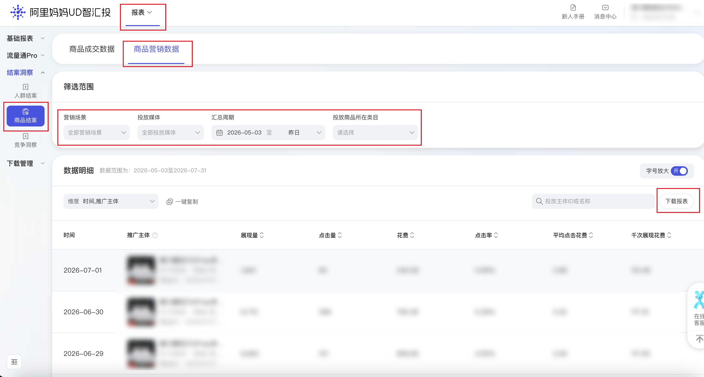

| 属性             | 值                                                                 |
| ---------------- | ------------------------------------------------------------------ |
| **连接器类型**   | `RPA 连接器`                                                       |
| **连接器名称**   | `ODS_UD智汇投商品营销数据明细报表(阿里妈妈RPA)`                  |
| **连接器代码**   | `rpa.conn.alimm.ud.item.marketing.data`                        |
| **操作类型**     | `文件导出`                                                         |
| **目标网页**     | `https://ud.alimama.com/index.html#!/report/launchItem?rptType=launchItem` |
| **适用场景**     | 导出阿里妈妈 UD智汇投 商品营销数据报表，支持按汇总周期、营销场景、投放媒体及投放商品类目筛选 |
| **数据表名**     | `ods_rpa_alimm_ud_item_marketing_data_du`                      |
| **业务表名**     | `ODS_UD智汇投商品营销数据明细报表(阿里妈妈RPA)`                  |

### 目标页面

> **取数路径**：阿里妈妈—UD智汇投—报表—结案洞察—商品结案—商品营销数据
>
> **取数链接**：[https://ud.alimama.com/index.html#!/report/launchItem?rptType=launchItem](https://ud.alimama.com/index.html#!/report/launchItem?rptType=launchItem)



### 业务入参

| 字段 | 中文释义 | 数据类型 | 必填 | 默认值 | 说明 |
| ---- | -------- | -------- | ---- | ------ | ---- |
| `date_type` | 汇总周期 | `String` | 是 | — | 仅接受英文 code，不接受页面中文。可选值：`YESTERDAY`（昨日）/ `LAST_7_DAYS`（过去 7 天）/ `LAST_WEEK`（上周）/ `LAST_15_DAYS`（过去 15 天）/ `THIS_MONTH`（本月）/ `LAST_30_DAYS`（过去 30 天）/ `LAST_MONTH`（上月）/ `CUSTOM`（自定义） |
| `custom_start_date` | 自定义开始日期 | `String` | 条件必填 | — | 仅 `date_type=CUSTOM` 时必填；仅 `YYYYMMDD` / `YYYY-MM-DD`（月日两位补零，如 `2026-06-02`）；拒绝 `2026-06-2`、`2026/06/02`；不能早于今天往前 89 天（页面「查询最大范围 90 天」含首尾）；与 `custom_end_date` 成对；含首尾跨度 ≤ 90 天 |
| `custom_end_date` | 自定义结束日期 | `String` | 条件必填 | — | 仅 `date_type=CUSTOM` 时必填；仅 `YYYYMMDD` / `YYYY-MM-DD`（月日须两位补零）；与 `custom_start_date` 成对；超过 90 天入参校验失败 |
| `marketing_scenes` | 营销场景 | `String` / `List[String]` | 否 | 全选 | 不传或空=页面「全选」；有值须为英文 code（不接受中文），否则入参校验失败。可选值：`ALL_MEDIA_SMART`（全媒体智投）/ `SINGLE_MEDIA_SMART`（单媒体智投）/ `UD_SMART`（UDSmart）；支持英文逗号分隔或 JSON 数组 |
| `delivery_medias` | 投放媒体 | `String` / `List[String]` | 否 | 全选 | 不传或空=页面「全选」；有值须为英文 code（不接受中文），否则入参校验失败。可选值：`ALL_MEDIA`（全媒体）/ `BYTEDANCE`（字节）/ `TENCENT`（腾讯）/ `XIAOHONGSHU`（小红书）/ `BILIBILI`（B站）；支持英文逗号分隔或 JSON 数组 |
| `launch_item_categories` | 投放商品所在类目 | `String` / `List[String]` | 否 | 全选 | 不传或空=页面「全选」；有值为搜索关键词（须能搜到下拉选项，否则报错）；单值最长 64 字；多匹配取第一条；支持英文逗号分隔或 JSON 数组 |

### 入参样例

快捷周期 + 全选筛选：

```json
{
  "date_type": "YESTERDAY"
}
```

快捷周期 + 场景 / 媒体 / 类目筛选：

```json
{
  "date_type": "LAST_7_DAYS",
  "marketing_scenes": ["ALL_MEDIA_SMART", "UD_SMART"],
  "delivery_medias": "BYTEDANCE,TENCENT",
  "launch_item_categories": "羽绒"
}
```

自定义汇总周期：

```json
{
  "date_type": "CUSTOM",
  "custom_start_date": "2026-07-01",
  "custom_end_date": "2026-07-20",
  "marketing_scenes": "ALL_MEDIA_SMART",
  "delivery_medias": ["BYTEDANCE", "XIAOHONGSHU"]
}
```

### 入参校验

```json-schema collapsed
{
  "$schema": "https://json-schema.org/draft/2020-12/schema",
  "title": "阿里妈妈-UD智汇投商品营销数据 - 查询入参",
  "description": "导出阿里妈妈 UD智汇投 商品营销数据报表，支持按汇总周期、营销场景、投放媒体及投放商品类目筛选",
  "type": "object",
  "properties": {
    "date_type": {
      "type": "string",
      "description": "汇总周期。仅接受英文 code，不接受页面中文。可选值：YESTERDAY（昨日）/ LAST_7_DAYS（过去 7 天）/ LAST_WEEK（上周）/ LAST_15_DAYS（过去 15 天）/ THIS_MONTH（本月）/ LAST_30_DAYS（过去 30 天）/ LAST_MONTH（上月）/ CUSTOM（自定义）",
      "enum": [
        "YESTERDAY",
        "LAST_7_DAYS",
        "LAST_WEEK",
        "LAST_15_DAYS",
        "THIS_MONTH",
        "LAST_30_DAYS",
        "LAST_MONTH",
        "CUSTOM"
      ]
    },
    "custom_start_date": {
      "type": "string",
      "description": "自定义开始日期。仅 date_type=CUSTOM 时必填；仅 YYYYMMDD 或 YYYY-MM-DD（月日须两位补零）；拒绝 2026-06-2、2026/06/02；不能早于今天往前 89 天（页面查询最大范围 90 天含首尾）；与 custom_end_date 成对；含首尾跨度 ≤ 90 天",
      "pattern": "^(\\d{8}|\\d{4}-\\d{2}-\\d{2})$"
    },
    "custom_end_date": {
      "type": "string",
      "description": "自定义结束日期。仅 date_type=CUSTOM 时必填；仅 YYYYMMDD 或 YYYY-MM-DD（月日须两位补零）；与 custom_start_date 成对；超过 90 天入参校验失败",
      "pattern": "^(\\d{8}|\\d{4}-\\d{2}-\\d{2})$"
    },
    "marketing_scenes": {
      "description": "营销场景。不传或空=页面全选；有值须为英文 code（不接受中文）。可选值：ALL_MEDIA_SMART（全媒体智投）/ SINGLE_MEDIA_SMART（单媒体智投）/ UD_SMART（UDSmart）；支持英文逗号分隔或 JSON 数组",
      "oneOf": [
        {
          "type": "string"
        },
        {
          "type": "array",
          "items": {
            "type": "string",
            "enum": [
              "ALL_MEDIA_SMART",
              "SINGLE_MEDIA_SMART",
              "UD_SMART"
            ]
          },
          "uniqueItems": true
        }
      ]
    },
    "delivery_medias": {
      "description": "投放媒体。不传或空=页面全选；有值须为英文 code（不接受中文）。可选值：ALL_MEDIA（全媒体）/ BYTEDANCE（字节）/ TENCENT（腾讯）/ XIAOHONGSHU（小红书）/ BILIBILI（B站）；支持英文逗号分隔或 JSON 数组",
      "oneOf": [
        {
          "type": "string"
        },
        {
          "type": "array",
          "items": {
            "type": "string",
            "enum": [
              "ALL_MEDIA",
              "BYTEDANCE",
              "TENCENT",
              "XIAOHONGSHU",
              "BILIBILI"
            ]
          },
          "uniqueItems": true
        }
      ]
    },
    "launch_item_categories": {
      "description": "投放商品所在类目搜索关键词。不传或空=页面全选；有值须能搜到下拉选项（单值最长 64 字），否则报错；多匹配取第一条；支持英文逗号分隔或 JSON 数组",
      "oneOf": [
        {
          "type": "string"
        },
        {
          "type": "array",
          "items": {
            "type": "string",
            "maxLength": 64
          },
          "uniqueItems": true
        }
      ]
    }
  },
  "required": ["date_type"],
  "allOf": [
    {
      "if": {
        "properties": {
          "date_type": {
            "const": "CUSTOM"
          }
        },
        "required": ["date_type"]
      },
      "then": {
        "required": ["custom_start_date", "custom_end_date"]
      }
    }
  ],
  "additionalProperties": false
}
```

### 数据字段

| 字段 | 中文释义 | 数据类型 | 可为空 | 取数路径 | 示例 |
| ---- | -------- | -------- | ------ | -------- | ---- |
| `reportDate` | 报表日期 | `String` | 否 | `XLSX.0.日期` | `2026-07-01` |
| `promoteSubjectId` | 推广主体 ID | `Number` | 否 | `XLSX.0.推广主体ID` | `625****657` (已脱敏) |
| `promoteSubjectTitle` | 推广主体标题 | `String` | 否 | `XLSX.0.推广主体标题` | `康尔****星级` (已脱敏) |
| `promoteSubjectCategory` | 推广主体类目 | `String` | 否 | `XLSX.0.推广主体类目` | `羽绒/羽毛被` |
| `impression` | 展现量 | `Number` | 否 | `XLSX.0.展现量` | `1841` |
| `click` | 点击量 | `Number` | 否 | `XLSX.0.点击量` | `84` |
| `cost` | 花费 | `Number` | 否 | `XLSX.0.花费` | `242.06` |
| `ctr` | 点击率 | `Number` | 否 | `XLSX.0.点击率` | `0.0456` |
| `cpc` | 平均点击花费 | `Number` | 否 | `XLSX.0.平均点击花费` | `2.88` |
| `cpm` | 千次展现花费 | `Number` | 否 | `XLSX.0.千次展现花费` | `131.48` |
| `bizDate` | 业务日期 | `String` | 否 | 附加 | `20260801` |
| `accountId` | 授权 ID | `String` | 否 | 附加 | `1****6` (已脱敏) |

### 数据样例

```json
{
  "reportDate": "2026-07-01",
  "promoteSubjectId": "625****657",
  "promoteSubjectTitle": "康尔****星级",
  "promoteSubjectCategory": "羽绒/羽毛被",
  "impression": 1841,
  "click": 84,
  "cost": 242.06,
  "ctr": 0.0456,
  "cpc": 2.88,
  "cpm": 131.48,
  "bizDate": "20260801",
  "accountId": "1****6"
}
```

---
