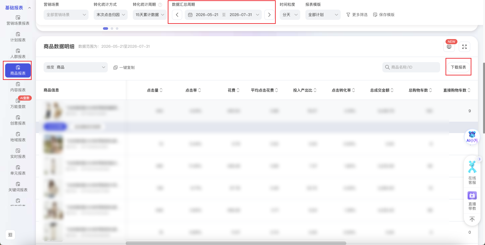

| 属性             | 值                                                                 |
| ---------------- | ------------------------------------------------------------------ |
| **连接器类型**   | `RPA 连接器`                                                       |
| **连接器名称**   | `ODS_万相台报表商品报表明细表(阿里妈妈RPA)`                         |
| **连接器代码**   | `rpa.conn.alimm.wxt.report.item.promotion`                         |
| **操作类型**     | `文件导出`                                                         |
| **目标网页**     | `https://one.alimama.com/index.html#!/report/item_promotion?rptType=item_promotion` |
| **适用场景**     | 下载阿里妈妈万相台商品报表（商品数据明细）离线文件，解析分天商品推广效果指标 |
| **数据表名**     | `ods_rpa_alimm_wxt_report_item_promotion_du`                       |
| **业务表名**     | `ODS_万相台报表商品报表明细表(阿里妈妈RPA)`                         |

### 目标页面

> **取数路径**：阿里妈妈—万相台—报表—商品报表
>
> **取数链接**：[https://one.alimama.com/index.html#!/report/item_promotion?rptType=item_promotion](https://one.alimama.com/index.html#!/report/item_promotion?rptType=item_promotion)



### 业务入参

| 字段 | 中文释义 | 数据类型 | 必填 | 默认值 | 说明 |
| ---- | -------- | -------- | ---- | ------ | ---- |
| `custom_start_date` | 自定义开始日期 | `String` | 条件必填 | — | 与 `custom_end_date` 须同时填写或同时为空；空则页面默认过去 7 天；支持格式：`YYYYMMDD`、`YYYY-MM-DD`（月日须两位补零）；须落在最近半年内（约 182 天） |
| `custom_end_date` | 自定义结束日期 | `String` | 条件必填 | — | 与 `custom_start_date` 须同时填写或同时为空；支持格式：`YYYYMMDD`、`YYYY-MM-DD`（月日须两位补零）；不能晚于今天；含首尾跨度 ≤ 90 天；须落在最近半年内 |

### 入参样例

不传日期（页面默认过去 7 天）：

```json
{}
```

自定义日期范围：

```json
{
  "custom_start_date": "2026-07-01",
  "custom_end_date": "2026-07-31"
}
```

```json
{
  "custom_start_date": "20260701",
  "custom_end_date": "20260731"
}
```

### 入参校验

```json-schema collapsed
{
  "$schema": "https://json-schema.org/draft/2020-12/schema",
  "title": "阿里妈妈-万相台商品报表 - 查询入参",
  "description": "下载阿里妈妈万相台商品报表（商品数据明细）离线文件，解析分天商品推广效果指标",
  "type": "object",
  "properties": {
    "custom_start_date": {
      "type": "string",
      "description": "自定义开始日期，与 custom_end_date 须同时填写或同时为空；空则页面默认过去 7 天。支持格式：YYYYMMDD、YYYY-MM-DD（月日须两位补零）；须落在最近半年内（约 182 天）",
      "pattern": "^(\\d{8}|\\d{4}-\\d{2}-\\d{2})$"
    },
    "custom_end_date": {
      "type": "string",
      "description": "自定义结束日期，与 custom_start_date 须同时填写或同时为空。支持格式：YYYYMMDD、YYYY-MM-DD（月日须两位补零）；不能晚于今天；含首尾跨度 ≤ 90 天；须落在最近半年内",
      "pattern": "^(\\d{8}|\\d{4}-\\d{2}-\\d{2})$"
    }
  },
  "required": [],
  "allOf": [
    {
      "if": {
        "required": ["custom_start_date"],
        "properties": {
          "custom_start_date": {
            "type": "string",
            "minLength": 1
          }
        }
      },
      "then": {
        "required": ["custom_end_date"]
      }
    },
    {
      "if": {
        "required": ["custom_end_date"],
        "properties": {
          "custom_end_date": {
            "type": "string",
            "minLength": 1
          }
        }
      },
      "then": {
        "required": ["custom_start_date"]
      }
    }
  ],
  "additionalProperties": false
}
```

### 数据字段

| 字段 | 中文释义 | 数据类型 | 可为空 | 取数路径 | 示例 |
| ---- | -------- | -------- | ------ | -------- | ---- |
| `theDate` | 日期 | `String` | 否 | `XLSX.0.日期` | `2026-07-31` |
| `promotionId` | 主体 ID | `Number` | 否 | `XLSX.0.主体ID` | `107****681` (已脱敏) |
| `subPromotionTypeName` | 主体类型 | `String` | 否 | `XLSX.0.主体类型` | `商品` |
| `promotionName` | 主体名称 | `String` | 否 | `XLSX.0.主体名称` | `飞鸟和****上衣女` (已脱敏) |
| `adPv` | 展现量 | `Number` | 否 | `XLSX.0.展现量` | `8225` |
| `click` | 点击量 | `Number` | 否 | `XLSX.0.点击量` | `274` |
| `charge` | 花费 | `Number` | 否 | `XLSX.0.花费` | `159.9` |
| `ctr` | 点击率 | `Number` | 否 | `XLSX.0.点击率` | `0.03331` |
| `ecpc` | 平均点击花费 | `Number` | 否 | `XLSX.0.平均点击花费` | `0.58` |
| `ecpm` | 千次展现花费 | `Number` | 否 | `XLSX.0.千次展现花费` | `19.44` |
| `prepayInshopAmt` | 总预售成交金额 | `Number` | 否 | `XLSX.0.总预售成交金额` | `0.0` |
| `prepayInshopNum` | 总预售成交笔数 | `Number` | 否 | `XLSX.0.总预售成交笔数` | `0` |
| `prepayDirAmt` | 直接预售成交金额 | `Number` | 否 | `XLSX.0.直接预售成交金额` | `0.0` |
| `prepayDirNum` | 直接预售成交笔数 | `Number` | 否 | `XLSX.0.直接预售成交笔数` | `0` |
| `prepayIndirAmt` | 间接预售成交金额 | `Number` | 否 | `XLSX.0.间接预售成交金额` | `0.0` |
| `prepayIndirNum` | 间接预售成交笔数 | `Number` | 否 | `XLSX.0.间接预售成交笔数` | `0` |
| `alipayDirAmt` | 直接成交金额 | `Number` | 否 | `XLSX.0.直接成交金额` | `0.0` |
| `alipayIndirAmt` | 间接成交金额 | `Number` | 否 | `XLSX.0.间接成交金额` | `2040.85` |
| `alipayInshopAmt` | 总成交金额 | `Number` | 否 | `XLSX.0.总成交金额` | `2040.85` |
| `alipayInshopNum` | 总成交笔数 | `Number` | 否 | `XLSX.0.总成交笔数` | `7` |
| `alipayDirNum` | 直接成交笔数 | `Number` | 否 | `XLSX.0.直接成交笔数` | `0` |
| `alipayIndirNum` | 间接成交笔数 | `Number` | 否 | `XLSX.0.间接成交笔数` | `7` |
| `cvr` | 点击转化率 | `Number` | 否 | `XLSX.0.点击转化率` | `0.02555` |
| `roi` | 投入产出比 | `Number` | 否 | `XLSX.0.投入产出比` | `12.76` |
| `alipayPrepayInshopRoi` | 含预售投产比 | `Number` | 否 | `XLSX.0.含预售投产比` | `12.76` |
| `alipayInshopCost` | 总成交成本 | `Number` | 否 | `XLSX.0.总成交成本` | `22.84` |
| `cartInshopNum` | 总购物车数 | `Number` | 否 | `XLSX.0.总购物车数` | `50` |
| `cartDirNum` | 直接购物车数 | `Number` | 否 | `XLSX.0.直接购物车数` | `5` |
| `cartIndirNum` | 间接购物车数 | `Number` | 否 | `XLSX.0.间接购物车数` | `45` |
| `cartRate` | 加购率 | `Number` | 否 | `XLSX.0.加购率` | `0.18248` |
| `itemColInshopNum` | 收藏宝贝数 | `Number` | 否 | `XLSX.0.收藏宝贝数` | `3` |
| `shopColDirNum` | 收藏店铺数 | `Number` | 否 | `XLSX.0.收藏店铺数` | `0` |
| `shopColInshopCost` | 店铺收藏成本 | `Number` | 是 | `XLSX.0.店铺收藏成本` | — |
| `colCartNum` | 总收藏加购数 | `Number` | 否 | `XLSX.0.总收藏加购数` | `53` |
| `colCartCost` | 总收藏加购成本 | `Number` | 否 | `XLSX.0.总收藏加购成本` | `3.02` |
| `itemColCart` | 宝贝收藏加购数 | `Number` | 否 | `XLSX.0.宝贝收藏加购数` | `53` |
| `itemColCartCost` | 宝贝收藏加购成本 | `Number` | 否 | `XLSX.0.宝贝收藏加购成本` | `3.02` |
| `colNum` | 总收藏数 | `Number` | 否 | `XLSX.0.总收藏数` | `3` |
| `itemColInshopCost` | 宝贝收藏成本 | `Number` | 否 | `XLSX.0.宝贝收藏成本` | `53.3` |
| `itemColInshopRate` | 宝贝收藏率 | `Number` | 否 | `XLSX.0.宝贝收藏率` | `0.01095` |
| `cartCost` | 加购成本 | `Number` | 否 | `XLSX.0.加购成本` | `3.2` |
| `gmvInshopNum` | 拍下订单笔数 | `Number` | 否 | `XLSX.0.拍下订单笔数` | `7` |
| `gmvInshopAmt` | 拍下订单金额 | `Number` | 否 | `XLSX.0.拍下订单金额` | `5542.0` |
| `itemColDirNum` | 直接收藏宝贝数 | `Number` | 否 | `XLSX.0.直接收藏宝贝数` | `1` |
| `itemColIndirNum` | 间接收藏宝贝数 | `Number` | 否 | `XLSX.0.间接收藏宝贝数` | `2` |
| `couponShopNum` | 优惠券领取量 | `Number` | 否 | `XLSX.0.优惠券领取量` | `4` |
| `shoppingNum` | 购物金充值笔数 | `Number` | 否 | `XLSX.0.购物金充值笔数` | `0` |
| `shoppingAmt` | 购物金充值金额 | `Number` | 否 | `XLSX.0.购物金充值金额` | `0.0` |
| `wwNum` | 旺旺咨询量 | `Number` | 否 | `XLSX.0.旺旺咨询量` | `3` |
| `inshopPv` | 引导访问量 | `Number` | 否 | `XLSX.0.引导访问量` | `1129` |
| `inshopUv` | 引导访问人数 | `Number` | 否 | `XLSX.0.引导访问人数` | `222` |
| `inshopPotentialUv` | 引导访问潜客数 | `Number` | 否 | `XLSX.0.引导访问潜客数` | `73` |
| `inshopPotentialUvRate` | 引导访问潜客占比 | `Number` | 否 | `XLSX.0.引导访问潜客占比` | `0.32883` |
| `rhRate` | 入会率 | `Number` | 否 | `XLSX.0.入会率` | `0.0073` |
| `rhNum` | 入会量 | `Number` | 否 | `XLSX.0.入会量` | `2` |
| `inshopPvRate` | 引导访问率 | `Number` | 否 | `XLSX.0.引导访问率` | `0.13726` |
| `deepInshopPv` | 深度访问量 | `Number` | 否 | `XLSX.0.深度访问量` | `836` |
| `avgAccessPageNum` | 平均访问页面数 | `Number` | 否 | `XLSX.0.平均访问页面数` | `5.0` |
| `newAlipayInshopUv` | 成交新客数 | `Number` | 否 | `XLSX.0.成交新客数` | `0` |
| `newAlipayInshopUvRate` | 成交新客占比 | `Number` | 否 | `XLSX.0.成交新客占比` | `0.0` |
| `hySgUv` | 会员首购人数 | `Number` | 否 | `XLSX.0.会员首购人数` | `0` |
| `hyPayAmt` | 会员成交金额 | `Number` | 否 | `XLSX.0.会员成交金额` | `2040.85` |
| `hyPayNum` | 会员成交笔数 | `Number` | 否 | `XLSX.0.会员成交笔数` | `7` |
| `alipayInshopUv` | 成交人数 | `Number` | 否 | `XLSX.0.成交人数` | `6` |
| `alipayInshopNumAvg` | 人均成交笔数 | `Number` | 否 | `XLSX.0.人均成交笔数` | `1.0` |
| `alipayInshopAmtAvg` | 人均成交金额 | `Number` | 否 | `XLSX.0.人均成交金额` | `340.14` |
| `naturalPayAmt` | 自然流量转化金额 | `Number` | 否 | `XLSX.0.自然流量转化金额` | `247.9` |
| `orgNaturalPv` | 自然流量曝光量 | `Number` | 否 | `XLSX.0.自然流量曝光量` | `3203` |
| `dsAlipayInshopNum` | 电商成交笔数 | `Number` | 否 | `XLSX.0.电商成交笔数` | `7` |
| `dsAlipayInshopAmt` | 电商成交金额 | `Number` | 否 | `XLSX.0.电商成交金额` | `2040.85` |
| `sgAlipayInshopNum` | 闪购成交笔数 | `Number` | 否 | `XLSX.0.闪购成交笔数` | `0` |
| `sgAlipayInshopAmt` | 闪购成交金额 | `Number` | 否 | `XLSX.0.闪购成交金额` | `0.0` |
| `alipayInshopAmtBoost` | 平台助推总成交 | `Number` | 否 | `XLSX.0.平台助推总成交` | `0.0` |
| `alipayDirAmtBoost` | 平台助推直接成交 | `Number` | 否 | `XLSX.0.平台助推直接成交` | `0.0` |
| `clickBoost` | 平台助推点击 | `Number` | 否 | `XLSX.0.平台助推点击` | `0` |
| `chargeCoupon` | 宝贝优惠券抵扣金额 | `Number` | 否 | `XLSX.0.宝贝优惠券抵扣金额` | `0.0` |
| `alipayInshopAmtCoupon` | 宝贝优惠券撬动总成交 | `Number` | 否 | `XLSX.0.宝贝优惠券撬动总成交` | `0.0` |
| `alipayDirAmtCoupon` | 宝贝优惠券撬动直接成交 | `Number` | 否 | `XLSX.0.宝贝优惠券撬动直接成交` | `0.0` |
| `clickCoupon` | 宝贝优惠券撬动点击 | `Number` | 否 | `XLSX.0.宝贝优惠券撬动点击` | `0` |
| `xxHxAlipayInshopAmt` | 平台补贴金额 | `Number` | 否 | `XLSX.0.平台补贴金额` | `0.0` |
| `xxHxNewAlipayAmt` | 补贴引导成交金额 | `Number` | 否 | `XLSX.0.补贴引导成交金额` | `0.0` |
| `xxHxItemNum` | 发券补贴商品个数 | `Number` | 否 | `XLSX.0.发券补贴商品个数` | `0` |
| `xxHxNewAlipayNum` | 补贴引导成交人数 | `Number` | 否 | `XLSX.0.补贴引导成交人数` | `0` |
| `bizDate` | 业务日期 | `String` | 否 | 附加 | `20260806` |
| `accountId` | 授权 ID | `String` | 否 | 附加 | `1****6` (已脱敏) |

### 数据样例

```json
{
  "theDate": "2026-07-31",
  "promotionId": "107****681",
  "subPromotionTypeName": "商品",
  "promotionName": "飞鸟和****上衣女",
  "adPv": 8225,
  "click": 274,
  "charge": 159.9,
  "ctr": 0.03331,
  "ecpc": 0.58,
  "ecpm": 19.44,
  "prepayInshopAmt": 0.0,
  "prepayInshopNum": 0,
  "prepayDirAmt": 0.0,
  "prepayDirNum": 0,
  "prepayIndirAmt": 0.0,
  "prepayIndirNum": 0,
  "alipayDirAmt": 0.0,
  "alipayIndirAmt": 2040.85,
  "alipayInshopAmt": 2040.85,
  "alipayInshopNum": 7,
  "alipayDirNum": 0,
  "alipayIndirNum": 7,
  "cvr": 0.02555,
  "roi": 12.76,
  "alipayPrepayInshopRoi": 12.76,
  "alipayInshopCost": 22.84,
  "cartInshopNum": 50,
  "cartDirNum": 5,
  "cartIndirNum": 45,
  "cartRate": 0.18248,
  "itemColInshopNum": 3,
  "shopColDirNum": 0,
  "shopColInshopCost": null,
  "colCartNum": 53,
  "colCartCost": 3.02,
  "itemColCart": 53,
  "itemColCartCost": 3.02,
  "colNum": 3,
  "itemColInshopCost": 53.3,
  "itemColInshopRate": 0.01095,
  "cartCost": 3.2,
  "gmvInshopNum": 7,
  "gmvInshopAmt": 5542.0,
  "itemColDirNum": 1,
  "itemColIndirNum": 2,
  "couponShopNum": 4,
  "shoppingNum": 0,
  "shoppingAmt": 0.0,
  "wwNum": 3,
  "inshopPv": 1129,
  "inshopUv": 222,
  "inshopPotentialUv": 73,
  "inshopPotentialUvRate": 0.32883,
  "rhRate": 0.0073,
  "rhNum": 2,
  "inshopPvRate": 0.13726,
  "deepInshopPv": 836,
  "avgAccessPageNum": 5.0,
  "newAlipayInshopUv": 0,
  "newAlipayInshopUvRate": 0.0,
  "hySgUv": 0,
  "hyPayAmt": 2040.85,
  "hyPayNum": 7,
  "alipayInshopUv": 6,
  "alipayInshopNumAvg": 1.0,
  "alipayInshopAmtAvg": 340.14,
  "naturalPayAmt": 247.9,
  "orgNaturalPv": 3203,
  "dsAlipayInshopNum": 7,
  "dsAlipayInshopAmt": 2040.85,
  "sgAlipayInshopNum": 0,
  "sgAlipayInshopAmt": 0.0,
  "alipayInshopAmtBoost": 0.0,
  "alipayDirAmtBoost": 0.0,
  "clickBoost": 0,
  "chargeCoupon": 0.0,
  "alipayInshopAmtCoupon": 0.0,
  "alipayDirAmtCoupon": 0.0,
  "clickCoupon": 0,
  "xxHxAlipayInshopAmt": 0.0,
  "xxHxNewAlipayAmt": 0.0,
  "xxHxItemNum": 0,
  "xxHxNewAlipayNum": 0,
  "bizDate": "20260806",
  "accountId": "1****6"
}
```

---
