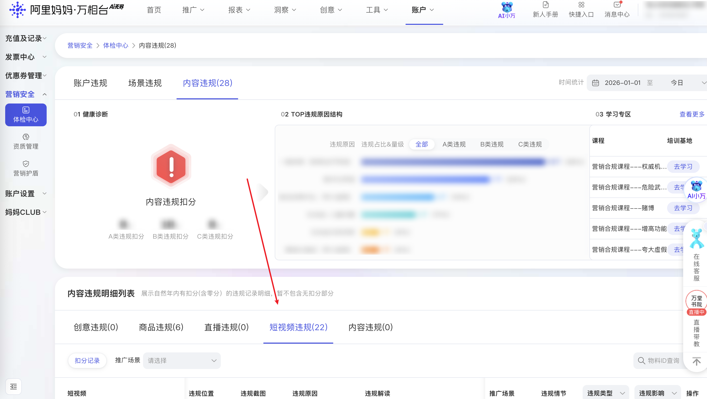

| 属性             | 值                                                                                                |
| ---------------- | ------------------------------------------------------------------------------------------------- |
| **连接器类型**   | `RPA 连接器`|
| **连接器名称**   | `ODS_万相台短视频违规明细表(阿里妈妈RPA)`|
| **连接器代码**   | `rpa.conn.alimm.wxt.short.video.violation`|
| **操作类型**     | `页面解析`|
| **目标网页**     | `https://one.alimama.com/index.html#!/account/violation/index?tab=content&tabIndex=short_video`|
| **适用场景**     | 采集阿里妈妈万相台内容违规列表中的短视频违规记录，支持推广场景、物料ID、违规类型、违规影响及时间范围筛选|
| **数据表名**     | `ods_rpa_alimm_wxt_short_video_violation_du`|
| **业务表名**     | `ODS_万相台短视频违规明细表(阿里妈妈RPA)`|

### 目标页面

> **取数路径**：阿里妈妈—万相台—账户—违规管理—内容违规—短视频
>
> **取数链接**：[https://one.alimama.com/index.html#!/account/violation/index?tab=content&tabIndex=short_video](https://one.alimama.com/index.html#!/account/violation/index?tab=content&tabIndex=short_video)



### 业务入参

| 字段 | 中文释义 | 数据类型 | 必填 | 默认值 | 说明 |
| ---- | -------- | -------- | ---- | ------ | ---- |
| `scene_id` | 推广场景 appId | `string` | 否 | `""` | 可选值：`372`（人群推广）、`428`（多目标直投）、`419`（追投快）、`418`（策略快）、`436`（货品全站推广）、`383`（全媒体智投）、`479`（店铺直达）、`408`（全店推广）、`376`（货品运营）、`533`（光合商单）、`386`（超级直播）、`400`（短直联动）、`387`（超级短视频）、`395`（线索推广）、`371`（关键词推广） |
| `element_id` | 物料 ID | `string` | 否 | `""` | 纯数字，最长 20 位 |
| `violate_id` | 违规类型 ID | `string` | 否 | `""` | 可选值：`630`（A 类违规）、`631`（B 类违规）、`632`（C 类违规） |
| `violate_impact` | 违规影响分值 | `string` | 否 | `""` | 可选值：`0`（0 分）、`1`（1 分）、`2`（2 分）、`3`（3 分）、`6`（6 分及以上） |
| `custom_start_date` | 时间统计开始日期 | `string` | 否 | — | 格式 `YYYYMMDD` 或 `YYYY-MM-DD`，不早于当年 1 月 1 日；不传则不拼接 URL 时间参数（页面默认当年 1 月 1 日）；与 `custom_end_date` 成对传入 |
| `custom_end_date` | 时间统计结束日期 | `string` | 否 | — | 格式 `YYYYMMDD` 或 `YYYY-MM-DD`，不晚于今天；不传则不拼接 URL 时间参数（页面默认今天）；与 `custom_start_date` 成对传入 |

### 入参样例

```json
{}
```

```json
{
    "scene_id": "387",
    "violate_id": "631",
    "violate_impact": "1",
    "custom_start_date": "20260101",
    "custom_end_date": "20260604"
}
```

```json
{
    "element_id": "560087737752",
    "custom_start_date": "2026-05-01",
    "custom_end_date": "2026-05-31"
}
```

### 数据字段

| 字段 | 中文释义 | 数据类型 | 可为空 | 取数路径 | 示例 |
| ---- | -------- | -------- | ------ | -------- | ---- |
| `id` | 违规记录 ID | `number` | 否 | `id` | `8673924` |
| `elementId` | 物料 ID | `number` | 否 | `elementId` | `560087737752` |
| `elementType` | 物料类型 | `string` | 否 | `elementType` | `short_video` |
| `itemId` | 商品 ID | `number` | 否 | `itemId` | `678264636662` |
| `sceneName` | 推广场景名 | `string` | 否 | `sceneName` | `内容营销/超级短视频` |
| `violateId` | 违规类型 ID | `number` | 否 | `violateId` | `631` |
| `violateType` | 违规类型 | `string` | 是 | `violateType` | — |
| `subViolateType` | 子违规类型 | `string` | 是 | `subViolateType` | `L4` |
| `score` | 违规影响分数 | `number` | 否 | `score` | `0` |
| `degree` | 违规等级 | `number` | 否 | `degree` | `1` |
| `isEffective` | 是否生效 | `number` | 否 | `isEffective` | `1` |
| `bizCode` | 业务代码 | `string` | 否 | `bizCode` | `onebpShortVideo` |
| `application` | 推广场景 appId | `number` | 否 | `application` | `700013` |
| `cumulateType` | 累计类型 | `string` | 否 | `cumulateType` | `lp` |
| `gmtCreate` | 违规时间 | `string` | 否 | `gmtCreate` | `2026-05-01 14:41:57` |
| `gmtModified` | 修改时间 | `string` | 否 | `gmtModified` | `2026-05-01 14:41:57` |
| `editUrl` | 编辑链接 | `string` | 否 | `editUrl` | `https://one.alimama.com/index.html#!/manage/content?bizCode=onebpShortVideo&offset=0&searchKey=videoId&searchValue=560087737752` |
| `reason` | 违规原因 | `string` | 否 | `reason` | 见数据样例 `reason` |
| `extendContent` | 扩展内容 | `string` | 是 | `extendContent` | `{"product_id":"101013001","line_id":"101013"}` |
| `adgroupId` | 推广单元 ID | `number` | 是 | `adgroupId` | — |
| `campaignId` | 推广计划 ID | `number` | 是 | `campaignId` | — |
| `shortVideo` | 短视频信息 | `Dict` | 是 | `shortVideo` | 见数据样例 `shortVideo` |
| `live` | 直播信息 | `Dict` | 是 | `live` | — |
| `creative` | 创意信息 | `Dict` | 是 | `creative` | — |
| `item` | 商品信息 | `Dict` | 是 | `item` | — |
| `material` | 素材信息 | `Dict` | 是 | `material` | — |
| `qualification` | 资质信息 | `Dict` | 是 | `qualification` | — |
| `rssContentDO` | RSS 内容对象 | `Dict` | 是 | `rssContentDO` | — |
| `rss_content` | RSS 内容 | `Dict` | 是 | `rss_content` | — |
| `bizDate` | 业务日期 | `string` | 否 | 附加 |  |
| `accountId` | 授权 ID | `string` | 否 | 附加 |  |

### 数据样例

```json
{
    "id": 8673924,
    "elementId": 560087737752,
    "elementType": "short_video",
    "itemId": 678264636662,
    "sceneName": "内容营销/超级短视频",
    "violateId": 631,
    "violateType": null,
    "subViolateType": "L4",
    "score": 0,
    "degree": 1,
    "isEffective": 1,
    "bizCode": "onebpShortVideo",
    "application": 700013,
    "cumulateType": "lp",
    "gmtCreate": "2026-05-01 14:41:57",
    "gmtModified": "2026-05-01 14:41:57",
    "editUrl": "https://one.alimama.com/index.html#!/manage/content?bizCode=onebpShortVideo&offset=0&searchKey=videoId&searchValue=560087737752",
    "reason": "[{\"auditBlockId\":386,\"auditBlockName\":\"推广视频\",\"blockUrl\":\"http://help.alimama.com/#!/ztc/faq/detail?id=5795497\",\"auditGroupId\":941,\"auditGroupName\":\"视频直播-B类风险\",\"auditReasonId\":6742,\"auditReasonName\":\"描述不符\",\"remark\":\"您好，发布内容不得出现描述不符或无法证实的信息或有虚构原价、虚假折扣等价格欺诈以及虚假营销的行为。请您对照规则解读内容进行修改！\",\"redirectUrl\":\"https://rule.alimama.com/#!/product/index?type=detail&id=1074&knowledgeId=7603\",\"violateType\":2,\"subViolateType\":4,\"badcaseTag\":\"0,2,3\",\"auditLevel\":10,\"flawUrls\":[\"https://adrisk-sample.taobao.com/snapshot/fbaf25a2-d3fc-4e70-9f20-1a26dc5b948f.jpg\"],\"punishDegree\":1,\"isManual\":false,\"ruleLink\":\"https://rule.alimama.com/#!/product/index?type=detail&id=1074&knowledgeId=7603\",\"subReason\":[],\"elementIndex\":\"\"}]",
    "extendContent": "{\"product_id\":\"101013001\",\"line_id\":\"101013\"}",
    "adgroupId": null,
    "campaignId": null,
    "shortVideo": {
        "imgUrl": "https://img.alicdn.com/imgextra/i3/6000000003454/O1CN01i3irlX1bNz907IwY2_!!6000000003454-0-alimamacc.jpg",
        "linkUrl": "https://market.m.taobao.com/app/tb-source-app/video-fullpage/pages/index?wx_navbar_hidden=true&source=publish&wh_weex=true&type=publish&id=560087737752",
        "id": 560087737752,
        "title": "兔头妈妈 新一代升级款4倍高纯奥拉氟牙膏！长效防蛀～特别适合不爱刷牙和刷牙敷衍的宝贝",
        "bizLine": "mmsvideo"
    },
    "live": null,
    "creative": null,
    "item": null,
    "material": null,
    "qualification": null,
    "rssContentDO": null,
    "rss_content": null,
    "bizDate": "20260604",
    "accountId": "108"
}
```

---
