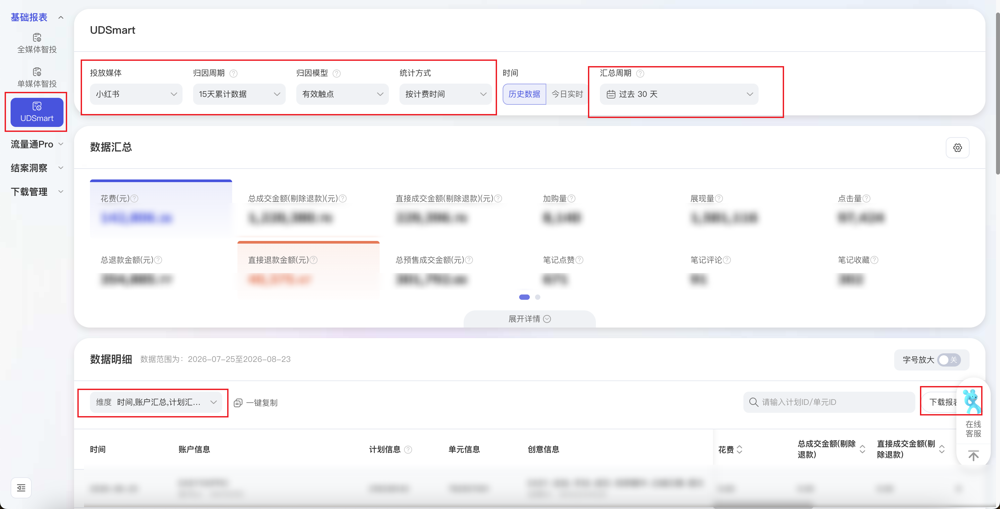

| 属性             | 值                                                                 |
| ---------------- | ------------------------------------------------------------------ |
| **连接器类型**   | `RPA 连接器`                                                       |
| **连接器名称**   | `ODS_营销生态UD智汇投报表UDSmart明细表(阿里妈妈RPA)`               |
| **连接器代码**   | `rpa.conn.alimm.yxstud.smart.report`                               |
| **操作类型**     | `文件导出`                                                         |
| **目标网页**     | `https://ud.alimama.com/index.html#!/report/ud_smart?rptType=udSmart&bizCode=udSmart` |
| **适用场景**     | 从阿里妈妈营销生态UD进入 UD智汇投，导出 UDSmart 报表明细，支持按投放媒体、归因周期、归因模型及汇总周期筛选 |
| **数据表名**     | `ods_rpa_alimm_yxstud_smart_report_du`                             |
| **业务表名**     | `ODS_营销生态UD智汇投报表UDSmart明细表(阿里妈妈RPA)`               |

### 目标页面

> **取数路径**：阿里妈妈—营销生态UD—UD智汇投—报表—基础报表—UDSmart
>
> **取数链接**：[https://ud.alimama.com/index.html#!/report/ud_smart?rptType=udSmart&bizCode=udSmart](https://ud.alimama.com/index.html#!/report/ud_smart?rptType=udSmart&bizCode=udSmart)



### 业务入参

| 字段 | 中文释义 | 数据类型 | 必填 | 默认值 | 说明 |
| ---- | -------- | -------- | ---- | ------ | ---- |
| `delivery_media` | 投放媒体 | `String` | 是 | — | 仅接受英文 code，不接受页面中文。可选值：`BYTEDANCE`（字节）/ `TENCENT`（腾讯）/ `XIAOHONGSHU`（小红书）/ `BILIBILI`（B站）/ `KUAISHOU`（快手）。不含「全部媒体」（页面选全部媒体无报表数据） |
| `attribution_period` | 归因周期 | `String` | 否 | `HOURS_24` | 仅接受英文 code。可选值：`DAYS_7`（7天累计数据）/ `DAYS_15`（15天累计数据）/ `HOURS_24`（24小时累计数据）。默认 24 小时累计数据 |
| `attribution_model` | 归因模型 | `String` | 否 | `CLICK` | 仅接受英文 code。可选值：`CLICK`（点击）/ `EFFECTIVE_TOUCH`（有效触点）。默认点击 |
| `date_type` | 汇总周期 | `String` | 否 | `YESTERDAY` | 仅接受英文 code，对齐页面「快捷日期」。可选值：`YESTERDAY`（昨日）/ `LAST_7_DAYS`（过去 7 天）/ `LAST_WEEK`（上周）/ `LAST_15_DAYS`（过去 15 天）/ `THIS_MONTH`（本月）/ `LAST_30_DAYS`（过去 30 天）/ `LAST_MONTH`（上月）/ `CUSTOM`（自定义）。未传 `date_type` 但传了起止日时按 `CUSTOM` |
| `custom_start_date` | 自定义开始日期 | `String` | 条件必填 | — | 仅 `date_type=CUSTOM` 时必填；仅 `YYYYMMDD` / `YYYY-MM-DD`（月日须两位补零）；拒绝斜杠等其它格式；最早=今天往前 364 天；与 `custom_end_date` 成对；含首尾跨度 ≤ 90 天；仅历史数据 |
| `custom_end_date` | 自定义结束日期 | `String` | 条件必填 | — | 仅 `date_type=CUSTOM` 时必填；仅 `YYYYMMDD` / `YYYY-MM-DD`（月日须两位补零）；最晚=昨天；与 `custom_start_date` 成对；超过 90 天入参校验失败 |

### 入参样例

小红书媒体 + 过去 30 天：

```json
{
  "delivery_media": "XIAOHONGSHU",
  "attribution_period": "DAYS_15",
  "attribution_model": "EFFECTIVE_TOUCH",
  "date_type": "LAST_30_DAYS"
}
```

字节媒体 + 昨日快捷日期：

```json
{
  "delivery_media": "BYTEDANCE",
  "attribution_period": "HOURS_24",
  "attribution_model": "CLICK",
  "date_type": "YESTERDAY"
}
```

自定义区间：

```json
{
  "delivery_media": "TENCENT",
  "date_type": "CUSTOM",
  "custom_start_date": "2026-06-01",
  "custom_end_date": "2026-07-04"
}
```

### 入参校验

```json-schema collapsed
{
  "$schema": "https://json-schema.org/draft/2020-12/schema",
  "title": "阿里妈妈-营销生态UD-UDSmart报表 - 查询入参",
  "description": "从阿里妈妈营销生态UD进入 UD智汇投，导出 UDSmart 报表明细，支持按投放媒体、归因周期、归因模型及汇总周期筛选",
  "type": "object",
  "properties": {
    "delivery_media": {
      "type": "string",
      "description": "投放媒体。仅接受英文 code，不接受页面中文。可选值：BYTEDANCE（字节）/ TENCENT（腾讯）/ XIAOHONGSHU（小红书）/ BILIBILI（B站）/ KUAISHOU（快手）。不含全部媒体",
      "enum": [
        "BYTEDANCE",
        "TENCENT",
        "XIAOHONGSHU",
        "BILIBILI",
        "KUAISHOU"
      ]
    },
    "attribution_period": {
      "type": "string",
      "description": "归因周期。仅接受英文 code。可选值：DAYS_7（7天累计数据）/ DAYS_15（15天累计数据）/ HOURS_24（24小时累计数据）。默认 HOURS_24",
      "enum": [
        "DAYS_7",
        "DAYS_15",
        "HOURS_24"
      ],
      "default": "HOURS_24"
    },
    "attribution_model": {
      "type": "string",
      "description": "归因模型。仅接受英文 code。可选值：CLICK（点击）/ EFFECTIVE_TOUCH（有效触点）。默认 CLICK",
      "enum": [
        "CLICK",
        "EFFECTIVE_TOUCH"
      ],
      "default": "CLICK"
    },
    "date_type": {
      "type": "string",
      "description": "汇总周期。仅接受英文 code，对齐页面「快捷日期」。可选值：YESTERDAY（昨日）/ LAST_7_DAYS（过去 7 天）/ LAST_WEEK（上周）/ LAST_15_DAYS（过去 15 天）/ THIS_MONTH（本月）/ LAST_30_DAYS（过去 30 天）/ LAST_MONTH（上月）/ CUSTOM（自定义）。默认 YESTERDAY；未传 date_type 但传了起止日时按 CUSTOM",
      "enum": [
        "YESTERDAY",
        "LAST_7_DAYS",
        "LAST_WEEK",
        "LAST_15_DAYS",
        "THIS_MONTH",
        "LAST_30_DAYS",
        "LAST_MONTH",
        "CUSTOM"
      ],
      "default": "YESTERDAY"
    },
    "custom_start_date": {
      "type": "string",
      "description": "自定义开始日期。仅 date_type=CUSTOM 时必填；仅 YYYYMMDD 或 YYYY-MM-DD（月日须两位补零）；最早=今天往前 364 天；与 custom_end_date 成对；含首尾跨度 ≤ 90 天；仅历史数据",
      "pattern": "^(\\d{8}|\\d{4}-\\d{2}-\\d{2})$"
    },
    "custom_end_date": {
      "type": "string",
      "description": "自定义结束日期。仅 date_type=CUSTOM 时必填；仅 YYYYMMDD 或 YYYY-MM-DD（月日须两位补零）；最晚=昨天；与 custom_start_date 成对；超过 90 天入参校验失败",
      "pattern": "^(\\d{8}|\\d{4}-\\d{2}-\\d{2})$"
    }
  },
  "required": [
    "delivery_media"
  ],
  "additionalProperties": false,
  "allOf": [
    {
      "if": {
        "properties": {
          "date_type": {
            "const": "CUSTOM"
          }
        },
        "required": [
          "date_type"
        ]
      },
      "then": {
        "required": [
          "custom_start_date",
          "custom_end_date"
        ]
      }
    }
  ]
}
```

### 数据字段

导出列为「全部数据指标」。下表为字节 / 腾讯 / 小红书 / 快手 / B 站五份真实 CSV 表头的**并集**；某一投放媒体没有的列在该次导出中不会出现对应英文字段。

| 字段 | 中文释义 | 数据类型 | 可为空 | 取数路径 | 示例 |
| ---- | -------- | -------- | ------ | -------- | ---- |
| `reportDate` | 日期 | `String` | 是 | `CSV.0.日期` | `2026-08-23` |
| `accountIdRaw` | 账户 ID | `String` | 是 | `CSV.0.账户ID` | `186****691` (已脱敏) |
| `accountName` | 账户名称 | `String` | 是 | `CSV.0.账户名称` | `****` (已脱敏) |
| `campaignId` | 项目 ID | `String` | 是 | `CSV.0.项目ID` | `767****098` (已脱敏) |
| `planId` | 计划 ID | `String` | 是 | `CSV.0.计划ID` | `185****458` (已脱敏) |
| `adgroupId` | 广告 ID | `String` | 是 | `CSV.0.广告ID` | `767****406` (已脱敏) |
| `adGroupId` | 广告组 ID | `String` | 是 | `CSV.0.广告组ID` | — |
| `unitId` | 单元 ID | `String` | 是 | `CSV.0.单元ID` | `584****384` (已脱敏) |
| `creativeId` | 创意 ID | `String` | 是 | `CSV.0.创意ID` | `432****268` (已脱敏) |
| `creativeName` | 创意名称 | `String` | 是 | `CSV.0.创意名称` | `****` (已脱敏) |
| `cost` | 花费 | `Number` | 是 | `CSV.0.花费` | `10.11` |
| `impression` | 展现量 | `Number` | 是 | `CSV.0.展现量` | `130` |
| `cpm` | 千次展现花费 | `Number` | 是 | `CSV.0.千次展现花费` | `77.77` |
| `click` | 点击量 | `Number` | 是 | `CSV.0.点击量` | `2` |
| `ctr` | 点击率 | `Number` | 是 | `CSV.0.点击率` | `0.0154` |
| `cpc` | 平均点击花费 | `Number` | 是 | `CSV.0.平均点击花费` | `5.06` |
| `play` | 播放数 | `Number` | 是 | `CSV.0.播放数` | `126` |
| `validPlay` | 有效播放数 | `Number` | 是 | `CSV.0.有效播放数` | `20` |
| `validPlayRate` | 有效播放率 | `Number` | 是 | `CSV.0.有效播放率` | `0.1587` |
| `playFinish` | 播完数 | `Number` | 是 | `CSV.0.播完数` | `0` |
| `playFinishRate` | 播完率 | `Number` | 是 | `CSV.0.播完率` | `0.0000` |
| `convertCnt` | 转化数 | `Number` | 是 | `CSV.0.转化数` | `0` |
| `convertAmt` | 转化金额 | `Number` | 是 | `CSV.0.转化金额` | `0.00` |
| `convertRoi` | 转化 ROI | `Number` | 是 | `CSV.0.转化ROI` | `0.00` |
| `convertRate` | 转化率 | `Number` | 是 | `CSV.0.转化率` | `0.0000` |
| `convertCost` | 转化成本 | `Number` | 是 | `CSV.0.转化成本` | `0.00` |
| `totalPresaleDealCnt` | 总预售成交笔数 | `Number` | 是 | `CSV.0.总预售成交笔数` | `0` |
| `totalPresaleDealAmt` | 总预售成交金额 | `Number` | 是 | `CSV.0.总预售成交金额` | `0.00` |
| `totalPresaleRoi` | 总预售投入产出比 | `Number` | 是 | `CSV.0.总预售投入产出比` | `0.00` |
| `totalOrderCnt` | 总拍下订单笔数 | `Number` | 是 | `CSV.0.总拍下订单笔数` | `0` |
| `totalOrderAmt` | 总拍下订单金额 | `Number` | 是 | `CSV.0.总拍下订单金额` | `0.00` |
| `directPresaleDealCnt` | 直接预售成交笔数 | `Number` | 是 | `CSV.0.直接预售成交笔数` | `0` |
| `directPresaleDealAmt` | 直接预售成交金额 | `Number` | 是 | `CSV.0.直接预售成交金额` | `0.00` |
| `directPresaleRoi` | 直接预售投入产出比 | `Number` | 是 | `CSV.0.直接预售投入产出比` | `0.00` |
| `directOrderCnt` | 直接拍下订单笔数 | `Number` | 是 | `CSV.0.直接拍下订单笔数` | `0` |
| `directOrderAmt` | 直接拍下订单金额 | `Number` | 是 | `CSV.0.直接拍下订单金额` | `0.00` |
| `totalDealCnt` | 总成交笔数 | `Number` | 是 | `CSV.0.总成交笔数` | `0` |
| `totalDealAmt` | 总成交金额 | `Number` | 是 | `CSV.0.总成交金额` | `0.00` |
| `roi` | 投入产出比 | `Number` | 是 | `CSV.0.投入产出比` | `0.00` |
| `totalDealCost` | 总成交成本 | `Number` | 是 | `CSV.0.总成交成本` | `0.00` |
| `directDealCnt` | 直接成交笔数 | `Number` | 是 | `CSV.0.直接成交笔数` | `0` |
| `directDealAmt` | 直接成交金额 | `Number` | 是 | `CSV.0.直接成交金额` | `0.00` |
| `directDealRoi` | 直接成交投入产出比 | `Number` | 是 | `CSV.0.直接成交投入产出比` | `0.00` |
| `directDealCost` | 直接成交订单成本 | `Number` | 是 | `CSV.0.直接成交订单成本` | `0.00` |
| `totalRefundOrderCnt` | 总退款订单数 | `Number` | 是 | `CSV.0.总退款订单数` | `0` |
| `totalRefundAmt` | 总退款金额 | `Number` | 是 | `CSV.0.总退款金额` | `0.00` |
| `totalRefundRate` | 总退款率 | `Number` | 是 | `CSV.0.总退款率` | `0.0000` |
| `totalDealCntExRefund` | 总成交笔数(剔除退款) | `Number` | 是 | `CSV.0.总成交笔数(剔除退款)` | `0` |
| `totalDealAmtExRefund` | 总成交金额(剔除退款) | `Number` | 是 | `CSV.0.总成交金额(剔除退款)` | `0.00` |
| `roiExRefund` | 投入产出比(剔除退款) | `Number` | 是 | `CSV.0.投入产出比(剔除退款)` | `0.00` |
| `directRefundOrderCnt` | 直接退款订单数 | `Number` | 是 | `CSV.0.直接退款订单数` | `0` |
| `directRefundAmt` | 直接退款金额 | `Number` | 是 | `CSV.0.直接退款金额` | `0.00` |
| `directReturnRate` | 直接退货率 | `Number` | 是 | `CSV.0.直接退货率` | `0.0000` |
| `directDealCntExRefund` | 直接成交笔数(剔除退款) | `Number` | 是 | `CSV.0.直接成交笔数(剔除退款)` | `0` |
| `directDealAmtExRefund` | 直接成交金额(剔除退款) | `Number` | 是 | `CSV.0.直接成交金额(剔除退款)` | `0.00` |
| `directRoiExRefund` | 直接投入产出比(剔除退款) | `Number` | 是 | `CSV.0.直接投入产出比(剔除退款)` | `0.00` |
| `favorCnt` | 收藏量 | `Number` | 是 | `CSV.0.收藏量` | `0` |
| `cartCnt` | 加购量 | `Number` | 是 | `CSV.0.加购量` | `1` |
| `directFavorCnt` | 直接收藏量 | `Number` | 是 | `CSV.0.直接收藏量` | `0` |
| `directCartCnt` | 直接加购量 | `Number` | 是 | `CSV.0.直接加购量` | `1` |
| `guideVisit` | 引导访问 | `Number` | 是 | `CSV.0.引导访问` | `0` |
| `arriveCnt` | 到达 | `Number` | 是 | `CSV.0.到达` | `0` |
| `noteLike` | 笔记点赞 | `Number` | 是 | `CSV.0.笔记点赞` | `0` |
| `noteComment` | 笔记评论 | `Number` | 是 | `CSV.0.笔记评论` | `0` |
| `noteFavorite` | 笔记收藏 | `Number` | 是 | `CSV.0.笔记收藏` | `0` |
| `noteShare` | 笔记分享 | `Number` | 是 | `CSV.0.笔记分享` | `0` |
| `noteInteract` | 笔记互动量 | `Number` | 是 | `CSV.0.笔记互动量` | `0` |
| `shoppingFundRechargeCnt` | 购物金充值笔数 | `Number` | 是 | `CSV.0.购物金充值笔数` | `0` |
| `shoppingFundRechargeAmt` | 购物金充值金额 | `Number` | 是 | `CSV.0.购物金充值金额` | `0.00` |
| `bizDate` | 业务日期 | `String` | 否 | 附加 | `20260824` |
| `accountId` | 授权 ID | `String` | 否 | 附加 | `1****2` (已脱敏) |

### 数据样例

字节媒体一行（含播放/项目/广告）；其它媒体独有列在该次导出中不出现，样例以空字符串占位展示并集 schema。

```json
{
  "reportDate": "2026-08-23",
  "accountIdRaw": "186****691",
  "accountName": "****",
  "campaignId": "767****098",
  "planId": "",
  "adgroupId": "767****406",
  "adGroupId": "",
  "unitId": "",
  "creativeId": "",
  "creativeName": "",
  "cost": "10.11",
  "impression": "130",
  "cpm": "77.77",
  "click": "2",
  "ctr": "0.0154",
  "cpc": "5.06",
  "play": "126",
  "validPlay": "20",
  "validPlayRate": "0.1587",
  "playFinish": "0",
  "playFinishRate": "0.0000",
  "convertCnt": "0",
  "convertAmt": "0.00",
  "convertRoi": "0.00",
  "convertRate": "0.0000",
  "convertCost": "0.00",
  "totalPresaleDealCnt": "0",
  "totalPresaleDealAmt": "0.00",
  "totalPresaleRoi": "0.00",
  "totalOrderCnt": "0",
  "totalOrderAmt": "0.00",
  "directPresaleDealCnt": "0",
  "directPresaleDealAmt": "0.00",
  "directPresaleRoi": "0.00",
  "directOrderCnt": "0",
  "directOrderAmt": "0.00",
  "totalDealCnt": "0",
  "totalDealAmt": "0.00",
  "roi": "0.00",
  "totalDealCost": "0.00",
  "directDealCnt": "0",
  "directDealAmt": "0.00",
  "directDealRoi": "0.00",
  "directDealCost": "0.00",
  "totalRefundOrderCnt": "0",
  "totalRefundAmt": "0.00",
  "totalRefundRate": "0.0000",
  "totalDealCntExRefund": "0",
  "totalDealAmtExRefund": "0.00",
  "roiExRefund": "0.00",
  "directRefundOrderCnt": "0",
  "directRefundAmt": "0.00",
  "directReturnRate": "0.0000",
  "directDealCntExRefund": "0",
  "directDealAmtExRefund": "0.00",
  "directRoiExRefund": "0.00",
  "favorCnt": "0",
  "cartCnt": "1",
  "directFavorCnt": "0",
  "directCartCnt": "1",
  "guideVisit": "",
  "arriveCnt": "",
  "noteLike": "",
  "noteComment": "",
  "noteFavorite": "",
  "noteShare": "",
  "noteInteract": "",
  "shoppingFundRechargeCnt": "0",
  "shoppingFundRechargeAmt": "0.00",
  "bizDate": "20260824",
  "accountId": "1****2"
}
```

---
