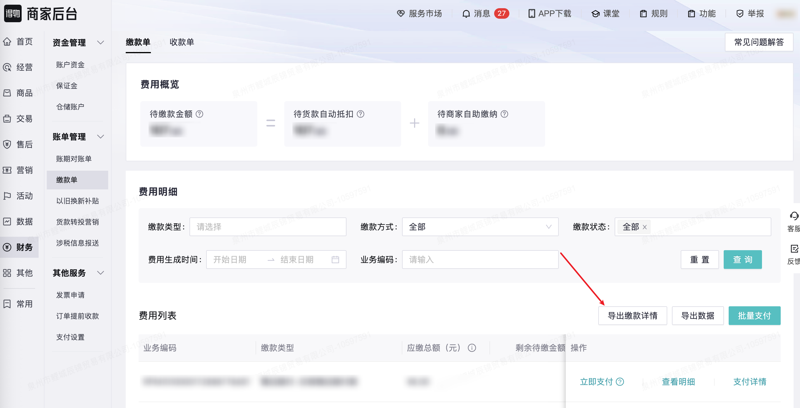

| 属性             | 值                                                                             |
| ---------------- | ------------------------------------------------------------------------------ |
| **连接器类型**   | `RPA 连接器`|
| **连接器名称**   | `ODS_财务缴款单费用明细表(得物RPA)`|
| **连接器代码**   | `rpa.conn.dewu.finance.finebill`|
| **操作类型**     | `文件导出`|
| **目标网页**     | `https://stark.dewu.com/main/finebill`|
| **适用场景**     | 导出得物商家后台缴款单费用明细数据，支持按缴款类型、缴款方式、缴款状态、费用生成时间、业务编码筛选|
| **数据表名**     | `ods_rpa_dewu_finance_finebill_du`|
| **业务表名**     | `ODS_财务缴款单费用明细表(得物RPA)`|

### 目标页面

> **取数路径**：得物商家后台—财务—缴款单
>
> **取数链接**：[https://stark.dewu.com/main/finebill](https://stark.dewu.com/main/finebill)



### 业务入参

| 字段 | 中文释义 | 数据类型 | 必填 | 默认值 | 说明 |
| ---- | -------- | -------- | ---- | ------ | ---- |
| `sub_receivable_types` | 缴款子类型 | `String` | 否 | — | 缴款子类型 code，多选时用英文逗号分隔或 JSON 数组，多选须属于同一一级分类。**仓储及增值服务费**：`F0027`（复检服务费）、`F0045`（换货运费补贴-上门取件）、`F0048`（增值服务含维修运费补贴-上门取件）、`F0054`（价保差额补偿款）、`G0022`（品牌直发运费补贴）、`G0181`（包材费）、`I0018`（操作服务费）、`I0021`（仓储费）、`I0024`（寄付服务费）、`I0027`（维修运费补贴-面对面换新卖家寄出）、`F0055`（授权退差补偿款）、`F0078`（上门揽运费-上门取件）、`F0082`（调拨服务费）；**治理罚款**：`F0006`（商品质量问题罚款）、`F0011`（虚假交易罚款）、`F0019`（欺诈发货罚款）、`F0020`（卖家错寄服务费）、`F0021`（售假罚款）、`F0022`（违背承诺罚款）、`F0023`（抄袭打版罚款）、`F0028`（商家考核不达标罚款）、`F0040`（品牌直发违规罚款）、`F0041`（商品外链罚款）、`F0050`（未按约定使用包材罚款）、`F0051`（包材卸货超时服务费）、`F0052`（抽检不合格罚款）、`G0015b`（买家退货赔付费）、`F0056`（虚假宣传罚款）、`F0057`（劣质治理罚款）、`F0058`（商家自寄物流超时罚款）、`F0072`（商责舆情罚款）、`F0073`（消极售后治理罚款）、`F0033`（入仓到货偏差罚款）、`F0083`（未规范贴码服务费）、`I0032`（客服托管服务费）、`F0084`（综合治理罚款）、`F0085`（商品品质治理罚款）、`F0086`（会话受损罚款）、`G0026`（出价托管服务费）；**售后赔付**：`F0014`（买贵赔付款）、`F0015`（交易售后赔付款）、`G0016a`（买家质保赔付费-自营）、`G0016b`（买家质保赔付费）、`F0154`（交易售后津贴补偿款）、`F0075`（交易售后还款）、`GX101i`（商家赔付-交易售后欠费追偿单）；**其他**：`F0038`（短信服务费）、`F0053`（退运服务费-直发）、`FLR01`（现金营销投入未达标收款）、`I0020`（趣开箱推广服务费）、`F0070`（营销投入充值）、`F0081`（国补运营处罚款）、`G0023`（商家违约赔付代收款）、`G0024`（商家违约赔付费）、`F0079`（先享后付营销费）、`F0115`（交易售后赔付款-其他）、`G0025`（平台代接服务费）、`FLR03`（JBP投入未达标收款）、`FLR04`（直发返利投入未达标收款）、`FLR05`（履约后返投入未达标收款）、`FLR06`（邮费返差投入未达标收款）、`FLR99`（其他后返投入未达标收款） |
| `receipt_scene_code` | 缴款方式 | `String` | 否 | `ALL` | 可选值：`ALL`（全部，不筛选）、`AUTONOMY`（自助缴纳）、`GOODS_DEDUCTION`（货款自动抵扣） |
| `pay_status` | 缴款状态 | `String` | 否 | `ALL` | 可选值：`ALL`（全部，不筛选）、`I`（待缴款）、`P`（部分缴款）、`S`（已缴款）、`C`（撤销）；多选时用英文逗号分隔或 JSON 数组，多选时不可包含 `ALL` |
| `fee_time_start` | 费用生成开始时间 | `String` | 否 | — | 支持格式：`YYYYMMDD`、`YYYY-MM-DD`、`YYYY-MM-DD HH:mm:ss`；不含时分秒时自动补 `00:00:00` |
| `fee_time_end` | 费用生成结束时间 | `String` | 否 | — | 支持格式：`YYYYMMDD`、`YYYY-MM-DD`、`YYYY-MM-DD HH:mm:ss`；不含时分秒时自动补 `00:00:00` |
| `business_code` | 业务编码 | `String` | 否 | — | 精确匹配业务编码 |

### 入参样例

```json
{
    "receipt_scene_code": "GOODS_DEDUCTION",
    "pay_status": "S",
    "fee_time_start": "2026-06-01",
    "fee_time_end": "2026-06-17"
}
```

### 入参校验

```json-schema collapsed
{
  "$schema": "https://json-schema.org/draft/2020-12/schema",
  "title": "得物-缴款单费用明细导出 - 查询入参",
  "description": "导出得物商家后台缴款单费用明细数据，支持按缴款类型、缴款方式、缴款状态、费用生成时间、业务编码筛选",
  "type": "object",
  "properties": {
    "sub_receivable_types": {
      "description": "缴款子类型 code，多选时用英文逗号分隔或 JSON 数组，多选须属于同一一级分类。可选值按一级分类分组：仓储及增值服务费（F0027/F0045/F0048/F0054/G0022/G0181/I0018/I0021/I0024/I0027/F0055/F0078/F0082）、治理罚款（F0006/F0011/F0019/F0020/F0021/F0022/F0023/F0028/F0040/F0041/F0050/F0051/F0052/G0015b/F0056/F0057/F0058/F0072/F0073/F0033/F0083/I0032/F0084/F0085/F0086/G0026）、售后赔付（F0014/F0015/G0016a/G0016b/F0154/F0075/GX101i）、其他（F0038/F0053/FLR01/I0020/F0070/F0081/G0023/G0024/F0079/F0115/G0025/FLR03/FLR04/FLR05/FLR06/FLR99）",
      "type": "string"
    },
    "receipt_scene_code": {
      "description": "缴款方式。ALL=全部（不筛选）、AUTONOMY=自助缴纳、GOODS_DEDUCTION=货款自动抵扣",
      "type": "string",
      "enum": ["ALL", "AUTONOMY", "GOODS_DEDUCTION"],
      "default": "ALL"
    },
    "pay_status": {
      "description": "缴款状态。ALL=全部（不筛选）、I=待缴款、P=部分缴款、S=已缴款、C=撤销；多选时用英文逗号分隔或 JSON 数组，多选时不可包含 ALL",
      "type": "string",
      "default": "ALL"
    },
    "fee_time_start": {
      "description": "费用生成开始时间，支持格式：YYYYMMDD、YYYY-MM-DD、YYYY-MM-DD HH:mm:ss；不含时分秒时自动补 00:00:00",
      "type": "string"
    },
    "fee_time_end": {
      "description": "费用生成结束时间，支持格式：YYYYMMDD、YYYY-MM-DD、YYYY-MM-DD HH:mm:ss；不含时分秒时自动补 00:00:00",
      "type": "string"
    },
    "business_code": {
      "description": "精确匹配业务编码",
      "type": "string"
    }
  },
  "required": [],
  "additionalProperties": false
}
```

### 数据字段

| 字段 | 中文释义 | 数据类型 | 可为空 | 取数路径 | 示例 |
| ---- | -------- | -------- | ------ | -------- | ---- |
| `paymentBillNo` | 缴款单号 | `Number` | 否 | `XLSX.0.缴款单号` | `1010000025205314` |
| `businessCode` | 业务编码 | `Number` | 否 | `XLSX.0.业务编码` | `1207036326180001` |
| `paymentType` | 缴款类型 | `String` | 否 | `XLSX.0.缴款类型` | `仓储及增值服务费 - 价保差额补偿款` |
| `feeGenerateTime` | 费用生成时间 | `String` | 否 | `XLSX.0.费用生成时间` | `2026-06-08 00:50:02` |
| `totalPayableAmount` | 应缴总额（元） | `Number` | 否 | `XLSX.0.应缴总额（元）` | `10.0` |
| `adjustedPayableAmount` | 应缴总额（调整后/元） | `Number` | 否 | `XLSX.0.应缴总额（调整后/元）` | `10.0` |
| `remainingPayableAmount` | 剩余待缴金额 | `Number` | 否 | `XLSX.0.剩余待缴金额` | `0.0` |
| `paymentMethod` | 缴款方式 | `String` | 否 | `XLSX.0.缴款方式` | `货款自动抵扣,自助缴纳` |
| `paymentStatus` | 缴款状态 | `String` | 否 | `XLSX.0.缴款状态` | `已缴款` |
| `paymentCompletedTime` | 缴款完成时间 | `String` | 是 | `XLSX.0.缴款完成时间` | `2026-06-08 20:36:25` |
| `originalBusinessNo` | 原业务单号 | `Number` | 否 | `XLSX.0.原业务单号` | `1207036326180001` |
| `paidType` | 已缴纳类型 | `String` | 是 | `XLSX.0.已缴纳类型` | `货款自动抵扣` |
| `relatedOrderNo` | 关联单号 | `String` | 是 | `XLSX.0.关联单号` | — |
| `paidTime` | 缴纳时间 | `String` | 是 | `XLSX.0.缴纳时间` | — |
| `paidAmount` | 缴纳金额 | `Number` | 否 | `XLSX.0.缴纳金额` | `10.0` |
| `bizDate` | 业务日期 | `String` | 否 | 附加 |  |
| `accountId` | 授权 ID | `String` | 否 | 附加 |  |

### 数据样例

```json
{
  "paymentBillNo": 1010000025205314,
  "businessCode": 1207036326180001,
  "paymentType": "仓储及增值服务费 - 价保差额补偿款",
  "feeGenerateTime": "2026-06-08 00:50:02",
  "totalPayableAmount": 10.0,
  "adjustedPayableAmount": 10.0,
  "remainingPayableAmount": 0.0,
  "paymentMethod": "货款自动抵扣,自助缴纳",
  "paymentStatus": "已缴款",
  "paymentCompletedTime": "2026-06-08 20:36:25",
  "originalBusinessNo": 1207036326180001,
  "paidType": "货款自动抵扣",
  "relatedOrderNo": null,
  "paidTime": null,
  "paidAmount": 10.0,
  "bizDate": "20260617",
  "accountId": "110"
}
```

---
