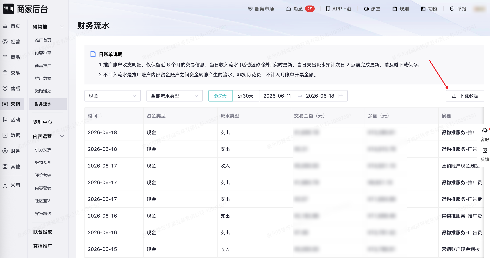

| 属性             | 值                                                                 |
| ---------------- | ------------------------------------------------------------------ |
| **连接器类型**   | `RPA 连接器`|
| **连接器名称**   | `ODS_营销得物推财务流水明细表(得物RPA)`|
| **连接器代码**   | `rpa.conn.dewu.marketing.adv.finance`|
| **操作类型**     | `文件导出`|
| **目标网页**     | `https://stark.dewu.com/main/newAdv/advFinance`|
| **适用场景**     | 导出得物推财务流水数据，支持按资金类型、流水类型、日期范围筛选|
| **数据表名**     | `ods_rpa_dewu_marketing_adv_finance_du`|
| **业务表名**     | `ODS_营销得物推财务流水明细表(得物RPA)`|

### 目标页面

> **取数路径**：得物商家后台—营销—得物推—财务流水
>
> **取数链接**：[https://stark.dewu.com/main/newAdv/advFinance](https://stark.dewu.com/main/newAdv/advFinance)



### 业务入参

| 字段 | 中文释义 | 数据类型 | 必填 | 默认值 | 说明 |
| ---- | -------- | -------- | ---- | ------ | ---- |
| `amount_type` | 资金类型 | `String` | 否 | `BONUS` | 可选值：`CASH`（现金）、`BONUS`（奖励金） |
| `flow_type` | 流水类型 | `String` | 否 | `ALL` | 可选值：`ALL`（全部流水类型）、`INCOME`（收入）、`EXPENSE`（支出） |
| `date_range_type` | 日期范围 | `String` | 否 | `WEEK` | 可选值：`WEEK`（近7天）、`MONTH`（近30天）、`CUSTOM`（自定义） |
| `start_date` | 自定义开始日期 | `String` | `date_range_type=CUSTOM` 时必填 | — | 支持格式：`YYYYMMDD`、`YYYY-MM-DD` |
| `end_date` | 自定义结束日期 | `String` | `date_range_type=CUSTOM` 时必填 | — | 支持格式：`YYYYMMDD`、`YYYY-MM-DD`；与 `start_date` 间隔不超过 6 个自然月 |

### 入参样例

```json
{
  "amount_type": "BONUS",
  "flow_type": "ALL",
  "date_range_type": "MONTH"
}
```

### 入参校验

```json-schema collapsed
{
  "$schema": "https://json-schema.org/draft/2020-12/schema",
  "title": "得物-得物推财务流水导出 - 查询入参",
  "description": "导出得物推财务流水数据，支持按资金类型、流水类型、日期范围筛选",
  "type": "object",
  "properties": {
    "amount_type": {
      "description": "资金类型。CASH=现金、BONUS=奖励金",
      "type": "string",
      "enum": ["CASH", "BONUS"],
      "default": "BONUS"
    },
    "flow_type": {
      "description": "流水类型。ALL=全部流水类型、INCOME=收入、EXPENSE=支出",
      "type": "string",
      "enum": ["ALL", "INCOME", "EXPENSE"],
      "default": "ALL"
    },
    "date_range_type": {
      "description": "日期范围。WEEK=近7天、MONTH=近30天、CUSTOM=自定义",
      "type": "string",
      "enum": ["WEEK", "MONTH", "CUSTOM"],
      "default": "WEEK"
    },
    "start_date": {
      "description": "自定义开始日期，date_range_type=CUSTOM 时必填。支持格式：YYYYMMDD、YYYY-MM-DD",
      "type": "string"
    },
    "end_date": {
      "description": "自定义结束日期，date_range_type=CUSTOM 时必填。支持格式：YYYYMMDD、YYYY-MM-DD；与 start_date 间隔不超过 6 个自然月",
      "type": "string"
    }
  },
  "required": [],
  "if": {
    "properties": {
      "date_range_type": { "const": "CUSTOM" }
    },
    "required": ["date_range_type"]
  },
  "then": {
    "required": ["start_date", "end_date"]
  },
  "additionalProperties": false
}
```

### 数据字段

| 字段 | 中文释义 | 数据类型 | 可为空 | 取数路径 | 示例 |
| ---- | -------- | -------- | ------ | -------- | ---- |
| `transactionTime` | 交易时间 | `String` | 否 | `XLSX.0.时间` | `2026-06-13 02:00:41` |
| `fundType` | 资金类型 | `String` | 否 | `XLSX.0.资金类型` | `奖励金` |
| `flowType` | 流水类型 | `String` | 否 | `XLSX.0.流水类型` | `支出` |
| `transactionAmount` | 交易金额（元） | `String` | 否 | `XLSX.0.交易金额(元)` | `¥1,530.57` |
| `balance` | 余额（元） | `String` | 否 | `XLSX.0.余额(元)` | `¥0.00` |
| `summary` | 摘要 | `String` | 否 | `XLSX.0.摘要` | `得物推服务费-推广费` |
| `bizDate` | 业务日期 | `String` | 否 | 附加 |  |
| `accountId` | 授权 ID | `String` | 否 | 附加 |  |

### 数据样例

```json
{
  "transactionTime": "2026-06-13 02:00:41",
  "fundType": "奖励金",
  "flowType": "支出",
  "transactionAmount": "¥1,530.57",
  "balance": "¥0.00",
  "summary": "得物推服务费-推广费",
  "bizDate": "20260618",
  "accountId": "110"
}
```

---
