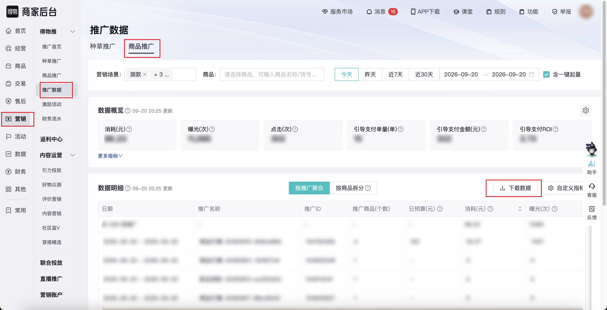

| 属性             | 值                                                                 |
| ---------------- | ------------------------------------------------------------------ |
| **连接器类型**   | `RPA 连接器`|
| **连接器名称**   | `ODS_得物营销推广数据商品推广明细报表(得物RPA)`|
| **连接器代码**   | `rpa.conn.dewu.promotion.item.detail.report`|
| **操作类型**     | `文件导出`|
| **目标网页**     | `https://stark.dewu.com/main/newAdv/advData`|
| **适用场景**     | 导出得物推推广数据页商品推广明细，支持按营销场景、商品、日期筛选|
| **数据表名**     | `ods_rpa_dewu_promotion_item_detail_report_du`|
| **业务表名**     | `ODS_得物营销推广数据商品推广明细报表(得物RPA)`|

### 目标页面

> **取数路径**：得物商家后台—营销—得物推—推广数据—商品推广
>
> **取数链接**：[https://stark.dewu.com/main/newAdv/advData](https://stark.dewu.com/main/newAdv/advData)



### 业务入参

| 字段 | 中文释义 | 数据类型 | 必填 | 默认值 | 说明 |
| ---- | -------- | -------- | ---- | ------ | ---- |
| `marketing_scenes` | 营销场景 | `String / List[String]` | 否 | `ALL` | 不传或 `ALL` 表示全选。允许值：`PRODUCT_TEST`（测款）/ `GROWTH`（成长）/ `BOOST`（打爆）/ `RESERVATION`（预约）。多选时用英文逗号分隔或 JSON 数组 |
| `item_ids` | 商品 | `String / List[String]` | 否 | `-` | 页面可搜索的商品 SPUID；多选时用英文逗号分隔或 JSON 数组；不传则不筛选商品。选项随店铺变化 |
| `date_type` | 日期 | `String` | 是 | `-` | 允许值：`TODAY`（今天）/ `YESTERDAY`（昨天）/ `LAST_7_DAYS`（近 7 天）/ `LAST_30_DAYS`（近 30 天）/ `CUSTOM`（自定义区间） |
| `custom_start_date` | 自定义开始日期 | `String` | 条件必填 | `-` | `date_type` 为 `CUSTOM` 时必填；格式 `YYYYMMDD` 或 `YYYY-MM-DD` |
| `custom_end_date` | 自定义结束日期 | `String` | 条件必填 | `-` | `date_type` 为 `CUSTOM` 时必填；格式 `YYYYMMDD` 或 `YYYY-MM-DD`；不得晚于当天；结束日须早于开始日加 6 个自然月，否则页面提示「日期查询间隔过长」 |

### 入参样例

全选营销场景 + 近 30 天：

```json
{
  "marketing_scenes": "ALL",
  "date_type": "LAST_30_DAYS"
}
```

今天 + 营销场景逗号串（测款、成长）：

```json
{
  "marketing_scenes": "PRODUCT_TEST,GROWTH",
  "date_type": "TODAY"
}
```

自定义区间（`YYYY-MM-DD`）：

```json
{
  "marketing_scenes": "ALL",
  "date_type": "CUSTOM",
  "custom_start_date": "2026-09-19",
  "custom_end_date": "2026-09-20"
}
```

自定义区间（`YYYYMMDD`）：

```json
{
  "date_type": "CUSTOM",
  "custom_start_date": "20260919",
  "custom_end_date": "20260920"
}
```

按商品 SPUID + 昨天：

```json
{
  "item_ids": ["8950895"],
  "date_type": "YESTERDAY"
}
```

### 入参校验

```json-schema collapsed
{
  "$schema": "https://json-schema.org/draft/2020-12/schema",
  "title": "得物-商品推广明细报表 - 查询入参",
  "description": "导出得物推推广数据页商品推广明细，支持按营销场景、商品、日期筛选",
  "type": "object",
  "properties": {
    "marketing_scenes": {
      "description": "营销场景。不传或 ALL 表示全选。PRODUCT_TEST=测款、GROWTH=成长、BOOST=打爆、RESERVATION=预约",
      "anyOf": [
        { "type": "string" },
        { "type": "array", "items": { "type": "string" } }
      ],
      "default": "ALL"
    },
    "item_ids": {
      "description": "商品 SPUID。英文逗号分隔或 JSON 数组；不传则不筛选商品",
      "anyOf": [
        { "type": "string" },
        { "type": "array", "items": { "type": "string" } }
      ]
    },
    "date_type": {
      "description": "日期范围。允许值：TODAY（今天）/ YESTERDAY（昨天）/ LAST_7_DAYS（近 7 天）/ LAST_30_DAYS（近 30 天）/ CUSTOM（自定义区间）",
      "type": "string",
      "enum": ["TODAY", "YESTERDAY", "LAST_7_DAYS", "LAST_30_DAYS", "CUSTOM"]
    },
    "custom_start_date": {
      "description": "自定义开始日期；date_type 为 CUSTOM 时必填。格式 YYYYMMDD 或 YYYY-MM-DD",
      "type": "string"
    },
    "custom_end_date": {
      "description": "自定义结束日期；date_type 为 CUSTOM 时必填。格式 YYYYMMDD 或 YYYY-MM-DD；不得晚于当天；结束日须早于开始日加 6 个自然月",
      "type": "string"
    }
  },
  "required": ["date_type"],
  "if": {
    "properties": {
      "date_type": { "const": "CUSTOM" }
    },
    "required": ["date_type"]
  },
  "then": {
    "required": ["custom_start_date", "custom_end_date"]
  },
  "additionalProperties": false
}
```

### 数据字段

| 字段 | 中文释义 | 数据类型 | 可为空 | 取数路径 | 示例 |
| ---- | -------- | -------- | ------ | -------- | ---- |
| `statDate` | 日期 | `String` | 否 | `XLSX.1.日期` | `08/22` |
| `merchantUid` | 商家UID | `String` | 否 | `XLSX.1.商家UID` | `195****197` (已脱敏) |
| `dataGranularity` | 数据粒度 | `String` | 否 | `XLSX.1.数据粒度` | `计划` |
| `planName` | 计划名称 | `String` | 否 | `XLSX.1.计划名称` | `****` (已脱敏) |
| `planId` | 计划ID | `String` | 否 | `XLSX.1.计划ID` | `104****356` (已脱敏) |
| `planType` | 计划类型 | `String` | 否 | `XLSX.1.计划类型` | `商品打爆` |
| `optimizeGoal` | 优化目标 | `String` | 否 | `XLSX.1.优化目标` | `促进成交` |
| `itemId` | 商品ID | `String` | 是 | `XLSX.1.商品ID` | — |
| `dailyBudget` | 日预算 | `String` | 是 | `XLSX.1.日预算` | `-` |
| `cost` | 消耗(元) | `String` | 否 | `XLSX.1.消耗(元)` | `0.00` |
| `impression` | 曝光(次) | `String` | 否 | `XLSX.1.曝光(次)` | `0` |
| `clickCnt` | 点击(次) | `String` | 否 | `XLSX.1.点击(次)` | `0` |
| `clickRate` | 点击率(%) | `String` | 否 | `XLSX.1.点击率(%)` | `0` |
| `cpm` | 千次曝光费用(元) | `String` | 否 | `XLSX.1.千次曝光费用(元)` | `0` |
| `directCollectReserveCnt` | 直接收藏预约数(次) | `String` | 否 | `XLSX.1.直接收藏预约数(次)` | `0` |
| `collectReserveCost` | 收藏预约成本(元) | `String` | 否 | `XLSX.1.收藏预约成本(元)` | `0` |
| `directPayOrderCnt` | 直接支付单量(单) | `String` | 否 | `XLSX.1.直接支付单量(单)` | `0` |
| `directPayAmount` | 直接支付金额(元) | `String` | 否 | `XLSX.1.直接支付金额(元)` | `0.00` |
| `guidedPayOrderCnt` | 引导支付单量(单) | `String` | 否 | `XLSX.1.引导支付单量(单)` | `0` |
| `guidedPayAmount` | 引导支付金额(元) | `String` | 否 | `XLSX.1.引导支付金额(元)` | `0.00` |
| `smartCouponOrderCnt` | 智能补贴券订单量(单) | `String` | 否 | `XLSX.1.智能补贴券订单量(单)` | `0` |
| `smartCouponAmount` | 智能补贴券金额(元) | `String` | 否 | `XLSX.1.智能补贴券金额(元)` | `0.00` |
| `clickConvertRate` | 点击转化率(%) | `String` | 否 | `XLSX.1.点击转化率(%)` | `0` |
| `orderCost` | 订单成本(元) | `String` | 否 | `XLSX.1.订单成本(元)` | `0` |
| `guidedPayRoi` | 引导支付ROI | `String` | 否 | `XLSX.1.引导支付ROI` | `0` |
| `directDetailVisitCnt` | 直接商详访问数(次) | `String` | 否 | `XLSX.1.直接商详访问数(次)` | `0` |
| `directPayRoi` | 直接支付ROI | `String` | 否 | `XLSX.1.直接支付ROI` | `0` |
| `directDetailVisitCost` | 直接商详访问成本(元) | `String` | 否 | `XLSX.1.直接商详访问成本(元)` | `0` |
| `collectCnt` | 收藏数（次） | `String` | 否 | `XLSX.1.收藏数（次）` | `0` |
| `collectCost` | 收藏成本（元） | `String` | 否 | `XLSX.1.收藏成本（元）` | `0` |
| `discountedDirectPayAmount` | 优惠后直接支付金额(元) | `String` | 否 | `XLSX.1.优惠后直接支付金额(元)` | `0.00` |
| `discountedDirectPayRoi` | 优惠后直接支付ROI | `String` | 否 | `XLSX.1.优惠后直接支付ROI` | `0` |
| `discountedGuidedPayAmount` | 优惠后引导支付金额(元) | `String` | 否 | `XLSX.1.优惠后引导支付金额(元)` | `0.00` |
| `discountedGuidedPayRoi` | 优惠后引导支付ROI | `String` | 否 | `XLSX.1.优惠后引导支付ROI` | `0` |
| `bizDate` | 业务日期 | `String` | 否 | 附加 | `20260920` |
| `accountId` | 授权 ID | `String` | 否 | 附加 | `4****9` (已脱敏) |

> 导出文件第 0 行为说明，第 1 行为表头。

### 数据样例

```json
{
  "statDate": "08/22",
  "merchantUid": "195****197",
  "dataGranularity": "计划",
  "planName": "****",
  "planId": "104****356",
  "planType": "商品打爆",
  "optimizeGoal": "促进成交",
  "itemId": null,
  "dailyBudget": "-",
  "cost": "0.00",
  "impression": "0",
  "clickCnt": "0",
  "clickRate": "0",
  "cpm": "0",
  "directCollectReserveCnt": "0",
  "collectReserveCost": "0",
  "directPayOrderCnt": "0",
  "directPayAmount": "0.00",
  "guidedPayOrderCnt": "0",
  "guidedPayAmount": "0.00",
  "smartCouponOrderCnt": "0",
  "smartCouponAmount": "0.00",
  "clickConvertRate": "0",
  "orderCost": "0",
  "guidedPayRoi": "0",
  "directDetailVisitCnt": "0",
  "directPayRoi": "0",
  "directDetailVisitCost": "0",
  "collectCnt": "0",
  "collectCost": "0",
  "discountedDirectPayAmount": "0.00",
  "discountedDirectPayRoi": "0",
  "discountedGuidedPayAmount": "0.00",
  "discountedGuidedPayRoi": "0",
  "bizDate": "20260920",
  "accountId": "4****9"
}
```
