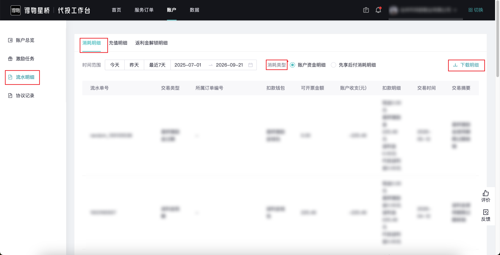

| 属性             | 值                                                         |
| ---------------- | ---------------------------------------------------------- |
| **连接器类型**   | `RPA 连接器`                                               |
| **连接器名称**   | `ODS_星桥账户流水消耗明细报表(得物RPA)`                    |
| **连接器代码**   | `rpa.conn.dewu.xq.account.consume.detail.report`           |
| **操作类型**     | `文件导出`                                                 |
| **目标网页**     | `https://xingqiao.dewu.com/account?menu=flowDetail&tab=consume` |
| **适用场景**     | 导出得物星桥账户消耗明细，支持按时间范围和消耗类型筛选     |
| **数据表名**     | `ods_rpa_dewu_xq_account_consume_detail_report_du`         |
| **业务表名**     | `ODS_星桥账户流水消耗明细报表(得物RPA)`                    |

### 目标页面

> **取数路径**：得物星桥—账户—流水明细—消耗明细
>
> **取数链接**：[https://xingqiao.dewu.com/account?menu=flowDetail&tab=consume](https://xingqiao.dewu.com/account?menu=flowDetail&tab=consume)



### 业务入参

| 字段 | 中文释义 | 数据类型 | 必填 | 默认值 | 说明 |
| ---- | -------- | -------- | ---- | ------ | ---- |
| `date_type` | 时间范围 | `String` | 是 | `-` | 允许值：`TODAY`（今天）/ `YESTERDAY`（昨天）/ `LAST_7_DAYS`（近 7 天）/ `CUSTOM`（自定义区间） |
| `custom_start_date` | 开始日期 | `String` | 条件必填 | `-` | `date_type` 为 `CUSTOM` 时必填；格式 `YYYYMMDD` 或 `YYYY-MM-DD` |
| `custom_end_date` | 结束日期 | `String` | 条件必填 | `-` | `date_type` 为 `CUSTOM` 时必填；格式 `YYYYMMDD` 或 `YYYY-MM-DD`；不得早于 `custom_start_date` |
| `consume_type` | 消耗类型 | `String` | 否 | `-` | 允许值：`ACCOUNT_FUND_DETAIL`（账户资金明细）/ `PAY_LATER_CONSUME_DETAIL`（先享后付消耗明细）。不传则为页面默认的账户资金明细 |

### 入参样例

自定义区间，不传消耗类型：

```json
{
  "date_type": "CUSTOM",
  "custom_start_date": "2026-05-01",
  "custom_end_date": "2026-09-01"
}
```

自定义区间（`YYYYMMDD`）+ 账户资金明细：

```json
{
  "date_type": "CUSTOM",
  "custom_start_date": "20260501",
  "custom_end_date": "20260901",
  "consume_type": "ACCOUNT_FUND_DETAIL"
}
```

自定义区间 + 先享后付消耗明细：

```json
{
  "date_type": "CUSTOM",
  "custom_start_date": "2025-09-22",
  "custom_end_date": "2026-09-22",
  "consume_type": "PAY_LATER_CONSUME_DETAIL"
}
```

近 7 天：

```json
{
  "date_type": "LAST_7_DAYS"
}
```

今天：

```json
{
  "date_type": "TODAY"
}
```

### 入参校验

```json-schema collapsed
{
  "$schema": "https://json-schema.org/draft/2020-12/schema",
  "title": "得物-星桥账户消耗明细 - 查询入参",
  "description": "导出得物星桥账户消耗明细，支持按时间范围和消耗类型筛选",
  "type": "object",
  "properties": {
    "date_type": {
      "description": "时间范围。允许值：TODAY（今天）/ YESTERDAY（昨天）/ LAST_7_DAYS（近 7 天）/ CUSTOM（自定义区间）",
      "type": "string",
      "enum": ["TODAY", "YESTERDAY", "LAST_7_DAYS", "CUSTOM"]
    },
    "custom_start_date": {
      "description": "开始日期；date_type 为 CUSTOM 时必填。格式 YYYYMMDD 或 YYYY-MM-DD",
      "type": "string"
    },
    "custom_end_date": {
      "description": "结束日期；date_type 为 CUSTOM 时必填。格式 YYYYMMDD 或 YYYY-MM-DD；不得早于 custom_start_date",
      "type": "string"
    },
    "consume_type": {
      "description": "消耗类型。允许值：ACCOUNT_FUND_DETAIL（账户资金明细）/ PAY_LATER_CONSUME_DETAIL（先享后付消耗明细）。不传则为页面默认的账户资金明细",
      "type": "string",
      "enum": ["ACCOUNT_FUND_DETAIL", "PAY_LATER_CONSUME_DETAIL"]
    }
  },
  "required": ["date_type"],
  "if": {
    "properties": {
      "date_type": { "const": "CUSTOM" }
    },
    "required": ["date_type"]
  },
  "then": {
    "required": ["custom_start_date", "custom_end_date"]
  },
  "additionalProperties": false
}
```

### 数据字段

两种消耗类型导出的表头不同；连接器按两套表头并集回传，本文件没有的列补 `null`。

| 字段 | 中文释义 | 数据类型 | 可为空 | 取数路径 | 示例 |
| ---- | -------- | -------- | ------ | -------- | ---- |
| `tradeTime` | 时间 | `String` | 是 | `XLSX.0.时间` | `2026-05-12` |
| `merchantId` | 商家 | `String` | 是 | `XLSX.0.商家` | `802****139` (已脱敏) |
| `orderNo` | 订单编号 / 所属订单编号 | `String` | 是 | `XLSX.0.订单编号` / `XLSX.0.所属订单编号` | `DLY****934` (已脱敏) |
| `cashDeductAmount` | 现金扣款(元)（可开票） | `String` | 是 | `XLSX.0.现金扣款(元)（可开票）` | `0` |
| `rebateDeductAmount` | 返利金扣款(元)（可开票） | `String` | 是 | `XLSX.0.返利金扣款(元)（可开票）` | `0` |
| `agentRebateDeductAmount` | 代投返利金扣款(元)（可开票） | `String` | 是 | `XLSX.0.代投返利金扣款(元)（可开票）` | `0` |
| `incentiveDeductAmount` | 星桥激励金扣款(元) | `String` | 是 | `XLSX.0.星桥激励金扣款(元)` | `225.49` |
| `accountAmount` | 账户收支(元) | `String` | 是 | `XLSX.0.账户收支(元)` | `-225.49` |
| `invoiceAmount` | 可开票金额（元） | `String` | 是 | `XLSX.0.可开票金额（元）` | `0` |
| `tradeType` | 交易类型 | `String` | 否 | `XLSX.0.交易类型` | `星桥激励金过期` |
| `tradeSummary` | 交易摘要 | `String` | 是 | `XLSX.0.交易摘要` | `星桥激励金使用期限过期核销` |
| `consumeAmount` | 消耗明细(元) | `String` | 是 | `XLSX.0.消耗明细(元)` | `-3667.02` |
| `effectiveTime` | 生效时间 | `String` | 是 | `XLSX.0.生效时间` | `2026-01-20 07:50:10` |
| `flowStatus` | 流水状态 | `String` | 是 | `XLSX.0.流水状态` | `已结算` |
| `bizDate` | 业务日期 | `String` | 否 | 附加 | `20260922` |
| `accountId` | 授权 ID | `String` | 否 | 附加 | `1****1` (已脱敏) |

### 数据样例

```json
[
  {
    "tradeTime": "2026-05-12",
    "merchantId": "802****139",
    "orderNo": null,
    "cashDeductAmount": "0",
    "rebateDeductAmount": "0",
    "agentRebateDeductAmount": "0",
    "incentiveDeductAmount": "225.49",
    "accountAmount": "-225.49",
    "invoiceAmount": "0",
    "tradeType": "星桥激励金过期",
    "tradeSummary": "星桥激励金使用期限过期核销",
    "consumeAmount": null,
    "effectiveTime": null,
    "flowStatus": null,
    "bizDate": "20260922",
    "accountId": "1****1"
  }
]
```
