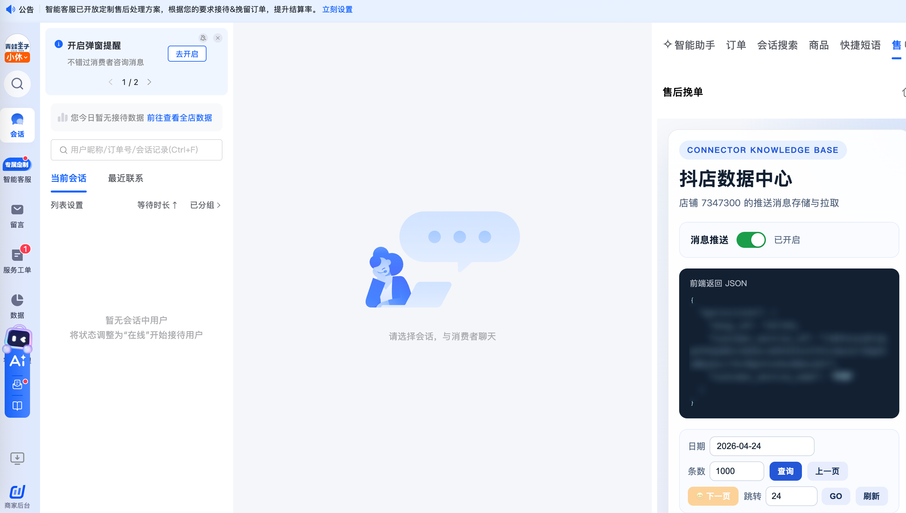

| 属性             | 值                                                                      |
| ---------------- | ----------------------------------------------------------------------- |
| **连接器类型**   | `RPA 连接器`|
| **连接器名称**   | `ODS_飞鸽售后挽单数据采集信息表(抖店RPA)`|
| **连接器代码**   | `rpa.conn.doudian.im.aftersale.retention`|
| **操作类型**     | `页面解析`|
| **目标网页**     | `https://im.jinritemai.com/pc_seller_v2/main/workspace`|
| **适用场景**     | 采集飞鸽客服系统售后挽单面板的消息数据，支持按日期查询与自动翻页|
| **数据表名**     | `ods_rpa_doudian_im_aftersale_retention_du`|
| **业务表名**     | `ODS_飞鸽售后挽单数据采集信息表(抖店RPA)`|

### 目标页面

> **取数路径**：抖店商家后台—飞鸽客服—工作台—售后挽单
>
> **取数链接**：[https://im.jinritemai.com/pc_seller_v2/main/workspace](https://im.jinritemai.com/pc_seller_v2/main/workspace)



### 业务入参

| 字段 | 中文释义 | 数据类型 | 必填 | 默认值 | 说明 |
| ---- | -------- | -------- | ---- | ------ | ---- |
| `biz_date` | 查询日期 | `string` | 否 | 昨天 | 支持格式：`YYYYMMDD` / `YYYY-MM-DD`；不能晚于当天 |

### 入参样例

`YYYYMMDD`：

```json
{
    "biz_date": "20260424"
}
```

`YYYY-MM-DD`：

```json
{
    "biz_date": "2026-04-24"
}
```

### 入参校验

```json-schema collapsed
{
  "$schema": "https://json-schema.org/draft/2020-12/schema",
  "title": "飞鸽-售后挽单-数据采集 - 查询入参",
  "description": "采集飞鸽客服系统售后挽单面板的消息数据，支持按日期查询与自动翻页",
  "type": "object",
  "properties": {
    "biz_date": {
      "type": "string",
      "description": "查询日期，支持 YYYYMMDD 或 YYYY-MM-DD；不能晚于当天；缺省时查询昨天",
      "pattern": "^(?:\\d{8}|\\d{4}-\\d{2}-\\d{2})$"
    }
  },
  "required": [],
  "additionalProperties": false
}
```

### 数据字段

| 字段 | 中文释义 | 数据类型 | 可为空 | 取数路径 | 示例 |
| ---- | -------- | -------- | ------ | -------- | ---- |
| `id` | 记录 ID | `number` | 否 | `id` | `1` |
| `msgId` | 消息 ID | `string` | 否 | `msg_id` | `70294394412336810000:07347300:143:1777001810:0001701534749987:7621506186822813194` |
| `logId` | 日志 ID | `string` | 否 | `log_id` | `20260424113651F5A226896AC6305E37C5` |
| `shopId` | 店铺 ID | `string` | 否 | `shop_id` | `7347300` |
| `payload` | 消息体 | `string` | 否 | `payload` | 见数据样例 `payload` |
| `pulled` | 拉取次数 | `number` | 是 | `pulled` | `53` |
| `createTime` | 创建时间 | `string` | 否 | `create_time` | `2026-04-24 11:36:51` |
| `taskId` | 任务 ID | `string` | 否 | 附加 |  |
| `bizDate` | 业务日期 | `string` | 否 | 附加 |  |
| `accountId` | 授权 ID | `string` | 否 | 附加 |  |

### 数据样例

```json
{
    "accountId": "105",
    "bizDate": "20260424",
    "createTime": "2026-04-24 11:36:51",
    "id": 1,
    "logId": "20260424113651F5A226896AC6305E37C5",
    "msgId": "70294394412336810000:07347300:143:1777001810:0001701534749987:7621506186822813194",
    "payload": "{\"data\": \"[{\\\"tag\\\":\\\"143\\\",\\\"msg_id\\\":\\\"70294394412336810000:07347300:143:1777001810:0001701534749987:7621506186822813194\\\",\\\"data\\\":\\\"{...}\\\"}]\", \"appId\": 7621506186822813194, \"authId\": \"\", \"method\": \"CloudOpenMsgConsumer\", \"userId\": 0, \"userType\": 0, \"subUserId\": 0, \"authSubjectType\": \"\"}",
    "pulled": 53,
    "shopId": "7347300",
    "taskId": "dev-0-9d27425a"
}
```

---
