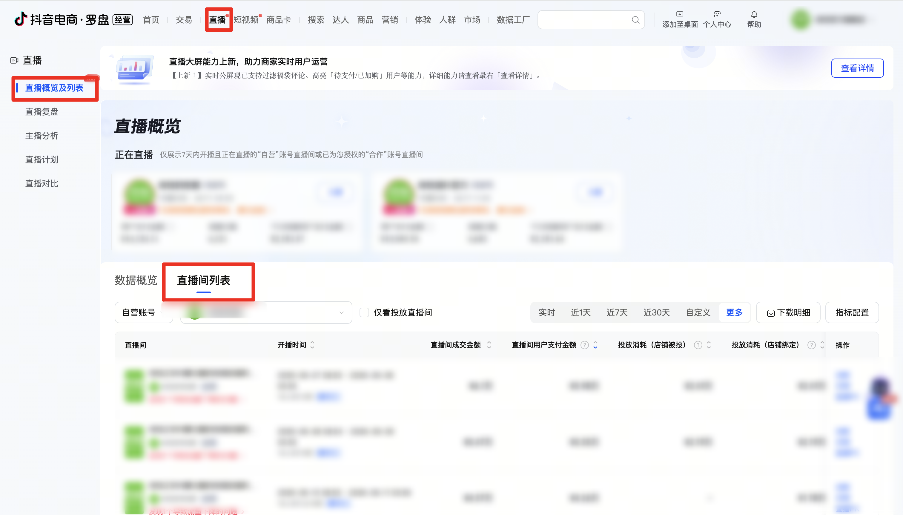

| 属性             | 值                                                         |
| ---------------- | ---------------------------------------------------------- |
| **连接器类型**   | `RPA 连接器`                                               |
| **连接器名称**   | `ODS_罗盘直播间列表数据报表(抖音电商RPA)`                  |
| **连接器代码**   | `rpa.conn.douyindianshang.lp.live.list.report`             |
| **操作类型**     | `文件导出`                                                 |
| **目标网页**     | `https://compass.jinritemai.com/shop/live-overview`        |
| **适用场景**     | 从抖音电商罗盘「直播概览」页导出直播间列表明细，采集主播、观看、成交、退款及投放等指标 |
| **数据表名**     | `ods_rpa_douyindianshang_lp_live_list_report_du`           |
| **业务表名**     | `ODS_罗盘直播间列表数据报表(抖音电商RPA)`                  |

### 目标页面

> **取数路径**：抖音电商罗盘—直播—直播概览及列表—直播间列表—下载明细
>
> **取数链接**：[https://compass.jinritemai.com/shop/live-overview](https://compass.jinritemai.com/shop/live-overview)



### 业务入参

| 字段 | 中文释义 | 数据类型 | 必填 | 默认值 | 说明 |
| ---- | -------- | -------- | ---- | ------ | ---- |
| `account_type` | 账号类型 | `String` | 是 | — | 可选值：`ALL`（全部账号（自营和合作））/ `SELF`（自营账号）/ `COOP`（合作账号） |
| `account_name` | 账号名称 | `String` | 否 | — | 须与下拉选项整串精确匹配，无匹配则失败；不传则跳过该筛选项 |
| `date_type` | 统计时间类型 | `String` | 是 | — | 可选值：`REALTIME`（实时）/ `LAST_1_DAY`（近 1 天）/ `LAST_7_DAYS`（近 7 天）/ `LAST_30_DAYS`（近 30 天）/ `LAST_90_DAYS`（近 90 天）/ `DAY`（自然日）/ `WEEK`（自然周）/ `MONTH`（自然月）/ `CUSTOM`（自定义）。自然日 / 周 / 月须同时传 `biz_date`；自定义须同时传起止日期。页面上不可选的日期或月份会报错 |
| `biz_date` | 业务日期 | `String` | 条件必填 | — | 仅 `date_type` 为 `DAY` / `WEEK` / `MONTH` 时必填。支持格式：`YYYYMMDD`、`YYYY-MM-DD`。传入周期内任一天即可。`WEEK` 时须为近 91 天内完整自然周中的任一天；`MONTH` 时页面仅本月及前两个月可选 |
| `custom_start_date` | 自定义开始日期 | `String` | 条件必填 | — | 仅 `date_type=CUSTOM` 时必填。支持格式：`YYYYMMDD`、`YYYY-MM-DD` |
| `custom_end_date` | 自定义结束日期 | `String` | 条件必填 | — | 仅 `date_type=CUSTOM` 时必填。支持格式：`YYYYMMDD`、`YYYY-MM-DD`。不能早于开始日期；跨度不超过 31 天 |

### 入参样例


```json
{
  "account_type": "ALL",
  "account_name": "示例直播账号",
  "date_type": "WEEK",
  "biz_date": "20260908"
}
```


```json
{
  "account_type": "SELF",
  "date_type": "LAST_7_DAYS"
}
```

```json
{
  "account_type": "SELF",
  "date_type": "CUSTOM",
  "custom_start_date": "2026-09-01",
  "custom_end_date": "2026-09-10"
}
```

### 入参校验

```json-schema collapsed
{
  "$schema": "https://json-schema.org/draft/2020-12/schema",
  "title": "抖音电商罗盘-直播间列表 - 查询入参",
  "description": "从抖音电商罗盘「直播概览」页导出直播间列表明细，采集主播、观看、成交、退款及投放等指标",
  "type": "object",
  "properties": {
    "account_type": {
      "type": "string",
      "description": "账号类型，必填。可选值：ALL（全部账号（自营和合作））/ SELF（自营账号）/ COOP（合作账号）",
      "enum": ["ALL", "SELF", "COOP"]
    },
    "account_name": {
      "type": "string",
      "description": "账号名称，可选。须与下拉选项整串精确匹配，无匹配则失败；不传则跳过该筛选项"
    },
    "date_type": {
      "type": "string",
      "description": "统计时间类型，必填。可选值：REALTIME（实时）/ LAST_1_DAY（近1天）/ LAST_7_DAYS（近7天）/ LAST_30_DAYS（近30天）/ LAST_90_DAYS（近90天）/ DAY（自然日）/ WEEK（自然周）/ MONTH（自然月）/ CUSTOM（自定义）。DAY/WEEK/MONTH 时须传 biz_date；CUSTOM 时须传 custom_start_date、custom_end_date。WEEK 时 biz_date 须为近91天内完整自然周中的任一天；CUSTOM 起止按闭区间计跨度不超过31天",
      "enum": ["REALTIME", "LAST_1_DAY", "LAST_7_DAYS", "LAST_30_DAYS", "LAST_90_DAYS", "DAY", "WEEK", "MONTH", "CUSTOM"]
    },
    "biz_date": {
      "type": "string",
      "description": "业务日期，仅 date_type 为 DAY/WEEK/MONTH 时必填。支持 YYYYMMDD 或 YYYY-MM-DD。传入周期内任一天即可",
      "pattern": "^(\\d{8}|\\d{4}-\\d{2}-\\d{2})$"
    },
    "custom_start_date": {
      "type": "string",
      "description": "自定义开始日期，仅 date_type=CUSTOM 时必填。支持 YYYYMMDD 或 YYYY-MM-DD",
      "pattern": "^(\\d{8}|\\d{4}-\\d{2}-\\d{2})$"
    },
    "custom_end_date": {
      "type": "string",
      "description": "自定义结束日期，仅 date_type=CUSTOM 时必填。支持 YYYYMMDD 或 YYYY-MM-DD。不能早于开始日期；闭区间跨度不超过 31 天",
      "pattern": "^(\\d{8}|\\d{4}-\\d{2}-\\d{2})$"
    }
  },
  "required": ["account_type", "date_type"],
  "additionalProperties": false,
  "allOf": [
    {
      "if": {
        "properties": {
          "date_type": {
            "enum": ["DAY", "WEEK", "MONTH"]
          }
        },
        "required": ["date_type"]
      },
      "then": {
        "required": ["biz_date"]
      }
    },
    {
      "if": {
        "properties": {
          "date_type": {
            "const": "CUSTOM"
          }
        },
        "required": ["date_type"]
      },
      "then": {
        "required": ["custom_start_date", "custom_end_date"]
      }
    }
  ]
}
```

### 数据字段

| 字段 | 中文释义 | 数据类型 | 可为空 | 取数路径 | 示例 |
| ---- | -------- | -------- | ------ | -------- | ---- |
| `authorAvatar` | 主播头像 | `String` | 是 | `XLSX.0.主播头像` | `https://p11.douyinpic.com/****` (已脱敏) |
| `authorNick` | 主播昵称 | `String` | 否 | `XLSX.0.主播昵称` | `****` (已脱敏) |
| `authorDouyinId` | 主播抖音号 | `String` | 否 | `XLSX.0.主播抖音号` | `793****514` (已脱敏) |
| `liveStartTime` | 直播开始时间 | `String` | 否 | `XLSX.0.直播开始时间` | `2026/09/07 08:55:37` |
| `liveEndTime` | 直播结束时间 | `String` | 是 | `XLSX.0.直播结束时间` | `2026/09/08 00:55:49` |
| `liveDurationMin` | 直播时长(分钟) | `Number` | 是 | `XLSX.0.直播时长(分钟)` | `960` |
| `roomShowUv` | 直播间曝光人数 | `Number` | 是 | `XLSX.0.直播间曝光人数` | `182584` |
| `roomShowPv` | 直播间曝光次数 | `Number` | 是 | `XLSX.0.直播间曝光次数` | `280286` |
| `roomWatchUv` | 直播间观看人数 | `Number` | 是 | `XLSX.0.直播间观看人数` | `15093` |
| `hourWatchUv` | 单小时观看人数 | `Number` | 是 | `XLSX.0.单小时观看人数` | `943.116017496355` |
| `roomWatchPv` | 直播间观看次数 | `Number` | 是 | `XLSX.0.直播间观看次数` | `21254` |
| `incentiveWatchPv` | 直播激励观看次数 | `String` | 是 | `XLSX.0.直播激励观看次数` | `-` |
| `maxOnlineUv` | 最高在线人数 | `Number` | 是 | `XLSX.0.最高在线人数` | `75` |
| `avgOnlineUv` | 平均在线人数 | `Number` | 是 | `XLSX.0.平均在线人数` | `24` |
| `avgWatchDurationMin` | 人均观看时长(分钟) | `Number` | 是 | `XLSX.0.人均观看时长(分钟)` | `1.07` |
| `commentCnt` | 评论次数 | `Number` | 是 | `XLSX.0.评论次数` | `660` |
| `newLiveGroupUv` | 新加直播团人数 | `Number` | 是 | `XLSX.0.新加直播团人数` | `2` |
| `newFansCnt` | 新增粉丝数 | `Number` | 是 | `XLSX.0.新增粉丝数` | `518` |
| `unfollowFansCnt` | 取关粉丝数 | `Number` | 是 | `XLSX.0.取关粉丝数` | `12` |
| `oldFansWatchRatio` | 观看老粉占比 | `Number` | 是 | `XLSX.0.观看老粉占比` | `0.0421` |
| `bindProductCnt` | 带货商品数 | `Number` | 是 | `XLSX.0.带货商品数` | `3` |
| `productShowUv` | 直播间商品曝光人数 | `Number` | 是 | `XLSX.0.直播间商品曝光人数` | `12774` |
| `productClickUv` | 直播间商品点击人数 | `Number` | 是 | `XLSX.0.直播间商品点击人数` | `6390` |
| `productShowPv` | 直播间商品曝光次数 | `Number` | 是 | `XLSX.0.直播间商品曝光次数` | `67458` |
| `productClickPv` | 直播间商品点击次数 | `Number` | 是 | `XLSX.0.直播间商品点击次数` | `10306` |
| `payOrderCnt` | 直播间成交订单数 | `Number` | 是 | `XLSX.0.直播间成交订单数` | `1536` |
| `payAmt` | 直播间成交金额 | `Number` | 是 | `XLSX.0.直播间成交金额` | `61045.3` |
| `userPayAmt` | 直播间用户支付金额 | `Number` | 是 | `XLSX.0.直播间用户支付金额` | `59847.17` |
| `hourUserPayAmt` | 单小时用户支付金额 | `Number` | 是 | `XLSX.0.单小时用户支付金额` | `3739.6690272859823` |
| `payComboCnt` | 直播间成交件数 | `Number` | 是 | `XLSX.0.直播间成交件数` | `1547` |
| `payUv` | 直播间成交人数 | `Number` | 是 | `XLSX.0.直播间成交人数` | `1513` |
| `refundOrderCnt` | 直播间退款订单数 | `Number` | 是 | `XLSX.0.直播间退款订单数` | `375` |
| `refundAmt` | 直播间退款金额 | `Number` | 是 | `XLSX.0.直播间退款金额` | `14603.08` |
| `refundUv` | 直播间退款人数 | `Number` | 是 | `XLSX.0.直播间退款人数` | `363` |
| `estimatedCommission` | 预估佣金支出 | `Number` | 是 | `XLSX.0.预估佣金支出` | `0` |
| `productShowClickRatePv` | 商品曝光-点击率(次数) | `Number` | 是 | `XLSX.0.商品曝光-点击率(次数)` | `0.1528` |
| `productShowClickRateUv` | 商品曝光-点击率(人数) | `Number` | 是 | `XLSX.0.商品曝光-点击率(人数)` | `0.5002` |
| `productClickPayRatePv` | 商品点击-成交率(次数) | `Number` | 是 | `XLSX.0.商品点击-成交率(次数)` | `0.149` |
| `productClickPayRateUv` | 商品点击-成交率(人数) | `Number` | 是 | `XLSX.0.商品点击-成交率(人数)` | `0.2368` |
| `watchPayRatePv` | 观看-成交率(次数) | `Number` | 是 | `XLSX.0.观看-成交率(次数)` | `0.0723` |
| `watchPayRateUv` | 观看-成交率(人数) | `Number` | 是 | `XLSX.0.观看-成交率(人数)` | `0.1002` |
| `presaleOrderCnt` | 预售订单数 | `Number` | 是 | `XLSX.0.预售订单数` | `0` |
| `presaleAmt` | 预售全款金额 | `Number` | 是 | `XLSX.0.预售全款金额` | `0` |
| `newShopGroupUv` | 新加购物团人数 | `Number` | 是 | `XLSX.0.新加购物团人数` | `0` |
| `adCostShopBind` | 投放消耗(店铺绑定) | `Number` | 是 | `XLSX.0.投放消耗(店铺绑定)` | `24052.43` |
| `adCostShopTargeted` | 投放消耗(店铺被投) | `Number` | 是 | `XLSX.0.投放消耗(店铺被投)` | `24052.43` |
| `netPayAmt` | 净成交金额 | `Number` | 是 | `XLSX.0.净成交金额` | `50512.9` |
| `netPayOrderCnt` | 净成交订单数 | `Number` | 是 | `XLSX.0.净成交订单数` | `1271` |
| `hourRefundAmt` | 1小时退款金额 | `Number` | 是 | `XLSX.0.1小时退款金额` | `10532.4` |
| `hourRefundOrderCnt` | 1小时退款订单数 | `Number` | 是 | `XLSX.0.1小时退款订单数` | `265` |
| `hourRefundRate` | 1小时退款率 | `Number` | 是 | `XLSX.0.1小时退款率` | `0.1725` |
| `couponGuidePayAmt` | 消费券引导支付金额 | `String` | 是 | `XLSX.0.消费券引导支付金额` | `-` |
| `couponGuidePayRatio` | 消费券引导支付占比 | `String` | 是 | `XLSX.0.消费券引导支付占比` | `-` |
| `couponSubsidyAmt` | 消费券补贴金额 | `String` | 是 | `XLSX.0.消费券补贴金额` | `-` |
| `couponUseCnt` | 消费券使用量 | `String` | 是 | `XLSX.0.消费券使用量` | `-` |
| `accountType` | 账号类型 | `String` | 否 | 页面解析 | `自营账号` |
| `accountName` | 账号名称 | `String` | 是 | 页面解析 | `****` (已脱敏) |
| `dateType` | 统计时间类型 | `String` | 否 | 页面解析 | `自然周` |
| `dateRangeStart` | 统计开始日期 | `String` | 否 | 页面解析 | `2026-09-07` |
| `dateRangeEnd` | 统计结束日期 | `String` | 否 | 页面解析 | `2026-09-10` |
| `bizDate` | 业务日期 | `String` | 否 | 附加 | `20260911` |
| `accountId` | 授权 ID | `String` | 否 | 附加 | `1****1` (已脱敏) |

### 数据样例

```json
{
  "authorAvatar": "https://p11.douyinpic.com/****",
  "authorNick": "****",
  "authorDouyinId": "793****514",
  "liveStartTime": "2026/09/07 08:55:37",
  "liveEndTime": "2026/09/08 00:55:49",
  "liveDurationMin": "960",
  "roomShowUv": "182584",
  "roomShowPv": "280286",
  "roomWatchUv": "15093",
  "hourWatchUv": "943.116017496355",
  "roomWatchPv": "21254",
  "incentiveWatchPv": "-",
  "maxOnlineUv": "75",
  "avgOnlineUv": "24",
  "avgWatchDurationMin": "1.07",
  "commentCnt": "660",
  "newLiveGroupUv": "2",
  "newFansCnt": "518",
  "unfollowFansCnt": "12",
  "oldFansWatchRatio": "0.0421",
  "bindProductCnt": "3",
  "productShowUv": "12774",
  "productClickUv": "6390",
  "productShowPv": "67458",
  "productClickPv": "10306",
  "payOrderCnt": "1536",
  "payAmt": "61045.3",
  "userPayAmt": "59847.17",
  "hourUserPayAmt": "3739.6690272859823",
  "payComboCnt": "1547",
  "payUv": "1513",
  "refundOrderCnt": "375",
  "refundAmt": "14603.08",
  "refundUv": "363",
  "estimatedCommission": "0",
  "productShowClickRatePv": "0.1528",
  "productShowClickRateUv": "0.5002",
  "productClickPayRatePv": "0.149",
  "productClickPayRateUv": "0.2368",
  "watchPayRatePv": "0.0723",
  "watchPayRateUv": "0.1002",
  "presaleOrderCnt": "0",
  "presaleAmt": "0",
  "newShopGroupUv": "0",
  "adCostShopBind": "24052.43",
  "adCostShopTargeted": "24052.43",
  "netPayAmt": "50512.9",
  "netPayOrderCnt": "1271",
  "hourRefundAmt": "10532.4",
  "hourRefundOrderCnt": "265",
  "hourRefundRate": "0.1725",
  "couponGuidePayAmt": "-",
  "couponGuidePayRatio": "-",
  "couponSubsidyAmt": "-",
  "couponUseCnt": "-",
  "accountType": "自**号",
  "accountName": "****",
  "dateType": "自**",
  "dateRangeStart": "2026-09-07",
  "dateRangeEnd": "2026-09-10",
  "bizDate": "20260911",
  "accountId": "1****1"
}
```

---
