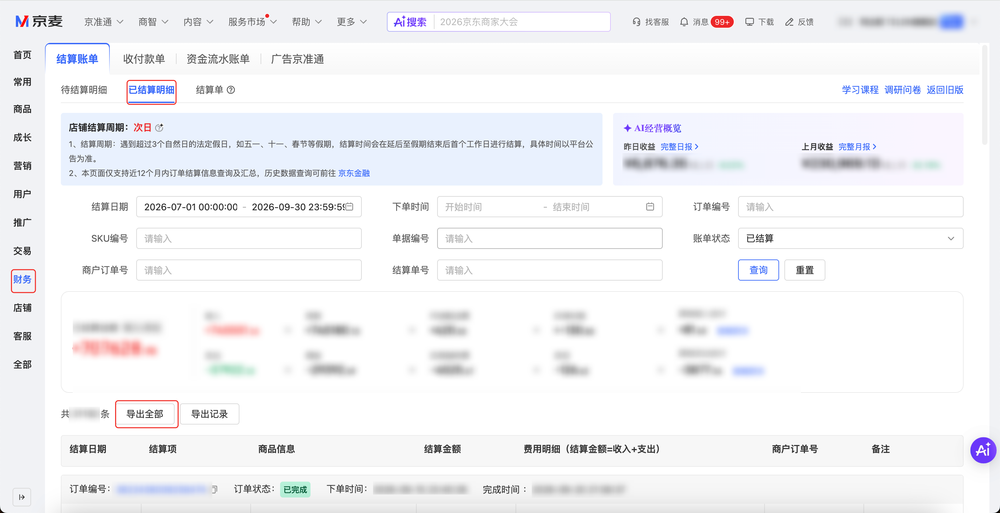

| 属性             | 值                                                                                 |
| ---------------- | ---------------------------------------------------------------------------------- |
| **连接器类型**   | `RPA 连接器`                                                                       |
| **连接器名称**   | `ODS_财务已结算账单明细报表(京麦RPA)`                                              |
| **连接器代码**   | `rpa.conn.jingmai.finance.already.settle.bill.report`                              |
| **操作类型**     | `文件导出`                                                                         |
| **目标网页**     | `https://shop.jd.com/jdm/finance/reconciliationCenter/orderSettleBill`             |
| **适用场景**     | 在京麦对账中心已结算明细页，按结算日期或下单时间与账单状态筛选并导出账单明细       |
| **数据表名**     | `ods_rpa_jingmai_finance_already_settle_bill_report_du`                            |
| **业务表名**     | `ODS_财务已结算账单明细报表(京麦RPA)`                                              |

### 目标页面

> **取数路径**：京麦商家后台—财务—对账中心—结算账单—已结算明细
>
> **取数链接**：[https://shop.jd.com/jdm/finance/reconciliationCenter/orderSettleBill](https://shop.jd.com/jdm/finance/reconciliationCenter/orderSettleBill)



### 业务入参

| 字段 | 中文释义 | 数据类型 | 必填 | 默认值 | 说明 |
| ---- | -------- | -------- | ---- | ------ | ---- |
| `settle_start_date` | 结算日期开始 | `String` | 条件必填 | `-` | 与 `order_start_date` 二选一必填一组；支持格式：`YYYYMMDD`、`YYYY-MM-DD`、`YYYY-MM-DD HH:mm:ss`、`YYYYMMDD HH:mm:ss`；仅传年月日时补 `00:00:00`；不能早于近一年 |
| `settle_end_date` | 结算日期结束 | `String` | 条件必填 | `-` | 与 `settle_start_date` 成对；格式同 `settle_start_date`；仅传年月日时补 `23:59:59`；不能晚于当天；不能早于开始 |
| `order_start_date` | 下单时间开始 | `String` | 条件必填 | `-` | 与 `settle_start_date` 二选一必填一组；格式同 `settle_start_date` |
| `order_end_date` | 下单时间结束 | `String` | 条件必填 | `-` | 与 `order_start_date` 成对；格式同 `settle_end_date` |
| `bill_status` | 账单状态 | `String` | 否 | `-` | 允许值：`SETTLED`（已结算）/ `NOT_SETTLED`（不结算） |

### 入参样例

按结算日期导出已结算账单（`YYYY-MM-DD`）：

```json
{
  "settle_start_date": "2026-09-20",
  "settle_end_date": "2026-09-20",
  "bill_status": "SETTLED"
}
```

按结算日期、紧凑格式（`YYYYMMDD`）：

```json
{
  "settle_start_date": "20260920",
  "settle_end_date": "20260920",
  "bill_status": "SETTLED"
}
```

按下单时间导出（不传账单状态）：

```json
{
  "order_start_date": "20260901",
  "order_end_date": "20260920"
}
```

结算日期带时分秒 + 账单状态为不结算：

```json
{
  "settle_start_date": "2026-09-20 00:00:00",
  "settle_end_date": "2026-09-20 23:59:59",
  "bill_status": "NOT_SETTLED"
}
```

### 入参校验

```json-schema collapsed
{
  "$schema": "https://json-schema.org/draft/2020-12/schema",
  "title": "京麦-财务已结算账单明细报表 - 查询入参",
  "description": "在京麦对账中心已结算明细页，按结算日期或下单时间与账单状态筛选并导出账单明细",
  "type": "object",
  "properties": {
    "settle_start_date": {
      "type": "string",
      "description": "结算日期开始。与下单时间二选一必填一组。支持 YYYYMMDD、YYYY-MM-DD、YYYY-MM-DD HH:mm:ss、YYYYMMDD HH:mm:ss；仅传年月日时补 00:00:00；不能早于近一年",
      "pattern": "^(\\d{4}-\\d{2}-\\d{2}([ T]\\d{2}:\\d{2}:\\d{2})?|\\d{8}( \\d{2}:\\d{2}:\\d{2})?)$"
    },
    "settle_end_date": {
      "type": "string",
      "description": "结算日期结束。与 settle_start_date 成对。格式同 settle_start_date；仅传年月日时补 23:59:59；不能晚于当天；不能早于开始",
      "pattern": "^(\\d{4}-\\d{2}-\\d{2}([ T]\\d{2}:\\d{2}:\\d{2})?|\\d{8}( \\d{2}:\\d{2}:\\d{2})?)$"
    },
    "order_start_date": {
      "type": "string",
      "description": "下单时间开始。与结算日期二选一必填一组。格式同 settle_start_date",
      "pattern": "^(\\d{4}-\\d{2}-\\d{2}([ T]\\d{2}:\\d{2}:\\d{2})?|\\d{8}( \\d{2}:\\d{2}:\\d{2})?)$"
    },
    "order_end_date": {
      "type": "string",
      "description": "下单时间结束。与 order_start_date 成对。格式同 settle_end_date",
      "pattern": "^(\\d{4}-\\d{2}-\\d{2}([ T]\\d{2}:\\d{2}:\\d{2})?|\\d{8}( \\d{2}:\\d{2}:\\d{2})?)$"
    },
    "bill_status": {
      "type": "string",
      "description": "账单状态。允许值：SETTLED（已结算）/ NOT_SETTLED（不结算）",
      "enum": ["SETTLED", "NOT_SETTLED"]
    }
  },
  "required": [],
  "anyOf": [
    { "required": ["settle_start_date", "settle_end_date"] },
    { "required": ["order_start_date", "order_end_date"] }
  ],
  "additionalProperties": false
}
```

### 数据字段

每条记录对应导出文件中的一行已结算账单明细。

| 字段 | 中文释义 | 数据类型 | 可为空 | 取数路径 | 示例 |
| ---- | -------- | -------- | ------ | -------- | ---- |
| `venderId` | 商家ID | `String` | 否 | `XLSX.1.商家ID` | `123****284` (已脱敏) |
| `companyId` | 公司ID | `String` | 否 | `XLSX.1.公司ID` | `554****430` (已脱敏) |
| `companyName` | 公司名称 | `String` | 否 | `XLSX.1.公司名称` | `****` (已脱敏) |
| `walletAccount` | 钱包账户 | `String` | 否 | `XLSX.1.钱包账户` | `189****001` (已脱敏) |
| `orderId` | 订单编号 | `String` | 否 | `XLSX.1.订单编号` | `358****1963` (已脱敏) |
| `rfBusiId` | 业务单据编号 | `String` | 否 | `XLSX.1.业务单据编号` | `358****1963` (已脱敏) |
| `parentOrderId` | 父单号 | `String` | 是 | `XLSX.1.父单号` | — |
| `orderStatus` | 订单状态 | `String` | 否 | `XLSX.1.订单状态` | `已完成` |
| `orderTime` | 下单时间 | `String` | 否 | `XLSX.1.下单时间` | `2026-08-06 15:43:37` |
| `finishTime` | 完成时间 | `String` | 否 | `XLSX.1.完成时间` | `2026-09-19 21:47:02` |
| `skuId` | 商品编号 | `String` | 否 | `XLSX.1.商品编号` | `100****3736` (已脱敏) |
| `skuName` | 商品名称 | `String` | 否 | `XLSX.1.商品名称` | `****` (已脱敏) |
| `skuPrice` | 商品单价 | `String` | 否 | `XLSX.1.商品单价` | `3.84` |
| `skuNum` | 商品数量 | `String` | 否 | `XLSX.1.商品数量` | `1` |
| `settleTime` | 结算时间 | `String` | 否 | `XLSX.1.结算时间` | `2026-09-20 12:41:09` |
| `settleAmount` | 结算金额合计 | `String` | 否 | `XLSX.1.结算金额合计` | `3.51` |
| `incomeAmount` | 收入金额合计 | `String` | 否 | `XLSX.1.收入金额合计` | `3.84` |
| `expenseAmount` | 支出金额合计 | `String` | 否 | `XLSX.1.支出金额合计` | `-0.33` |
| `merchantOrderNo` | 商户订单号 | `String` | 否 | `XLSX.1.商户订单号` | `202****001` (已脱敏) |
| `fundRemark` | 资金动账备注 | `String` | 是 | `XLSX.1.资金动账备注` | `2026年9月19日商家结算款` |
| `bizDate` | 业务日期 | `String` | 否 | 附加 | `20260920` |
| `accountId` | 授权 ID | `String` | 否 | 附加 | `4****0` (已脱敏) |

### 数据样例

```json
{
  "accountId": "4****0",
  "bizDate": "20260920",
  "companyId": "554****430",
  "companyName": "****",
  "expenseAmount": "-0.33",
  "finishTime": "2026-09-19 21:47:02",
  "fundRemark": "2026年9月19日商家结算款",
  "incomeAmount": "3.84",
  "merchantOrderNo": "202****001",
  "orderId": "358****1963",
  "orderStatus": "已完成",
  "orderTime": "2026-08-06 15:43:37",
  "parentOrderId": null,
  "rfBusiId": "358****1963",
  "settleAmount": "3.51",
  "settleTime": "2026-09-20 12:41:09",
  "skuId": "100****3736",
  "skuName": "****",
  "skuNum": "1",
  "skuPrice": "3.84",
  "venderId": "123****284",
  "walletAccount": "189****001"
}
```
