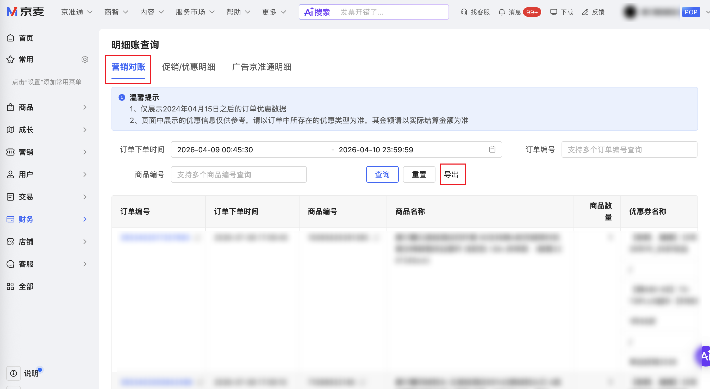

:::warning[店铺兼容性说明]
当前连接器目标页面已在 **2 个 POP 店** 和 **1 个供应商店** 完成验证。验证结果：**POP 店** 可用，**供应商店** 暂不支持，使用前请确认店铺类型！
:::

| 属性             | 值                                                                                 |
| ---------------- | ---------------------------------------------------------------------------------- |
| **连接器类型**   | `RPA 连接器`|
| **连接器名称**   | `ODS_财务营销对账明细表(京麦RPA)`|
| **连接器代码**   | `rpa.conn.jingmai.finance.market.account`|
| **操作类型**     | `页面解析` + `文件导出`|
| **目标网页**     | `https://shop.jd.com/jdm/finance/detailAccount/marketAccount`|
| **适用场景**     | 在京麦商家后台营销对账页，按订单下单时间范围导出营销对账明细数据|
| **数据表名**     | `ods_rpa_jingmai_finance_market_account_du`|
| **业务表名**     | `ODS_财务营销对账明细表(京麦RPA)`|

### 目标页面

> **取数路径**：京麦商家后台—财务—明细对账—营销对账
>
> **取数链接**：[https://shop.jd.com/jdm/finance/detailAccount/marketAccount](https://shop.jd.com/jdm/finance/detailAccount/marketAccount)



### 业务入参

| 字段 | 中文释义 | 数据类型 | 必填 | 默认值 | 说明 |
| ---- | -------- | -------- | ---- | ------ | ---- |
| `custom_start_date` | 订单下单开始时间 | `String` | 是 | — | 支持格式：YYYYMMDD、YYYY-MM-DD、YYYY-MM-DD HH:mm:ss、YYYYMMDD HH:mm:ss；不含时分秒时自动补 `00:00:00` |
| `custom_end_date` | 订单下单结束时间 | `String` | 是 | — | 格式同 `custom_start_date`；不含时分秒时自动补 `23:59:59`；不能早于 `custom_start_date`；不能晚于当天；与 `custom_start_date` 间隔不超过 31 个自然日（含起止日） |

### 入参样例

```json
{
  "custom_start_date": "2026-04-01",
  "custom_end_date": "2026-04-10"
}
```

### 入参校验

```json-schema collapsed
{
  "$schema": "https://json-schema.org/draft/2020-12/schema",
  "title": "京麦-营销对账明细导出 - 查询入参",
  "description": "在京麦商家后台营销对账页，按订单下单时间范围导出营销对账明细数据",
  "type": "object",
  "properties": {
    "custom_start_date": {
      "type": "string",
      "description": "订单下单开始时间。支持格式：YYYYMMDD、YYYY-MM-DD、YYYY-MM-DD HH:mm:ss、YYYYMMDD HH:mm:ss；不含时分秒时自动补 00:00:00"
    },
    "custom_end_date": {
      "type": "string",
      "description": "订单下单结束时间。格式同 custom_start_date；不含时分秒时自动补 23:59:59；不能早于 custom_start_date；不能晚于当天；与 custom_start_date 间隔不超过 31 个自然日（含起止日）"
    }
  },
  "required": ["custom_start_date", "custom_end_date"],
  "additionalProperties": false
}
```

### 数据字段

| 字段 | 中文释义 | 数据类型 | 可为空 | 取数路径 | 示例 |
| ---- | -------- | -------- | ------ | -------- | ---- |
| `orderId` | 订单编号 | `String` | 否 | `CSV.0.订单编号` | `3464251014580195` |
| `orderTime` | 订单下单时间 | `String` | 否 | `CSV.0.订单下单时间` | `2026-04-10 23:59:26` |
| `skuId` | 商品编号 | `Number` | 否 | `CSV.0.商品编号` | `10062485911639` |
| `skuName` | 商品名称 | `String` | 否 | `CSV.0.商品名称` | `康尔馨抗阴干菌纯棉浴巾 五星级酒店A类亲肤吸水成人男女情侣浴巾 【抗阴干菌】深灰色 880g *150cm*90cm` |
| `skuQuantity` | 商品数量 | `Number` | 否 | `CSV.0.商品数量` | `1` |
| `discountType` | 优惠类型 | `String` | 否 | `CSV.0.优惠类型` | `支付营销优惠类型` |
| `promotionName` | 优惠活动名称 | `String` | 是 | `CSV.0.优惠活动名称` | `--` |
| `promotionId` | 优惠活动 ID | `String` | 是 | `CSV.0.优惠活动ID` | `--` |
| `jdBearAmount` | 京东承担金额 | `Number` | 否 | `CSV.0.京东承担金额` | `30.0` |
| `merchantBearAmount` | 商家承担金额 | `Number` | 否 | `CSV.0.商家承担金额` | `0.0` |
| `govBearAmount` | 政府承担金额 | `String` | 是 | `CSV.0.政府承担金额` | `--` |
| `bizDate` | 业务日期 | `String` | 否 | 附加 |  |
| `accountId` | 授权 ID | `String` | 否 | 附加 |  |

### 数据样例

```json
{
  "orderId": "3464251014580195",
  "orderTime": "2026-04-10 23:59:26",
  "skuId": 10062485911639,
  "skuName": "康尔馨抗阴干菌纯棉浴巾 五星级酒店A类亲肤吸水成人男女情侣浴巾 【抗阴干菌】深灰色 880g *150cm*90cm",
  "skuQuantity": 1,
  "discountType": "支付营销优惠类型",
  "promotionName": "--",
  "promotionId": "--",
  "jdBearAmount": 30.0,
  "merchantBearAmount": 0.0,
  "govBearAmount": "--",
  "bizDate": "20260708",
  "accountId": "122"
}
```

---
