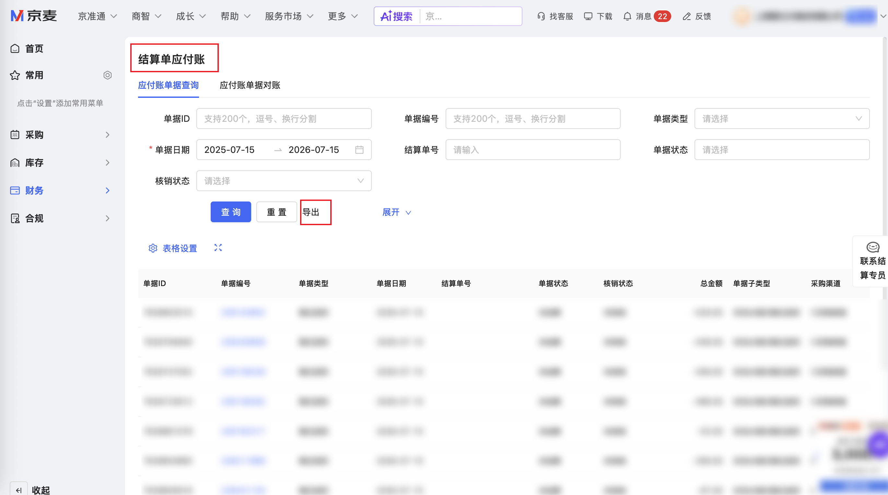

| 属性             | 值                                                                                 |
| ---------------- | ---------------------------------------------------------------------------------- |
| **连接器类型**   | `RPA 连接器`                                                                       |
| **连接器名称**   | `ODS_财务结算单应付账明细表(京麦RPA)`                                              |
| **连接器代码**   | `rpa.conn.jingmai.finance.settle.accounts.payable`                                 |
| **操作类型**     | `文件导出`                                                                         |
| **目标网页**     | `https://vcnew.jd.com/finance/settleAccountsPayable`                               |
| **适用场景**     | 在京麦供应商协同结算单应付账页，按单据日期与单据状态筛选并导出应付账明细数据       |
| **数据表名**     | `ods_rpa_jingmai_finance_settle_accounts_payable_du`                               |
| **业务表名**     | `ODS_财务结算单应付账明细表(京麦RPA)`                                              |

### 目标页面

> **取数路径**：京麦供应商协同—财务—结算单应付账
>
> **取数链接**：[https://vcnew.jd.com/finance/settleAccountsPayable](https://vcnew.jd.com/finance/settleAccountsPayable)



### 业务入参

| 字段 | 中文释义 | 数据类型 | 必填 | 默认值 | 说明 |
| ---- | -------- | -------- | ---- | ------ | ---- |
| `custom_start_date` | 单据日期开始 | `String` | 是 | — | 支持格式：`YYYYMMDD`、`YYYY-MM-DD`；不能早于近一年（相对当天） |
| `custom_end_date` | 单据日期结束 | `String` | 是 | — | 支持格式：`YYYYMMDD`、`YYYY-MM-DD`；不能晚于当天；不能早于 `custom_start_date` |
| `bill_statuses` | 单据状态 | `String` \| `List[String]` | 否 | — | 多选；可选值：`UNSETTLED`（未结算）、`APPLYING`（申请中）、`APPROVED`（审核通过）、`SETTLED`（已结算）；字符串形式为英文逗号分隔 |

### 入参样例

按单据日期范围导出，不限单据状态：

```json
{
  "custom_start_date": "2026-07-01",
  "custom_end_date": "2026-07-15"
}
```

指定单据状态（未结算、申请中）：

```json
{
  "custom_start_date": "20260701",
  "custom_end_date": "20260715",
  "bill_statuses": ["UNSETTLED", "APPLYING"]
}
```

### 入参校验

```json-schema collapsed
{
  "$schema": "https://json-schema.org/draft/2020-12/schema",
  "title": "京麦-结算单应付账明细导出 - 查询入参",
  "description": "在京麦供应商协同结算单应付账页，按单据日期与单据状态筛选并导出应付账明细数据",
  "type": "object",
  "properties": {
    "custom_start_date": {
      "type": "string",
      "description": "单据日期开始。支持 YYYYMMDD 或 YYYY-MM-DD；不能早于近一年（相对当天）",
      "pattern": "^(\\d{4}-\\d{2}-\\d{2}|\\d{8})$"
    },
    "custom_end_date": {
      "type": "string",
      "description": "单据日期结束。支持 YYYYMMDD 或 YYYY-MM-DD；不能晚于当天；不能早于 custom_start_date",
      "pattern": "^(\\d{4}-\\d{2}-\\d{2}|\\d{8})$"
    },
    "bill_statuses": {
      "description": "单据状态（多选）。可选值：UNSETTLED（未结算）、APPLYING（申请中）、APPROVED（审核通过）、SETTLED（已结算）；字符串形式为英文逗号分隔",
      "oneOf": [
        {
          "type": "string",
          "pattern": "^(UNSETTLED|APPLYING|APPROVED|SETTLED)(,(UNSETTLED|APPLYING|APPROVED|SETTLED))*$"
        },
        {
          "type": "array",
          "items": {
            "type": "string",
            "enum": ["UNSETTLED", "APPLYING", "APPROVED", "SETTLED"]
          },
          "minItems": 1,
          "uniqueItems": true
        }
      ]
    }
  },
  "required": ["custom_start_date", "custom_end_date"],
  "additionalProperties": false
}
```

### 数据字段

每条记录对应导出文件中的一行应付账明细。

| 字段 | 中文释义 | 数据类型 | 可为空 | 取数路径 | 示例 |
| ---- | -------- | -------- | ------ | -------- | ---- |
| `billId` | 单据 ID | `Number` | 否 | `XLSX.0.单据ID` | `762****010` (已脱敏) |
| `billNo` | 单据编号 | `Number` | 否 | `XLSX.0.单据编号` | `226****802` (已脱敏) |
| `billType` | 单据类型 | `String` | 否 | `XLSX.0.单据类型` | `售后退货` |
| `billSubType` | 单据子类型 | `String` | 否 | `XLSX.0.单据子类型` | `非流水倒扣售后退货` |
| `purchaseOrderNo` | 采购单号 | `Number` | 否 | `XLSX.0.采购单号` | `274****246` (已脱敏) |
| `department` | 部门 | `String` | 否 | `XLSX.0.部门` | `家居日****业群)` (已脱敏) |
| `teamGroup` | 组别 | `String` | 否 | `XLSX.0.组别` | `床****组` (已脱敏) |
| `contractEntity` | 合同主体 | `String` | 否 | `XLSX.0.合同主体` | `北京京****公司` (已脱敏) |
| `payableEntryTime` | 进入应付账时间 | `String` | 否 | `XLSX.0.进入应付账时间` | `2026-07-15` |
| `billDate` | 单据日期 | `String` | 否 | `XLSX.0.单据日期` | `2026-07-15` |
| `totalAmount` | 总金额 | `Number` | 否 | `XLSX.0.总金额` | `-529.0` |
| `settlementNo` | 结算单号 | `String` | 是 | `XLSX.0.结算单号` | — |
| `writeoffStatus` | 核销状态 | `String` | 否 | `XLSX.0.核销状态` | `未核销` |
| `settlementStatus` | 结算状态 | `String` | 否 | `XLSX.0.结算状态` | `未结算` |
| `reconciliationStatus` | 对账状态 | `String` | 否 | `XLSX.0.对账状态` | `无需对账` |
| `purchaser` | 采购员 | `String` | 否 | `XLSX.0.采购员` | `赵****琪` (已脱敏) |
| `purchaseChannel` | 采购渠道 | `String` | 否 | `XLSX.0.采购渠道` | `C采购渠道` |
| `bizDate` | 业务日期 | `String` | 否 | 附加 | `20260715` |
| `accountId` | 授权 ID | `String` | 否 | 附加 | `1****1` (已脱敏) |

### 数据样例

```json
{
  "accountId": "1****1",
  "billDate": "2026-07-15",
  "billId": "762****010",
  "billNo": "226****802",
  "billSubType": "非流水倒扣售后退货",
  "billType": "售后退货",
  "bizDate": "20260715",
  "contractEntity": "北京京****公司",
  "department": "家居日****业群)",
  "payableEntryTime": "2026-07-15",
  "purchaseChannel": "C采购渠道",
  "purchaseOrderNo": "274****246",
  "purchaser": "赵****琪",
  "reconciliationStatus": "无需对账",
  "settlementNo": null,
  "settlementStatus": "未结算",
  "teamGroup": "床****组",
  "totalAmount": -529.0,
  "writeoffStatus": "未核销"
}
```

---
