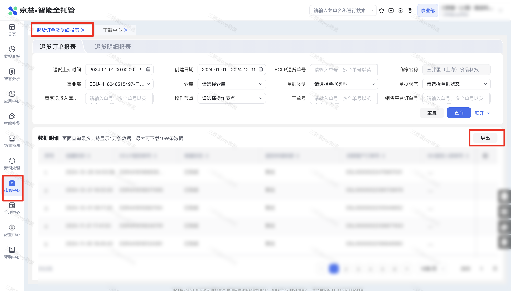

| 属性             | 值                                                                                   |
| ---------------- | ------------------------------------------------------------------------------------ |
| **连接器类型**   | `RPA 连接器`                                                                         |
| **连接器名称**   | `ODS_京慧退货订单明细报表(京麦RPA)`                                                  |
| **连接器代码**   | `rpa.conn.jingmai.jh.return.order.report`                                            |
| **操作类型**     | `文件导出`                                                                           |
| **目标网页**     | `https://jh.jdl.com/#/ReturnReportForm`                                              |
| **适用场景**     | 按退货上架时间与创建日期筛选京慧退货订单报表，异步导出并解析为行级明细             |
| **数据表名**     | `ods_rpa_jingmai_jh_return_order_report_du`                                          |
| **业务表名**     | `ODS_京慧退货订单明细报表(京麦RPA)`                                                  |

### 目标页面

> **取数路径**：京慧—报表中心—退货订单及明细报表—退货订单报表
>
> **取数链接**：[https://jh.jdl.com/#/ReturnReportForm](https://jh.jdl.com/#/ReturnReportForm)



页面可选历史日期较久，但近三年以前的区间平台侧常无数据，连接器会按空结果返回，属正常现象；建议使用近两年内日期。


### 业务入参

| 字段 | 中文释义 | 数据类型 | 必填 | 默认值 | 说明 |
| ---- | -------- | -------- | ---- | ------ | ---- |
| `putaway_custom_start_date` | 退货上架起始时间 | `String` | 是 | — | 须与结束时间成对。支持 `YYYYMMDD` / `YYYY-MM-DD` / `YYYY-MM-DD HH:MM:SS`；仅年月日时默认 `00:00:00`。最早为当年往前第 4 年的 1 月 1 日，最晚为当天；起止跨度**含起止共不超过 367 天** |
| `putaway_custom_end_date` | 退货上架结束时间 | `String` | 是 | — | 须与起始时间成对。格式同起始时间；仅年月日时默认 `23:59:59`。不能早于起始时间 |
| `create_custom_start_date` | 创建起始日期 | `String` | 是 | — | 须与结束日期成对。仅 `YYYYMMDD` / `YYYY-MM-DD`。边界与跨度同退货上架时间 |
| `create_custom_end_date` | 创建结束日期 | `String` | 是 | — | 须与起始日期成对。仅 `YYYYMMDD` / `YYYY-MM-DD`。不能早于起始日期 |

### 入参样例

```json
{
  "putaway_custom_start_date": "2024-01-01",
  "putaway_custom_end_date": "2024-12-31",
  "create_custom_start_date": "2024-01-01",
  "create_custom_end_date": "2024-12-31"
}
```

退货上架带时分秒：

```json
{
  "putaway_custom_start_date": "2024-06-01 00:00:00",
  "putaway_custom_end_date": "2024-06-30 23:59:59",
  "create_custom_start_date": "2024-06-01",
  "create_custom_end_date": "2024-06-30"
}
```

### 入参校验

```json-schema collapsed
{
  "$schema": "https://json-schema.org/draft/2020-12/schema",
  "title": "京慧-退货订单-明细报表 - 查询入参",
  "description": "按退货上架时间与创建日期筛选京慧退货订单报表，异步导出并解析为行级明细",
  "type": "object",
  "properties": {
    "putaway_custom_start_date": {
      "type": "string",
      "description": "退货上架起始时间。须与结束时间成对。支持 YYYYMMDD / YYYY-MM-DD / YYYY-MM-DD HH:MM:SS；仅年月日时默认 00:00:00。最早为当年往前第 4 年的 1 月 1 日，最晚为当天；起止跨度含起止共不超过 367 天",
      "anyOf": [
        { "pattern": "^\\d{8}$" },
        { "pattern": "^\\d{4}-\\d{2}-\\d{2}$" },
        { "pattern": "^\\d{4}-\\d{2}-\\d{2} \\d{2}:\\d{2}:\\d{2}$" }
      ]
    },
    "putaway_custom_end_date": {
      "type": "string",
      "description": "退货上架结束时间。须与起始时间成对。格式同起始时间；仅年月日时默认 23:59:59。不能早于起始时间",
      "anyOf": [
        { "pattern": "^\\d{8}$" },
        { "pattern": "^\\d{4}-\\d{2}-\\d{2}$" },
        { "pattern": "^\\d{4}-\\d{2}-\\d{2} \\d{2}:\\d{2}:\\d{2}$" }
      ]
    },
    "create_custom_start_date": {
      "type": "string",
      "description": "创建起始日期。须与结束日期成对。仅 YYYYMMDD / YYYY-MM-DD。边界与跨度同退货上架时间",
      "anyOf": [
        { "pattern": "^\\d{8}$" },
        { "pattern": "^\\d{4}-\\d{2}-\\d{2}$" }
      ]
    },
    "create_custom_end_date": {
      "type": "string",
      "description": "创建结束日期。须与起始日期成对。仅 YYYYMMDD / YYYY-MM-DD。不能早于起始日期",
      "anyOf": [
        { "pattern": "^\\d{8}$" },
        { "pattern": "^\\d{4}-\\d{2}-\\d{2}$" }
      ]
    }
  },
  "required": [
    "putaway_custom_start_date",
    "putaway_custom_end_date",
    "create_custom_start_date",
    "create_custom_end_date"
  ],
  "additionalProperties": false
}
```

### 数据字段

| 字段 | 中文释义 | 数据类型 | 可为空 | 取数路径 | 示例 |
| ---- | -------- | -------- | ------ | -------- | ---- |
| `createTime` | 创建时间 | `String` | 否 | `XLSX.0.创建时间` | `2024-12-26 04:53:39` |
| `eclpReturnOrderNo` | ECLP退货单号 | `String` | 否 | `XLSX.0.ECLP退货单号` | `ESR****885` (已脱敏) |
| `documentStatus` | 单据状态 | `String` | 否 | `XLSX.0.单据状态` | `已完成` |
| `returnApplySource` | 退货申请来源 | `String` | 否 | `XLSX.0.退货申请来源` | `青龙` |
| `relatedCustomerOrderNo` | 关联客户订单号 | `String` | 否 | `XLSX.0.关联客户订单号` | `ESL****031` (已脱敏) |
| `isvReturnInboundNo` | ISV退货入库单号 | `String` | 是 | `XLSX.0.ISV退货入库单号` | — |
| `deptCode` | 事业部编码 | `String` | 否 | `XLSX.0.事业部编码` | `EBU****497` (已脱敏) |
| `deptName` | 事业部名称 | `String` | 否 | `XLSX.0.事业部名称` | `****` (已脱敏) |
| `inboundWarehouse` | 入库库房 | `String` | 否 | `XLSX.0.入库库房` | `****` (已脱敏) |
| `actualInboundWarehouseName` | 实际入库库房名称 | `String` | 否 | `XLSX.0.实际入库库房名称` | `****` (已脱敏) |
| `warehousePutawayTime` | 库房上架时间 | `String` | 否 | `XLSX.0.库房上架时间` | `2024-12-26 16:50:05` |
| `salesPlatformOrderNo` | 销售平台订单号 | `String` | 否 | `XLSX.0.销售平台订单号` | `300****649` (已脱敏) |
| `isvOutboundNo` | isv出库单号 | `String` | 否 | `XLSX.0.isv出库单号` | `300****649` (已脱敏) |
| `originalWaybillNo` | 原运单号 | `String` | 否 | `XLSX.0.原运单号` | `JDV****529` (已脱敏) |
| `reverseWaybillNo` | 逆向运单号 | `String` | 否 | `XLSX.0.逆向运单号` | `JDV****171` (已脱敏) |
| `packageNo` | 包裹号 | `String` | 是 | `XLSX.0.包裹号` | — |
| `skuCount` | sku数量 | `Number` | 否 | `XLSX.0.sku数量` | `1` |
| `expectedInboundSkuQty` | 应入库sku总件数 | `Number` | 否 | `XLSX.0.应入库sku总件数` | `1` |
| `actualInboundSkuQty` | 实际入库sku总件数 | `Number` | 否 | `XLSX.0.实际入库sku总件数` | `1` |
| `returnPutawayTime` | 退货上架时间 | `String` | 否 | `XLSX.0.退货上架时间` | `2024-12-26 16:50:05` |
| `receiveRequirement` | 收货要求 | `String` | 否 | `XLSX.0.收货要求` | `按实物等级入库` |
| `inboundPriority` | 入库优先级 | `String` | 是 | `XLSX.0.入库优先级` | — |
| `storeCode` | 门店编码 | `String` | 是 | `XLSX.0.门店编码` | — |
| `storeName` | 门店名称 | `String` | 是 | `XLSX.0.门店名称` | — |
| `carrierName` | 承运商名称 | `String` | 是 | `XLSX.0.承运商名称` | — |
| `sender` | 寄件人 | `String` | 是 | `XLSX.0.寄件人` | — |
| `senderMobile` | 寄件人手机号 | `String` | 是 | `XLSX.0.寄件人手机号` | — |
| `senderPhone` | 寄件人电话 | `String` | 是 | `XLSX.0.寄件人电话` | — |
| `salesPlatform` | 销售平台 | `String` | 否 | `XLSX.0.销售平台` | `京东商城` |
| `merchantShop` | 商家店铺 | `String` | 是 | `XLSX.0.商家店铺` | — |
| `merchantRemark` | 商家备注 | `String` | 是 | `XLSX.0.商家备注` | — |
| `returnUnitCode` | 退货单位编码 | `String` | 是 | `XLSX.0.退货单位编码` | — |
| `returnUnitName` | 退货单位名称 | `String` | 是 | `XLSX.0.退货单位名称` | — |
| `merchantReturnType` | 商家退货类型 | `String` | 是 | `XLSX.0.商家退货类型` | — |
| `merchantReturnTypeName` | 商家退货类型名称 | `String` | 是 | `XLSX.0.商家退货类型名称` | — |
| `workOrderNo` | 工单号 | `String` | 是 | `XLSX.0.工单号` | — |
| `logicFactorCode1` | 逻辑因子编码1 | `String` | 是 | `XLSX.0.逻辑因子编码1` | — |
| `logicFactorName1` | 逻辑因子名称1 | `String` | 是 | `XLSX.0.逻辑因子名称1` | — |
| `logicFactorCode2` | 逻辑因子编码2 | `String` | 是 | `XLSX.0.逻辑因子编码2` | — |
| `logicFactorName2` | 逻辑因子名称2 | `String` | 是 | `XLSX.0.逻辑因子名称2` | — |
| `operationNode` | 操作节点 | `String` | 是 | `XLSX.0.操作节点` | — |
| `operationNodeTime` | 操作节点时间 | `String` | 是 | `XLSX.0.操作节点时间` | — |
| `documentType` | 单据类型 | `String` | 否 | `XLSX.0.单据类型` | `B2C` |
| `bizDate` | 业务日期 | `String` | 否 | 附加 | `20260820` |
| `accountId` | 授权 ID | `String` | 否 | 附加 | `1****2` (已脱敏) |

### 数据样例

```json
{
  "createTime": "2024-12-26 04:53:39",
  "eclpReturnOrderNo": "ESR****885",
  "documentStatus": "已完成",
  "returnApplySource": "*",
  "relatedCustomerOrderNo": "ESL****031",
  "isvReturnInboundNo": null,
  "deptCode": "EBU****497",
  "deptName": "****",
  "inboundWarehouse": "****",
  "actualInboundWarehouseName": "****",
  "warehousePutawayTime": "2024-12-26 16:50:05",
  "salesPlatformOrderNo": "300****649",
  "isvOutboundNo": "300****649",
  "originalWaybillNo": "JDV****529",
  "reverseWaybillNo": "JDV****171",
  "packageNo": null,
  "skuCount": "1",
  "expectedInboundSkuQty": "1",
  "actualInboundSkuQty": "1",
  "returnPutawayTime": "2024-12-26 16:50:05",
  "receiveRequirement": "按实物等级入库",
  "inboundPriority": null,
  "storeCode": null,
  "storeName": null,
  "carrierName": null,
  "sender": null,
  "senderMobile": null,
  "senderPhone": null,
  "salesPlatform": "**商城",
  "merchantShop": null,
  "merchantRemark": null,
  "returnUnitCode": null,
  "returnUnitName": null,
  "merchantReturnType": null,
  "merchantReturnTypeName": null,
  "workOrderNo": null,
  "logicFactorCode1": null,
  "logicFactorName1": null,
  "logicFactorCode2": null,
  "logicFactorName2": null,
  "operationNode": null,
  "operationNodeTime": null,
  "documentType": "B2C",
  "bizDate": "20260820",
  "accountId": "1****2"
}
```

---
