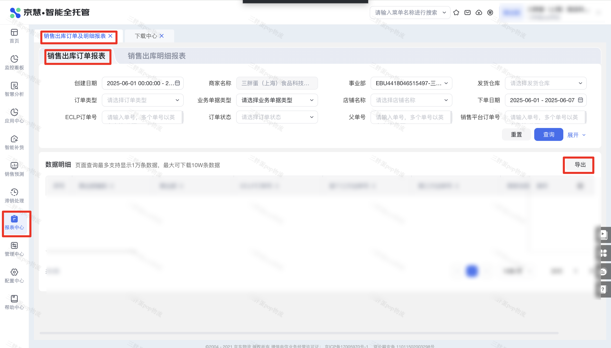

| 属性             | 值                                                                                   |
| ---------------- | ------------------------------------------------------------------------------------ |
| **连接器类型**   | `RPA 连接器`                                                                         |
| **连接器名称**   | `ODS_京慧销售出库单明细报表(京麦RPA)`                                                 |
| **连接器代码**   | `rpa.conn.jingmai.jh.sales.order.report`                                             |
| **操作类型**     | `文件导出`                                                                           |
| **目标网页**     | `https://jh.jdl.com/#/reportForm/salesOrderDetailForm`                               |
| **适用场景**     | 按创建日期与下单日期筛选京慧销售出库订单及明细报表，异步导出并解析为行级明细         |
| **数据表名**     | `ods_rpa_jingmai_jh_sales_order_report_du`                                           |
| **业务表名**     | `DS_京慧销售出库单明细报表(京麦RPA)`                                                 |

### 目标页面

> **取数路径**：京慧—报表中心—销售出库订单及明细报表
>
> **取数链接**：[https://jh.jdl.com/#/reportForm/salesOrderDetailForm](https://jh.jdl.com/#/reportForm/salesOrderDetailForm)



页面可选历史日期较久，但近三年以前的区间平台侧常无数据，连接器会按空结果返回，属正常现象；建议使用近两年内日期。

### 业务入参

| 字段 | 中文释义 | 数据类型 | 必填 | 默认值 | 说明 |
| ---- | -------- | -------- | ---- | ------ | ---- |
| `create_custom_start_date` | 创建起始日期 | `String` | 是 | — | 须与结束日期成对。支持 `YYYYMMDD` / `YYYY-MM-DD` / `YYYY-MM-DD HH:MM:SS` / `YYYYMMDD HH:MM:SS`；仅年月日时默认 `00:00:00`。最早为当年往前第 4 年的 1 月 1 日，最晚为当天；起止跨度**含起止共不超过 367 天**（例 `2025-01-01`~`2026-01-02`） |
| `create_custom_end_date` | 创建结束日期 | `String` | 是 | — | 须与起始日期成对。格式同起始日期；仅年月日时默认 `23:59:59`。不能早于起始日期 |
| `order_custom_start_date` | 下单起始日期 | `String` | 是 | — | 须与结束日期成对。仅 `YYYYMMDD` / `YYYY-MM-DD`。边界与跨度同创建日期 |
| `order_custom_end_date` | 下单结束日期 | `String` | 是 | — | 须与起始日期成对。仅 `YYYYMMDD` / `YYYY-MM-DD`。不能早于起始日期 |

### 入参样例

```json
{
  "create_custom_start_date": "2025-01-01",
  "create_custom_end_date": "2025-01-31",
  "order_custom_start_date": "2025-01-01",
  "order_custom_end_date": "2025-12-31"
}
```

创建带时分秒：

```json
{
  "create_custom_start_date": "2026-08-20 13:06:33",
  "create_custom_end_date": "2026-08-20 14:06:33",
  "order_custom_start_date": "2025-01-01",
  "order_custom_end_date": "2025-12-31"
}
```

紧凑日期加时分秒（`YYYYMMDD HH:MM:SS`）：

```json
{
  "create_custom_start_date": "20250101 00:00:00",
  "create_custom_end_date": "20250131 23:59:59",
  "order_custom_start_date": "20250101",
  "order_custom_end_date": "20251231"
}
```

### 入参校验

```json-schema collapsed
{
  "$schema": "https://json-schema.org/draft/2020-12/schema",
  "title": "京慧-销售出库-订单明细 - 查询入参",
  "description": "按创建日期与下单日期筛选京慧销售出库订单及明细报表，异步导出并解析为行级明细",
  "type": "object",
  "properties": {
    "create_custom_start_date": {
      "type": "string",
      "description": "创建起始日期。须与结束日期成对。支持 YYYYMMDD / YYYY-MM-DD / YYYY-MM-DD HH:MM:SS / YYYYMMDD HH:MM:SS；仅年月日时默认 00:00:00。最早为当年往前第 4 年的 1 月 1 日，最晚为当天；起止跨度含起止共不超过 367 天（例 2025-01-01~2026-01-02）",
      "anyOf": [
        { "pattern": "^\\d{8}$" },
        { "pattern": "^\\d{4}-\\d{2}-\\d{2}$" },
        { "pattern": "^\\d{4}-\\d{2}-\\d{2} \\d{2}:\\d{2}:\\d{2}$" },
        { "pattern": "^\\d{8} \\d{2}:\\d{2}:\\d{2}$" }
      ]
    },
    "create_custom_end_date": {
      "type": "string",
      "description": "创建结束日期。须与起始日期成对。格式同起始日期；仅年月日时默认 23:59:59。不能早于起始日期",
      "anyOf": [
        { "pattern": "^\\d{8}$" },
        { "pattern": "^\\d{4}-\\d{2}-\\d{2}$" },
        { "pattern": "^\\d{4}-\\d{2}-\\d{2} \\d{2}:\\d{2}:\\d{2}$" },
        { "pattern": "^\\d{8} \\d{2}:\\d{2}:\\d{2}$" }
      ]
    },
    "order_custom_start_date": {
      "type": "string",
      "description": "下单起始日期。须与结束日期成对。仅 YYYYMMDD / YYYY-MM-DD。边界与跨度同创建日期",
      "anyOf": [
        { "pattern": "^\\d{8}$" },
        { "pattern": "^\\d{4}-\\d{2}-\\d{2}$" }
      ]
    },
    "order_custom_end_date": {
      "type": "string",
      "description": "下单结束日期。须与起始日期成对。仅 YYYYMMDD / YYYY-MM-DD。不能早于起始日期",
      "anyOf": [
        { "pattern": "^\\d{8}$" },
        { "pattern": "^\\d{4}-\\d{2}-\\d{2}$" }
      ]
    }
  },
  "required": [
    "create_custom_start_date",
    "create_custom_end_date",
    "order_custom_start_date",
    "order_custom_end_date"
  ],
  "additionalProperties": false
}
```

### 数据字段

| 字段 | 中文释义 | 数据类型 | 可为空 | 取数路径 | 示例 |
| ---- | -------- | -------- | ------ | -------- | ---- |
| `deptCode` | 事业部编码 | `String` | 否 | `XLSX.0.事业部编码` | `EBU****497` (已脱敏) |
| `deptName` | 事业部 | `String` | 否 | `XLSX.0.事业部` | `****` (已脱敏) |
| `eclpOrderNo` | ECLP订单号 | `String` | 否 | `XLSX.0.ECLP订单号` | `ESL****741` (已脱敏) |
| `firstThirdWaybillNo` | 首个三方运单号 | `String` | 是 | `XLSX.0.首个三方运单号` | — |
| `thirdWaybillNo` | 第三方运单号 | `String` | 是 | `XLSX.0.第三方运单号` | — |
| `merchantName` | 商家名称 | `String` | 否 | `XLSX.0.商家名称` | `****` (已脱敏) |
| `shopName` | 店铺名称 | `String` | 否 | `XLSX.0.店铺名称` | `****` (已脱敏) |
| `isvMerchantOrderNo` | ISV商家单号 | `String` | 否 | `XLSX.0.ISV商家单号` | `315****766` (已脱敏) |
| `salesPlatformOrderNo` | 销售平台订单号 | `String` | 否 | `XLSX.0.销售平台订单号` | `315****766` (已脱敏) |
| `orderType` | 订单类型 | `String` | 否 | `XLSX.0.订单类型` | `B2C订单` |
| `bizDocType` | 业务单据类型 | `String` | 否 | `XLSX.0.业务单据类型` | `普通销售出库单` |
| `orderSource` | 订单来源 | `String` | 否 | `XLSX.0.订单来源` | `京仓` |
| `bizSource` | 业务来源 | `String` | 是 | `XLSX.0.业务来源` | — |
| `shipWarehouse` | 发货仓库 | `String` | 否 | `XLSX.0.发货仓库` | `****` (已脱敏) |
| `receiveWarehouse` | 收货仓库 | `String` | 是 | `XLSX.0.收货仓库` | — |
| `orderTime` | 下单时间 | `String` | 否 | `XLSX.0.下单时间` | `2025-05-20 15:33:58` |
| `createTime` | 创建时间 | `String` | 否 | `XLSX.0.创建时间` | `2025-05-20 16:14:01` |
| `expectDeliveryTime` | 期望送达时间 | `String` | 否 | `XLSX.0.期望送达时间` | `2025-05-20 16:14:01` |
| `carrier` | 承运商 | `String` | 否 | `XLSX.0.承运商` | `京东配送` |
| `waybillNo` | 运单号 | `String` | 否 | `XLSX.0.运单号` | `JDV****717` (已脱敏) |
| `parentOrderNo` | 父单号 | `String` | 是 | `XLSX.0.父单号` | — |
| `groupOrderNo` | 团单号 | `String` | 是 | `XLSX.0.团单号` | — |
| `parentOrderStatus` | 父单状态 | `String` | 是 | `XLSX.0.父单状态` | — |
| `qty` | 数量 | `Number` | 否 | `XLSX.0.数量` | `1` |
| `volumeCm3` | 体积(cm³) | `Number` | 否 | `XLSX.0.体积(cm³)` | `15675` |
| `weightKg` | 重量(kg) | `Number` | 否 | `XLSX.0.重量(kg)` | `1.57` |
| `receiverName` | 收货人 | `String` | 否 | `XLSX.0.收货人` | `****` (已脱敏) |
| `receiverAddress` | 收货地址 | `String` | 否 | `XLSX.0.收货地址` | `北京通*****4室` (已脱敏) |
| `receiverMobile` | 收货人手机 | `String` | 否 | `XLSX.0.收货人手机` | `1*******620` |
| `orderStatus` | 订单状态 | `String` | 否 | `XLSX.0.订单状态` | `妥投` |
| `customsClearTime` | 清关时间 | `String` | 是 | `XLSX.0.清关时间` | — |
| `checkTime` | 复核时间 | `String` | 否 | `XLSX.0.复核时间` | `2025-05-20 17:31:55` |
| `firstSortAcceptTime` | 首次分拣验收时间 | `String` | 否 | `XLSX.0.首次分拣验收时间` | `2025-05-20 17:35:44` |
| `shipTime` | 发货时间 | `String` | 否 | `XLSX.0.发货时间` | `2025-05-20 17:31:55` |
| `deliveredTime` | 妥投时间 | `String` | 否 | `XLSX.0.妥投时间` | `2025-05-21 10:37:25` |
| `batchOrderQty` | 批量订单数量 | `Number` | 是 | `XLSX.0.批量订单数量` | — |
| `batchNo` | 批量号 | `String` | 是 | `XLSX.0.批量号` | — |
| `orderAmount` | 订单金额 | `Number` | 否 | `XLSX.0.订单金额` | `103.0` |
| `receivableAmount` | 应收金额 | `Number` | 否 | `XLSX.0.应收金额` | `0` |
| `stationName` | 站点名称 | `String` | 否 | `XLSX.0.站点名称` | `****` (已脱敏) |
| `salesPlatform` | 销售平台 | `String` | 否 | `XLSX.0.销售平台` | `京东商城` |
| `estimatedDeliveryTime` | 预计送达时间 | `String` | 否 | `XLSX.0.预计送达时间` | `2025-05-21 15:00:00` |
| `aging` | 时效 | `String` | 否 | `XLSX.0.时效` | `次日达` |
| `orderCancelStatus` | 订单取消状态 | `String` | 否 | `XLSX.0.订单取消状态` | `未取消` |
| `urgentFlag` | 加急标识 | `String` | 是 | `XLSX.0.加急标识` | — |
| `storeCode` | 门店编号 | `String` | 是 | `XLSX.0.门店编号` | — |
| `storeName` | 门店名称 | `String` | 是 | `XLSX.0.门店名称` | — |
| `packageQty` | 包裹数量 | `Number` | 否 | `XLSX.0.包裹数量` | `1` |
| `accountSetCode` | 账套编码 | `String` | 是 | `XLSX.0.账套编码` | — |
| `warehouseTypeCode` | 仓别编码 | `String` | 是 | `XLSX.0.仓别编码` | — |
| `actualShipQty` | 实际发货数量 | `Number` | 否 | `XLSX.0.实际发货数量` | `1` |
| `wmsAllocateQty` | WMS分配数量 | `Number` | 否 | `XLSX.0.WMS分配数量` | `1` |
| `merchantExpectDeliveryTime` | 商家期望配送时间 | `String` | 是 | `XLSX.0.商家期望配送时间` | — |
| `merchantBizTypeCode` | 商家业务类型编码 | `String` | 是 | `XLSX.0.商家业务类型编码` | — |
| `merchantBizTypeName` | 商家业务类型名称 | `String` | 是 | `XLSX.0.商家业务类型名称` | — |
| `skuLineCount` | sku行数 | `Number` | 否 | `XLSX.0.sku行数` | `1` |
| `actualOutboundAmount` | 实际出库金额 | `Number` | 否 | `XLSX.0.实际出库金额` | `202.5` |
| `orderChannel` | 下单渠道 | `String` | 是 | `XLSX.0.下单渠道` | — |
| `merchantRelatedOrderNo` | 商家关联单号 | `String` | 是 | `XLSX.0.商家关联单号` | — |
| `merchantRemark` | 商家备注 | `String` | 是 | `XLSX.0.商家备注` | — |
| `originProvince` | 始发省份 | `String` | 否 | `XLSX.0.始发省份` | `河北` |
| `originCity` | 始发城市 | `String` | 否 | `XLSX.0.始发城市` | `廊坊市` |
| `destProvince` | 目的省份 | `String` | 否 | `XLSX.0.目的省份` | `北京` |
| `destCity` | 目的城市 | `String` | 否 | `XLSX.0.目的城市` | `通州区` |
| `zhongyouWaybillNo` | 众邮运单号 | `String` | 是 | `XLSX.0.众邮运单号` | — |
| `lastMileStatus` | 落地配状态 | `String` | 是 | `XLSX.0.落地配状态` | — |
| `destWarehouseReceiveTime` | 目的仓接货时间 | `String` | 否 | `XLSX.0.目的仓接货时间` | `2025-05-20 19:43:40` |
| `destWarehouseShipTime` | 目的仓发货时间 | `String` | 否 | `XLSX.0.目的仓发货时间` | `2025-05-20 19:49:59` |
| `paidBalanceTime` | 已付尾款时间 | `String` | 是 | `XLSX.0.已付尾款时间` | — |
| `cancelSuccessTime` | 取消成功时间 | `String` | 是 | `XLSX.0.取消成功时间` | — |
| `merchantKaFlag` | 商家KA标识 | `String` | 是 | `XLSX.0.商家KA标识` | — |
| `queryType` | 查询类型 | `String` | 是 | `XLSX.0.查询类型` | — |
| `reverseWaybillNo` | 逆向运单号 | `String` | 是 | `XLSX.0.逆向运单号` | — |
| `bizDate` | 业务日期 | `String` | 否 | 附加 | `20260819` |
| `accountId` | 授权 ID | `String` | 否 | 附加 | `1****2` (已脱敏) |

### 数据样例

```json
{
  "deptCode": "EBU****497",
  "deptName": "****",
  "eclpOrderNo": "ESL****741",
  "firstThirdWaybillNo": null,
  "thirdWaybillNo": null,
  "merchantName": "****",
  "shopName": "****",
  "isvMerchantOrderNo": "315****766",
  "salesPlatformOrderNo": "315****766",
  "orderType": "B2C订单",
  "bizDocType": "普通销售出库单",
  "orderSource": "京仓",
  "bizSource": null,
  "shipWarehouse": "****",
  "receiveWarehouse": null,
  "orderTime": "2025-05-20 15:33:58",
  "createTime": "2025-05-20 16:14:01",
  "expectDeliveryTime": "2025-05-20 16:14:01",
  "carrier": "**配送",
  "waybillNo": "JDV****717",
  "parentOrderNo": null,
  "groupOrderNo": null,
  "parentOrderStatus": null,
  "qty": "1",
  "volumeCm3": "15675",
  "weightKg": "1.57",
  "receiverName": "****",
  "receiverAddress": "北京通*****4室",
  "receiverMobile": "1*******620",
  "orderStatus": "妥投",
  "customsClearTime": null,
  "checkTime": "2025-05-20 17:31:55",
  "firstSortAcceptTime": "2025-05-20 17:35:44",
  "shipTime": "2025-05-20 17:31:55",
  "deliveredTime": "2025-05-21 10:37:25",
  "batchOrderQty": null,
  "batchNo": null,
  "orderAmount": "103.0",
  "receivableAmount": "0",
  "stationName": "****",
  "salesPlatform": "**商城",
  "estimatedDeliveryTime": "2025-05-21 15:00:00",
  "aging": "次日达",
  "orderCancelStatus": "未取消",
  "urgentFlag": null,
  "storeCode": null,
  "storeName": null,
  "packageQty": "1",
  "accountSetCode": null,
  "warehouseTypeCode": null,
  "actualShipQty": "1",
  "wmsAllocateQty": "1",
  "merchantExpectDeliveryTime": null,
  "merchantBizTypeCode": null,
  "merchantBizTypeName": null,
  "skuLineCount": "1",
  "actualOutboundAmount": "202.5",
  "orderChannel": null,
  "merchantRelatedOrderNo": null,
  "merchantRemark": null,
  "originProvince": "**",
  "originCity": "**市",
  "destProvince": "**",
  "destCity": "**区",
  "zhongyouWaybillNo": null,
  "lastMileStatus": null,
  "destWarehouseReceiveTime": "2025-05-20 19:43:40",
  "destWarehouseShipTime": "2025-05-20 19:49:59",
  "paidBalanceTime": null,
  "cancelSuccessTime": null,
  "merchantKaFlag": null,
  "queryType": null,
  "reverseWaybillNo": null,
  "bizDate": "20260819",
  "accountId": "1****2"
}
```
