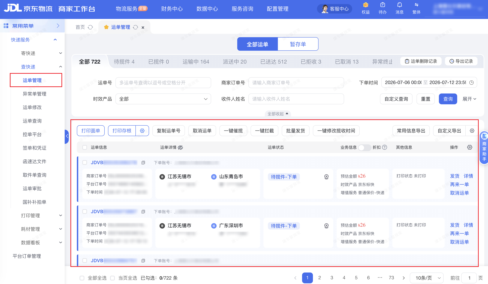

:::warning[权限说明]
访问「运单管理」须已开通**物流商家权限**。若账号未开通，页面会提示无权限，连接器将返回不可重试错误。请联系主账号在京麦-店铺-子账号设置中开通物流工作台【一键授权】。
:::

| 属性             | 值                                                                   |
| ---------------- | -------------------------------------------------------------------- |
| **连接器类型**   | `RPA 连接器`                                                         |
| **连接器名称**   | `ODS_物流运单常用信息明细表(京麦RPA)`                                 |
| **连接器代码**   | `rpa.conn.jingmai.wl.express.query.waybill`                          |
| **操作类型**     | `页面解析` + `文件导出`                                              |
| **目标网页**     | `https://wl.jdl.com/express-query/waybill`                           |
| **适用场景**     | 在京东物流工作台运单管理页，按下单时间范围导出运单常用信息明细数据   |
| **数据表名**     | `ods_rpa_jingmai_wl_express_query_waybill_du`                        |
| **业务表名**     | `ODS_物流运单常用信息明细表(京麦RPA)`                                 |

### 目标页面

> **取数路径**：京东物流工作台—快递服务—运单管理
>
> **取数链接**：[https://wl.jdl.com/express-query/waybill](https://wl.jdl.com/express-query/waybill)



### 业务入参

| 字段 | 中文释义 | 数据类型 | 必填 | 默认值 | 说明 |
| ---- | -------- | -------- | ---- | ------ | ---- |
| `date_range` | 下单时间范围 | `String` | 否 | `TODAY` | 可选值：`TODAY`（今天）、`LAST_SEVEN_DAYS`（最近七天）、`LAST_MONTH`（最近一个月）、`CUSTOM`（自定义） |
| `custom_start_date` | 自定义开始时间 | `String` | `date_range` 为 `CUSTOM` 时必填 | — | 支持格式：YYYYMMDD、YYYY-MM-DD、YYYY-MM-DD HH:mm:ss、YYYYMMDD HH:mm:ss；不含时分秒时自动补 `00:00:00`；不能早于 370 天前；非 `CUSTOM` 模式不可传入 |
| `custom_end_date` | 自定义结束时间 | `String` | `date_range` 为 `CUSTOM` 时必填 | — | 格式同 `custom_start_date`；不含时分秒时自动补 `23:59:59`；不能早于 `custom_start_date`；不能晚于当天；非 `CUSTOM` 模式不可传入 |

### 入参样例

```json
{
  "date_range": "TODAY"
}
```

```json
{
  "date_range": "LAST_SEVEN_DAYS"
}
```

```json
{
  "date_range": "CUSTOM",
  "custom_start_date": "2026-07-01 00:00:00",
  "custom_end_date": "2026-07-12 23:59:59"
}
```

### 入参校验

```json-schema collapsed
{
  "$schema": "https://json-schema.org/draft/2020-12/schema",
  "title": "京麦-运单管理常用信息导出 - 查询入参",
  "description": "在京东物流工作台运单管理页，按下单时间范围导出运单常用信息明细数据",
  "type": "object",
  "properties": {
    "date_range": {
      "type": "string",
      "description": "下单时间范围。可选值：TODAY（今天）、LAST_SEVEN_DAYS（最近七天）、LAST_MONTH（最近一个月）、CUSTOM（自定义）",
      "enum": [
        "TODAY",
        "LAST_SEVEN_DAYS",
        "LAST_MONTH",
        "CUSTOM"
      ],
      "default": "TODAY"
    },
    "custom_start_date": {
      "type": "string",
      "description": "自定义开始时间。支持格式：YYYYMMDD、YYYY-MM-DD、YYYY-MM-DD HH:mm:ss、YYYYMMDD HH:mm:ss；不含时分秒时自动补 00:00:00；不能早于 370 天前；date_range 为 CUSTOM 时必填；非 CUSTOM 模式不可传入",
      "anyOf": [
        { "pattern": "^\\d{8}$" },
        { "pattern": "^\\d{4}-\\d{2}-\\d{2}$" },
        { "pattern": "^\\d{4}-\\d{2}-\\d{2} \\d{2}:\\d{2}:\\d{2}$" },
        { "pattern": "^\\d{8} \\d{2}:\\d{2}:\\d{2}$" }
      ]
    },
    "custom_end_date": {
      "type": "string",
      "description": "自定义结束时间。支持格式：YYYYMMDD、YYYY-MM-DD、YYYY-MM-DD HH:mm:ss、YYYYMMDD HH:mm:ss；不含时分秒时自动补 23:59:59；不能早于 custom_start_date；不能晚于当天；date_range 为 CUSTOM 时必填；非 CUSTOM 模式不可传入",
      "anyOf": [
        { "pattern": "^\\d{8}$" },
        { "pattern": "^\\d{4}-\\d{2}-\\d{2}$" },
        { "pattern": "^\\d{4}-\\d{2}-\\d{2} \\d{2}:\\d{2}:\\d{2}$" },
        { "pattern": "^\\d{8} \\d{2}:\\d{2}:\\d{2}$" }
      ]
    }
  },
  "required": [],
  "if": {
    "properties": {
      "date_range": { "const": "CUSTOM" }
    }
  },
  "then": {
    "required": ["custom_start_date", "custom_end_date"]
  },
  "additionalProperties": false
}
```

### 数据字段

| 字段 | 中文释义 | 数据类型 | 可为空 | 取数路径 | 示例 |
| ---- | -------- | -------- | ------ | -------- | ---- |
| `orderNo` | 订单号 | `String` | 是 | `XLSX.0.订单号` | — |
| `waybillCode` | 运单号 | `String` | 是 | `XLSX.0.运单号` | — |
| `platformOrderId` | 平台订单号 | `String` | 是 | `XLSX.0.平台订单号` | — |
| `exchangeWaybillCode` | 换单单号 | `String` | 是 | `XLSX.0.换单单号` | — |
| `waybillStatus` | 状态 | `String` | 是 | `XLSX.0.状态` | — |
| `paymentMethod` | 付费方式 | `String` | 是 | `XLSX.0.付费方式` | — |
| `isOutOfArea` | 是否超区 | `String` | 是 | `XLSX.0.是否超区` | — |
| `outOfAreaReason` | 超区原因 | `String` | 是 | `XLSX.0.超区原因` | — |
| `pickupCode` | 取件码 | `String` | 是 | `XLSX.0.取件码` | — |
| `codAmount` | 代收货款 | `String` | 是 | `XLSX.0.代收货款` | — |
| `orderPlacer` | 下单人 | `String` | 是 | `XLSX.0.下单人` | — |
| `orderAccount` | 下单账号 | `String` | 是 | `XLSX.0.下单账号` | — |
| `orderPlacerDept` | 下单人部门 | `String` | 是 | `XLSX.0.下单人部门` | — |
| `senderName` | 寄件人 | `String` | 是 | `XLSX.0.寄件人` | — |
| `senderPhone` | 寄件人手机 | `String` | 是 | `XLSX.0.寄件人手机` | — |
| `senderAddress` | 寄件人地址 | `String` | 是 | `XLSX.0.寄件人地址` | — |
| `senderCompany` | 寄件人公司 | `String` | 是 | `XLSX.0.寄件人公司` | — |
| `receiverName` | 收件人 | `String` | 是 | `XLSX.0.收件人` | — |
| `receiverPhone` | 收件人手机 | `String` | 是 | `XLSX.0.收件人手机` | — |
| `receiverAddress` | 收件人地址 | `String` | 是 | `XLSX.0.收件人地址` | — |
| `receiverCompany` | 收件人公司 | `String` | 是 | `XLSX.0.收件人公司` | — |
| `packageCount` | 包裹数量 | `String` | 是 | `XLSX.0.包裹数量` | — |
| `remark` | 备注 | `String` | 是 | `XLSX.0.备注` | — |
| `orderTime` | 下单时间 | `String` | 是 | `XLSX.0.下单时间` | — |
| `businessType` | 业务类型 | `String` | 是 | `XLSX.0.业务类型` | — |
| `itemName` | 物品名 | `String` | 是 | `XLSX.0.物品名` | — |
| `temperatureLayer` | 温层 | `String` | 是 | `XLSX.0.温层` | — |
| `returnReceiptType` | 返单类型 | `String` | 是 | `XLSX.0.返单类型` | — |
| `isInsured` | 是否保价 | `String` | 是 | `XLSX.0.是否保价` | — |
| `insuredAmount` | 保价金额 | `String` | 是 | `XLSX.0.保价金额` | — |
| `estimatedTotalAmount` | 预估总价 | `String` | 是 | `XLSX.0.预估总价` | — |
| `estimatedDeliveryTime` | 预计送达 | `String` | 是 | `XLSX.0.预计送达` | — |
| `orderWeightKg` | 下单重量(kg) | `String` | 是 | `XLSX.0.下单重量(kg)` | — |
| `isRejected` | 是否拒收 | `String` | 是 | `XLSX.0.是否拒收` | — |
| `inspectionMethod` | 验货方式 | `String` | 是 | `XLSX.0.验货方式` | — |
| `statusUpdateTime` | 状态更新时间 | `String` | 是 | `XLSX.0.状态更新时间` | — |
| `consignmentItemCount` | 托寄物商品数量 | `String` | 是 | `XLSX.0.托寄物商品数量` | — |
| `customerBoxTypeInfo` | 客户箱型信息 | `String` | 是 | `XLSX.0.客户箱型信息` | — |
| `monthlySettlementAccount` | 月结账号 | `String` | 是 | `XLSX.0.月结账号` | — |
| `actualOrderTimeStart` | 实际筛选下单开始时间 | `String` | 否 | 页面下单时间筛选项 | `2026-07-06 00:00:00` |
| `actualOrderTimeEnd` | 实际筛选下单结束时间 | `String` | 否 | 页面下单时间筛选项 | `2026-07-12 23:59:59` |
| `bizDate` | 业务日期 | `String` | 否 | 附加 |  |
| `accountId` | 授权 ID | `String` | 否 | 附加 |  |

### 数据样例

{/* TODO: 数据样例待补充 */}

---
