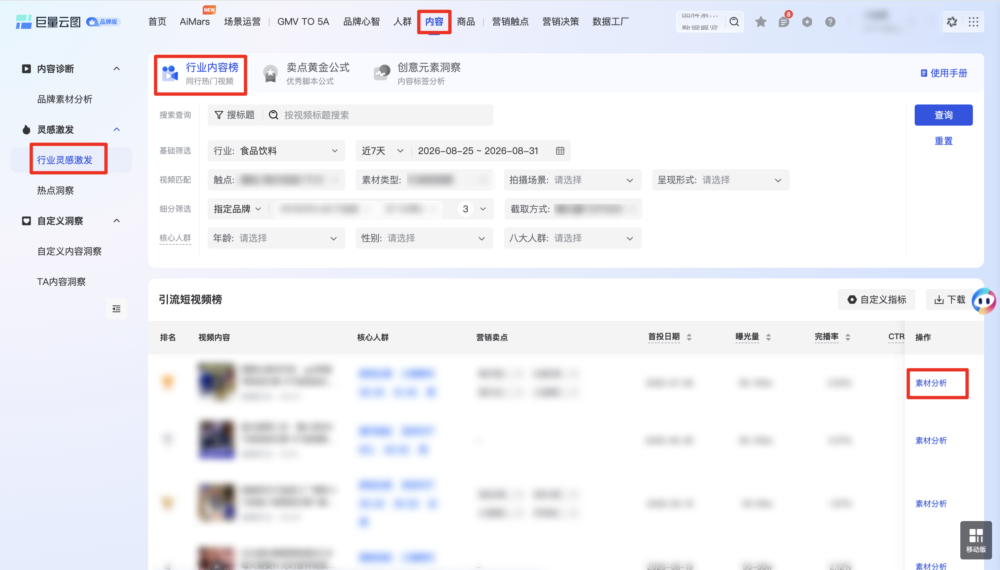
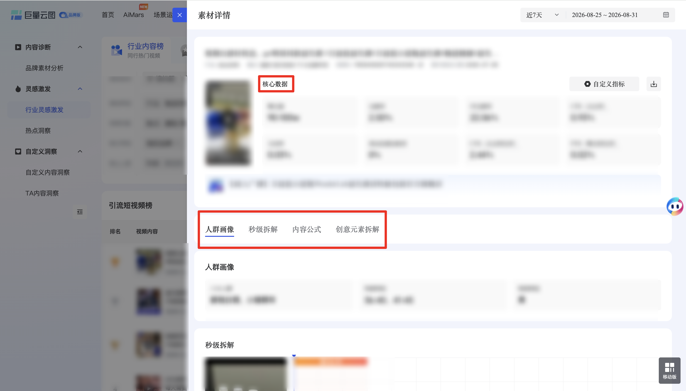

| 属性             | 值                                                                                                                                            |
| ---------------- | --------------------------------------------------------------------------------------------------------------------------------------------- |
| **连接器类型**   | `RPA 连接器`|
| **连接器名称**   | `ODS_内容行业灵感激发素材详情(巨量云图RPA)`|
| **连接器代码**   | `rpa.conn.juliang.yt.industry.content.rankings.details`|
| **操作类型**     | `页面解析`|
| **目标网页**     | `https://yuntu.oceanengine.com/yuntu_brand/ecom/content_new/creative/content_lab/inspiration/industryContent`|
| **适用场景**     | 采集巨量云图行业内容榜指定素材的核心数据、人群画像、秒级拆解、内容公式与创意元素拆解|
| **数据表名**     | `ods_rpa_juliang_yt_industry_content_rankings_details_du`|
| **业务表名**     | `ODS_内容行业灵感激发素材详情(巨量云图RPA)`|

### 目标页面

> **取数路径**：巨量云图—内容—灵感激发—行业灵感激发—行业内容榜—素材分析
>
> **取数链接**：[https://yuntu.oceanengine.com/yuntu_brand/ecom/content_new/creative/content_lab/inspiration/industryContent](https://yuntu.oceanengine.com/yuntu_brand/ecom/content_new/creative/content_lab/inspiration/industryContent)





### 业务入参

| 字段 | 中文释义 | 数据类型 | 必填 | 默认值 | 说明 |
| ---- | -------- | -------- | ---- | ------ | ---- |
| `material_id` | 素材 ID | `String` | 是 | — | 必须为纯数字 |
| `date_type` | 时间周期类型 | `String` | 是 | — | 可选值：`LAST_7_DAYS`（近7天）、`LAST_30_DAYS`（近30天）、`CUSTOM`（自定义） |
| `custom_start_date` | 自定义开始日期 | `String` | `date_type = CUSTOM` 时必填 | — | 支持格式：`YYYYMMDD`、`YYYY-MM-DD` |
| `custom_end_date` | 自定义结束日期 | `String` | `date_type = CUSTOM` 时必填 | — | 支持格式：`YYYYMMDD`、`YYYY-MM-DD`；不得早于 `custom_start_date` |

### 入参样例

**指定素材 ID + 近 7 天：**

```json
{
  "material_id": "7659409261740343346",
  "date_type": "LAST_7_DAYS"
}
```

**指定素材 ID + 近 30 天：**

```json
{
  "material_id": "7659409261740343346",
  "date_type": "LAST_30_DAYS"
}
```

**指定素材 ID + 自定义时间：**

```json
{
  "material_id": "7659409261740343346",
  "date_type": "CUSTOM",
  "custom_start_date": "2026-08-20",
  "custom_end_date": "2026-08-26"
}
```

### 入参校验

```json-schema collapsed
{
  "$schema": "https://json-schema.org/draft/2020-12/schema",
  "title": "巨量云图-行业内容榜素材详情 - 查询入参",
  "description": "采集巨量云图行业内容榜指定素材的核心数据、人群画像、秒级拆解、内容公式与创意元素拆解",
  "type": "object",
  "properties": {
    "material_id": {
      "type": "string",
      "description": "素材 ID，必须为纯数字",
      "pattern": "^\\d+$"
    },
    "date_type": {
      "type": "string",
      "description": "时间周期类型。可选值：LAST_7_DAYS（近7天）、LAST_30_DAYS（近30天）、CUSTOM（自定义）",
      "enum": ["LAST_7_DAYS", "LAST_30_DAYS", "CUSTOM"]
    },
    "custom_start_date": {
      "type": "string",
      "description": "自定义开始日期；date_type=CUSTOM 时必填。支持 YYYYMMDD 或 YYYY-MM-DD",
      "pattern": "^(\\d{8}|\\d{4}-\\d{2}-\\d{2})$"
    },
    "custom_end_date": {
      "type": "string",
      "description": "自定义结束日期；date_type=CUSTOM 时必填。支持 YYYYMMDD 或 YYYY-MM-DD；不得早于 custom_start_date",
      "pattern": "^(\\d{8}|\\d{4}-\\d{2}-\\d{2})$"
    }
  },
  "required": ["material_id", "date_type"],
  "if": {
    "properties": {
      "date_type": { "const": "CUSTOM" }
    },
    "required": ["date_type"]
  },
  "then": {
    "required": ["custom_start_date", "custom_end_date"],
    "dependentRequired": {
      "custom_start_date": ["custom_end_date"],
      "custom_end_date": ["custom_start_date"]
    }
  },
  "additionalProperties": false
}
```

### 数据字段

每次采集返回单条记录，包含视频链接与五个详情区块：`coreData`（核心数据）、`audiencePortrait`（人群画像）、`secondTrend`（秒级拆解，含点赞/流失/点击/互动/评论五类指数）、`contentFormula`（内容公式）、`creativeBreakdown`（创意元素拆解）。`bizDate` 格式为 `YYYYMMDD`。

:::field-tree
@define 关联商品
| `product_id` | 商品 ID | `String` | 否 | 页面解析 | `352****118` (已脱敏) |
| `product_name` | 商品名称 | `String` | 否 | 页面解析 | `****` (已脱敏) |
| `cate_name` | 商品类目 | `String` | 是 | 页面解析 | `营养保健/特医食品-营养膳食-菌/菇/酵素/微生物发酵` |
| `image` | 商品主图 | `String` | 是 | 页面解析 | `https://p9-aio.ecombdimg.com/****` (已脱敏) |

@define 核心数据
| `objectId` | 素材 ID | `String` | 否 | 页面解析 | `765****346` (已脱敏) |
| `vid` | 视频 vid | `String` | 是 | 页面解析 | `v02****jcg` (已脱敏) |
| `title` | 素材标题 | `String` | 是 | 页面解析 | `****` (已脱敏) |
| `showCnt` | 展示量 | `String` | 是 | 页面解析 | `90-100w` |
| `clickCnt` | 点击量 | `String` | 是 | 页面解析 | `8722` |
| `ctr` | 点击率 | `Number` | 是 | 页面解析 | `0.0093118697` |
| `ctrRank` | 点击率排名 | `String` | 是 | 页面解析 | `10%` |
| `cvr` | 转化率 | `Number` | 是 | 页面解析 | `0.0244210044` |
| `pvr` | 完播率 | `Number` | 是 | 页面解析 | `0.0002274052` |
| `cost` | 消耗 | `Number` | 是 | 页面解析 | `215103.54` |
| `costRank` | 消耗排名 | `String` | 是 | 页面解析 | `10%` |
| `playOverRate` | 完播率（播放完成） | `Number` | 是 | 页面解析 | `0.0249687939` |
| `playOverCnt` | 播放完成数 | `String` | 是 | 页面解析 | `25264` |
| `play3sCnt` | 3 秒播放数 | `String` | 是 | 页面解析 | `296298` |
| `play3sRate` | 3 秒播放率 | `Number` | 是 | 页面解析 | `0.2928358023` |
| `play5sCnt` | 5 秒播放数 | `String` | 是 | 页面解析 | `223228` |
| `play5sRate` | 5 秒播放率 | `Number` | 是 | 页面解析 | `0.2206196143` |
| `playDurationAvg` | 平均播放时长（秒） | `Number` | 是 | 页面解析 | `4.9646561057` |
| `videoDuration` | 视频时长（秒） | `Number` | 是 | 页面解析 | `41` |
| `gmv` | 成交金额 | `Number` | 是 | 页面解析 | `326715` |
| `roi` | 投产比 | `Number` | 是 | 页面解析 | `1.524630557` |
| `orderCnt` | 成交订单数 | `String` | 是 | 页面解析 | `205` |
| `convertCnt` | 转化数 | `String` | 是 | 页面解析 | `213` |
| `convertCost` | 转化成本 | `Number` | 是 | 页面解析 | `1009.8757746479` |
| `interactCnt` | 互动数 | `String` | 是 | 页面解析 | `277` |
| `interactRate` | 互动率 | `Number` | 是 | 页面解析 | `0.0002957335` |
| `likeCnt` | 点赞数 | `String` | 是 | 页面解析 | `0` |
| `likeRate` | 点赞率 | `Number` | 是 | 页面解析 | `0` |
| `commentCnt` | 评论数 | `String` | 是 | 页面解析 | `27` |
| `commentRate` | 评论率 | `Number` | 是 | 页面解析 | `0.000028826` |
| `shareCnt` | 分享数 | `String` | 是 | 页面解析 | `250` |
| `shareRate` | 分享率 | `Number` | 是 | 页面解析 | `0.0002669075` |
| `dislikeRate` | 不感兴趣率 | `Number` | 是 | 页面解析 | `0.0001686856` |
| `commentNps` | 评论 NPS | `Number` | 是 | 页面解析 | `-0.037037037` |
| `cpm` | 千次展示成本 | `Number` | 是 | 页面解析 | `229.6510130742` |
| `cpc` | 点击成本 | `Number` | 是 | 页面解析 | `24.6621806925` |
| `cpe` | 互动成本 | `Number` | 是 | 页面解析 | `776.5470758123` |
| `a3IncreaseCnt` | 新增粉丝数 | `String` | 是 | 页面解析 | `0` |
| `a3IncreaseRate` | 新增粉丝率 | `Number` | 是 | 页面解析 | `0` |
| `afterSearchCnt` | 搜索后行为数 | `String` | 是 | 页面解析 | `0` |
| `afterSearchRate` | 搜索后行为率 | `Number` | 是 | 页面解析 | `0` |
| `productWishButtonBuyCartCnt` | 心愿购/加购数 | `String` | 是 | 页面解析 | `0` |
| `productWishButtonBuyCartRate` | 心愿购/加购率 | `Number` | 是 | 页面解析 | `0` |
| `componentClickCnt` | 组件点击数 | `Number` | 是 | 页面解析 | `8722` |
| `componentClickRate` | 组件点击率 | `Number` | 是 | 页面解析 | `0.0093118697` |
| `adStarShowCnt` | 广告星图展示量 | `String` | 是 | 页面解析 | `0` |
| `naturalStarShowCnt` | 自然星图展示量 | `String` | 是 | 页面解析 | `0` |
| `adCost` | 广告消耗 | `Number` | 是 | 页面解析 | `0` |
| `starCost` | 星图消耗 | `Number` | 是 | 页面解析 | `0` |
| `adA3IncreaseCnt` | 广告新增粉丝 | `String` | 是 | 页面解析 | `0` |
| `naturalA3IncreaseCnt` | 自然新增粉丝 | `String` | 是 | 页面解析 | `0` |
| `adInteractCnt` | 广告互动数 | `String` | 是 | 页面解析 | `277` |
| `natureInteractCnt` | 自然互动数 | `String` | 是 | 页面解析 | `0` |
| `authorFansCnt` | 作者粉丝数 | `String` | 是 | 页面解析 | `0` |
| `itemPublishTime` | 内容发布时间 | `String` | 是 | 页面解析 | `20260706` |
| `materialCreateTime` | 素材创建时间 | `String` | 是 | 页面解析 | `2026-07-06 21:40:18` |
| `statusLifetime` | 投放生命周期状态 | `Number` | 是 | 页面解析 | `5` |
| `statusIdentity` | 投放身份状态 | `List` | 是 | 页面解析 | `[]` |
| `industryIdList` | 行业 ID 列表 | `List[String]` | 是 | 页面解析 | `["14"]` |
| `productInfoList` @关联商品 | 关联商品列表 | `List[Dict]` | 是 | 页面解析 | 见数据样例 |
| `highQualityMaterialEffectCost` | 优质素材效果消耗 | `Number` | 是 | 页面解析 | `0` |
| `highQualityMaterialEffectCostRate` | 优质素材效果消耗占比 | `Number` | 是 | 页面解析 | `0` |

@define 人群画像
| `eightCrowds` | 八大人群标签 | `List[String]` | 是 | 页面解析 | `["新锐白领", "小镇青年"]` |
| `ageFeatures` | 年龄区间 | `List[String]` | 是 | 页面解析 | `["36-40", "41-45"]` |
| `genderFeatures` | 性别 | `List[String]` | 是 | 页面解析 | `["男"]` |

@define 曲线点
| `x` | 时间轴位置（秒） | `Number` | 否 | 页面解析 | `0` |
| `y` | 指数值（归一化 0–1） | `Number` | 否 | 页面解析 | `0.3263157895` |

@define 高光时刻
| `start_point` | 开始位置（秒） | `String` | 否 | 页面解析 | `1` |
| `end_point` | 结束位置（秒） | `String` | 否 | 页面解析 | `2` |

@define 流失点
| `start_point` | 开始位置（秒） | `String` | 否 | 页面解析 | `0` |
| `end_point` | 结束位置（秒） | `String` | 否 | 页面解析 | `1` |
| `loss_percent` | 流失比例 | `Number` | 否 | 页面解析 | `0.3556738733` |

@define 秒级指数
| `tendList` @曲线点 | 秒级曲线点列表 | `List[Dict]` | 否 | 页面解析 | 见数据样例 |
| `highPoint` @高光时刻 | 高光时刻（高互动区间） | `Dict` | 是 | 页面解析 | 见数据样例 |
| `lossPoint` @流失点 | 流失点（最大流失区间） | `Dict` | 是 | 页面解析 | 见数据样例 |
| `itemLink` | 视频预览链接 | `String` | 是 | 页面解析 | `https://yuntu.oceanengine.com/****` (已脱敏) |
| `videoDurationType` | 视频时长类型 | `Number` | 是 | 页面解析 | `3` |
| `trendType` | 指数类型编号（1–5） | `Number` | 否 | 页面解析 | `1` |

@define 秒级拆解
| `likeIndex` @秒级指数 | 点赞指数曲线 | `Dict` | 否 | 页面解析 | 见数据样例 |
| `lossIndex` @秒级指数 | 流失指数曲线 | `Dict` | 否 | 页面解析 | 见数据样例 |
| `clickIndex` @秒级指数 | 点击指数曲线 | `Dict` | 否 | 页面解析 | 见数据样例 |
| `interactIndex` @秒级指数 | 互动指数曲线 | `Dict` | 否 | 页面解析 | 见数据样例 |
| `commentIndex` @秒级指数 | 评论指数曲线 | `Dict` | 否 | 页面解析 | 见数据样例 |

@define 内容公式标签
| `level_1_label` | 一级标签 ID | `Number` | 否 | 页面解析 | `15` |
| `level_2_labels` | 二级标签 ID 列表 | `List[Number]` | 否 | 页面解析 | `[87]` |

@define 本视频内容公式
| `labels` @内容公式标签 | 内容公式标签组合 | `List[Dict]` | 是 | 页面解析 | 见数据样例 |

@define 公式文本块
| `detail` | 标签命中明细（标签 ID → 文案列表） | `Dict` | 是 | 页面解析 | 见数据样例 |
| `text` | 文本内容 | `String` | 是 | 页面解析 | `****` (已脱敏) |

@define 内容公式
| `videoContentFormula` @本视频内容公式 | 本视频内容公式结构 | `Dict` | 是 | 页面解析 | 见数据样例 |
| `videoTitle` @公式文本块 | 视频标题及命中标签 | `Dict` | 是 | 页面解析 | 见数据样例 |
| `videoVisual` @公式文本块 | 视频画面 OCR 文本及命中标签 | `Dict` | 是 | 页面解析 | 见数据样例 |
| `videoScript` @公式文本块 | 视频口播文本及命中标签 | `Dict` | 是 | 页面解析 | 见数据样例 |

@define 创意元素拆解
| `brandImpression` | 品牌印象标签 | `List[String]` | 是 | 页面解析 | `["****"]` (已脱敏) |
| `targetAudience` | 适用人群标签 | `List[String]` | 是 | 页面解析 | `[]` |
| `userPainPoints` | 用户痛点标签 | `List[String]` | 是 | 页面解析 | `[]` |
| `productSellingPoints` | 商品卖点标签 | `List[String]` | 是 | 页面解析 | `["活菌", "益生菌配方"]` |
| `usageScenarios` | 使用场景标签 | `List[String]` | 是 | 页面解析 | `["每天使用", "出差", "旅行出门"]` |
| `marketingCampaigns` | 营销活动标签 | `List[String]` | 是 | 页面解析 | `[]` |
| `shootingScene` | 拍摄场景 | `List[String]` | 是 | 页面解析 | `["其他场景"]` |
| `presentationForm` | 呈现形式 | `List[String]` | 是 | 页面解析 | `["商品展示(有语音)"]` |

| 字段 | 中文释义 | 数据类型 | 可为空 | 取数路径 | 示例 |
| ---- | -------- | -------- | ------ | -------- | ---- |
| `dateType` | 时间周期类型 | `String` | 否 | 根据入参 `date_type` 回写 | `LAST_7_DAYS` |
| `customStartDate` | 自定义开始日期 | `String` | 是 | `date_type=CUSTOM` 时有值 | `2026-08-20` |
| `customEndDate` | 自定义结束日期 | `String` | 是 | `date_type=CUSTOM` 时有值 | `2026-08-26` |
| `materialId` | 素材 ID | `String` | 否 | 根据入参 `material_id` 回写 | `765****346` (已脱敏) |
| `videoUrl` | 视频 MP4 播放链接 | `String` | 否 | 页面解析 | `https://v6-yd.oceanengine.com/****` (已脱敏) |
| `coreData` @核心数据 | 核心数据 | `Dict` | 否 | 页面解析 | 见数据样例 |
| `audiencePortrait` @人群画像 | 人群画像 | `Dict` | 否 | 页面解析 | 见数据样例 |
| `secondTrend` @秒级拆解 | 秒级拆解五类指数 | `Dict` | 否 | 页面解析 | 见数据样例 |
| `contentFormula` @内容公式 | 内容公式 | `Dict` | 否 | 页面解析 | 见数据样例 |
| `creativeBreakdown` @创意元素拆解 | 创意元素拆解 | `Dict` | 否 | 页面解析 | 见数据样例 |
| `bizDate` | 业务日期 | `String` | 否 | 附加 | `20260903` |
| `accountId` | 授权 ID | `String` | 否 | 附加 | `1****4` (已脱敏) |
:::

### 数据样例

```json
{
  "dateType": "LAST_7_DAYS",
  "customStartDate": null,
  "customEndDate": null,
  "materialId": "765****346",
  "videoUrl": "https://v6-yd.oceanengine.com/****",
  "coreData": {
    "objectId": "765****346",
    "vid": "v02****jcg",
    "title": "****",
    "showCnt": "90-100w",
    "clickCnt": "8722",
    "ctr": 0.0093118697,
    "ctrRank": "10%",
    "cvr": 0.0244210044,
    "pvr": 0.0002274052,
    "cost": 215103.54,
    "costRank": "10%",
    "playOverRate": 0.0249687939,
    "playOverCnt": "25264",
    "play3sCnt": "296298",
    "play3sRate": 0.2928358023,
    "play5sCnt": "223228",
    "play5sRate": 0.2206196143,
    "playDurationAvg": 4.9646561057,
    "videoDuration": 41,
    "gmv": 326715,
    "roi": 1.524630557,
    "orderCnt": "205",
    "convertCnt": "213",
    "convertCost": 1009.8757746479,
    "interactCnt": "277",
    "interactRate": 0.0002957335,
    "likeCnt": "0",
    "likeRate": 0,
    "commentCnt": "27",
    "commentRate": 0.000028826,
    "shareCnt": "250",
    "shareRate": 0.0002669075,
    "dislikeRate": 0.0001686856,
    "commentNps": -0.037037037,
    "cpm": 229.6510130742,
    "cpc": 24.6621806925,
    "cpe": 776.5470758123,
    "a3IncreaseCnt": "0",
    "a3IncreaseRate": 0,
    "afterSearchCnt": "0",
    "afterSearchRate": 0,
    "productWishButtonBuyCartCnt": "0",
    "productWishButtonBuyCartRate": 0,
    "componentClickCnt": 8722,
    "componentClickRate": 0.0093118697,
    "adStarShowCnt": "0",
    "naturalStarShowCnt": "0",
    "adCost": 0,
    "starCost": 0,
    "adA3IncreaseCnt": "0",
    "naturalA3IncreaseCnt": "0",
    "adInteractCnt": "277",
    "natureInteractCnt": "0",
    "authorFansCnt": "0",
    "itemPublishTime": "20260706",
    "materialCreateTime": "2026-07-06 21:40:18",
    "statusLifetime": 5,
    "statusIdentity": [],
    "industryIdList": ["14"],
    "productInfoList": [
      {
        "product_id": "352****118",
        "product_name": "****",
        "cate_name": "营养保健/特医食品-营养膳食-菌/菇/酵素/微生物发酵",
        "image": "https://p9-aio.ecombdimg.com/****"
      }
    ],
    "highQualityMaterialEffectCost": 0,
    "highQualityMaterialEffectCostRate": 0
  },
  "audiencePortrait": {
    "eightCrowds": ["新锐白领", "小镇青年"],
    "ageFeatures": ["36-40", "41-45"],
    "genderFeatures": ["男"]
  },
  "secondTrend": {
    "likeIndex": {
      "tendList": [
        { "x": 0, "y": 0.3263157895 },
        { "x": 1, "y": 1 },
        { "x": 2, "y": 0.7157894737 },
        { "x": 3, "y": 0.3894736842 }
      ],
      "highPoint": { "start_point": "1", "end_point": "2" },
      "lossPoint": { "start_point": "0", "end_point": "1", "loss_percent": 0.3556738733 },
      "itemLink": "https://yuntu.oceanengine.com/****",
      "videoDurationType": 3,
      "trendType": 1
    },
    "lossIndex": {
      "tendList": [
        { "x": 0, "y": 1 },
        { "x": 1, "y": 0.6880911819 },
        { "x": 2, "y": 0.2267719075 },
        { "x": 3, "y": 0.1345718961 }
      ],
      "highPoint": null,
      "lossPoint": { "start_point": "0", "end_point": "1", "loss_percent": 0.3556738733 },
      "itemLink": "https://yuntu.oceanengine.com/****",
      "videoDurationType": 3,
      "trendType": 2
    },
    "clickIndex": {
      "tendList": [
        { "x": 0, "y": 0.4217791411 },
        { "x": 1, "y": 0.9325153374 },
        { "x": 2, "y": 0.768404908 },
        { "x": 7, "y": 1 }
      ],
      "highPoint": { "start_point": "7", "end_point": "8" },
      "lossPoint": { "start_point": "0", "end_point": "1", "loss_percent": 0.3556738733 },
      "itemLink": "https://yuntu.oceanengine.com/****",
      "videoDurationType": 3,
      "trendType": 3
    },
    "interactIndex": {
      "tendList": [
        { "x": 0, "y": 0.3265306122 },
        { "x": 1, "y": 1 },
        { "x": 2, "y": 0.7959183673 },
        { "x": 3, "y": 0.5204081633 }
      ],
      "highPoint": { "start_point": "1", "end_point": "2" },
      "lossPoint": { "start_point": "0", "end_point": "1", "loss_percent": 0.3556738733 },
      "itemLink": "https://yuntu.oceanengine.com/****",
      "videoDurationType": 3,
      "trendType": 4
    },
    "commentIndex": {
      "tendList": [
        { "x": 0, "y": 0 },
        { "x": 1, "y": 0 },
        { "x": 2, "y": 1 },
        { "x": 3, "y": 0.3333333333 }
      ],
      "highPoint": { "start_point": "2", "end_point": "3" },
      "lossPoint": { "start_point": "0", "end_point": "1", "loss_percent": 0.3556738733 },
      "itemLink": "https://yuntu.oceanengine.com/****",
      "videoDurationType": 3,
      "trendType": 5
    }
  },
  "contentFormula": {
    "videoContentFormula": {
      "labels": [
        { "level_1_label": 15, "level_2_labels": [87] },
        { "level_1_label": 10, "level_2_labels": [40] },
        { "level_1_label": 9, "level_2_labels": [42, 34] }
      ]
    },
    "videoTitle": {
      "detail": { "40": ["****"], "42": ["益生菌"] },
      "text": "****"
    },
    "videoVisual": {
      "detail": {
        "34": ["补充优质活菌"],
        "40": ["****"],
        "42": ["活菌", "益生菌", "400亿超活能量菌", "优质活菌"],
        "87": ["每天"]
      },
      "text": "****"
    },
    "videoScript": {
      "detail": {
        "34": ["补充优质活菌"],
        "40": ["****"],
        "42": ["活菌", "益生菌", "优质活菌"],
        "87": ["每天"]
      },
      "text": "****"
    }
  },
  "creativeBreakdown": {
    "brandImpression": ["****"],
    "targetAudience": [],
    "userPainPoints": [],
    "productSellingPoints": ["活菌", "益生菌配方", "有活菌", "高含量活菌", "活性益生菌"],
    "usageScenarios": ["每天使用", "出差", "旅行出门"],
    "marketingCampaigns": [],
    "shootingScene": ["其他场景"],
    "presentationForm": ["商品展示(有语音)"]
  },
  "bizDate": "20260903",
  "accountId": "1****4"
}
```

---
