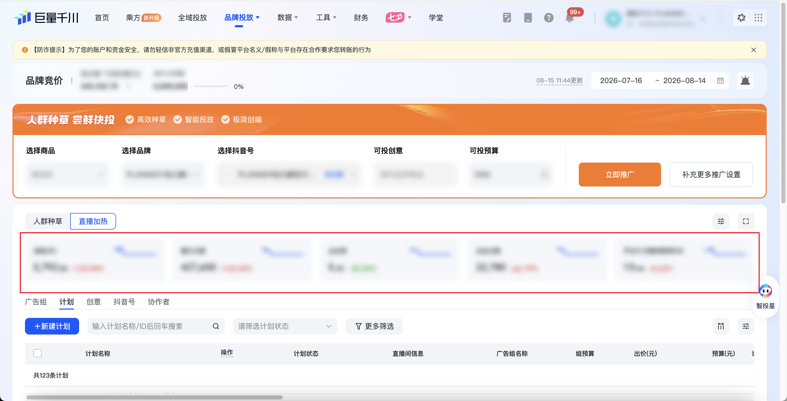

| 属性             | 值                                                                                       |
| ---------------- | ---------------------------------------------------------------------------------------- |
| **连接器类型**   | `RPA 连接器`|
| **连接器名称**   | `ODS_千川品牌投放直播加热汇总(巨量千川RPA)`|
| **连接器代码**   | `rpa.conn.juliang.qc.brand.placement.live.heat`|
| **操作类型**     | `页面解析`|
| **目标网页**     | `https://qianchuan.jinritemai.com/brand_bid/promotion/standard`|
| **适用场景**     | 采集巨量千川品牌投放「直播加热」页的计划总数与消耗、展示、点击、成交等汇总指标|
| **数据表名**     | `ods_rpa_juliang_qc_brand_placement_live_heat_du`|
| **业务表名**     | `ODS_千川品牌投放直播加热汇总(巨量千川RPA)`|

### 目标页面

> **取数路径**：巨量千川—品牌投放—直播加热
>
> **取数链接**：[https://qianchuan.jinritemai.com/brand_bid/promotion/standard](https://qianchuan.jinritemai.com/brand_bid/promotion/standard)



### 业务入参

| 字段 | 中文释义 | 数据类型 | 必填 | 默认值 | 说明 |
| ---- | -------- | -------- | ---- | ------ | ---- |
| `date_range_type` | 统计周期类型 | `String` | 是 | — | 可选值：`TODAY`（今天）、`YESTERDAY`（昨天）、`LAST_3_DAYS`（最近3天）、`LAST_7_DAYS`（最近7天）、`LAST_15_DAYS`（最近15天）、`LAST_30_DAYS`（最近30天）、`LAST_WEEK`（上周）、`THIS_MONTH`（本月）、`LAST_MONTH`（上月）、`CUSTOM`（自定义） |
| `custom_start_date` | 自定义开始日期 | `String` | 条件必填 | — | `date_range_type=CUSTOM` 时必填；支持格式：`YYYYMMDD`、`YYYY-MM-DD`；不能晚于 `custom_end_date`；含首尾跨度最长 183 天 |
| `custom_end_date` | 自定义结束日期 | `String` | 条件必填 | — | `date_range_type=CUSTOM` 时必填；支持格式：`YYYYMMDD`、`YYYY-MM-DD`；不能早于 `custom_start_date`；含首尾跨度最长 183 天 |

### 入参样例

快捷周期：

```json
{
  "date_range_type": "LAST_30_DAYS"
}
```

自定义日期（`YYYYMMDD`）：

```json
{
  "date_range_type": "CUSTOM",
  "custom_start_date": "20260801",
  "custom_end_date": "20260807"
}
```

自定义日期（`YYYY-MM-DD`）：

```json
{
  "date_range_type": "CUSTOM",
  "custom_start_date": "2026-08-01",
  "custom_end_date": "2026-08-07"
}
```

### 入参校验

```json-schema collapsed
{
  "$schema": "https://json-schema.org/draft/2020-12/schema",
  "title": "巨量千川-品牌投放直播加热汇总 - 查询入参",
  "description": "采集巨量千川品牌投放「直播加热」页的计划总数与消耗、展示、点击、成交等汇总指标",
  "type": "object",
  "properties": {
    "date_range_type": {
      "type": "string",
      "description": "统计周期类型。可选值：TODAY（今天）、YESTERDAY（昨天）、LAST_3_DAYS（最近3天）、LAST_7_DAYS（最近7天）、LAST_15_DAYS（最近15天）、LAST_30_DAYS（最近30天）、LAST_WEEK（上周）、THIS_MONTH（本月）、LAST_MONTH（上月）、CUSTOM（自定义）",
      "enum": [
        "TODAY",
        "YESTERDAY",
        "LAST_3_DAYS",
        "LAST_7_DAYS",
        "LAST_15_DAYS",
        "LAST_30_DAYS",
        "LAST_WEEK",
        "THIS_MONTH",
        "LAST_MONTH",
        "CUSTOM"
      ]
    },
    "custom_start_date": {
      "type": "string",
      "description": "自定义开始日期；date_range_type=CUSTOM 时必填。支持 YYYYMMDD 或 YYYY-MM-DD；不能晚于 custom_end_date；含首尾跨度最长 183 天",
      "pattern": "^(\\d{8}|\\d{4}-\\d{2}-\\d{2})$"
    },
    "custom_end_date": {
      "type": "string",
      "description": "自定义结束日期；date_range_type=CUSTOM 时必填。支持 YYYYMMDD 或 YYYY-MM-DD；不能早于 custom_start_date；含首尾跨度最长 183 天",
      "pattern": "^(\\d{8}|\\d{4}-\\d{2}-\\d{2})$"
    }
  },
  "required": ["date_range_type"],
  "allOf": [
    {
      "if": {
        "properties": {
          "date_range_type": { "const": "CUSTOM" }
        },
        "required": ["date_range_type"]
      },
      "then": {
        "required": ["custom_start_date", "custom_end_date"]
      }
    }
  ],
  "additionalProperties": false
}
```

### 数据字段

每次运行返回 1 行汇总记录。`totalMetrics` 为嵌套对象，指标不拆平。`bizDate` 格式为 `YYYYMMDD`。

:::field-tree
@define 指标项
| `value` | 指标数值 | `Number` | 否 | 页面解析 | `5792` |
| `controlType` | 控件类型 | `Number` | 否 | 页面解析 | `1` |
| `valueStr` | 指标展示文案 | `String` | 是 | 页面解析 | `5,792.00` |

@define 汇总指标
| `statCost` @指标项 | 消耗 | `Dict` | 否 | 页面解析 | 见数据样例 |
| `showCnt` @指标项 | 展示次数 | `Dict` | 否 | 页面解析 | 见数据样例 |
| `clickCnt` @指标项 | 点击次数 | `Dict` | 否 | 页面解析 | 见数据样例 |
| `ctr` @指标项 | 点击率 | `Dict` | 否 | 页面解析 | 见数据样例 |
| `cpmPlatform` @指标项 | 平均千次展现费用 | `Dict` | 否 | 页面解析 | 见数据样例 |
| `payOrderCount` @指标项 | 成交订单数 | `Dict` | 否 | 页面解析 | 见数据样例 |
| `payOrderAmount` @指标项 | 成交金额 | `Dict` | 否 | 页面解析 | 见数据样例 |
| `prepayAndPayOrderRoi` @指标项 | 成交 ROI | `Dict` | 否 | 页面解析 | 见数据样例 |
| `allOrderPayCount7Days` @指标项 | 7 日总成交订单数 | `Dict` | 否 | 页面解析 | 见数据样例 |
| `allOrderPayGmv7Days` @指标项 | 7 日总成交金额 | `Dict` | 否 | 页面解析 | 见数据样例 |
| `allOrderPrepayAndPayRoi7Days` @指标项 | 7 日总成交 ROI | `Dict` | 否 | 页面解析 | 见数据样例 |
| `qianchuanFirstOrderCnt` @指标项 | 新增成交订单数 | `Dict` | 否 | 页面解析 | 见数据样例 |
| `qianchuanFirstOrderRoi30` @指标项 | 新增成交订单 30 日 ROI | `Dict` | 否 | 页面解析 | 见数据样例 |
| `qianchuanFirstOrderDirectPayOrderRoi` @指标项 | 新增成交订单直接成交 ROI | `Dict` | 否 | 页面解析 | 见数据样例 |

@define 汇总指标对象
| `metrics` @汇总指标 | 指标集合 | `Dict` | 否 | 页面解析 | 见数据样例 |

| 字段 | 中文释义 | 数据类型 | 可为空 | 取数路径 | 示例 |
| ---- | -------- | -------- | ------ | -------- | ---- |
| `totalNum` | 计划总数 | `String` | 否 | 页面解析 | `123` |
| `totalMetrics` @汇总指标对象 | 汇总指标 | `Dict` | 否 | 页面解析 | 见数据样例 |
| `startDate` | 统计开始日期 | `String` | 否 | url解析 | `2026-07-16` |
| `endDate` | 统计结束日期 | `String` | 否 | url解析 | `2026-08-14` |
| `dateRangeType` | 统计周期类型 | `String` | 否 | 入参回写 | `LAST_30_DAYS` |
| `bizDate` | 业务日期 | `String` | 否 | 附加 | `20260815` |
| `accountId` | 授权 ID | `String` | 否 | 附加 | `1****6` (已脱敏) |
:::

### 数据样例

```json
[
  {
    "totalNum": "123",
    "totalMetrics": {
      "metrics": {
        "qianchuanFirstOrderCnt": {
          "value": 12,
          "controlType": 1,
          "valueStr": "12"
        },
        "qianchuanFirstOrderDirectPayOrderRoi": {
          "value": 0.16,
          "controlType": 1,
          "valueStr": "0.16"
        },
        "cpmPlatform": {
          "value": 13.54,
          "controlType": 1,
          "valueStr": "13.54"
        },
        "allOrderPayCount7Days": {
          "value": 17,
          "controlType": 1,
          "valueStr": "17"
        },
        "payOrderAmount": {
          "value": 1401,
          "controlType": 1,
          "valueStr": "1,401.00"
        },
        "prepayAndPayOrderRoi": {
          "value": 0.24,
          "controlType": 1,
          "valueStr": "0.24"
        },
        "statCost": {
          "value": 5792,
          "controlType": 1,
          "valueStr": "5,792.00"
        },
        "showCnt": {
          "value": 427650,
          "controlType": 1,
          "valueStr": "427,650"
        },
        "clickCnt": {
          "value": 22780,
          "controlType": 1,
          "valueStr": "22,780"
        },
        "allOrderPrepayAndPayRoi7Days": {
          "value": 0.24,
          "controlType": 1,
          "valueStr": "0.24"
        },
        "ctr": {
          "value": 5.33,
          "controlType": 1,
          "valueStr": "5.33%"
        },
        "payOrderCount": {
          "value": 17,
          "controlType": 1,
          "valueStr": "17"
        },
        "allOrderPayGmv7Days": {
          "value": 1401,
          "controlType": 1,
          "valueStr": "1,401.00"
        },
        "qianchuanFirstOrderRoi30": {
          "value": 0.16,
          "controlType": 1,
          "valueStr": "0.16"
        }
      }
    },
    "bizDate": "20260815",
    "accountId": "1****6",
    "startDate": "2026-07-16",
    "endDate": "2026-08-14",
    "dateRangeType": "LAST_30_DAYS"
  }
]
```

---
