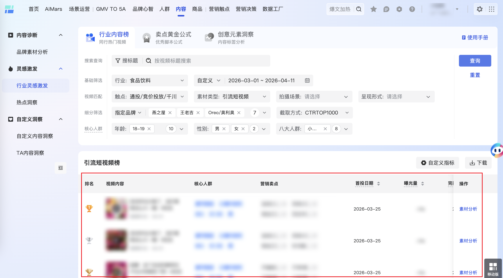

| 属性             | 值                                                                                                                                       |
| ---------------- | ---------------------------------------------------------------------------------------------------------------------------------------- |
| **连接器类型**   | `RPA 连接器`|
| **连接器名称**   | `ODS_云图行业内容榜视频列表(巨量云图RPA)`|
| **连接器代码**   | `rpa.conn.juliang.yt.industry.content.rankings.list`|
| **操作类型**     | `页面解析`|
| **目标网页**     | `https://yuntu.oceanengine.com/yuntu_brand/ecom/content_new/creative/content_lab/inspiration/industryContent`|
| **适用场景**     | 采集巨量云图行业灵感页行业内容榜视频列表，支持按行业、时间、品牌范围、截取方式及年龄/性别/八大人群筛选，返回榜内素材详情及页面实际筛选项|
| **数据表名**     | `ods_rpa_juliang_yt_industry_content_rankings_list_du`|
| **业务表名**     | `ODS_云图行业内容榜视频列表(巨量云图RPA)`|

### 目标页面

> **取数路径**：巨量云图—内容—创意内容实验室—行业灵感—行业内容榜
>
> **取数链接**：[https://yuntu.oceanengine.com/yuntu_brand/ecom/content_new/creative/content_lab/inspiration/industryContent](https://yuntu.oceanengine.com/yuntu_brand/ecom/content_new/creative/content_lab/inspiration/industryContent)



### 业务入参

| 字段 | 中文释义 | 数据类型 | 必填 | 默认值 | 说明 |
| ---- | -------- | -------- | ---- | ------ | ---- |
| `industry` | 行业 | `String` | 否 | — | 行业搜索关键词；未传则沿用页面当前选中行业 |
| `time_range_type` | 时间快捷类型 | `String` | 否 | — | 可选值：`LAST_7_DAYS`（近7天）、`LAST_30_DAYS`（近30天）、`CUSTOM`（自定义）；未传则沿用页面当前选中值 |
| `custom_start_date` | 自定义开始日期 | `String` | `time_range_type = CUSTOM` 时必填 | — | 支持格式：`YYYYMMDD`、`YYYY-MM-DD`；不得早于一年前再往前推 4 天（如 today=2026-07-03 则最早 2025-06-29） |
| `custom_end_date` | 自定义结束日期 | `String` | `time_range_type = CUSTOM` 时必填 | — | 支持格式：`YYYYMMDD`、`YYYY-MM-DD`；不得晚于 today-4 天（如 today=2026-07-03 则最晚 2026-06-29）；与 `custom_start_date` 相差不得超过 44 天 |
| `ages` | 年龄 | `String / List[String]` | 否 | — | 多选，英文逗号分隔或 JSON 数组；可选值：`AGE_18_19`（18-19）、`AGE_20_23`（20-23）、`AGE_24_30`（24-30）、`AGE_31_35`（31-35）、`AGE_36_40`（36-40）、`AGE_41_45`（41-45）、`AGE_46_50`（46-50）、`AGE_51_55`（51-55）、`AGE_56_59`（56-59）、`AGE_60_PLUS`（60+） |
| `genders` | 性别 | `String / List[String]` | 否 | — | 多选，英文逗号分隔或 JSON 数组；可选值：`MALE`（男）、`FEMALE`（女） |
| `crowd_groups` | 八大人群 | `String / List[String]` | 否 | — | 多选，英文逗号分隔或 JSON 数组；可选值：`TOWN_YOUTH`（小镇青年）、`GENZ`（genz）、`SENIOR_MIDDLE`（资深中产）、`REFINED_MOM`（精致妈妈）、`NEW_WHITE_COLLAR`（新锐白领）、`URBAN_SILVER`（都市银发）、`TOWN_MIDDLE_ELDER`（小镇中老年）、`URBAN_BLUE_COLLAR`（都市蓝领） |
| `brand_scope_type` | 品牌范围 | `String` | 否 | — | 可选值：`ALL_INDUSTRY`（全行业）、`SPECIFIED_BRANDS`（指定品牌）；部分行业无此筛选项（如手机）；传 `brands` 时本字段必填且须为 `SPECIFIED_BRANDS` |
| `brands` | 指定品牌 | `String / List[String]` | 传 `brands` 时 `brand_scope_type` 必填且为 `SPECIFIED_BRANDS` | — | 品牌搜索关键词，多选 3-10 个，英文逗号分隔或 JSON 数组；搜索有结果则选列表第一项，无结果则跳过；选完后页面实际 tag 数须仍为 3-10 个 |
| `ranking_limit_type` | 截取方式 | `String` | 否 | — | 可选值：`EXPOSURE_TOP1000`（曝光量TOP1000）、`CTR_TOP1000`（CTRTOP1000）、`INTERACTION_RATE_TOP1000`（互动率TOP1000）、`COMPLETION_RATE_TOP1000`（完播率TOP1000） |

### 入参样例

**沿用页面当前筛选项（不传任何入参）：**

```json
{}
```

**指定行业 + 近 7 天：**

```json
{
  "industry": "食品饮料",
  "time_range_type": "LAST_7_DAYS"
}
```

**近 30 天 + 全行业 + 曝光量 TOP1000：**

```json
{
  "industry": "手机",
  "time_range_type": "LAST_30_DAYS",
  "brand_scope_type": "ALL_INDUSTRY",
  "ranking_limit_type": "EXPOSURE_TOP1000"
}
```

**自定义时间 + 指定品牌 + 截取方式 + 人群筛选（完整场景）：**

```json
{
  "industry": "食品饮料",
  "time_range_type": "CUSTOM",
  "custom_start_date": "2026-03-01",
  "custom_end_date": "2026-04-11",
  "brand_scope_type": "SPECIFIED_BRANDS",
  "brands": ["燕之屋", "王老吉", "Oreo/奥利奥", "鲁花", "洋河", "香飘飘", "ChaCheer/洽洽"],
  "ranking_limit_type": "CTR_TOP1000",
  "crowd_groups": ["TOWN_YOUTH", "GENZ", "SENIOR_MIDDLE", "REFINED_MOM", "NEW_WHITE_COLLAR", "URBAN_SILVER", "TOWN_MIDDLE_ELDER", "URBAN_BLUE_COLLAR"]
}
```

**年龄 / 性别 / 八大人群（英文逗号分隔字符串）：**

```json
{
  "industry": "食品饮料",
  "time_range_type": "LAST_7_DAYS",
  "ages": "AGE_24_30,AGE_31_35,AGE_36_40",
  "genders": "FEMALE",
  "crowd_groups": "REFINED_MOM,NEW_WHITE_COLLAR,URBAN_SILVER",
  "ranking_limit_type": "INTERACTION_RATE_TOP1000"
}
```

**指定品牌 + 逗号分隔 brands（须同时传 brand_scope_type）：**

```json
{
  "industry": "食品饮料",
  "time_range_type": "LAST_7_DAYS",
  "brand_scope_type": "SPECIFIED_BRANDS",
  "brands": "燕之屋,王老吉,Oreo/奥利奥,鲁花,洋河,香飘飘,ChaCheer/洽洽"
}
```

**完播率 TOP1000 + 自定义日期（YYYYMMDD 格式）：**

```json
{
  "industry": "美妆",
  "time_range_type": "CUSTOM",
  "custom_start_date": "20260501",
  "custom_end_date": "20260615",
  "brand_scope_type": "SPECIFIED_BRANDS",
  "brands": ["兰蔻", "雅诗兰黛", "欧莱雅", "SK-II", "资生堂"],
  "ranking_limit_type": "COMPLETION_RATE_TOP1000",
  "ages": ["AGE_24_30", "AGE_31_35"],
  "genders": ["FEMALE"]
}
```

### 入参校验

```json-schema collapsed
{
  "$schema": "https://json-schema.org/draft/2020-12/schema",
  "title": "巨量云图-行业内容榜列表 - 查询入参",
  "description": "采集巨量云图行业灵感页行业内容榜视频列表，支持按行业、时间、品牌范围、截取方式及年龄/性别/八大人群筛选，返回榜内素材详情及页面实际筛选项",
  "type": "object",
  "properties": {
    "industry": {
      "type": "string",
      "description": "行业搜索关键词；未传则沿用页面当前选中行业"
    },
    "time_range_type": {
      "type": "string",
      "description": "时间快捷类型。可选值：LAST_7_DAYS（近7天）、LAST_30_DAYS（近30天）、CUSTOM（自定义）",
      "enum": ["LAST_7_DAYS", "LAST_30_DAYS", "CUSTOM"]
    },
    "custom_start_date": {
      "type": "string",
      "description": "自定义开始日期；time_range_type=CUSTOM 时必填。支持 YYYYMMDD 或 YYYY-MM-DD；不得早于一年前再往前推 4 天"
    },
    "custom_end_date": {
      "type": "string",
      "description": "自定义结束日期；time_range_type=CUSTOM 时必填。支持 YYYYMMDD 或 YYYY-MM-DD；不得晚于 today-4 天；与 custom_start_date 相差不得超过 44 天"
    },
    "ages": {
      "description": "年龄多选，英文逗号分隔字符串或字符串数组",
      "oneOf": [
        {
          "type": "string",
          "description": "英文逗号分隔的年龄 code"
        },
        {
          "type": "array",
          "items": {
            "type": "string",
            "enum": [
              "AGE_18_19",
              "AGE_20_23",
              "AGE_24_30",
              "AGE_31_35",
              "AGE_36_40",
              "AGE_41_45",
              "AGE_46_50",
              "AGE_51_55",
              "AGE_56_59",
              "AGE_60_PLUS"
            ]
          },
          "uniqueItems": true
        }
      ]
    },
    "genders": {
      "description": "性别多选，英文逗号分隔字符串或字符串数组",
      "oneOf": [
        {
          "type": "string",
          "description": "英文逗号分隔的性别 code"
        },
        {
          "type": "array",
          "items": {
            "type": "string",
            "enum": ["MALE", "FEMALE"]
          },
          "uniqueItems": true
        }
      ]
    },
    "crowd_groups": {
      "description": "八大人群多选，英文逗号分隔字符串或字符串数组",
      "oneOf": [
        {
          "type": "string",
          "description": "英文逗号分隔的人群 code"
        },
        {
          "type": "array",
          "items": {
            "type": "string",
            "enum": [
              "TOWN_YOUTH",
              "GENZ",
              "SENIOR_MIDDLE",
              "REFINED_MOM",
              "NEW_WHITE_COLLAR",
              "URBAN_SILVER",
              "TOWN_MIDDLE_ELDER",
              "URBAN_BLUE_COLLAR"
            ]
          },
          "uniqueItems": true
        }
      ]
    },
    "brand_scope_type": {
      "type": "string",
      "description": "品牌范围。可选值：ALL_INDUSTRY（全行业）、SPECIFIED_BRANDS（指定品牌）",
      "enum": ["ALL_INDUSTRY", "SPECIFIED_BRANDS"]
    },
    "brands": {
      "description": "指定品牌搜索关键词，3~10 个；英文逗号分隔字符串或字符串数组",
      "oneOf": [
        {
          "type": "string",
          "description": "英文逗号分隔的品牌关键词"
        },
        {
          "type": "array",
          "items": { "type": "string", "minLength": 1 },
          "minItems": 3,
          "maxItems": 10,
          "uniqueItems": true
        }
      ]
    },
    "ranking_limit_type": {
      "type": "string",
      "description": "截取方式。可选值：EXPOSURE_TOP1000（曝光量TOP1000）、CTR_TOP1000（CTRTOP1000）、INTERACTION_RATE_TOP1000（互动率TOP1000）、COMPLETION_RATE_TOP1000（完播率TOP1000）",
      "enum": [
        "EXPOSURE_TOP1000",
        "CTR_TOP1000",
        "INTERACTION_RATE_TOP1000",
        "COMPLETION_RATE_TOP1000"
      ]
    }
  },
  "required": [],
  "allOf": [
    {
      "if": {
        "properties": {
          "time_range_type": { "const": "CUSTOM" }
        },
        "required": ["time_range_type"]
      },
      "then": {
        "required": ["custom_start_date", "custom_end_date"],
        "dependentRequired": {
          "custom_start_date": ["custom_end_date"],
          "custom_end_date": ["custom_start_date"]
        }
      }
    },
    {
      "if": {
        "properties": {
          "brand_scope_type": { "const": "SPECIFIED_BRANDS" }
        },
        "required": ["brand_scope_type"]
      },
      "then": {
        "required": ["brands"]
      }
    },
    {
      "if": {
        "required": ["brands"]
      },
      "then": {
        "required": ["brand_scope_type"],
        "properties": {
          "brand_scope_type": { "const": "SPECIFIED_BRANDS" }
        }
      }
    }
  ],
  "additionalProperties": false
}
```

### 数据字段

输出为 `List[Dict]`，每条记录对应榜内一条视频素材。`page_*` 字段为查询前从页面读取的实际筛选项；非自定义时间范围时不输出 `page_custom_date_range`。`bizDate` 格式为 `YYYYMMDD`。

:::field-tree
@define 视频指标
| `ctr` | 点击率 | `Number` | 是 | `object_index.ctr` | `0.664652568` |
| `show_cnt` | 曝光量 | `String` | 是 | `object_index.show_cnt` | `1655` |
| `cvr` | 转化率 | `Number` | 是 | `object_index.cvr` | `0.1709090909` |
| `play_3s_rate` | 3秒播放率 | `Number` | 是 | `object_index.play_3s_rate` | `0.6639741519` |
| `play_5s_rate` | 5秒播放率 | `Number` | 是 | `object_index.play_5s_rate` | `0.605277329` |
| `play_over_rate` | 完播率 | `Number` | 是 | `object_index.play_over_rate` | `0.239633818` |
| `play_duration_avg` | 平均播放时长(秒) | `Number` | 是 | `object_index.play_duration_avg` | `13.752265861` |
| `interact_rate` | 互动率 | `Number` | 是 | `object_index.interact_rate` | `0` |
| `pvr` | 支付转化率 | `Number` | 是 | `object_index.pvr` | `0.1135951662` |
| `interact_cnt` | 互动量 | `String` | 是 | `object_index.interact_cnt` | `0` |
| `like_rate` | 点赞率 | `Number` | 是 | `object_index.like_rate` | `0` |
| `comment_rate` | 评论率 | `Number` | 是 | `object_index.comment_rate` | `0` |
| `share_rate` | 分享率 | `Number` | 是 | `object_index.share_rate` | `0` |
| `a3_increase_rate` | A3 人群增长率 | `Number` | 是 | `object_index.a3_increase_rate` | `0` |
| `after_search_rate` | 看后搜率 | `Number` | 是 | `object_index.after_search_rate` | `0` |
| `product_wish_button_buy_cart_rate` | 商品收藏/加购/购买率 | `Number` | 是 | `object_index.product_wish_button_buy_cart_rate` | `0` |
| `ad_star_show_cnt` | 广告星图曝光量 | `String` | 是 | `object_index.ad_star_show_cnt` | `0` |
| `natural_star_show_cnt` | 自然星图曝光量 | `String` | 是 | `object_index.natural_star_show_cnt` | `0` |
| `create_time` | 创建时间 | `String` | 是 | `object_index.create_time` | `20260325` |
| `publish_time` | 发布时间 | `String` | 是 | `object_index.publish_time` | `20260325` |
| `component_click_rate` | 组件点击率 | `Number` | 是 | `object_index.component_click_rate` | `0.664652568` |
| `ad_interact_cnt` | 广告互动量 | `String` | 是 | `object_index.ad_interact_cnt` | `0` |
| `nature_interact_cnt` | 自然互动量 | `String` | 是 | `object_index.nature_interact_cnt` | `0` |

@define 人群标签组
| `people_tag_type` | 人群标签类型 ID | `Number` | 否 | `people_tag_entry[].people_tag_type` | `4` |
| `tag_name_list` | 标签名称列表 | `List[String]` | 是 | `people_tag_entry[].tag_name_list` | 见数据样例 |

@define 素材标签组
| `material_tag_type` | 素材标签类型 ID | `Number` | 否 | `material_tag_entry[].material_tag_type` | `56` |
| `tag_name_list` | 标签名称列表 | `List[String]` | 是 | `material_tag_entry[].tag_name_list` | 见数据样例 |

@define 作者信息
| `nickname` | 昵称 | `String` | 是 | `author_info[].nickname` | — |
| `author_head_img` | 头像 URL | `String` | 是 | `author_info[].author_head_img` | — |
| `fans_cnt` | 粉丝数 | `String` | 是 | `author_info[].fans_cnt` | `0` |
| `uid` | 用户 UID | `String` | 是 | `author_info[].uid` | `0` |
| `aweme_id` | 抖音号 | `String` | 是 | `author_info[].aweme_id` | — |
| 字段 | 中文释义 | 数据类型 | 可为空 | 取数路径 | 示例 |
| ---- | -------- | -------- | ------ | -------- | ---- |
| `title` | 视频标题 | `String` | 否 | `title` | `洽洽你也太卷了，这价拿到这么大一箱！#洽洽` |
| `material_id` | 素材 ID | `String` | 否 | `material_id` | `7620993598538301494` |
| `item_id` | 视频 ID | `String` | 否 | `item_id` | `7620993598538301494` |
| `object_type` | 对象类型 | `Number` | 否 | `object_type` | `1` |
| `material_uri` | 素材 URI | `String` | 否 | `material_uri` | `v02033g10000d71jdhvog65ukoutjbo0` |
| `show_cnt` | 曝光量区间 | `String` | 否 | `show_cnt` | `<1w` |
| `video_duration` | 视频时长(秒) | `String` | 否 | `video_duration` | `31` |
| `object_index` @视频指标 | 视频指标 | `Dict` | 否 | `object_index` | 见数据样例 |
| `people_tag_entry` @人群标签组 | 人群标签 | `List[Dict]` | 是 | `people_tag_entry` | 见数据样例 |
| `material_tag_entry` @素材标签组 | 素材标签 | `List[Dict]` | 是 | `material_tag_entry` | 见数据样例 |
| `author_info` @作者信息 | 作者信息 | `List[Dict]` | 是 | `author_info` | 见数据样例 |
| `page_industry` | 页面选中行业 | `String` | 否 | 附加 | `食品饮料` |
| `page_time_range` | 页面选中时间范围 | `String` | 否 | 附加 | `自定义` |
| `page_custom_date_range` | 页面自定义日期范围 | `String` | 是 | 附加 | `2026-03-01 ~ 2026-04-11` |
| `page_brand_scope` | 页面品牌范围 | `String` | 是 | 附加 | `指定品牌` |
| `page_brands` | 页面选中品牌 | `String` | 是 | 附加 | 见数据样例 |
| `page_ranking_limit` | 页面截取方式 | `String` | 是 | 附加 | `CTRTOP1000` |
| `page_ages` | 页面选中年龄 | `String` | 是 | 附加 | `[]` |
| `page_genders` | 页面选中性别 | `String` | 是 | 附加 | `[]` |
| `page_crowd_groups` | 页面选中八大人群 | `String` | 是 | 附加 | 见数据样例 |
| `bizDate` | 业务日期 | `String` | 否 | 附加 |  |
| `accountId` | 授权 ID | `String` | 否 | 附加 |  |
:::

### 数据样例

```json
{
  "title": "洽洽你也太卷了，这价拿到这么大一箱！#洽洽",
  "material_id": "7620993598538301494",
  "item_id": "7620993598538301494",
  "object_type": 1,
  "material_uri": "v02033g10000d71jdhvog65ukoutjbo0",
  "show_cnt": "<1w",
  "video_duration": "31",
  "object_index": {
    "ctr": 0.664652568,
    "show_cnt": "1655",
    "cvr": 0.1709090909,
    "play_3s_rate": 0.6639741519,
    "play_5s_rate": 0.605277329,
    "play_over_rate": 0.239633818,
    "play_duration_avg": 13.752265861,
    "interact_rate": 0,
    "pvr": 0.1135951662,
    "interact_cnt": "0",
    "like_rate": 0,
    "comment_rate": 0,
    "share_rate": 0,
    "a3_increase_rate": 0,
    "after_search_rate": 0,
    "product_wish_button_buy_cart_rate": 0,
    "ad_star_show_cnt": "0",
    "natural_star_show_cnt": "0",
    "create_time": "20260325",
    "publish_time": "20260325",
    "component_click_rate": 0.664652568,
    "ad_interact_cnt": "0",
    "nature_interact_cnt": "0"
  },
  "people_tag_entry": [
    {
      "people_tag_type": 4,
      "tag_name_list": ["都市银发", "小镇中老年"]
    },
    {
      "people_tag_type": 5,
      "tag_name_list": []
    },
    {
      "people_tag_type": 3,
      "tag_name_list": ["60+", "51-55"]
    },
    {
      "people_tag_type": 1,
      "tag_name_list": ["男"]
    }
  ],
  "material_tag_entry": [
    {
      "material_tag_type": 56,
      "tag_name_list": ["人群_运动"]
    },
    {
      "material_tag_type": 52,
      "tag_name_list": [
        "使用感受和服务体验_负担小",
        "工艺科技_轻加工",
        "成分配方原料_巴旦木",
        "功效功能_补充脂肪",
        "成分配方原料_腰果",
        "使用感受和服务体验_颗粒饱满",
        "成分配方原料_无多余添加",
        "使用感受和服务体验_饱腹感",
        "包装_独立包装",
        "使用感受和服务体验_便携",
        "功效功能_能量补充"
      ]
    },
    {
      "material_tag_type": 58,
      "tag_name_list": ["使用场景_健身前后", "使用场景_健身", "使用场景_轻食"]
    },
    {
      "material_tag_type": 43,
      "tag_name_list": ["包邮发货"]
    },
    {
      "material_tag_type": 1,
      "tag_name_list": ["其他场景"]
    },
    {
      "material_tag_type": 2,
      "tag_name_list": ["商品展示(有语音)"]
    }
  ],
  "author_info": [
    {
      "nickname": "",
      "author_head_img": "",
      "fans_cnt": "0",
      "uid": "0",
      "aweme_id": ""
    }
  ],
  "bizDate": "20260703",
  "accountId": "118",
  "page_industry": "食品饮料",
  "page_time_range": "自定义",
  "page_custom_date_range": "2026-03-01 ~ 2026-04-11",
  "page_brand_scope": "指定品牌",
  "page_brands": "[\"燕之屋\", \"王老吉\", \"Oreo/奥利奥\", \"鲁花\", \"洋河\", \"香飘飘\", \"ChaCheer/洽洽\"]",
  "page_ranking_limit": "CTRTOP1000",
  "page_ages": "[]",
  "page_genders": "[]",
  "page_crowd_groups": "[\"小镇青年\", \"genz\", \"资深中产\", \"精致妈妈\", \"新锐白领\", \"都市银发\", \"小镇中老年\", \"都市蓝领\"]"
}
```

---
