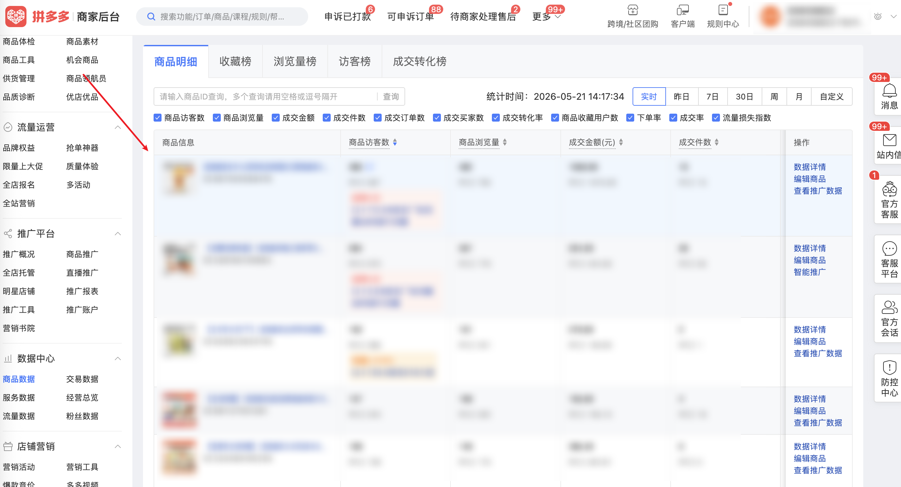

| 属性             | 值                                                                                                  |
| ---------------- | --------------------------------------------------------------------------------------------------- |
| **连接器类型**   | `RPA 连接器`                                                                                        |
| **连接器名称**   | `ODS_数据中心商品数据明细表(拼多多RPA)`                                                             |
| **连接器代码**   | `rpa.conn.pinduoduo.item.goods.data`                                                                |
| **操作类型**     | `页面解析`                                                                                          |
| **目标网页**     | `https://mms.pinduoduo.com/sycm/goods_effect?msfrom=mms_sidenav`                                    |
| **适用场景**     | 在商品数据明细页按所选统计周期采集各商品的流量、转化、成交与环比及同行等指标，列表按成交金额降序，支持翻页汇总（单任务上限 100 页） |
| **数据表名**     | `ods_rpa_pinduoduo_item_goods_data_du`                                                              |
| **业务表名**     | `ODS_数据中心商品数据明细表(拼多多RPA)`                                                             |

### 目标页面

> **取数路径**：拼多多商家后台—数据中心—商品数据—商品明细
>
> **取数链接**：[https://mms.pinduoduo.com/sycm/goods_effect?msfrom=mms_sidenav](https://mms.pinduoduo.com/sycm/goods_effect?msfrom=mms_sidenav)



### 业务入参

| 字段 | 中文释义 | 数据类型 | 必填 | 默认值 | 说明 |
| ---- | -------- | -------- | ---- | ------ | ---- |
| `date_type` | 统计周期类型 | `String` | 否 | `昨日` | 可选值：`实时` / `昨日` / `7日` / `30日` / `周` / `月` / `自定义` |
| `biz_date` | 业务日期 | `String` | 条件必填 | — | `date_type` 为 `周`、`月`、`自定义` 时必填，用于匹配自然周/月或自定义单日；支持格式：`YYYYMMDD` / `YYYY-MM-DD`；不可晚于昨天；选 `自定义` 时若日期超出平台可查范围，任务会失败并提示可选日期区间（约最近 25 天）；未传时输出中的 `bizDate` 默认取昨天（`T-1`） |

### 入参样例

默认昨日（不传 `biz_date`）：

```json
{
  "date_type": "昨日"
}
```

自定义单日（`YYYYMMDD`）：

```json
{
  "date_type": "自定义",
  "biz_date": "20260501"
}
```

按自然周（`YYYY-MM-DD`）：

```json
{
  "date_type": "周",
  "biz_date": "2026-03-26"
}
```

### 入参校验

```json-schema collapsed
{
  "$schema": "https://json-schema.org/draft/2020-12/schema",
  "title": "拼多多-数据中心-商品数据-商品明细 - 查询入参",
  "description": "在商品数据明细页按所选统计周期采集各商品的流量、转化、成交与环比及同行等指标，列表按成交金额降序，支持翻页汇总（单任务上限 100 页）",
  "type": "object",
  "properties": {
    "date_type": {
      "type": "string",
      "description": "统计周期类型；可选值：实时 / 昨日 / 7日 / 30日 / 周 / 月 / 自定义",
      "enum": [
        "实时",
        "昨日",
        "7日",
        "30日",
        "周",
        "月",
        "自定义"
      ],
      "default": "昨日"
    },
    "biz_date": {
      "type": "string",
      "description": "业务日期；date_type 为 周、月、自定义 时必填；支持 YYYYMMDD 或 YYYY-MM-DD；不可晚于昨天；自定义时约限近 25 天",
      "pattern": "^(?:\\d{8}|\\d{4}-\\d{2}-\\d{2})$"
    }
  },
  "required": [],
  "allOf": [
    {
      "if": {
        "properties": {
          "date_type": {
            "enum": [
              "周",
              "月",
              "自定义"
            ]
          }
        },
        "required": [
          "date_type"
        ]
      },
      "then": {
        "required": [
          "biz_date"
        ]
      }
    }
  ],
  "additionalProperties": false
}
```

### 数据字段

:::field-tree
@define 热门商品活动信息
| `desc` | 活动描述 | `String` | 是 | 页面解析 | `爆单啦！恭喜解锁保权重权益` |
| `showEntry` | 是否展示入口 | `Boolean` | 否 | 页面解析 | `false` |

| 字段 | 中文释义 | 数据类型 | 可为空 | 取数路径 | 示例 |
| ---- | -------- | -------- | ------ | -------- | ---- |
| `statDate` | 统计日期 | `String` | 否 | 页面解析 | `2026-04-19` |
| `goodsId` | 商品 ID | `Number` | 否 | 页面解析 | `930****830` (已脱敏) |
| `goodsName` | 商品名称 | `String` | 否 | 页面解析 | `【抖音****水果味` (已脱敏) |
| `goodsFavCnt` | 商品收藏用户数 | `String` | 否 | 页面解析 | `25` |
| `goodsUv` | 商品访客数 | `String` | 否 | 页面解析 | `525` |
| `goodsPv` | 商品浏览量 | `String` | 否 | 页面解析 | `675` |
| `payOrdrCnt` | 成交订单数 | `String` | 否 | 页面解析 | `61` |
| `goodsVcr` | 成交转化率 | `String` | 否 | 页面解析 | `11.43%` |
| `pctGoodsVcr` | 同行成交转化率 | `String` | 否 | 页面解析 | `0.00%` |
| `payOrdrGoodsQty` | 成交件数 | `String` | 否 | 页面解析 | `63` |
| `payOrdrUsrCnt` | 成交买家数 | `String` | 否 | 页面解析 | `60` |
| `payOrdrAmt` | 成交金额 | `String` | 否 | 页面解析 | `2209.58` |
| `cfmOrdrCnt` | 确认订单数 | `String` | 否 | 页面解析 | `61` |
| `cfmOrdrGoodsQty` | 确认订单件数 | `String` | 否 | 页面解析 | `63` |
| `imprUsrCnt` | 曝光用户数 | `String` | 否 | 页面解析 | `0` |
| `ordrCrtUsrCnt` | 下单用户数 | `String` | 否 | 页面解析 | `63` |
| `ordrVstrRto` | 下单率 | `String` | 否 | 页面解析 | `12.00%` |
| `payOrdrRto` | 成交率 | `String` | 否 | 页面解析 | `95.24%` |
| `goodsPtHelpRate` | 流量损失指数 | `String` | 否 | 页面解析 | `0.00%` |
| `cnsltUsrQty` | 咨询用户数 | `String` | 否 | 页面解析 | `0` |
| `goodsFavCntYtd` | 收藏用户数（昨日） | `String` | 是 | 页面解析 | `null` |
| `goodsUvYtd` | 访客数（昨日） | `String` | 是 | 页面解析 | `null` |
| `goodsPvYtd` | 浏览量（昨日） | `String` | 是 | 页面解析 | `null` |
| `payOrdrCntYtd` | 订单数（昨日） | `String` | 是 | 页面解析 | `null` |
| `goodsVcrYtd` | 转化率（昨日） | `String` | 是 | 页面解析 | `0.00%` |
| `pctGoodsVcrYtd` | 同行转化率（昨日） | `String` | 是 | 页面解析 | `0.00%` |
| `payOrdrGoodsQtyYtd` | 成交件数（昨日） | `String` | 是 | 页面解析 | `null` |
| `payOrdrUsrCntYtd` | 成交买家数（昨日） | `String` | 是 | 页面解析 | `null` |
| `payOrdrAmtYtd` | 成交金额（昨日） | `String` | 是 | 页面解析 | `null` |
| `cfmOrdrCntYtd` | 确认订单数（昨日） | `String` | 是 | 页面解析 | `null` |
| `cfmOrdrGoodsQtyYtd` | 确认订单件数（昨日） | `String` | 是 | 页面解析 | `null` |
| `imprUsrCntYtd` | 曝光用户数（昨日） | `String` | 是 | 页面解析 | `null` |
| `ordrCrtUsrCntYtd` | 下单用户数（昨日） | `String` | 是 | 页面解析 | `0` |
| `ordrVstrRtoYtd` | 下单率（昨日） | `String` | 是 | 页面解析 | `0.00%` |
| `payOrdrRtoYtd` | 成交率（昨日） | `String` | 是 | 页面解析 | `0.00%` |
| `cnsltUsrQtyYtd` | 咨询用户数（昨日） | `String` | 是 | 页面解析 | `0` |
| `goodsUvPpr` | 访客数环比 | `Number` | 否 | 页面解析 | `-0.1294` |
| `goodsPvPpr` | 浏览量环比 | `Number` | 否 | 页面解析 | `-0.1118` |
| `payOrdrCntPpr` | 订单数环比 | `Number` | 否 | 页面解析 | `0.1961` |
| `goodsVcrPpr` | 转化率环比 | `Number` | 否 | 页面解析 | `0.3783` |
| `payOrdrAmtPpr` | 成交金额环比 | `Number` | 否 | 页面解析 | `0.1786` |
| `goodsFavCntPpr` | 收藏用户数环比 | `Number` | 否 | 页面解析 | `-0.1379` |
| `payOrdrGoodsQtyPpr` | 成交件数环比 | `Number` | 否 | 页面解析 | `0.2115` |
| `payOrdrUsrCntPpr` | 成交买家数环比 | `Number` | 否 | 页面解析 | `0.2` |
| `cfmOrdrCntPpr` | 确认订单数环比 | `Number` | 否 | 页面解析 | `0.1961` |
| `cfmOrdrGoodsQtyPpr` | 确认订单件数环比 | `Number` | 否 | 页面解析 | `0.2115` |
| `cfmOrdrRtoPpr` | 确认率环比 | `Number` | 否 | 页面解析 | `0.0` |
| `imprUsrCntPpr` | 曝光用户数环比 | `Number` | 否 | 页面解析 | `0.0` |
| `ordrCrtUsrCntPpr` | 下单用户数环比 | `Number` | 否 | 页面解析 | `0.2115` |
| `ordrVstrRtoPpr` | 下单率环比 | `Number` | 否 | 页面解析 | `0.3915` |
| `payOrdrRtoPpr` | 成交率环比 | `Number` | 否 | 页面解析 | `-0.0095` |
| `goodsPtHelpRatePpr` | 流量损失指数环比 | `Number` | 否 | 页面解析 | `0.0` |
| `cnsltUsrQtyPpr` | 咨询用户数环比 | `Number` | 否 | 页面解析 | `4.5` |
| `goodsUvPprIsPercent` | 访客数环比为百分比 | `Boolean` | 否 | 页面解析 | `true` |
| `goodsPvPprIsPercent` | 浏览量环比为百分比 | `Boolean` | 否 | 页面解析 | `true` |
| `payOrdrCntPprIsPercent` | 订单数环比为百分比 | `Boolean` | 否 | 页面解析 | `true` |
| `goodsVcrPprIsPercent` | 转化率环比为百分比 | `Boolean` | 否 | 页面解析 | `true` |
| `cfmOrdrRtoPprIsPercent` | 确认率环比为百分比 | `Boolean` | 否 | 页面解析 | `true` |
| `goodsFavCntPprIsPercent` | 收藏环比为百分比 | `Boolean` | 否 | 页面解析 | `true` |
| `payOrdrGoodsQtyPprIsPercent` | 成交件数环比为百分比 | `Boolean` | 否 | 页面解析 | `true` |
| `payOrdrUsrCntPprIsPercent` | 成交买家数环比为百分比 | `Boolean` | 否 | 页面解析 | `true` |
| `payOrdrAmtPprIsPercent` | 成交金额环比为百分比 | `Boolean` | 否 | 页面解析 | `true` |
| `cfmOrdrCntPprIsPercent` | 确认订单数环比为百分比 | `Boolean` | 否 | 页面解析 | `true` |
| `cfmOrdrGoodsQtyPprIsPercent` | 确认件数环比为百分比 | `Boolean` | 否 | 页面解析 | `true` |
| `imprUsrCntPprIsPercent` | 曝光环比为百分比 | `Boolean` | 否 | 页面解析 | `true` |
| `imprUsrCntDetail` | 曝光详情标记 | `Boolean` | 否 | 页面解析 | `false` |
| `ordrCrtUsrCntPprIsPercent` | 下单用户环比为百分比 | `Boolean` | 否 | 页面解析 | `true` |
| `ordrVstrRtoPprIsPercent` | 下单率环比为百分比 | `Boolean` | 否 | 页面解析 | `true` |
| `payOrdrRtoPprIsPercent` | 成交率环比为百分比 | `Boolean` | 否 | 页面解析 | `true` |
| `goodsPtHelpRatePprIsPercent` | 流量损失环比为百分比 | `Boolean` | 否 | 页面解析 | `true` |
| `cnsltUsrQtyPprIsPercent` | 咨询用户环比为百分比 | `Boolean` | 否 | 页面解析 | `true` |
| `hdThumbUrl` | 商品缩略图 URL | `String` | 否 | 页面解析 | `https://img.pddpic.com/****` (已脱敏) |
| `cate1Id` | 一级类目 ID | `Number` | 否 | 页面解析 | `1****5` (已脱敏) |
| `cate1Name` | 一级类目名 | `String` | 否 | 页面解析 | `洗护清洁剂/卫生巾/纸/香薰` |
| `cate2Id` | 二级类目 ID | `Number` | 否 | 页面解析 | `1****6` (已脱敏) |
| `cate2Name` | 二级类目名 | `String` | 否 | 页面解析 | `口腔护理` |
| `cate3Id` | 三级类目 ID | `Number` | 否 | 页面解析 | `2****4` (已脱敏) |
| `cate3Name` | 三级类目名 | `String` | 否 | 页面解析 | `儿童牙膏` |
| `cate3PctGoodsVcr` | 三级类目同行转化率 | `String` | 否 | 页面解析 | `98.08%` |
| `cate3AvgGoodsVcr` | 三级类目平均转化率 | `String` | 否 | 页面解析 | `23.90%` |
| `goodsVcrRised` | 转化率变化方向（-1/0/1） | `Number` | 否 | 页面解析 | `-1` |
| `cate3IsPgvAbove` | 是否高于三级类目均值（1=是） | `Number` | 否 | 页面解析 | `1` |
| `isCreated1m` | 是否近一月上架（1=是） | `Number` | 否 | 页面解析 | `1` |
| `isNewstyle` | 是否新款（1=是） | `Number` | 否 | 页面解析 | `0` |
| `goodsLabel` | 商品标签 | `Number` | 否 | 页面解析 | `0.0` |
| `goodsStatus` | 商品状态（1=在售） | `Number` | 否 | 页面解析 | `1` |
| `goodsPtHelpRateRank` | 流量损失指数排名 | `Number` | 否 | 页面解析 | `0.0` |
| `adStrategy` | 广告策略 | `Dict` | 是 | 页面解析 | `null` |
| `adStrategyStatus` | 广告策略状态 | `Number` | 否 | 页面解析 | `3` |
| `adStrategyDesc` | 广告策略描述 | `String` | 否 | 页面解析 | `查看推广数据` |
| `adStrategyJumpUrl` | 广告策略跳转 URL | `String` | 否 | 页面解析 | `https://yingxiao.pinduoduo.com/****` (已脱敏) |
| `url` | 链接 | `String` | 是 | 页面解析 | `null` |
| `peerPerfPayOrdrAmt` | 同行表现-成交金额 | `Number` | 否 | 页面解析 | `4` |
| `peerPerfGoodsUv` | 同行表现-访客数 | `Number` | 否 | 页面解析 | `4` |
| `peerPerfGoodsPv` | 同行表现-浏览量 | `Number` | 否 | 页面解析 | `4` |
| `peerPerfGoodsFavCnt` | 同行表现-收藏用户数 | `Number` | 否 | 页面解析 | `2` |
| `peerPerfGoodsCvr` | 同行表现-转化率 | `Number` | 否 | 页面解析 | `1` |
| `peerPerfOrdrVstrRto` | 同行表现-下单率 | `Number` | 否 | 页面解析 | `1` |
| `peerPerfPayOrdrRto` | 同行表现-成交率 | `Number` | 否 | 页面解析 | `1` |
| `peerPerfGoodsPtHelpRate` | 同行表现-流量损失 | `Number` | 是 | 页面解析 | `null` |
| `activityInfo` | 活动信息 | `Dict` | 是 | 页面解析 | `null` |
| `showCol` | 展示列标记 | `Number` | 否 | 页面解析 | `0` |
| `hotGoodsActivityInfo` @热门商品活动信息 | 热门商品活动信息 | `Dict` | 是 | 页面解析 | 见数据样例 |
| `taskId` | 任务 ID | `String` | 否 | 附加 |  |
| `bizDate` | 业务日期 | `String` | 否 | 附加 | `20260419` |
| `accountId` | 授权 ID | `String` | 否 | 附加 | `1****4` (已脱敏) |
:::

### 数据样例

```json
[
  {
    "statDate": "2026-04-19",
    "goodsId": "930****830",
    "goodsName": "【抖音****水果味",
    "goodsFavCnt": "25",
    "goodsUv": "525",
    "goodsPv": "675",
    "payOrdrCnt": "61",
    "goodsVcr": "11.43%",
    "pctGoodsVcr": "0.00%",
    "payOrdrGoodsQty": "63",
    "payOrdrUsrCnt": "60",
    "payOrdrAmt": "2209.58",
    "cfmOrdrCnt": "61",
    "cfmOrdrGoodsQty": "63",
    "imprUsrCnt": "0",
    "ordrCrtUsrCnt": "63",
    "ordrVstrRto": "12.00%",
    "payOrdrRto": "95.24%",
    "goodsPtHelpRate": "0.00%",
    "cnsltUsrQty": "0",
    "goodsFavCntYtd": null,
    "goodsUvYtd": null,
    "goodsPvYtd": null,
    "payOrdrCntYtd": null,
    "goodsVcrYtd": "0.00%",
    "pctGoodsVcrYtd": "0.00%",
    "payOrdrGoodsQtyYtd": null,
    "payOrdrUsrCntYtd": null,
    "payOrdrAmtYtd": null,
    "cfmOrdrCntYtd": null,
    "cfmOrdrGoodsQtyYtd": null,
    "imprUsrCntYtd": null,
    "ordrCrtUsrCntYtd": "0",
    "ordrVstrRtoYtd": "0.00%",
    "payOrdrRtoYtd": "0.00%",
    "cnsltUsrQtyYtd": "0",
    "goodsUvPpr": -0.1294,
    "goodsPvPpr": -0.1118,
    "payOrdrCntPpr": 0.1961,
    "goodsVcrPpr": 0.3783,
    "payOrdrAmtPpr": 0.1786,
    "goodsFavCntPpr": -0.1379,
    "payOrdrGoodsQtyPpr": 0.2115,
    "payOrdrUsrCntPpr": 0.2,
    "cfmOrdrCntPpr": 0.1961,
    "cfmOrdrGoodsQtyPpr": 0.2115,
    "cfmOrdrRtoPpr": 0.0,
    "imprUsrCntPpr": 0.0,
    "ordrCrtUsrCntPpr": 0.2115,
    "ordrVstrRtoPpr": 0.3915,
    "payOrdrRtoPpr": -0.0095,
    "goodsPtHelpRatePpr": 0.0,
    "cnsltUsrQtyPpr": 4.5,
    "goodsUvPprIsPercent": true,
    "goodsPvPprIsPercent": true,
    "payOrdrCntPprIsPercent": true,
    "goodsVcrPprIsPercent": true,
    "cfmOrdrRtoPprIsPercent": true,
    "goodsFavCntPprIsPercent": true,
    "payOrdrGoodsQtyPprIsPercent": true,
    "payOrdrUsrCntPprIsPercent": true,
    "payOrdrAmtPprIsPercent": true,
    "cfmOrdrCntPprIsPercent": true,
    "cfmOrdrGoodsQtyPprIsPercent": true,
    "imprUsrCntPprIsPercent": true,
    "imprUsrCntDetail": false,
    "ordrCrtUsrCntPprIsPercent": true,
    "ordrVstrRtoPprIsPercent": true,
    "payOrdrRtoPprIsPercent": true,
    "goodsPtHelpRatePprIsPercent": true,
    "cnsltUsrQtyPprIsPercent": true,
    "hdThumbUrl": "https://img.pddpic.com/****",
    "cate1Id": "1****5",
    "cate1Name": "洗护清洁剂/卫生巾/纸/香薰",
    "cate2Id": "1****6",
    "cate2Name": "口腔护理",
    "cate3Id": "2****4",
    "cate3Name": "儿童牙膏",
    "cate3PctGoodsVcr": "98.08%",
    "cate3AvgGoodsVcr": "23.90%",
    "goodsVcrRised": -1,
    "cate3IsPgvAbove": 1,
    "isCreated1m": 1,
    "isNewstyle": 0,
    "goodsLabel": 0.0,
    "goodsStatus": 1,
    "goodsPtHelpRateRank": 0.0,
    "adStrategy": null,
    "adStrategyStatus": 3,
    "adStrategyDesc": "查看推广数据",
    "adStrategyJumpUrl": "https://yingxiao.pinduoduo.com/****",
    "url": null,
    "peerPerfPayOrdrAmt": 4,
    "peerPerfGoodsUv": 4,
    "peerPerfGoodsPv": 4,
    "peerPerfGoodsFavCnt": 2,
    "peerPerfGoodsCvr": 1,
    "peerPerfOrdrVstrRto": 1,
    "peerPerfPayOrdrRto": 1,
    "peerPerfGoodsPtHelpRate": null,
    "activityInfo": null,
    "showCol": 0,
    "hotGoodsActivityInfo": {
      "desc": "爆单啦！恭喜解锁保权重权益",
      "showEntry": false
    },
    "taskId": "t****1",
    "bizDate": "20260419",
    "accountId": "1****4"
  }
]
```

---
