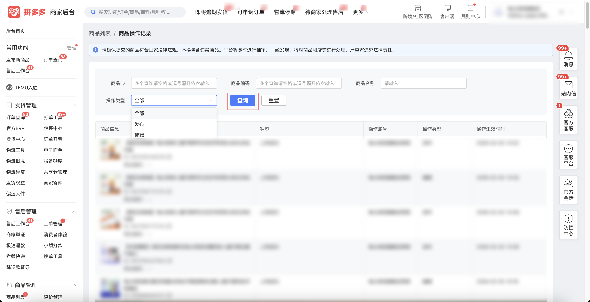

| 属性             | 值                                                                                                  |
| ---------------- | --------------------------------------------------------------------------------------------------- |
| **连接器类型**   | `RPA 连接器`                                                                                        |
| **连接器名称**   | `ODS_商品列表操作记录明细表(拼多多RPA)`                                                             |
| **连接器代码**   | `rpa.conn.pinduoduo.item.goods.success.record`                                                      |
| **操作类型**     | `页面解析`                                                                                          |
| **目标网页**     | `https://mms.pinduoduo.com/goods/goods_success_record`                                              |
| **适用场景**     | 采集拼多多商家后台商品操作记录（上传成功），支持按商品ID、商品编码、商品名称与操作类型筛选，并翻页汇总全部记录 |
| **数据表名**     | `ods_rpa_pinduoduo_item_goods_success_record_du`                                                    |
| **业务表名**     | `ODS_商品列表操作记录明细表(拼多多RPA)`                                                             |

### 目标页面

> **取数路径**：拼多多商家后台—商品列表—商品操作记录
>
> **取数链接**：[https://mms.pinduoduo.com/goods/goods_success_record](https://mms.pinduoduo.com/goods/goods_success_record)



### 业务入参

| 字段 | 中文释义 | 数据类型 | 必填 | 默认值 | 说明 |
| ---- | -------- | -------- | ---- | ------ | ---- |
| `goods_ids` | 商品 ID | `String \| List[String]` | 否 | — | 支持英文逗号分隔字符串或 JSON 数组；多个查询时用空格或逗号隔开依次输入；不传则不按商品 ID 筛选 |
| `goods_codes` | 商品编码 | `String \| List[String]` | 否 | — | 支持英文逗号分隔字符串或 JSON 数组；多个查询时用空格或逗号隔开依次输入；不传则不按商品编码筛选 |
| `goods_name` | 商品名称 | `String` | 否 | — | 商品名称关键字；不传则不按商品名称筛选 |
| `operation_type` | 操作类型 | `String` | 否 | `ALL` | 可选值：`ALL`（全部）、`PUBLISH`（发布）、`EDIT`（编辑） |

### 入参样例

不传筛选条件（采集全部上传成功记录）：

```json
{}
```

按商品 ID 与操作类型筛选：

```json
{
  "goods_ids": "977792573153,977792573154",
  "operation_type": "EDIT"
}
```

商品 ID 以数组传入：

```json
{
  "goods_ids": ["977792573153"],
  "goods_codes": ["SKU001"],
  "goods_name": "儿童牙膏",
  "operation_type": "PUBLISH"
}
```

### 入参校验

```json-schema collapsed
{
  "$schema": "https://json-schema.org/draft/2020-12/schema",
  "title": "拼多多-商品列表-商品操作记录 - 查询入参",
  "description": "采集拼多多商家后台商品操作记录（上传成功），支持按商品ID、商品编码、商品名称与操作类型筛选，并翻页汇总全部记录",
  "type": "object",
  "properties": {
    "goods_ids": {
      "description": "商品 ID，支持英文逗号分隔字符串或 JSON 数组；不传则不按商品 ID 筛选",
      "oneOf": [
        {
          "type": "string"
        },
        {
          "type": "array",
          "items": {
            "type": "string"
          }
        }
      ]
    },
    "goods_codes": {
      "description": "商品编码，支持英文逗号分隔字符串或 JSON 数组；不传则不按商品编码筛选",
      "oneOf": [
        {
          "type": "string"
        },
        {
          "type": "array",
          "items": {
            "type": "string"
          }
        }
      ]
    },
    "goods_name": {
      "type": "string",
      "description": "商品名称关键字；不传则不按商品名称筛选",
      "default": ""
    },
    "operation_type": {
      "type": "string",
      "description": "操作类型，可选全部、发布或编辑",
      "enum": ["ALL", "PUBLISH", "EDIT"],
      "default": "ALL"
    }
  },
  "required": [],
  "additionalProperties": false
}
```

### 数据字段

| 字段 | 中文释义 | 数据类型 | 可为空 | 取数路径 | 示例 |
| ---- | -------- | -------- | ------ | -------- | ---- |
| `id` | 记录 ID | `Number` | 否 | 页面解析 | `196****060` (已脱敏) |
| `goods_id` | 商品 ID | `Number` | 否 | 页面解析 | `977****153` (已脱敏) |
| `goods_sn` | 商品编码（平台） | `String` | 是 | 页面解析 | `null` |
| `out_goods_sn` | 商家商品编码 | `String` | 是 | 页面解析 | `""` |
| `mall_id` | 店铺 ID | `Number` | 否 | 页面解析 | `669****465` (已脱敏) |
| `goods_name` | 商品名称 | `String` | 否 | 页面解析 | `示例商品****` (已脱敏) |
| `check_status` | 审核状态 | `Number` | 否 | 页面解析 | `2` |
| `is_shop` | 操作类型标识（`0`=发布，`1`=编辑） | `Number` | 否 | 页面解析 | `1` |
| `updated_at` | 更新时间戳 | `Number` | 否 | 页面解析 | `1784270713` |
| `submit_time` | 提交时间戳 | `Number` | 否 | 页面解析 | `1784270705` |
| `checked_time` | 审核完成时间戳 | `Number` | 否 | 页面解析 | `1784270709` |
| `appeal_status` | 申诉状态 | `Number` | 是 | 页面解析 | `null` |
| `can_appeal` | 是否可申诉 | `Number` | 是 | 页面解析 | `null` |
| `cat_id` | 类目 ID | `Number` | 是 | 页面解析 | `1****4` (已脱敏) |
| `owner_name` | 操作账号 | `String` | 是 | 页面解析 | `示例店铺****` (已脱敏) |
| `belong_to_others` | 是否他人商品 | `Number` | 否 | 页面解析 | `0` |
| `reject_comment` | 驳回原因 | `String` | 是 | 页面解析 | `null` |
| `must_check_type` | 必审类型 | `Number` | 是 | 页面解析 | `null` |
| `is_reject_by_post_check` | 是否后置驳回 | `Number` | 否 | 页面解析 | `0` |
| `reject_comment_list` | 驳回原因列表 | `List[Dict]` | 是 | 页面解析 | `null` |
| `hd_thumb_url` | 商品缩略图 | `String` | 是 | 页面解析 | `https://img.pddpic.com/****` (已脱敏) |
| `bizDate` | 业务日期 | `String` | 否 | 附加 | `20260717` |
| `accountId` | 授权 ID | `String` | 否 | 附加 | `1****8` (已脱敏) |

### 数据样例

```json
[
  {
    "id": "196****060",
    "goods_id": "977****153",
    "goods_sn": null,
    "out_goods_sn": "",
    "mall_id": "669****465",
    "goods_name": "示例商品****",
    "check_status": 2,
    "is_shop": 1,
    "updated_at": 1784270713,
    "submit_time": 1784270705,
    "checked_time": 1784270709,
    "appeal_status": null,
    "can_appeal": null,
    "cat_id": "1****4",
    "owner_name": "示例店铺****",
    "belong_to_others": 0,
    "reject_comment": null,
    "must_check_type": null,
    "is_reject_by_post_check": 0,
    "reject_comment_list": null,
    "hd_thumb_url": "https://img.pddpic.com/****",
    "bizDate": "20260717",
    "accountId": "1****8"
  }
]
```

---
