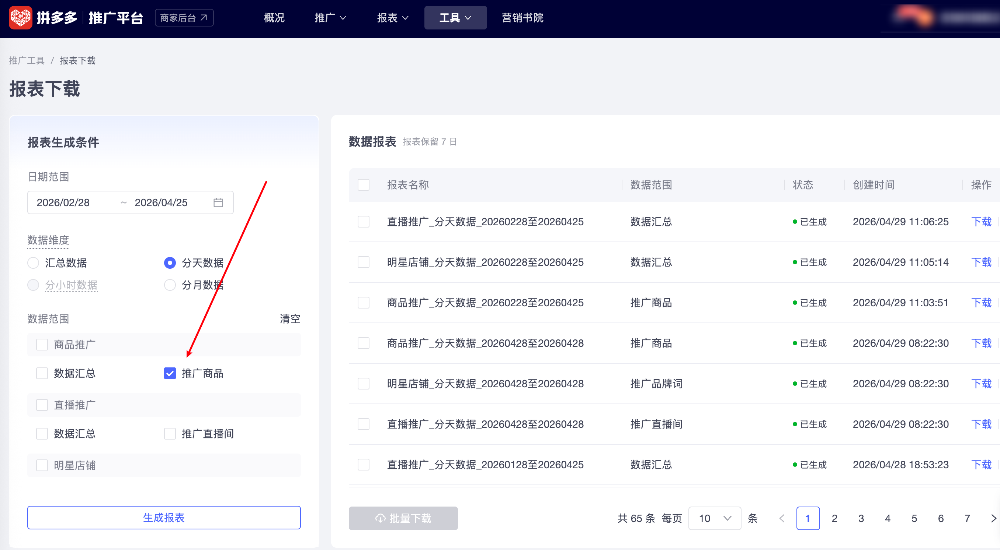

| 属性             | 值                                                                |
| ---------------- | ----------------------------------------------------------------- |
| **连接器类型**   | `RPA 连接器`|
| **连接器名称**   | `ODS_商品推广数据报表下载(拼多多RPA)`|
| **连接器代码**   | `rpa.conn.pinduoduo.promotion.goods.report.download`|
| **操作类型**     | `文件导出`|
| **目标网页**     | `https://yingxiao.pinduoduo.com/tools/report/download`|
| **适用场景**     | 从拼多多推广平台下载「商品推广-推广商品」分天数据报表，支持快捷日期与自定义日期范围|
| **数据表名**     | `ods_rpa_pinduoduo_promotion_goods_report_download_du`|
| **业务表名**     | `ODS_商品推广数据报表下载(拼多多RPA)`|

### 目标页面

> **取数路径**：拼多多推广平台—工具—报表下载
>
> **取数链接**：[https://yingxiao.pinduoduo.com/tools/report/download](https://yingxiao.pinduoduo.com/tools/report/download)



### 业务入参

| 字段 | 中文释义 | 数据类型 | 必填 | 默认值 | 说明 |
| ---- | -------- | -------- | ---- | ------ | ---- |
| `date_range` | 日期范围 | `string` | 否 | `"7d"` | 可选值：`today`(今日) / `yesterday`(昨日) / `7d`(近7日) / `30d`(近30日) / `90d`(近90日) / `custom`(自定义) |
| `custom_start_date` | 自定义开始日期 | `string` | 否 | — | 支持格式：`YYYYMMDD` / `YYYY-MM-DD`；`date_range="custom"` 时必填；须落在平台可选最近 90 天内 |
| `custom_end_date` | 自定义结束日期 | `string` | 否 | — | 支持格式：`YYYYMMDD` / `YYYY-MM-DD`；`date_range="custom"` 时必填；不可晚于今天 |

### 入参样例

近 7 日：

```json
{
  "date_range": "7d"
}
```

自定义区间（`YYYY-MM-DD`）：

```json
{
  "date_range": "custom",
  "custom_start_date": "2026-07-01",
  "custom_end_date": "2026-07-07"
}
```

### 数据字段

| 字段 | 中文释义 | 数据类型 | 可为空 | 取数路径 | 示例 |
| ---- | -------- | -------- | ------ | -------- | ---- |
| `date` | 日期 | `string` | 否 | `XLSX.0.日期` | 2026-04-25 |
| `goods_id` | 商品ID | `string` | 否 | `XLSX.0.商品ID` | 681127001261 |
| `goods_name` | 商品名称 | `string` | 否 | `XLSX.0.商品名称` | 【全家桶】连咖啡速溶黑咖啡粉15风味34杯… |
| `promotion_scene` | 推广场景 | `string` | 是 | `XLSX.0.推广场景` | 稳定成本推广 |
| `promotion_name` | 推广名称 | `string` | 是 | `XLSX.0.推广名称` | 【15种风味34杯】连咖啡多种限定风味黑咖啡粉 |
| `bid_method` | 出价方式 | `string` | 是 | `XLSX.0.出价方式` | 目标投产比：3.95 |
| `group_name` | 分组 | `string` | 是 | `XLSX.0.分组` | |
| `is_deleted` | 是否已删除 | `string` | 是 | `XLSX.0.是否已删除` | |
| `deal_cost` | 成交花费(元) | `number` | 是 | `XLSX.0.成交花费(元)` | 171.93 |
| `trade_amount` | 交易额(元) | `number` | 是 | `XLSX.0.交易额(元)` | 660.0 |
| `actual_roi` | 实际投产比 | `number` | 是 | `XLSX.0.实际投产比` | 3.84 |
| `total_cost` | 总花费(元) | `number` | 是 | `XLSX.0.总花费(元)` | 171.93 |
| `net_trade_amount` | 净交易额(元) | `number` | 是 | `XLSX.0.净交易额(元)` | 574.3 |
| `net_actual_roi` | 净实际投产比 | `number` | 是 | `XLSX.0.净实际投产比` | 3.34 |
| `net_deal_count` | 净成交笔数 | `number` | 是 | `XLSX.0.净成交笔数` | 16.0 |
| `cost_per_net_deal` | 每笔净成交花费(元) | `number` | 是 | `XLSX.0.每笔净成交花费(元)` | 10.75 |
| `net_trade_amount_ratio` | 净交易额占比 | `string` | 是 | `XLSX.0.净交易额占比` | 87.02% |
| `net_deal_count_ratio` | 净成交笔数占比 | `string` | 是 | `XLSX.0.净成交笔数占比` | 84.21% |
| `amount_per_net_deal` | 每笔净成交金额(元) | `number` | 是 | `XLSX.0.每笔净成交金额(元)` | 35.89 |
| `settled_trade_amount` | 结算交易额(元) | `number` | 是 | `XLSX.0.结算交易额(元)` | 535.4 |
| `settled_roi` | 结算投产比 | `number` | 是 | `XLSX.0.结算投产比` | 3.11 |
| `settled_deal_count` | 结算成交笔数 | `number` | 是 | `XLSX.0.结算成交笔数` | 15.0 |
| `refund_exemption_rate` | 退款豁免率 | `string` | 是 | `XLSX.0.退款豁免率` | 68.78% |
| `return_exemption_rate` | 退单豁免率 | `string` | 是 | `XLSX.0.退单豁免率` | 75.00% |
| `cost_per_settled_deal` | 每笔结算成交花费(元) | `number` | 是 | `XLSX.0.每笔结算成交花费(元)` | 11.46 |
| `settled_trade_rate` | 交易额结算率 | `string` | 是 | `XLSX.0.交易额结算率` | 81.12% |
| `settled_order_rate` | 订单结算率 | `string` | 是 | `XLSX.0.订单结算率` | 78.95% |
| `amount_per_settled_deal` | 每笔结算成交金额(元) | `number` | 是 | `XLSX.0.每笔结算成交金额(元)` | 35.69 |
| `deal_count` | 成交笔数 | `number` | 是 | `XLSX.0.成交笔数` | 19.0 |
| `cost_per_deal` | 每笔成交花费(元) | `number` | 是 | `XLSX.0.每笔成交花费(元)` | 9.05 |
| `amount_per_deal` | 每笔成交金额(元) | `number` | 是 | `XLSX.0.每笔成交金额(元)` | 34.74 |
| `direct_trade_amount` | 直接交易额(元) | `number` | 是 | `XLSX.0.直接交易额(元)` | 544.6 |
| `indirect_trade_amount` | 间接交易额(元) | `number` | 是 | `XLSX.0.间接交易额(元)` | 115.4 |
| `direct_deal_count` | 直接成交笔数 | `number` | 是 | `XLSX.0.直接成交笔数` | 14.0 |
| `indirect_deal_count` | 间接成交笔数 | `number` | 是 | `XLSX.0.间接成交笔数` | 5.0 |
| `impressions` | 曝光量 | `number` | 是 | `XLSX.0.曝光量` | 7134.0 |
| `clicks` | 点击量 | `number` | 是 | `XLSX.0.点击量` | 515.0 |
| `inquiry_cost` | 询单花费(元) | `number` | 是 | `XLSX.0.询单花费(元)` | 0.0 |
| `inquiry_count` | 询单量 | `number` | 是 | `XLSX.0.询单量` | 0.0 |
| `avg_inquiry_cost` | 平均询单成本(元) | `number` | 是 | `XLSX.0.平均询单成本(元)` | 0.0 |
| `favorite_cost` | 收藏花费(元) | `number` | 是 | `XLSX.0.收藏花费(元)` | 0.0 |
| `favorite_count` | 收藏量 | `number` | 是 | `XLSX.0.收藏量` | 0.0 |
| `avg_favorite_cost` | 平均收藏成本(元) | `number` | 是 | `XLSX.0.平均收藏成本(元)` | 0.0 |
| `follow_cost` | 关注花费(元) | `number` | 是 | `XLSX.0.关注花费(元)` | 0.0 |
| `follow_count` | 关注量 | `number` | 是 | `XLSX.0.关注量` | 0.0 |
| `avg_follow_cost` | 平均关注成本(元) | `number` | 是 | `XLSX.0.平均关注成本(元)` | 0.0 |
| `taskId` | 任务 ID | `string` | 否 | 附加 | dev-0-b917e3b4 |
| `bizDate` | 业务日期 | `string` | 否 | 附加 |  |
| `accountId` | 授权 ID | `string` | 否 | 附加 |  |

### 数据样例

```json
[
  {
    "date": "2026-04-25",
    "goods_id": "681127001261",
    "goods_name": "【全家桶】连咖啡速溶黑咖啡粉15风味34杯特浓椰子焦糖榛果牛油果",
    "promotion_scene": "稳定成本推广",
    "promotion_name": "【15种风味34杯】连咖啡多种限定风味黑咖啡粉",
    "bid_method": "目标投产比：3.95",
    "group_name": null,
    "is_deleted": null,
    "deal_cost": 171.93,
    "trade_amount": 660.0,
    "actual_roi": 3.84,
    "total_cost": 171.93,
    "net_trade_amount": 574.3,
    "net_actual_roi": 3.34,
    "net_deal_count": 16.0,
    "cost_per_net_deal": 10.75,
    "net_trade_amount_ratio": "87.02%",
    "net_deal_count_ratio": "84.21%",
    "amount_per_net_deal": 35.89,
    "settled_trade_amount": 535.4,
    "settled_roi": 3.11,
    "settled_deal_count": 15.0,
    "refund_exemption_rate": "68.78%",
    "return_exemption_rate": "75.00%",
    "cost_per_settled_deal": 11.46,
    "settled_trade_rate": "81.12%",
    "settled_order_rate": "78.95%",
    "amount_per_settled_deal": 35.69,
    "deal_count": 19.0,
    "cost_per_deal": 9.05,
    "amount_per_deal": 34.74,
    "direct_trade_amount": 544.6,
    "indirect_trade_amount": 115.4,
    "direct_deal_count": 14.0,
    "indirect_deal_count": 5.0,
    "impressions": 7134.0,
    "clicks": 515.0,
    "inquiry_cost": 0.0,
    "inquiry_count": 0.0,
    "avg_inquiry_cost": 0.0,
    "favorite_cost": 0.0,
    "favorite_count": 0.0,
    "avg_favorite_cost": 0.0,
    "follow_cost": 0.0,
    "follow_count": 0.0,
    "avg_follow_cost": 0.0,
    "taskId": "dev-0-b917e3b4",
    "bizDate": "20260429",
    "accountId": "104"
  }
]
```

---
