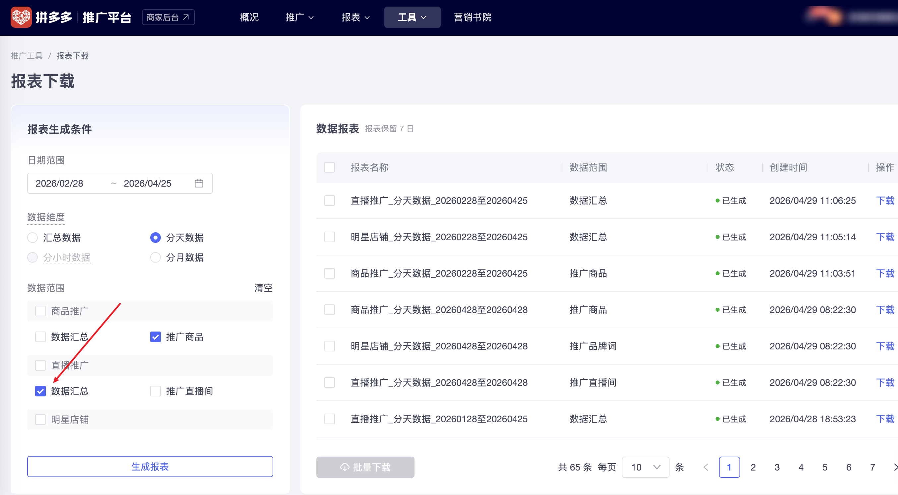

| 属性             | 值                                                                |
| ---------------- | ----------------------------------------------------------------- |
| **连接器类型**   | `RPA 连接器`|
| **连接器名称**   | `ODS_直播推广数据报表下载(拼多多RPA)`|
| **连接器代码**   | `rpa.conn.pinduoduo.promotion.live.report.download`|
| **操作类型**     | `文件导出`|
| **目标网页**     | `https://yingxiao.pinduoduo.com/tools/report/download`|
| **适用场景**     | 从拼多多推广平台下载「直播推广(数据汇总)」分天数据报表，支持快捷日期与自定义日期范围|
| **数据表名**     | `ods_rpa_pinduoduo_promotion_live_report_download_du`|
| **业务表名**     | `ODS_直播推广数据报表下载(拼多多RPA)`|

### 目标页面

> **取数路径**：拼多多推广平台—工具—报表下载—直播推广(数据汇总)
>
> **取数链接**：[https://yingxiao.pinduoduo.com/tools/report/download](https://yingxiao.pinduoduo.com/tools/report/download)



### 业务入参

| 字段 | 中文释义 | 数据类型 | 必填 | 默认值 | 说明 |
| ---- | -------- | -------- | ---- | ------ | ---- |
| `date_type` | 日期范围 | `String` | 是 | `-` | 允许值：`TODAY`（今日）/ `YESTERDAY`（昨日）/ `LAST_7_DAYS`（近 7 天）/ `LAST_30_DAYS`（近 30 天）/ `LAST_90_DAYS`（近 90 天）/ `CUSTOM`（自定义区间） |
| `custom_start_date` | 自定义开始日期 | `String` | 条件必填 | `-` | `date_type` 为 `CUSTOM` 时必填；格式 `YYYYMMDD` / `YYYY-MM-DD`；最早约 today-90 |
| `custom_end_date` | 自定义结束日期 | `String` | 条件必填 | `-` | `date_type` 为 `CUSTOM` 时必填；格式 `YYYYMMDD` / `YYYY-MM-DD`；不可晚于今天 |

### 入参样例

近 7 天：

```json
{
  "date_type": "LAST_7_DAYS",
  "custom_start_date": "",
  "custom_end_date": ""
}
```

自定义区间（两种日期格式均可）：

```json
{
  "date_type": "CUSTOM",
  "custom_start_date": "20260901",
  "custom_end_date": "2026-09-07"
}
```

### 入参校验

```json-schema collapsed
{
  "$schema": "https://json-schema.org/draft/2020-12/schema",
  "title": "拼多多-推广平台-工具-报表下载-直播推广(数据汇总) - 查询入参",
  "description": "date_type 必填；允许值 TODAY（今日）/ YESTERDAY（昨日）/ LAST_7_DAYS（近 7 天）/ LAST_30_DAYS（近 30 天）/ LAST_90_DAYS（近 90 天）/ CUSTOM（自定义区间）；CUSTOM 时起止条件必填；最早约 today-90；不可晚于今天",
  "type": "object",
  "required": ["date_type"],
  "additionalProperties": false,
  "properties": {
    "date_type": {
      "type": "string",
      "description": "日期范围；允许值：TODAY（今日）/ YESTERDAY（昨日）/ LAST_7_DAYS（近 7 天）/ LAST_30_DAYS（近 30 天）/ LAST_90_DAYS（近 90 天）/ CUSTOM（自定义区间）",
      "enum": ["TODAY", "YESTERDAY", "LAST_7_DAYS", "LAST_30_DAYS", "LAST_90_DAYS", "CUSTOM"]
    },
    "custom_start_date": {
      "type": "string",
      "description": "自定义开始日期；date_type 为 CUSTOM 时必填；格式 YYYYMMDD / YYYY-MM-DD；最早约 today-90",
      "pattern": "^(?:\\d{8}|\\d{4}-\\d{2}-\\d{2})$"
    },
    "custom_end_date": {
      "type": "string",
      "description": "自定义结束日期；date_type 为 CUSTOM 时必填；格式 YYYYMMDD / YYYY-MM-DD；不可晚于今天",
      "pattern": "^(?:\\d{8}|\\d{4}-\\d{2}-\\d{2})$"
    }
  },
  "allOf": [
    {
      "if": {
        "properties": { "date_type": { "const": "CUSTOM" } },
        "required": ["date_type"]
      },
      "then": {
        "required": ["custom_start_date", "custom_end_date"]
      }
    }
  ]
}
```

### 数据字段

| 字段 | 中文释义 | 数据类型 | 可为空 | 取数路径 | 示例 |
| ---- | -------- | -------- | ------ | -------- | ---- |
| `date` | 日期 | `string` | 否 | `XLSX.0.日期` | — |
| `total_cost` | 总花费(元) | `number` | 是 | `XLSX.0.总花费(元)` | — |
| `deal_cost` | 成交花费(元) | `number` | 是 | `XLSX.0.成交花费(元)` | — |
| `trade_amount` | 交易额(元) | `number` | 是 | `XLSX.0.交易额(元)` | — |
| `actual_roi` | 实际投产比 | `number` | 是 | `XLSX.0.实际投产比` | — |
| `deal_count` | 成交笔数 | `number` | 是 | `XLSX.0.成交笔数` | — |
| `cost_per_deal` | 每笔成交花费(元) | `number` | 是 | `XLSX.0.每笔成交花费(元)` | — |
| `amount_per_deal` | 每笔成交金额(元) | `number` | 是 | `XLSX.0.每笔成交金额(元)` | — |
| `impressions` | 曝光量 | `number` | 是 | `XLSX.0.曝光量` | — |
| `follow_count` | 关注量 | `number` | 是 | `XLSX.0.关注量` | — |
| `deep_view_count` | 深度观看 | `number` | 是 | `XLSX.0.深度观看` | — |
| `cpm` | 千次曝光花费(元) | `number` | 是 | `XLSX.0.千次曝光花费(元)` | — |
| `cvr_per_mille` | 千次曝光转化数 | `number` | 是 | `XLSX.0.千次曝光转化数` | — |
| `trade_per_mille` | 千次曝光交易额(元) | `number` | 是 | `XLSX.0.千次曝光交易额(元)` | — |
| `fans_per_mille` | 千次曝光增粉数 | `number` | 是 | `XLSX.0.千次曝光增粉数` | — |
| `comment_count` | 直播评论量 | `number` | 是 | `XLSX.0.直播评论量` | — |
| `goods_favorite_count` | 商品收藏量 | `number` | 是 | `XLSX.0.商品收藏量` | — |
| `taskId` | 任务 ID | `string` | 否 | 附加 | dev-0-b917e3b4 |
| `bizDate` | 业务日期 | `string` | 否 | 附加 |  |
| `accountId` | 授权 ID | `string` | 否 | 附加 |  |

### 数据样例

{/* TODO: 数据样例待补充 */}

---
