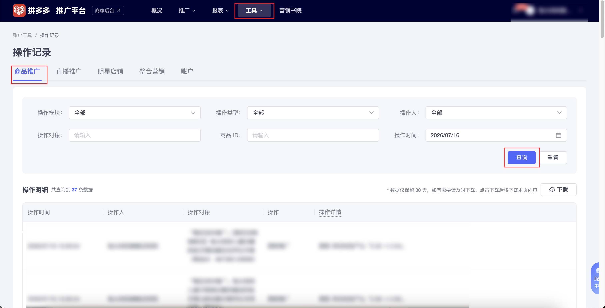

| 属性             | 值                                                                                                  |
| ---------------- | --------------------------------------------------------------------------------------------------- |
| **连接器类型**   | `RPA 连接器`                                                                                        |
| **连接器名称**   | `ODS_推广平台工具操作记录明细表(拼多多RPA)`                                                         |
| **连接器代码**   | `rpa.conn.pinduoduo.promotion.tools.operate.log`                                                    |
| **操作类型**     | `页面解析`                                                                                          |
| **目标网页**     | `https://yingxiao.pinduoduo.com/tools/operate/log`                                                  |
| **适用场景**     | 采集拼多多推广平台操作记录页各子页签数据，支持按子页签切换，并按当前页签允许的操作模块、操作类型/操作、操作人及日期范围筛选；当前页签不支持的筛选项显式传入时任务失败 |
| **数据表名**     | `ods_rpa_pinduoduo_promotion_tools_operate_log_du`                                                  |
| **业务表名**     | `ODS_推广平台工具操作记录明细表(拼多多RPA)`                                                         |

### 目标页面

> **取数路径**：拼多多推广平台—工具—操作记录（商品推广 / 直播推广 / 明星店铺 / 整合营销 / 账户）
>
> **取数链接**：[https://yingxiao.pinduoduo.com/tools/operate/log](https://yingxiao.pinduoduo.com/tools/operate/log)



### 业务入参

| 字段 | 中文释义 | 数据类型 | 必填 | 默认值 | 说明 |
| ---- | -------- | -------- | ---- | ------ | ---- |
| `sub_tab` | 子页签 | `String` | 否 | `PRODUCT_PROMOTION` | 可选值：`PRODUCT_PROMOTION`（商品推广）、`LIVE_PROMOTION`（直播推广）、`STAR_SHOP`（明星店铺）、`INTEGRATED_MARKETING`（整合营销）、`ACCOUNT`（账户）；决定可用筛选项；非法枚举直接失败 |
| `operation_module` | 操作模块 | `String` | 否 | `ALL` | 默认 `ALL`（全部）时不操作控件。**商品推广**：`ALL` / `PROMOTION`（推广）/ `CREATIVE`（创意）。**明星店铺**：另增 `BRAND_CATEGORY`（品牌类目词）。**整合营销**：`ALL` / `CROWD`（人群）/ `ACTIVITY`（活动）/ `GOODS`（商品）。**账户**：`ALL` / `FINANCE`（财务）/ `PRODUCT`（产品）/ `ACCOUNT_MODULE`（账户）。**直播推广不可传**（显式传入即失败） |
| `operation_type` | 操作类型 | `String` | 否 | `ALL` | 默认 `ALL`（全部）时不操作控件。可选值：`ALL` / `ADD`（添加）/ `UPDATE`（更新）/ `DELETE`（删除）。适用于商品推广、明星店铺、整合营销；**直播推广、账户不可传** |
| `operation` | 操作 | `String` | 否 | `ALL` | 仅直播推广可用。默认 `ALL`（全部）时不操作控件。可选值：`ALL` / `ADD_PROMO`（添加推广）/ `UPDATE_PROMO`（更新推广）/ `DELETE_PROMO`（删除推广）。非直播推广显式传入即失败 |
| `operator_type` | 操作人类型 | `String` | 否 | `ALL` | 各子页签均可用。默认 `ALL`（全部）时不操作控件。可选值：`ALL` / `MERCHANT`（商家）/ `SYSTEM`（系统） |
| `custom_start_date` | 查询起始日期 | `String` | 条件必填 | — | 与 `custom_end_date` **须成对传入**才改写页面日期；均未传时保留页面默认区间。支持 `YYYYMMDD` 或 `YYYY-MM-DD`；不可晚于结束日期；仅支持近 30 天（含今天共 30 个自然日） |
| `custom_end_date` | 查询结束日期 | `String` | 条件必填 | — | 须与 `custom_start_date` 成对；支持 `YYYYMMDD` 或 `YYYY-MM-DD`；不可早于起始日期；不可选择未来日期，且须在近 30 天范围内 |

### 入参样例

**默认商品推广** — 不传 `sub_tab` 与筛选项时，走商品推广 + 页面「全部」筛选，日期沿用页面默认。

```json
{}
```

**商品推广 + 自定义日期** — 显式指定模块/类型/操作人与日期区间。

```json
{
  "sub_tab": "PRODUCT_PROMOTION",
  "operation_module": "ALL",
  "operation_type": "ALL",
  "operator_type": "ALL",
  "custom_start_date": "20260728",
  "custom_end_date": "20260728"
}
```

**明星店铺** — 可使用品牌类目词模块。

```json
{
  "sub_tab": "STAR_SHOP",
  "operation_module": "BRAND_CATEGORY",
  "operation_type": "ALL",
  "operator_type": "ALL"
}
```

**直播推广** — 使用 `operation`，不可传 `operation_module` / `operation_type`。

```json
{
  "sub_tab": "LIVE_PROMOTION",
  "operation": "ALL",
  "operator_type": "ALL"
}
```

**整合营销** — 模块取人群/活动/商品等。

```json
{
  "sub_tab": "INTEGRATED_MARKETING",
  "operation_module": "CROWD",
  "operation_type": "UPDATE",
  "operator_type": "MERCHANT"
}
```

**账户** — 无操作类型控件；不可传 `operation_type` / `operation`。

```json
{
  "sub_tab": "ACCOUNT",
  "operation_module": "FINANCE",
  "operator_type": "SYSTEM"
}
```

### 入参校验

```json-schema collapsed
{
  "$schema": "https://json-schema.org/draft/2020-12/schema",
  "title": "拼多多推广平台-工具-操作记录 - 查询入参",
  "description": "采集拼多多推广平台操作记录页各子页签数据，支持按子页签切换，并按当前页签允许的操作模块、操作类型/操作、操作人及日期范围筛选；当前页签不支持的筛选项显式传入时任务失败",
  "type": "object",
  "properties": {
    "sub_tab": {
      "type": "string",
      "description": "子页签；决定可用筛选项",
      "enum": [
        "PRODUCT_PROMOTION",
        "LIVE_PROMOTION",
        "STAR_SHOP",
        "INTEGRATED_MARKETING",
        "ACCOUNT"
      ],
      "default": "PRODUCT_PROMOTION"
    },
    "operation_module": {
      "type": "string",
      "description": "操作模块；默认 ALL 时不操作控件；允许值随 sub_tab 变化：商品推广 ALL/PROMOTION/CREATIVE；明星店铺另含 BRAND_CATEGORY；整合营销 ALL/CROWD/ACTIVITY/GOODS；账户 ALL/FINANCE/PRODUCT/ACCOUNT_MODULE；直播推广不可传",
      "enum": [
        "ALL",
        "PROMOTION",
        "CREATIVE",
        "BRAND_CATEGORY",
        "CROWD",
        "ACTIVITY",
        "GOODS",
        "FINANCE",
        "PRODUCT",
        "ACCOUNT_MODULE"
      ],
      "default": "ALL"
    },
    "operation_type": {
      "type": "string",
      "description": "操作类型；默认 ALL 时不操作控件；适用于商品推广/明星店铺/整合营销；直播推广与账户不可传",
      "enum": ["ALL", "ADD", "UPDATE", "DELETE"],
      "default": "ALL"
    },
    "operation": {
      "type": "string",
      "description": "操作（仅直播推广）；默认 ALL 时不操作控件；非直播推广不可传",
      "enum": ["ALL", "ADD_PROMO", "UPDATE_PROMO", "DELETE_PROMO"],
      "default": "ALL"
    },
    "operator_type": {
      "type": "string",
      "description": "操作人类型；各子页签均可用；默认 ALL 时不操作控件",
      "enum": ["ALL", "MERCHANT", "SYSTEM"],
      "default": "ALL"
    },
    "custom_start_date": {
      "type": "string",
      "description": "查询起始日期；须与 custom_end_date 成对传入；均未传时保留页面默认区间；支持 YYYYMMDD 或 YYYY-MM-DD；不可晚于结束日期；仅支持近 30 天（含今天共 30 个自然日）",
      "pattern": "^(?:\\d{8}|\\d{4}-\\d{2}-\\d{2})$"
    },
    "custom_end_date": {
      "type": "string",
      "description": "查询结束日期；须与 custom_start_date 成对；支持 YYYYMMDD 或 YYYY-MM-DD；不可早于起始日期；不可选择未来日期，且须在近 30 天范围内",
      "pattern": "^(?:\\d{8}|\\d{4}-\\d{2}-\\d{2})$"
    }
  },
  "required": [],
  "dependentRequired": {
    "custom_start_date": ["custom_end_date"],
    "custom_end_date": ["custom_start_date"]
  },
  "additionalProperties": false
}
```

### 数据字段

| 字段 | 中文释义 | 数据类型 | 可为空 | 取数路径 | 示例 |
| ---- | -------- | -------- | ------ | -------- | ---- |
| `moduleType` | 操作模块类型 | `Number` | 是 | 页面解析 | `15` |
| `operateTime` | 操作时间 | `String` | 是 | 页面解析 | `2026-07-16 13:26:54` |
| `operationObject` | 操作对象 | `String` | 是 | 页面解析 | `「稳定****96）` (已脱敏) |
| `operationType` | 操作类型 | `Number` | 是 | 页面解析 | `2` |
| `id` | 操作记录 ID | `Number` | 是 | 页面解析 | `710****551` (已脱敏) |
| `columnChanges` | 字段变更明细 | `List[Dict]` | 是 | 页面解析 | `null` |
| `operatorId` | 操作人 ID | `Number` | 是 | 页面解析 | `164****036` (已脱敏) |
| `operatorName` | 操作人 | `String` | 是 | 页面解析 | `示例店铺****` (已脱敏) |
| `content` | 操作详情 | `String` | 是 | 页面解析 | `更新 ****54」` (已脱敏) |
| `operateCodeList` | 操作编码列表 | `List[Number]` | 是 | 页面解析 | `[157]` |
| `primaryKey` | 操作对象主键 | `Number` | 是 | 页面解析 | `973****821` (已脱敏) |
| `bizDate` | 业务日期 | `String` | 否 | 任务执行日（YYYYMMDD） | `20260717` |
| `accountId` | 授权 ID | `String` | 否 | 当前授权账号 ID | `1****8` (已脱敏) |
| `subTab` | 子页签 | `String` | 否 | 任务入参 `sub_tab` | `PRODUCT_PROMOTION` |

### 数据样例

```json
[
  {
    "moduleType": 15,
    "operateTime": "2026-07-16 13:26:54",
    "operationObject": "「稳定****96）",
    "operationType": 2,
    "id": "710****551",
    "columnChanges": null,
    "operatorId": "164****036",
    "operatorName": "示例店铺****",
    "content": "更新 ****54」",
    "operateCodeList": [157],
    "primaryKey": "973****821",
    "bizDate": "20260717",
    "accountId": "1****8",
    "subTab": "PRODUCT_PROMOTION"
  }
]
```

---

:::changelog{pageSize=5}

@title ### 更新记录

@20260729 支持操作记录多子页签采集

**取数链接:** https://yingxiao.pinduoduo.com/tools/operate/log

#### 页面变更说明

> 操作记录页在原有「商品推广」基础上，支持切换「直播推广 / 明星店铺 / 整合营销 / 账户」子页签采集；各页签筛选项不同，当前页签不支持的字段显式传入时任务失败。日期成对传入时改写页面区间，均未传时保留页面默认。

#### 变更内容

- 新增入参 `sub_tab`（默认 `PRODUCT_PROMOTION`）：`PRODUCT_PROMOTION` / `LIVE_PROMOTION` / `STAR_SHOP` / `INTEGRATED_MARKETING` / `ACCOUNT`
- 新增入参 `operation`（仅直播推广）：`ALL` / `ADD_PROMO` / `UPDATE_PROMO` / `DELETE_PROMO`
- `operation_module` 按页签扩展允许值（明星店铺含 `BRAND_CATEGORY`；整合营销为人群/活动/商品；账户为财务/产品/账户）；直播推广不可传
- `operation_type` 仅适用于商品推广 / 明星店铺 / 整合营销；直播推广、账户不可传
- 筛选项默认 `ALL` 时不操作页面控件；非法枚举或跨页签字段直接失败
- 出参新增 `subTab`（任务入参 `sub_tab` 原样写出）
- 入参样例改为多场景（商品推广 / 明星店铺 / 直播推广 / 整合营销 / 账户）

#### 新增输出字段

| 字段 | 中文释义 | 数据类型 | 说明 |
| ---- | -------- | -------- | ---- |
| `subTab` | 子页签 | `String` | 对应入参 `sub_tab`，如 `PRODUCT_PROMOTION` |

#### 新增字段样例

```json
{
  "moduleType": 15,
  "operateTime": "2026-07-16 13:26:54",
  "operationObject": "「稳定****96）",
  "operationType": 2,
  "id": "710****551",
  "columnChanges": null,
  "operatorId": "164****036",
  "operatorName": "示例店铺****",
  "content": "更新 ****54」",
  "operateCodeList": [157],
  "primaryKey": "973****821",
  "bizDate": "20260717",
  "accountId": "1****8",
  "subTab": "PRODUCT_PROMOTION"
}
```

:::
