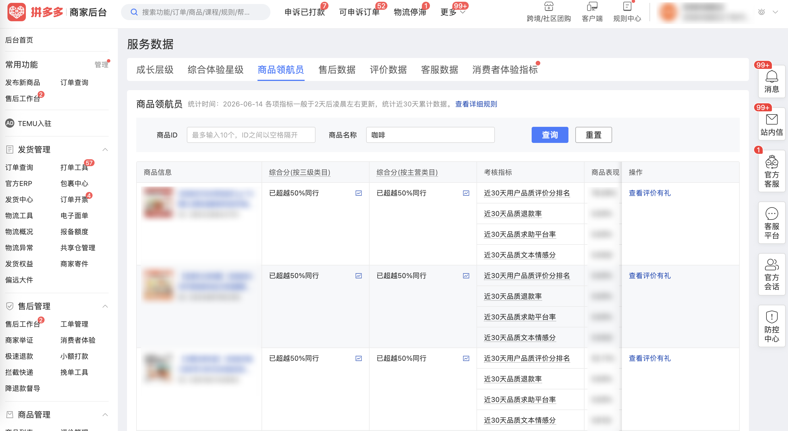

| 属性             | 值                                                                          |
| ---------------- | --------------------------------------------------------------------------- |
| **连接器类型**   | `RPA 连接器`|
| **连接器名称**   | `ODS_店铺服务数据商品领航员明细表(拼多多RPA)`|
| **连接器代码**   | `rpa.conn.pinduoduo.shop.pilot.goods`|
| **操作类型**     | `页面解析`|
| **目标网页**     | `https://mms.pinduoduo.com/sycm/goods_quality/pilot_goods`|
| **适用场景**     | 采集拼多多商家后台商品领航员列表数据，包含综合分、考核指标排名及商品表现等维度|
| **数据表名**     | `ods_rpa_pinduoduo_shop_pilot_goods_du`|
| **业务表名**     | `ODS_店铺服务数据商品领航员明细表(拼多多RPA)`|

### 目标页面

> **取数路径**：拼多多商家后台—服务数据—商品领航员
>
> **取数链接**：[https://mms.pinduoduo.com/sycm/goods_quality/pilot_goods](https://mms.pinduoduo.com/sycm/goods_quality/pilot_goods)



### 业务入参

| 字段         | 中文释义       | 数据类型 | 必填 | 默认值 | 说明                                         |
| ------------ | -------------- | -------- | ---- | ------ | -------------------------------------------- |
| `goods_id`   | 商品 ID        | `string` | 否   | —      | 最多 10 个，英文逗号分隔；也支持 JSON 数组格式 |
| `goods_name` | 商品名称关键词 | `string` | 否   | —      | —                                            |

### 入参样例

```json
{
    "goods_id": "290328842701,290328842702",
    "goods_name": "咖啡"
}
```

### 入参校验

```json-schema collapsed
{
  "$schema": "https://json-schema.org/draft/2020-12/schema",
  "title": "拼多多-商品领航员 - 查询入参",
  "description": "采集拼多多商家后台商品领航员列表数据，包含综合分、考核指标排名及商品表现等维度",
  "type": "object",
  "properties": {
    "goods_id": {
      "type": "string",
      "description": "商品 ID，最多 10 个，英文逗号分隔；也支持 JSON 数组格式"
    },
    "goods_name": {
      "type": "string",
      "description": "商品名称关键词"
    }
  },
  "required": [],
  "additionalProperties": false
}
```

### 数据字段

| 字段                                    | 中文释义                         | 数据类型 | 可为空 | 取数路径                                                      | 示例                                                                                             |
| --------------------------------------- | -------------------------------- | -------- | ------ | ------------------------------------------------------------- | ------------------------------------------------------------------------------------------------ |
| `goodsId`                               | 商品 ID                          | `number` | 否     | `goodsId`                                                     | `290328842701`                                                                                   |
| `goodsName`                             | 商品名称                         | `string` | 否     | `goodsName`                                                   | `连咖啡风味黑咖啡2g*10颗生椰焦糖榛果香草每日鲜萃上班熬夜美式`                                    |
| `thumbUrl`                              | 商品缩略图                       | `string` | 否     | `thumbUrl`                                                    | `https://img.pddpic.com/gaudit-image/2025-06-24/49b341d5db62550f4e27ec01d478449c.jpeg`           |
| `hdThumbUrl`                            | 商品高清缩略图                   | `string` | 否     | `hdThumbUrl`                                                  | `https://img.pddpic.com/gaudit-image/2025-06-24/5b51e3b4484c057dc3aa9526046e2275.jpeg`           |
| `isOnsale`                              | 是否在售                         | `string` | 否     | `isOnsale`                                                    | `1`                                                                                              |
| `quantity`                              | 库存数量                         | `number` | 否     | `quantity`                                                    | `2377`                                                                                           |
| `reviewCnt1m`                           | 近 30 天评价数                   | `number` | 否     | `reviewCnt1m`                                                 | `28`                                                                                             |
| `goodsReward`                           | 商品奖励标记                     | `number` | 否     | `goodsReward`                                                 | `1`                                                                                              |
| `entranceType`                          | 入口类型                         | `number` | 否     | `entranceType`                                                | `0`                                                                                              |
| `goodsReviewCnt`                        | 商品评价数                       | `number` | 是     | `goodsReviewCnt`                                              | `null`                                                                                           |
| `goodsStatus`                           | 商品状态                         | `number` | 否     | `goodsStatus`                                                 | `1`                                                                                              |
| `goodsScoreRk`                          | 综合分数值（三级类目）           | `number` | 否     | `goodsNavigatorDetailDTO.goodsScoreRk`                        | `0.7164`                                                                                         |
| `goodsScoreRkStage`                     | 综合分阶段（三级类目），1=低于20%同行/2=超越20%/3=超越40%/4=超越50% | `number` | 否     | `goodsNavigatorDetailDTO.goodsScoreRkStage`                   | `4`                                                                                              |
| `goodsScoreRkStpl`                      | 综合分数值（主营类目）           | `number` | 否     | `goodsNavigatorDetailDTO.goodsScoreRkStpl`                    | `0.7644`                                                                                         |
| `goodsScoreRkStplStage`                 | 综合分阶段（主营类目），1=低于20%同行/2=超越20%/3=超越40%/4=超越50% | `number` | 否     | `goodsNavigatorDetailDTO.goodsScoreRkStplStage`               | `4`                                                                                              |
| `avgDescRevScr1m`                       | 近 30 天用户品质评价分           | `number` | 否     | `goodsNavigatorDetailDTO.avgDescRevScr1m`                     | `4.86`                                                                                           |
| `rankAvgDescRevScr1m`                   | 品质评价分排名（三级类目）       | `number` | 否     | `goodsNavigatorDetailDTO.rankAvgDescRevScr1m`                 | `0.4727`                                                                                         |
| `rankAvgDescRevScr1mStage`              | 品质评价分排名阶段（三级类目），1=低于20%同行/2=超越20%/3=超越40%/4=超越50% | `number` | 否     | `goodsNavigatorDetailDTO.rankAvgDescRevScr1mStage`            | `3`                                                                                              |
| `rankAvgDescRevScr1mStpl`               | 品质评价分排名（主营类目）       | `number` | 否     | `goodsNavigatorDetailDTO.rankAvgDescRevScr1mStpl`             | `0.7194`                                                                                         |
| `rankAvgDescRevScr1mStplStage`          | 品质评价分排名阶段（主营类目），1=低于20%同行/2=超越20%/3=超越40%/4=超越50% | `number` | 否     | `goodsNavigatorDetailDTO.rankAvgDescRevScr1mStplStage`        | `4`                                                                                              |
| `qltyRfndOrdrCntRto1m`                  | 近 30 天品质退款率               | `number` | 否     | `goodsNavigatorDetailDTO.qltyRfndOrdrCntRto1m`                | `0.0`                                                                                            |
| `rankQltyRfndOrdrCntRto1m`              | 品质退款率排名（三级类目）       | `number` | 否     | `goodsNavigatorDetailDTO.rankQltyRfndOrdrCntRto1m`            | `1.0`                                                                                            |
| `rankQltyRfndOrdrCntRto1mStage`         | 品质退款率排名阶段（三级类目），1=低于20%同行/2=超越20%/3=超越40%/4=超越50% | `number` | 否     | `goodsNavigatorDetailDTO.rankQltyRfndOrdrCntRto1mStage`       | `4`                                                                                              |
| `rankQltyRfndOrdrCntRto1mStpl`          | 品质退款率排名（主营类目）       | `number` | 否     | `goodsNavigatorDetailDTO.rankQltyRfndOrdrCntRto1mStpl`        | `1.0`                                                                                            |
| `rankQltyRfndOrdrCntRto1mStplStage`     | 品质退款率排名阶段（主营类目），1=低于20%同行/2=超越20%/3=超越40%/4=超越50% | `number` | 否     | `goodsNavigatorDetailDTO.rankQltyRfndOrdrCntRto1mStplStage`   | `4`                                                                                              |
| `ptHelpPzRate30d`                       | 近 30 天品质求助平台率           | `number` | 否     | `goodsNavigatorDetailDTO.ptHelpPzRate30d`                     | `0.0`                                                                                            |
| `rankPtHelpPzRate30d`                   | 求助平台率排名（三级类目）       | `number` | 否     | `goodsNavigatorDetailDTO.rankPtHelpPzRate30d`                 | `0.9937`                                                                                         |
| `rankPtHelpPzRate30dStage`              | 求助平台率排名阶段（三级类目），1=低于20%同行/2=超越20%/3=超越40%/4=超越50% | `number` | 否     | `goodsNavigatorDetailDTO.rankPtHelpPzRate30dStage`            | `4`                                                                                              |
| `rankPtHelpPzRate30dStpl`               | 求助平台率排名（主营类目）       | `number` | 否     | `goodsNavigatorDetailDTO.rankPtHelpPzRate30dStpl`             | `0.9956`                                                                                         |
| `rankPtHelpPzRate30dStplStage`          | 求助平台率排名阶段（主营类目），1=低于20%同行/2=超越20%/3=超越40%/4=超越50% | `number` | 否     | `goodsNavigatorDetailDTO.rankPtHelpPzRate30dStplStage`        | `4`                                                                                              |
| `midRto30d`                             | 近 30 天品质文本情感分           | `number` | 否     | `goodsNavigatorDetailDTO.midRto30d`                           | `5.0`                                                                                            |
| `rankComscoreStage`                     | 文本情感分排名阶段（三级类目），1=低于20%同行/2=超越20%/3=超越40%/4=超越50% | `number` | 否     | `goodsNavigatorDetailDTO.rankComscoreStage`                   | `4`                                                                                              |
| `rankComscoreStplStage`                 | 文本情感分排名阶段（主营类目），1=低于20%同行/2=超越20%/3=超越40%/4=超越50% | `number` | 否     | `goodsNavigatorDetailDTO.rankComscoreStplStage`               | `4`                                                                                              |
| `goodsAvgAntiDescCtgrpRevScrPct1m`      | 商品描述同类评分百分位（%）      | `number` | 否     | `goodsNavigatorDetailDTO.goodsAvgAntiDescCtgrpRevScrPct1m`    | `76.09`                                                                                          |
| `mallScoreRkStage`                      | 店铺体验分阶段，1=低于20%同行/2=超越20%/3=超越40%/4=超越50% | `number` | 否     | `goodsNavigatorDetailDTO.mallScoreRkStage`                    | `4`                                                                                              |
| `displayMallScoreRk`                    | 店铺体验分展示值                 | `number` | 否     | `goodsNavigatorDetailDTO.displayMallScoreRk`                  | `0`                                                                                              |
| `versionTag`                            | 版本标签                         | `string` | 否     | `goodsNavigatorDetailDTO.versionTag`                          | `V1`                                                                                             |
| `statDate`                              | 数据统计日期                     | `string` | 是     | `result.statDate`                                             | `2026-06-14`                                                                                     |
| `bizDate`                               | 业务日期                         | `string` | 否     | 附加                                                          |                                                                                                  |
| `accountId`                             | 授权 ID                          | `string` | 否     | 附加                                                          |                                                                                                  |

### 数据样例

```json
{
  "goodsId": 290328842701,
  "goodsName": "连咖啡风味黑咖啡2g*10颗生椰焦糖榛果香草每日鲜萃上班熬夜美式",
  "thumbUrl": "https://img.pddpic.com/gaudit-image/2025-06-24/49b341d5db62550f4e27ec01d478449c.jpeg",
  "hdThumbUrl": "https://img.pddpic.com/gaudit-image/2025-06-24/5b51e3b4484c057dc3aa9526046e2275.jpeg",
  "isOnsale": "1",
  "quantity": 2377,
  "reviewCnt1m": 28,
  "goodsReward": 1,
  "entranceType": 0,
  "goodsReviewCnt": null,
  "goodsStatus": 1,
  "goodsScoreRk": 0.7164,
  "goodsScoreRkStage": 4,
  "goodsScoreRkStpl": 0.7644,
  "goodsScoreRkStplStage": 4,
  "avgDescRevScr1m": 4.86,
  "rankAvgDescRevScr1m": 0.4727,
  "rankAvgDescRevScr1mStage": 3,
  "rankAvgDescRevScr1mStpl": 0.7194,
  "rankAvgDescRevScr1mStplStage": 4,
  "qltyRfndOrdrCntRto1m": 0.0,
  "rankQltyRfndOrdrCntRto1m": 1.0,
  "rankQltyRfndOrdrCntRto1mStage": 4,
  "rankQltyRfndOrdrCntRto1mStpl": 1.0,
  "rankQltyRfndOrdrCntRto1mStplStage": 4,
  "ptHelpPzRate30d": 0.0,
  "rankPtHelpPzRate30d": 0.9937,
  "rankPtHelpPzRate30dStage": 4,
  "rankPtHelpPzRate30dStpl": 0.9956,
  "rankPtHelpPzRate30dStplStage": 4,
  "midRto30d": 5.0,
  "rankComscoreStage": 4,
  "rankComscoreStplStage": 4,
  "goodsAvgAntiDescCtgrpRevScrPct1m": 76.09,
  "mallScoreRkStage": 4,
  "displayMallScoreRk": 0,
  "versionTag": "V1",
  "statDate": "2026-06-14",
  "bizDate": "20260616",
  "accountId": "104"
}
```

---
