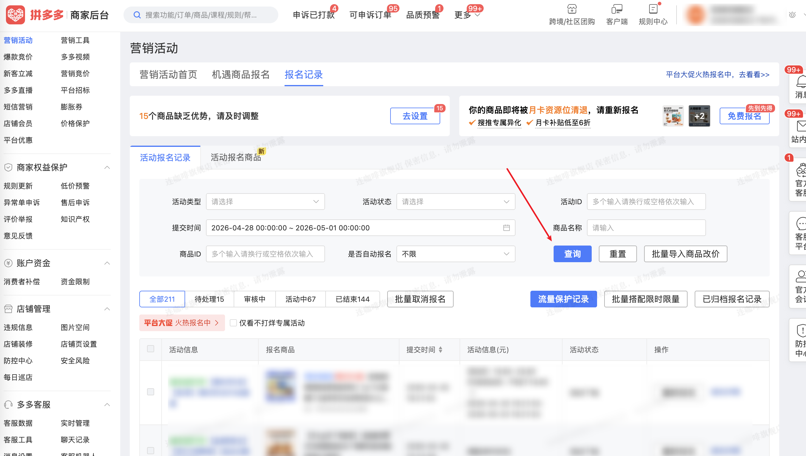

| 属性             | 值                                                                                  |
| ---------------- | ----------------------------------------------------------------------------------- |
| **连接器类型**   | `RPA 连接器`|
| **连接器名称**   | `ODS_店铺营销活动报名记录表(拼多多RPA)`|
| **连接器代码**   | `rpa.conn.pinduoduo.shop.register.record`|
| **操作类型**     | `页面解析`|
| **目标网页**     | `https://mms.pinduoduo.com/act/register_record?tab=0`|
| **适用场景**     | 采集拼多多商家后台营销活动报名记录数据，支持按状态标签、活动类型、活动状态、商品名称/ID、提交时间筛选；支持翻页采集，最大 100 页|
| **数据表名**     | `ods_rpa_pinduoduo_shop_act_register_record_du`|
| **业务表名**     | `ODS_店铺营销活动报名记录表(拼多多RPA)`|

### 目标页面

> **取数路径**：拼多多商家后台—营销活动—报名记录
>
> **取数链接**：[https://mms.pinduoduo.com/act/register_record](https://mms.pinduoduo.com/act/register_record?tab=0)



### 业务入参

| 字段 | 中文释义 | 数据类型 | 必填 | 默认值 | 说明 |
| ---- | -------- | -------- | ---- | ------ | ---- |
| `status_tab` | 状态标签 | `String` | 否 | `-` | 允许值：`ALL`（全部）/ `PENDING`（待处理）/ `REVIEWING`（审核中）/ `IN_PROGRESS`（活动中）/ `ENDED`（已结束） |
| `activity_type` | 活动类型 | `String` | 否 | `-` | 允许值：`LIMITED_FLASH_SALE` / `SALE_99` / `BIG_PROMOTION` / `DAILY_GOOD_STORE` / `LOVE_SHOPPING` / `CLEARANCE_BILLION_SUBSIDY` / `FOOD_SUPERMARKET` / `LIMITED_DISCOUNT` / `QUANTITY_DISCOUNT` / `COUPON_CENTER` / `BRAND_FLASH_SALE` / `MARKET_ACTIVITY` / `BILLION_SUBSIDY` / `CROSS_STORE_REBATE` / `SUPER_CATEGORY_DAY` / `NEW_CLOTHES_HALL` / `MEDICINE_HALL` / `GLOBAL_PURCHASE` / `NEW_USER_EXCLUSIVE` / `SAVE_MONEY_MONTHLY_CARD` / `PERSONALIZED_HOMEPAGE` / `DUODUO_SUPPLY` / `REMOTE_FREE_SHIPPING` / `HOMEPAGE_RECOMMEND` / `BILLION_SUBSIDY_TIME_COUPON` / `STORE_JOINT_SUBSIDY` / `INFLUENCER_PROMOTION` / `MULTI_PERSON_GROUP` / `TREND_GOOD_PRICE` / `BRAND_GOOD_PRICE` / `SCENE_EXCLUSIVE_COUPON` / `THREE_ORDER_CHALLENGE` / `MONTHLY_CARD_MEMBER` / `DUODUO_ORCHARD_SUBSIDY` / `SUPER_NIGHT_8` |
| `activity_status` | 活动状态 | `String \| List[String]` | 否 | `-` | 允许值：`ALL`（全选）/ `UNDER_REVIEW`（审核中）/ `REVIEW_PASSED`（审核通过）/ `REGISTRATION_REJECTED`（报名被驳回）/ `PENDING_DEPOSIT`（待缴活动保证金）/ `PENDING_FINAL_REVIEW`（待终审）/ `SYSTEM_PENDING_CONFIRM`（系统报名/返场待确认）/ `MARKETING_ACCOUNT_RECHARGE`（营销账户待充值）/ `SYSTEM_REVIEW_PASSED`（系统审核通过）/ `OPERATION_REVIEW_PASSED`（运营审核通过）/ `SYSTEM_PENDING_DEPOSIT_CHECK`（系统待校验保证金）/ `DEPOSIT_CHECK_PASSED`（保证金校验通过）/ `MERCHANT_CONFIRMED`（商家已确认返场/系统晋升）/ `PENDING_ADJUSTMENT`（待调整）/ `NEGOTIATION_PENDING_REVIEW`（协商待审核）/ `AGREE_ADJUSTMENT_PENDING`（同意调整待审核）/ `PENDING_SCHEDULE`（待确认排期）/ `ACTIVITY_TIME_CONFIRMED`（已确定具体活动时间）/ `SAMPLE_REVIEW`（寄样及寄样审核）/ `PUSHING`（推送中）/ `REGISTRATION_SUCCESS`（报名成功）/ `PUSH_FAILED`（推送失败）/ `CANCELLED`（已取消）/ `PRICE_REDUCED`（降低活动价格）/ `ACTIVITY_OFFLINE`（活动下线）；`ALL`（全选）仅支持单值，不可与其它状态多选；`status_tab` 非 `ALL` 时部分状态在当前标签下不可选，传入不可选状态则返回空数据并在结果消息中说明 |
| `goods_name` | 商品名称 | `String` | 否 | `-` | — |
| `goods_id` | 商品 ID | `String \| List[String]` | 否 | `-` | 英文逗号分隔或列表；单个最长 17 位 |
| `submit_start_date` | 提交开始时间 | `String` | 条件必填 | `-` | 与 `submit_end_date` 成对；均未传则不填页面时间筛选；格式 `YYYYMMDD` / `YYYY-MM-DD` / `YYYYMMDD HH:mm:ss` / `YYYY-MM-DD HH:mm:ss`；纯日期自动补 `00:00:00` |
| `submit_end_date` | 提交结束时间 | `String` | 条件必填 | `-` | 与 `submit_start_date` 成对；格式同开始；跨度不超过 30 天 |

### 入参样例

```json
{
  "status_tab": "ALL",
  "activity_type": "",
  "activity_status": [],
  "goods_name": "",
  "goods_id": [],
  "submit_start_date": "",
  "submit_end_date": ""
}
```

成对传入提交时间（两种日期格式均可）：

```json
{
  "status_tab": "PENDING",
  "submit_start_date": "20260901",
  "submit_end_date": "2026-09-07 21:49:59"
}
```

### 入参校验

```json-schema collapsed
{
  "$schema": "https://json-schema.org/draft/2020-12/schema",
  "title": "拼多多-店铺-营销活动-营销报名记录 - 查询入参",
  "description": "status_tab 可选；允许值 ALL（全部）/ PENDING（待处理）/ REVIEWING（审核中）/ IN_PROGRESS（活动中）/ ENDED（已结束）；submit_start_date / submit_end_date 成对可选，均未传则不填页面时间筛选；跨度不超过 30 天",
  "type": "object",
  "required": [],
  "additionalProperties": false,
  "properties": {
    "status_tab": {
      "type": "string",
      "description": "状态标签；允许值：ALL（全部）/ PENDING（待处理）/ REVIEWING（审核中）/ IN_PROGRESS（活动中）/ ENDED（已结束）",
      "enum": ["ALL", "PENDING", "REVIEWING", "IN_PROGRESS", "ENDED"]
    },
    "activity_type": {
      "type": "string",
      "description": "活动类型；允许值：LIMITED_FLASH_SALE（限时秒杀）/ SALE_99（9块9特卖）/ BIG_PROMOTION（大促活动）/ DAILY_GOOD_STORE（每日好店）/ LOVE_SHOPPING（爱逛街）/ CLEARANCE_BILLION_SUBSIDY（断码清仓百亿补贴）/ FOOD_SUPERMARKET（食品超市）/ LIMITED_DISCOUNT（限时折扣）/ QUANTITY_DISCOUNT（限量折扣）/ COUPON_CENTER（领券中心）/ BRAND_FLASH_SALE（品牌秒杀）/ MARKET_ACTIVITY（市场活动）/ BILLION_SUBSIDY（百亿补贴）/ CROSS_STORE_REBATE（跨店满返）/ SUPER_CATEGORY_DAY（超级品类日）/ NEW_CLOTHES_HALL（新衣馆）/ MEDICINE_HALL（医药馆）/ GLOBAL_PURCHASE（全球购）/ NEW_USER_EXCLUSIVE（新人专享）/ SAVE_MONEY_MONTHLY_CARD（省钱月卡）/ PERSONALIZED_HOMEPAGE（个性化首页）/ DUODUO_SUPPLY（多多供货）/ REMOTE_FREE_SHIPPING（偏远包邮）/ HOMEPAGE_RECOMMEND（首页推荐专区）/ BILLION_SUBSIDY_TIME_COUPON（百亿补贴限时神券）/ STORE_JOINT_SUBSIDY（店铺联合补贴）/ INFLUENCER_PROMOTION（达人推广）/ MULTI_PERSON_GROUP（多人团）/ TREND_GOOD_PRICE（潮流好价）/ BRAND_GOOD_PRICE（品牌好价）/ SCENE_EXCLUSIVE_COUPON（场景专属券）/ THREE_ORDER_CHALLENGE（三单挑战）/ MONTHLY_CARD_MEMBER（月卡会员活动）/ DUODUO_ORCHARD_SUBSIDY（多多果园补贴）/ SUPER_NIGHT_8（超级晩8）"
    },
    "activity_status": {
      "type": "array",
      "description": "活动状态；允许值：ALL（全选）/ UNDER_REVIEW（审核中）/ REVIEW_PASSED（审核通过）/ REGISTRATION_REJECTED（报名被驳回）/ PENDING_DEPOSIT（待缴活动保证金）/ PENDING_FINAL_REVIEW（待终审）/ SYSTEM_PENDING_CONFIRM（系统报名/返场待确认）/ MARKETING_ACCOUNT_RECHARGE（营销账户待充值）/ SYSTEM_REVIEW_PASSED（系统审核通过）/ OPERATION_REVIEW_PASSED（运营审核通过）/ SYSTEM_PENDING_DEPOSIT_CHECK（系统待校验保证金）/ DEPOSIT_CHECK_PASSED（保证金校验通过）/ MERCHANT_CONFIRMED（商家已确认返场/系统晋升）/ PENDING_ADJUSTMENT（待调整）/ NEGOTIATION_PENDING_REVIEW（协商待审核）/ AGREE_ADJUSTMENT_PENDING（同意调整待审核）/ PENDING_SCHEDULE（待确认排期）/ ACTIVITY_TIME_CONFIRMED（已确定具体活动时间）/ SAMPLE_REVIEW（寄样及寄样审核）/ PUSHING（推送中）/ REGISTRATION_SUCCESS（报名成功）/ PUSH_FAILED（推送失败）/ CANCELLED（已取消）/ PRICE_REDUCED（降低活动价格）/ ACTIVITY_OFFLINE（活动下线）；ALL（全选）仅支持单值，不可与其它状态多选；status_tab 非 ALL 时部分状态在当前标签下不可选，传入不可选状态则返回空数据并在结果消息中说明",
      "items": { "type": "string" }
    },
    "goods_name": { "type": "string", "description": "商品名称" },
    "goods_id": {
      "type": "array",
      "description": "商品 ID；单个最长 17 位",
      "items": { "type": "string" }
    },
    "submit_start_date": {
      "type": "string",
      "description": "提交开始时间；与 submit_end_date 成对；均未传则不填页面时间筛选；格式 YYYYMMDD / YYYY-MM-DD / YYYYMMDD HH:mm:ss / YYYY-MM-DD HH:mm:ss；纯日期自动补 00:00:00"
    },
    "submit_end_date": {
      "type": "string",
      "description": "提交结束时间；与 submit_start_date 成对；跨度不超过 30 天"
    }
  },
  "dependentRequired": {
    "submit_start_date": ["submit_end_date"],
    "submit_end_date": ["submit_start_date"]
  }
}
```

### 数据字段

| 字段 | 中文释义 | 数据类型 | 可为空 | 取数路径 | 示例 |
| ---- | -------- | -------- | ------ | -------- | ---- |
| `activity_goods_id` | 报名记录 ID | `number` | 否 | `activityGoodsId` | `11278861375712` |
| `activity_id` | 活动 ID | `number` | 否 | `activityId` | `22660` |
| `activity_name` | 活动名称 | `string` | 否 | `activityName` | `【免审】限时秒杀外场通道` |
| `activity_type` | 活动类型 | `number` | 否 | `activityType` | `101` |
| `business_type_str` | 活动类型描述 | `string` | 否 | `businessTypeStr` | `限时秒杀` |
| `goods_id` | 商品 ID | `number` | 否 | `goodsId` | `781634232288` |
| `goods_name` | 商品名称 | `string` | 否 | `goodsName` | `连咖啡燃燃咖黑咖啡粉2.1g*30袋…` |
| `thumb_url` | 商品缩略图 | `string` | 否 | `thumbUrl` | `https://img.pddpic.com/…` |
| `status` | 状态码 | `number` | 否 | `status` | `702` |
| `final_status_name` | 状态描述 | `string` | 否 | `finalStatusName` | `活动下线` |
| `activity_status` | 活动状态码 | `number` | 否 | `activityStatus` | `101` |
| `enroll_time` | 报名时间 | `number` | 否 | `enrollTime` | `1777548063239` |
| `enroll_start_time` | 活动报名开始时间 | `number` | 否 | `enrollStartTime` | `1681203898000` |
| `enroll_end_time` | 活动报名结束时间 | `number` | 否 | `enrollEndTime` | `1903795199000` |
| `refuse_reason` | 驳回原因 | `string` | 是 | `refuseReason` | — |
| `cancel_reason` | 取消原因 | `string` | 是 | `cancelReason` | — |
| `goods_quantity` | 商品库存 | `number` | 否 | `goodsQuantity` | `4986` |
| `sold_quantity` | 已售数量 | `number` | 否 | `soldQuantity` | `1014` |
| `activity_goods_time_list` | 活动时间段列表 | `List[Dict]` | 是 | `activityGoodsTimeList` | 见数据样例 `activity_goods_time_list` |
| `activity_sku_info` | SKU 活动信息 | `List[Dict]` | 是 | `activitySkuInfo` | 见数据样例 `activity_sku_info` |
| `min_on_sale_group_price` | 最低拼团价（分） | `number` | 是 | `minOnSaleGroupPrice` | `3290` |
| `bizDate` | 业务日期 | `string` | 否 | 附加 | |
| `accountId` | 授权 ID | `string` | 否 | 附加 | |

### 数据样例

```json
{
  "activity_goods_id": 11278861375712,
  "activity_id": 22660,
  "activity_name": "【免审】限时秒杀外场通道",
  "activity_type": 101,
  "business_type_str": "限时秒杀",
  "goods_id": 781634232288,
  "goods_name": "连咖啡燃燃咖黑咖啡粉2.1g*30袋椰子油茉莉风味熬夜办公提神美式",
  "thumb_url": "https://img.pddpic.com/gaudit-image/2025-07-18/5ad40cf05ba8194041dc05bfd228b57d.jpeg",
  "status": 702,
  "final_status_name": "活动下线",
  "activity_status": 101,
  "enroll_time": 1777548063239,
  "enroll_start_time": 1681203898000,
  "enroll_end_time": 1903795199000,
  "refuse_reason": null,
  "cancel_reason": null,
  "goods_quantity": 4986,
  "sold_quantity": 1014,
  "activity_goods_time_list": [
    {
      "activity_goods_start_time": 1777548063000,
      "activity_goods_end_time": 1777807263000,
      "activity_goods_event_id": 11278716990688,
      "event_type": 5,
      "max_activity_sku_price": 2980,
      "min_activity_sku_price": 1980,
      "activity_quantity": 3000
    }
  ],
  "activity_sku_info": [
    {
      "sku_id": 1761318107957,
      "sku_name": "【3盒】椰子油12条+茉莉山茶油6条",
      "goods_id": 781634232288,
      "activity_price": 1980,
      "cost_price": null,
      "is_on_sale": true
    },
    {
      "sku_id": 1761318107958,
      "sku_name": "【3盒】椰子油6条+山茶油6条+牛油果6条",
      "goods_id": 781634232288,
      "activity_price": 1980,
      "cost_price": null,
      "is_on_sale": true
    }
  ],
  "min_on_sale_group_price": 3290,
  "bizDate": "20260508",
  "accountId": "102"
}
```

---
