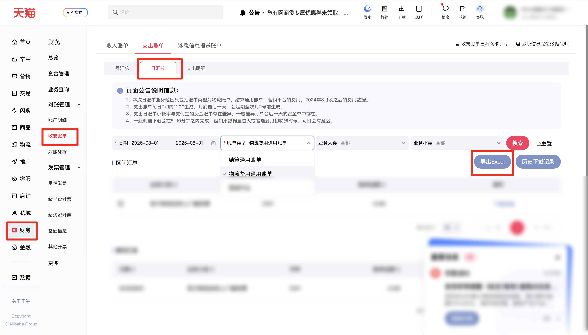

| 属性             | 值                                                                                                                         |
| ---------------- | -------------------------------------------------------------------------------------------------------------------------- |
| **连接器类型**   | `RPA 连接器`                                                                                                               |
| **连接器名称**   | `ODS_财务收支账单支出日汇总明细报表(千牛RPA)`                                                                              |
| **连接器代码**   | `rpa.conn.qianniu.finance.income.bill.day.summary`                                                                         |
| **操作类型**     | `文件导出`                                                                                                                 |
| **目标网页**     | `https://myseller.taobao.com/home.htm/whale-accountant/bill/summary?billType=day&billDirection=expense`                     |
| **适用场景**     | 导出千牛收支账单中支出账单日汇总的区间汇总数据，支持按同月日期区间和账单类型筛选                                           |
| **数据表名**     | `ods_rpa_qianniu_finance_income_bill_day_summary_du`                                                                       |
| **业务表名**     | `ODS_财务收支账单支出日汇总明细报表(千牛RPA)`                                                                              |

### 目标页面

> **取数路径**：千牛—财务—对账管理—收支账单—支出账单—日汇总—区间汇总
>
> **取数链接**：[https://myseller.taobao.com/home.htm/whale-accountant/bill/summary?billType=day&billDirection=expense](https://myseller.taobao.com/home.htm/whale-accountant/bill/summary?billType=day&billDirection=expense)



页面可选历史日期较久，但近两年以前的区间平台侧常无数据；搜索后表体为空态「没有数据」时，任务返回 `success=true`、`message=没有数据`、`data=[]`，不执行导出。建议使用近两年内日期。

### 返回消息

| success | message | 说明 |
| ------- | ------- | ---- |
| `true` | `没有数据` | 搜索后区间汇总表为空态「没有数据」，不执行导出 |
| `true` | `导出成功，共 N 条` | 导出 Excel 并解析成功，`N` 为回传行数 |
| `false` | `文件错误，没有数据` | 页面判定有数据，但导出文件解析后无有效行 |
| `false` | `当前账号暂无权限查看「对账管理-收支账单」，请联系主账号添加相关权限后重试` | 子账号无收支账单页面查看权限 |
| `false` | `入参校验失败: …` | 日期跨月、区间超过 31 天、结束早于开始，或 `bill_type` 不在允许值内 |

### 业务入参

| 字段 | 中文释义 | 数据类型 | 必填 | 默认值 | 说明 |
| ---- | -------- | -------- | ---- | ------ | ---- |
| `custom_start_date` | 查询起始日期 | `String` | 是 | — | 支持格式：`YYYYMMDD` / `YYYY-MM-DD`。须与结束日期处于同一个自然月，区间跨度不超过 31 天（含起止），且不得晚于结束日期 |
| `custom_end_date` | 查询结束日期 | `String` | 是 | — | 支持格式：`YYYYMMDD` / `YYYY-MM-DD`。不得早于开始日期；跨月或超过 31 天时连接器返回「时间范围不可超过31天且不允许跨月，请重新选择」 |
| `bill_type` | 账单类型 | `String` | 否 | 页面默认值 | 英文 code。不传则沿用页面当前默认值。可选值：`SETTLE_COMMON`（结算通用账单）/ `LOGISTICS_COMMON`（物流费用通用账单）/ `MARKETING_PLATFORM`（营销平台） |

### 入参样例

结算通用账单 + 同月日期区间：

```json
{
  "bill_type": "SETTLE_COMMON",
  "custom_start_date": "2026-08-05",
  "custom_end_date": "2026-08-31"
}
```

紧凑日期格式：

```json
{
  "bill_type": "MARKETING_PLATFORM",
  "custom_start_date": "20260801",
  "custom_end_date": "20260815"
}
```

不传账单类型（沿用页面默认）：

```json
{
  "custom_start_date": "2026-08-01",
  "custom_end_date": "2026-08-10"
}
```

### 入参校验

```json-schema collapsed
{
  "$schema": "https://json-schema.org/draft/2020-12/schema",
  "title": "千牛-支出账单日汇总 - 查询入参",
  "description": "导出千牛收支账单中支出账单日汇总的区间汇总数据，支持按同月日期区间和账单类型筛选",
  "type": "object",
  "properties": {
    "custom_start_date": {
      "description": "查询起始日期，必填。支持 YYYYMMDD 或 YYYY-MM-DD；须与结束日期处于同一个自然月，区间跨度不超过 31 天（含起止），且不得晚于结束日期",
      "type": "string",
      "minLength": 1,
      "pattern": "^(\\d{8}|\\d{4}-\\d{2}-\\d{2})$"
    },
    "custom_end_date": {
      "description": "查询结束日期，必填。支持 YYYYMMDD 或 YYYY-MM-DD；不得早于开始日期；跨月或超过 31 天时校验失败",
      "type": "string",
      "minLength": 1,
      "pattern": "^(\\d{8}|\\d{4}-\\d{2}-\\d{2})$"
    },
    "bill_type": {
      "description": "账单类型英文 code，选填；不传则沿用页面当前默认值。可选值：SETTLE_COMMON（结算通用账单）/ LOGISTICS_COMMON（物流费用通用账单）/ MARKETING_PLATFORM（营销平台）",
      "type": "string",
      "enum": ["SETTLE_COMMON", "LOGISTICS_COMMON", "MARKETING_PLATFORM"]
    }
  },
  "required": ["custom_start_date", "custom_end_date"],
  "additionalProperties": false
}
```

### 数据字段

不同账单类型导出的 Excel 表头不完全相同；连接器按三种账单类型表头并集回传，本文件没有的列补 `null`。

| 字段 | 中文释义 | 数据类型 | 可为空 | 取数路径 | 示例 |
| ---- | -------- | -------- | ------ | -------- | ---- |
| `billDate` | 日期 | `String` | 否 | `XLSX.0.日期` | `20260818` |
| `bizMajor` | 业务大类 | `String` | 否 | `XLSX.0.业务大类` | `阿里妈妈智汇投流量通PRO软件服务费` |
| `invoiceDirection` | 开票方向 | `String` | 否 | `XLSX.0.开票方向` | `平台开票给商家` |
| `currency` | 币种 | `String` | 否 | `XLSX.0.币种` | `CNY` |
| `billAmount` | 账单金额 | `String` | 是 | `XLSX.0.账单金额` | `null` |
| `monthPayment` | 本月付款 | `String` | 是 | `XLSX.0.本月付款` | `8570.32` |
| `monthTradeAmount` | 本月交易额 | `String` | 是 | `XLSX.0.本月交易额` | `8570.32` |
| `deductAmountTotal` | 扣费金额合计（元） | `String` | 是 | `XLSX.0.扣费金额合计 (元）` | `8570.32` |
| `refundAmount` | 退款金额 | `String` | 是 | `XLSX.0.退款金额` | `0.00` |
| `expenseAmountTotal` | 支出金额合计（元） | `String` | 是 | `XLSX.0.支出金额合计（元）` | `null` |
| `refundAmountTotal` | 退款金额合计（元） | `String` | 是 | `XLSX.0.退款金额合计 (元）` | `null` |
| `customStartDate` | 查询起始日期 | `String` | 否 | 回读通过的查询起始日期 | `2026-08-05` |
| `customEndDate` | 查询结束日期 | `String` | 否 | 回读通过的查询结束日期 | `2026-08-31` |
| `billType` | 账单类型 | `String` | 否 | 页面账单类型展示文案 | `结算通用账单` |
| `bizDate` | 业务日期 | `String` | 否 | 附加 | `20260819` |
| `accountId` | 授权 ID | `String` | 否 | 附加 | `1****1` (已脱敏) |

### 数据样例

```json
[
  {
    "billDate": "20260818",
    "bizMajor": "**********软件服务费",
    "invoiceDirection": "平台****商家",
    "currency": "CNY",
    "monthPayment": "8570.32",
    "monthTradeAmount": "8570.32",
    "deductAmountTotal": "8570.32",
    "refundAmount": "0.00",
    "bizDate": "20260819",
    "accountId": "1****1",
    "customStartDate": "2026-08-05",
    "customEndDate": "2026-08-31",
    "billType": "结算通用账单",
    "billAmount": null,
    "expenseAmountTotal": null,
    "refundAmountTotal": null
  }
]
```

---
