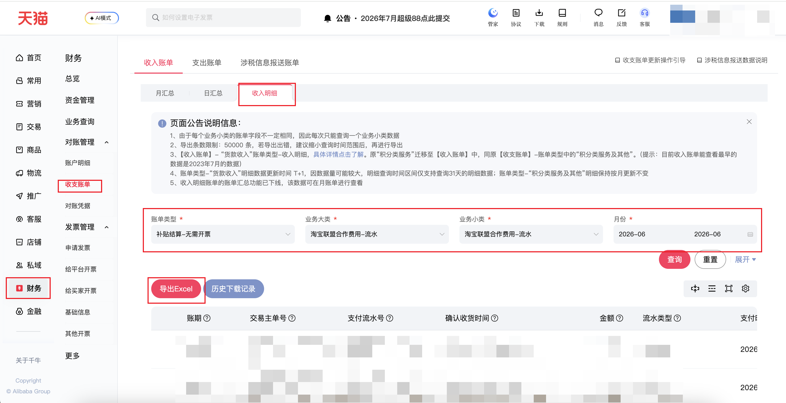

| 属性             | 值                                                                                                                           |
| ---------------- | ---------------------------------------------------------------------------------------------------------------------------- |
| **连接器类型**   | `RPA 连接器`                                                                                                                 |
| **连接器名称**   | `ODS_财务收支账单收入明细(千牛RPA)`                                                                                          |
| **连接器代码**   | `rpa.conn.qianniu.finance.income.bill.detail`                                                                                |
| **操作类型**     | `文件导出`                                                                                                                   |
| **目标网页**     | `https://myseller.taobao.com/home.htm/whale-accountant/bill/summary?billDirection=income&billType=detail`                    |
| **适用场景**     | 导出千牛收支账单中的收入明细，支持按账单类型、业务大类、业务小类和同月时间范围筛选                                           |
| **数据表名**     | `ods_rpa_qianniu_finance_income_bill_detail_du`                                                                              |
| **业务表名**     | `ODS_财务收支账单收入明细(千牛RPA)`                                                                                          |

### 目标页面

> **取数路径**：千牛—财务—收支账单—收入账单—收入明细
>
> **取数链接**：[https://myseller.taobao.com/home.htm/whale-accountant/bill/summary?billDirection=income&billType=detail](https://myseller.taobao.com/home.htm/whale-accountant/bill/summary?billDirection=income&billType=detail)



### 业务入参

| 字段 | 中文释义 | 数据类型 | 必填 | 默认值 | 说明 |
| ---- | -------- | -------- | ---- | ------ | ---- |
| `bill_type` | 账单类型 | `String` | 是 | — | 填写页面「账单类型」下拉框中的中文选项；不同账单类型对应不同的时间选择方式和导出字段 |
| `biz_major` | 业务大类 | `String` | 是 | — | 填写所选账单类型下页面「业务大类」下拉框中的中文选项 |
| `biz_minor` | 业务小类 | `String` | 是 | — | 填写所选业务大类下页面「业务小类」下拉框中的中文选项 |
| `custom_start_date` | 开始时间 | `String` | 是 | — | 支持格式：YYYYMM、YYYY-MM、YYYYMMDD、YYYY-MM-DD；账单类型为「货款收入」时按日期选择，其他类型按月份选择；须与结束时间处于同一个自然月 |
| `custom_end_date` | 结束时间 | `String` | 是 | — | 支持格式：YYYYMM、YYYY-MM、YYYYMMDD、YYYY-MM-DD；不得早于开始时间，且须与开始时间处于同一个自然月 |

### 入参样例

```json
{
  "bill_type": "积分",
  "biz_major": "消费",
  "biz_minor": "消费",
  "custom_start_date": "20260401",
  "custom_end_date": "20260430"
}
```

### 入参校验

```json-schema collapsed
{
  "$schema": "https://json-schema.org/draft/2020-12/schema",
  "title": "千牛-收入账单收入明细 - 查询入参",
  "description": "导出千牛收支账单中的收入明细。须按页面三级联筛选项（账单类型 → 业务大类 → 业务小类）填写中文原文，并指定同月内的时间范围；级联可选项因账号而异，选择失败时连接器会返回当前账号完整可选项树。",
  "type": "object",
  "properties": {
    "bill_type": {
      "type": "string",
      "minLength": 1,
      "description": "账单类型，必填。须填写页面「账单类型」下拉框中的中文原文（如「补贴结算-无需开票」）。不同账单类型对应不同的时间选择器与导出字段：仅「货款收入」使用日期选择器，其余类型使用月份选择器。2026-07-10 实测常见类型包括「补贴结算-无需开票」「积分服务及其他-调账」「积分类服务及其他」「货款收入」，实际可选项以当前账号页面为准。",
      "examples": [
        "补贴结算-无需开票",
        "积分类服务及其他",
        "积分服务及其他-调账",
        "货款收入"
      ]
    },
    "biz_major": {
      "type": "string",
      "minLength": 1,
      "description": "业务大类，必填。须填写所选账单类型下页面「业务大类」下拉框中的中文原文；为三级联第二级，依赖 bill_type。可选项因账号及账单类型而异，须与页面展示完全一致。",
      "examples": [
        "淘宝联盟合作费用-流水",
        "消费"
      ]
    },
    "biz_minor": {
      "type": "string",
      "minLength": 1,
      "description": "业务小类，必填。须填写所选业务大类下页面「业务小类」下拉框中的中文原文；为三级联第三级，依赖 bill_type 与 biz_major。可选项因账号及上级筛选而异，须与页面展示完全一致。",
      "examples": [
        "淘宝联盟合作费用-流水",
        "消费"
      ]
    },
    "custom_start_date": {
      "type": "string",
      "description": "开始时间，必填。账单类型为「货款收入」时按日期选择，支持 YYYYMMDD、YYYY-MM-DD；其余类型按月份选择，支持 YYYYMM、YYYY-MM，亦可传入 YYYYMMDD / YYYY-MM-DD 并由连接器归一化到对应月份。不得晚于 custom_end_date，且须与结束时间处于同一自然月（不可跨月）。",
      "pattern": "^(\\d{6}|\\d{8}|\\d{4}-\\d{2}|\\d{4}-\\d{2}-\\d{2})$",
      "examples": [
        "202606",
        "2026-06",
        "20260401",
        "2026-04-01"
      ]
    },
    "custom_end_date": {
      "type": "string",
      "description": "结束时间，必填。格式规则同 custom_start_date：「货款收入」按日期选择，其余类型按月份选择。不得早于 custom_start_date，且须与开始时间处于同一自然月（不可跨月）。",
      "pattern": "^(\\d{6}|\\d{8}|\\d{4}-\\d{2}|\\d{4}-\\d{2}-\\d{2})$",
      "examples": [
        "202606",
        "2026-06",
        "20260430",
        "2026-04-30"
      ]
    }
  },
  "required": [
    "bill_type",
    "biz_major",
    "biz_minor",
    "custom_start_date",
    "custom_end_date"
  ],
  "additionalProperties": false
}
```

> **运行时补充校验**（由连接器 `_validate_inputs` 执行，JSON Schema 无法完全表达）：
>
> - 五个字段均不能为空；缺失级联字段时，连接器会返回当前账号完整三级联可选项树。
> - `custom_start_date` 不能晚于 `custom_end_date`。
> - 开始时间与结束时间不可跨月。
> - 级联入参在页面搜索无匹配时，连接器会返回当前账号该级全部可选项，便于修正入参。

### 数据字段

不同账单类型导出的字段不同；下表汇总连接器支持的全部字段，当前账单类型不提供的字段为空。

| 字段 | 中文释义 | 数据类型 | 可为空 | 取数路径 | 示例 |
| ---- | -------- | -------- | ------ | -------- | ---- |
| `billCycle` | 账期 | `Number` | 否 | `CSV.0.账期` | `202606` |
| `fundDirection` | 资金方向 | `String` | 是 | `CSV.0.资金方向` | `null` |
| `billCategory` | 账单大类 | `String` | 否 | `CSV.0.账单大类` | `补贴结算（合作费用冻结解冻明细-无需开票）` |
| `bizMajorName` | 业务大类 | `String` | 否 | `CSV.0.业务大类` | `淘宝联盟合作费用-流水` |
| `bizMinorName` | 业务小类 | `String` | 否 | `CSV.0.业务小类` | `淘宝联盟合作费用-流水` |
| `tradeMainOrderNo` | 交易主单号 | `String` | 是 | `CSV.0.交易主单号` | `5118036****015423` |
| `payFlowNo` | 支付流水号 | `String` | 是 | `CSV.0.支付流水号` | `FP1202_867596****0197` |
| `confirmReceiptTime` | 确认收货时间 | `String` | 是 | `CSV.0.确认收货时间` | `2026-05-31 13:41:59` |
| `amount` | 金额 | `Number / String` | 是 | `CSV.0.金额` | `-0.13` |
| `flowType` | 流水类型 | `String` | 是 | `CSV.0.流水类型` | `结算解冻` |
| `payTime` | 支付时间 | `String` | 是 | `CSV.0.支付时间` | `2026-05-27 23:36:12` |
| `settleChannel` | 结算渠道 | `String` | 是 | `CSV.0.结算渠道` | `支付宝` |
| `transactionTime` | 业务发生时间 | `String` | 是 | `CSV.0.时间` | `null` |
| `orderId` | 订单号 | `String` | 是 | `CSV.0.订单号` | `null` |
| `pointServiceFeeAmount` | 积分类服务费金额 | `Number / String` | 是 | `CSV.0.积分类服务费金额` | `null` |
| `alipayOrderNo` | 支付宝订单号 | `String` | 是 | `CSV.0.支付宝订单号` | `null` |
| `remark` | 备注 | `String` | 是 | `CSV.0.备注` | `null` |
| `tradeSubOrderNo` | 交易子订单号 | `String` | 是 | `CSV.0.交易子订单号` | `null` |
| `alipayAccount` | 支付宝账号 | `String` | 是 | `CSV.0.支付宝账号` | `null` |
| `subOrderId` | 子订单号 | `String` | 是 | `CSV.0.子订单号` | `null` |
| `orderCreatedAt` | 下单时间 | `String` | 是 | `CSV.0.下单时间` | `null` |
| `itemId` | 商品 ID | `String` | 是 | `CSV.0.商品ID` | `null` |
| `sku` | 商品 SKU | `String` | 是 | `CSV.0.sku` | `null` |
| `itemName` | 商品名称 | `String` | 是 | `CSV.0.商品名称` | `null` |
| `quantity` | 商品数量 | `Number / String` | 是 | `CSV.0.数量` | `null` |
| `unitPrice` | 商品单价（元） | `Number / String` | 是 | `CSV.0.单价（元）` | `null` |
| `actualOrderAmount` | 订单实际金额（元） | `Number / String` | 是 | `CSV.0.订单实际金额（元）` | `null` |
| `refundOrderNo` | 退款单号 | `String` | 是 | `CSV.0.退款单号` | `null` |
| `refundAmount` | 退款金额（元） | `Number / String` | 是 | `CSV.0.退款金额（元）` | `null` |
| `paymentChannel` | 收付渠道 | `String` | 是 | `CSV.0.收/付渠道` | `null` |
| `bizFlowNo` | 业务流水号 | `String` | 是 | `CSV.0.业务流水号` | `null` |
| `merchantOrderNo` | 商户订单号 | `String` | 是 | `CSV.0.商户订单号` | `null` |
| `payoutTime` | 打款时间 | `String` | 是 | `CSV.0.打款时间` | `null` |
| `payoutUpdatedAt` | 打款更新时间 | `String` | 是 | `CSV.0.打款更新时间` | `null` |
| `billType` | 查询账单类型 | `String` | 否 | 附加 | `补贴结算-无需开票` |
| `bizMajor` | 查询业务大类 | `String` | 否 | 附加 | `淘宝联盟合作费用-流水` |
| `bizMinor` | 查询业务小类 | `String` | 否 | 附加 | `淘宝联盟合作费用-流水` |
| `bizDate` | 业务日期 | `String` | 否 | 附加 |  |
| `accountId` | 授权 ID | `String` | 否 | 附加 |  |

### 数据样例

```json
[
  {
    "billCycle": 202606,
    "billCategory": "补贴结算（合作费用冻结解冻明细-无需开票）",
    "bizMajorName": "淘宝联盟合作费用-流水",
    "bizMinorName": "淘宝联盟合作费用-流水",
    "tradeMainOrderNo": "5118036****015423",
    "payFlowNo": "FP1202_867596****0197",
    "confirmReceiptTime": "2026-05-31 13:41:59",
    "amount": -0.13,
    "flowType": "结算解冻",
    "payTime": "2026-05-27 23:36:12",
    "settleChannel": "支付宝",
    "transactionTime": null,
    "orderId": null,
    "pointServiceFeeAmount": null,
    "alipayOrderNo": null,
    "remark": null,
    "fundDirection": null,
    "tradeSubOrderNo": null,
    "alipayAccount": null,
    "subOrderId": null,
    "orderCreatedAt": null,
    "itemId": null,
    "sku": null,
    "itemName": null,
    "quantity": null,
    "unitPrice": null,
    "actualOrderAmount": null,
    "refundOrderNo": null,
    "refundAmount": null,
    "paymentChannel": null,
    "bizFlowNo": null,
    "merchantOrderNo": null,
    "payoutTime": null,
    "payoutUpdatedAt": null,
    "billType": "补贴结算-无需开票",
    "bizMajor": "淘宝联盟合作费用-流水",
    "bizMinor": "淘宝联盟合作费用-流水",
    "bizDate": "2026-07-12T16:00:00.000Z",
    "accountId": "***"
  }
]
```

---
