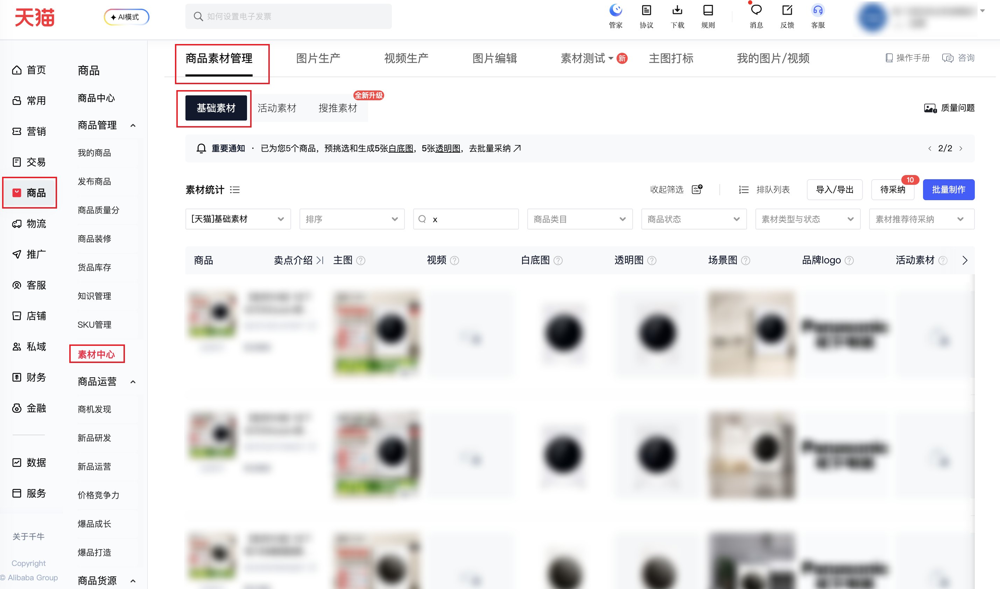

:::warning[页面兼容性说明]
当前连接器同时支持**天猫（淘宝B店）**与**淘宝C店**，但 `scene` 必须与店铺类型一致：天猫请传 `TMALL_BASIC` / `TMALL_PROMO`，淘宝C店请传 `TAOBAO_BASIC` / `TAOBAO_PROMO`。不一致会失败，请确认后使用！
:::

| 属性             | 值                                                                          |
| ---------------- | --------------------------------------------------------------------------- |
| **连接器类型**   | `RPA 连接器`|
| **连接器名称**   | `ODS_商品素材中心基础素材明细报表(千牛RPA)`|
| **连接器代码**   | `rpa.conn.qianniu.item.material.list.report`|
| **操作类型**     | `页面解析`|
| **目标网页**     | `https://myseller.taobao.com/home.htm/material-center/material-management?tab=basic`|
| **适用场景**     | 采集千牛素材中心—商品素材管理—基础素材明细，支持按素材场景（须与店铺类型一致）、排序、商品ID或名称、类目、商品状态、素材类型与状态、大促活动、素材推荐待采纳筛选；自动翻页，最多 100 页、采集条数上限 1～1000|
| **数据表名**     | `ods_rpa_qianniu_item_material_list_report_du`|
| **业务表名**     | `ODS_商品素材中心基础素材明细报表(千牛RPA)`|

### 目标页面

> **取数路径**：千牛商家工作台—商品—素材中心—商品素材管理—基础素材
>
> **取数链接**：[https://myseller.taobao.com/home.htm/material-center/material-management?tab=basic](https://myseller.taobao.com/home.htm/material-center/material-management?tab=basic)



### 业务入参

| 字段 | 中文释义 | 数据类型 | 必填 | 默认值 | 说明 |
| ---- | -------- | -------- | ---- | ------ | ---- |
| `scene` | 素材场景 | `String` | 否 | `-` | 不传则沿用页面当前场景。传入后须与当前店铺类型一致，不一致会失败。淘宝B店/天猫允许值：`TMALL_BASIC`（[天猫]基础素材）/ `TMALL_PROMO`（天猫大促）。淘宝C店/千牛允许值：`TAOBAO_BASIC`（[淘宝]基础素材）/ `TAOBAO_PROMO`（淘宝大促） |
| `sort` | 排序 | `String` | 否 | `-` | 不传则不改页面排序。允许值：`SHELF_TIME_ASC`（上架时间由低到高排序）/ `SHELF_TIME_DESC`（上架时间由高到低排序）/ `TOTAL_SALES_ASC`（总销量由低到高排序）/ `TOTAL_SALES_DESC`（总销量由高到低排序）/ `FIRST_SHELF_TIME_ASC`（最初上架时间由低到高排序）/ `FIRST_SHELF_TIME_DESC`（最初上架时间由高到低排序）/ `PRICE_ASC`（价格由低到高排序）/ `PRICE_DESC`（价格由高到低排序） |
| `item_id_or_name` | 商品ID或名称 | `String` | 否 | `-` | 填商品 ID 或商品名称；不传则不填搜索框 |
| `category` | 商品类目 | `String` | 否 | `-` | 须与页面「商品类目」下拉原文完全一致；不传则不选 |
| `item_status` | 商品状态 | `String` | 否 | `-` | 不传则不选。允许值：`ON_SALE`（出售中）/ `IN_STOCK`（仓库中） |
| `material_type` | 素材类型 | `String` | 条件必填 | `-` | 仅 `TMALL_BASIC` / `TAOBAO_BASIC` 可传，且须与 `material_status` 成对（都传或都不传）；`TMALL_PROMO` / `TAOBAO_PROMO` 禁止传入。共用允许值：`ALL`（所有类型）/ `SELL_POINT_1`（卖点1）/ `SELL_POINT_2`（卖点2）/ `WHITE_BG`（白底图）/ `TRANSPARENT`（透明图）/ `SCENE`（场景图）/ `SHORT_TITLE`（短标题）/ `SEEDING_SINGLE`（种草单品素材）/ `SEEDING_MATCH`（种草搭配素材）。仅 `TMALL_BASIC`（淘宝B店/天猫基础素材）另有：`BRAND_LOGO`（品牌logo）/ `BENEFIT_SHORT`（商品利益点（短））。仅 `TAOBAO_BASIC`（淘宝C店/千牛基础素材）另有：`ITEM_NAME_8`（宝贝名称(8个字)）/ `RECOMMEND_REASON`（推荐理由）。种草类型的状态枚举见 `material_status` |
| `material_status` | 素材状态 | `String` / `List[String]` | 条件必填 | `-` | `TMALL_BASIC` / `TAOBAO_BASIC` 须与 `material_type` 成对，且只能单值（字符串，不能数组）。非种草类型允许值：`PENDING_FILL`（待补充）/ `AUDIT_REJECTED`（审核不通过）/ `AUDIT_PASSED`（审核通过）/ `PENDING_AUDIT`（待审核）。种草类型（`material_type` 为 `SEEDING_SINGLE` / `SEEDING_MATCH`）允许值：`FEATURED`（精选）/ `PENDING_FILL`（待补充）。`TMALL_PROMO` / `TAOBAO_PROMO` 为独立筛选项，不与 `material_type` 成对，可多选，英文逗号分隔或 JSON 数组，允许值：`PENDING_FILL`（待补充）/ `PENDING_AUDIT`（待审核）/ `AUDIT_PASSED`（审核通过）/ `AUDIT_REJECTED`（审核不通过） |
| `campaign` | 大促活动 | `String` | 条件必填 | `-` | 仅 `TMALL_PROMO` / `TAOBAO_PROMO`。与 `campaign_sub` 成对（传入任一则必须两个都传）。须与页面「大促活动商品」级联第一级原文完全一致。`TMALL_BASIC` / `TAOBAO_BASIC` 禁止传入 |
| `campaign_sub` | 大促子活动 | `String` | 条件必填 | `-` | 仅 `TMALL_PROMO` / `TAOBAO_PROMO`。与 `campaign` 成对。须与页面「大促活动商品」级联第二级原文完全一致。`TMALL_BASIC` / `TAOBAO_BASIC` 禁止传入 |
| `recommend_types` | 素材推荐待采纳 | `String` / `List[String]` | 否 | `-` | 不传则不选。英文逗号分隔或 JSON 数组。须属于当前 `scene` 的允许值，当前场景页面没有的项会失败。`TMALL_BASIC` / `TAOBAO_BASIC`：`ALL`（全部）/ `WHITE_BG`（白底图）/ `TRANSPARENT`（透明图）/ `SCENE`（场景图）/ `LONG_IMAGE`（商品长图推荐）/ `SELL_POINT_1`（卖点1推荐）/ `SELL_POINT_2`（卖点2推荐）/ `SHORT_TITLE`（短标题推荐）。`TMALL_PROMO`：`ALL`（全部）/ `TRANSPARENT`（透明图）/ `SCENE`（场景图）/ `SHORT_TITLE`（短标题推荐），无白底图/长图/卖点。`TAOBAO_PROMO`：`ALL`（全部）/ `WHITE_BG`（白底图）/ `SCENE`（场景图）/ `LONG_IMAGE`（商品长图推荐），无透明图/卖点/短标题 |
| `collect_limit` | 采集条数上限 | `String` | 否 | `-` | 正整数字符串，范围 1～1000（每页 10 条 × 最多 100 页）。不传或空：按接口 total 翻完，最多 100 页。传入：翻页数 = 向上取整(min(采集上限, total) / 10)，仍不超过 100 页。接口实际条数不足时仍成功，不凑条 |

### 入参样例

`category` / `campaign` / `campaign_sub` 须换成当前店铺页面下拉原文。

淘宝C店 / [淘宝]基础素材：白底图待补充，按上架时间由高到低，采 30 条。

```json
{
  "scene": "TAOBAO_BASIC",
  "sort": "SHELF_TIME_DESC",
  "item_status": "ON_SALE",
  "material_type": "WHITE_BG",
  "material_status": "PENDING_FILL",
  "collect_limit": "30"
}
```

淘宝C店 / [淘宝]基础素材：C店专属「宝贝名称」，按商品 ID 搜索，推荐待采纳用逗号串。

```json
{
  "scene": "TAOBAO_BASIC",
  "item_id_or_name": "123456789012",
  "material_type": "ITEM_NAME_8",
  "material_status": "AUDIT_PASSED",
  "recommend_types": "WHITE_BG,SHORT_TITLE",
  "collect_limit": "50"
}
```

淘宝C店 / [淘宝]基础素材：种草单品 + 精选（种草状态不能用待审核等普通枚举）。

```json
{
  "scene": "TAOBAO_BASIC",
  "material_type": "SEEDING_SINGLE",
  "material_status": "FEATURED",
  "collect_limit": "20"
}
```

淘宝B店 / [天猫]基础素材：B店专属「品牌logo」，带类目与仓库中，推荐待采纳用数组。

```json
{
  "scene": "TMALL_BASIC",
  "sort": "PRICE_ASC",
  "category": "女装/连衣裙",
  "item_status": "IN_STOCK",
  "material_type": "BRAND_LOGO",
  "material_status": "PENDING_AUDIT",
  "recommend_types": ["SCENE", "LONG_IMAGE"],
  "collect_limit": "40"
}
```

淘宝B店 / 天猫大促：活动与子活动成对，素材状态多选；推荐只能用该场景有的项（不能传白底图/长图/卖点）。

```json
{
  "scene": "TMALL_PROMO",
  "campaign": "天天低价",
  "campaign_sub": "官方立减",
  "material_status": ["PENDING_FILL", "PENDING_AUDIT"],
  "recommend_types": ["TRANSPARENT", "SCENE"],
  "collect_limit": "20"
}
```

淘宝C店 / 淘宝大促：素材状态用逗号串；推荐只能用该场景有的项（不能传透明图/卖点/短标题）。

```json
{
  "scene": "TAOBAO_PROMO",
  "campaign": "天天低价",
  "campaign_sub": "官方立减",
  "material_status": "PENDING_FILL,AUDIT_PASSED",
  "recommend_types": ["WHITE_BG", "LONG_IMAGE"],
  "collect_limit": "20"
}
```

不传场景与筛选：沿用页面当前条件，按接口 total 翻完（最多 100 页）。

```json
{}
```

### 入参校验

```json-schema collapsed
{
  "$schema": "https://json-schema.org/draft/2020-12/schema",
  "title": "千牛-商品-素材中心-基础素材明细 - 查询入参",
  "description": "采集千牛素材中心—商品素材管理—基础素材明细，支持按素材场景（须与店铺类型一致）、排序、商品ID或名称、类目、商品状态、素材类型与状态、大促活动、素材推荐待采纳筛选；自动翻页，最多 100 页、采集条数上限 1～1000",
  "type": "object",
  "properties": {
    "scene": {
      "type": "string",
      "description": "素材场景；不传则沿用页面当前场景，传入后须与当前店铺类型一致。淘宝B店/天猫：TMALL_BASIC（[天猫]基础素材）/ TMALL_PROMO（天猫大促）。淘宝C店/千牛：TAOBAO_BASIC（[淘宝]基础素材）/ TAOBAO_PROMO（淘宝大促）",
      "enum": ["TMALL_BASIC", "TMALL_PROMO", "TAOBAO_BASIC", "TAOBAO_PROMO"]
    },
    "sort": {
      "type": "string",
      "description": "排序；不传则不改页面排序。允许值：SHELF_TIME_ASC（上架时间由低到高排序）/ SHELF_TIME_DESC（上架时间由高到低排序）/ TOTAL_SALES_ASC（总销量由低到高排序）/ TOTAL_SALES_DESC（总销量由高到低排序）/ FIRST_SHELF_TIME_ASC（最初上架时间由低到高排序）/ FIRST_SHELF_TIME_DESC（最初上架时间由高到低排序）/ PRICE_ASC（价格由低到高排序）/ PRICE_DESC（价格由高到低排序）",
      "enum": ["SHELF_TIME_ASC", "SHELF_TIME_DESC", "TOTAL_SALES_ASC", "TOTAL_SALES_DESC", "FIRST_SHELF_TIME_ASC", "FIRST_SHELF_TIME_DESC", "PRICE_ASC", "PRICE_DESC"]
    },
    "item_id_or_name": {
      "type": "string",
      "description": "商品ID或商品名称；不传则不填搜索框"
    },
    "category": {
      "type": "string",
      "description": "商品类目，须与页面「商品类目」下拉原文完全一致；不传则不选"
    },
    "item_status": {
      "type": "string",
      "description": "商品状态；不传则不选。允许值：ON_SALE（出售中）/ IN_STOCK（仓库中）",
      "enum": ["ON_SALE", "IN_STOCK"]
    },
    "material_type": {
      "type": "string",
      "description": "素材类型；仅 TMALL_BASIC / TAOBAO_BASIC 可传，且须与 material_status 成对（都传或都不传）；TMALL_PROMO / TAOBAO_PROMO 禁止传入。共用：ALL / SELL_POINT_1 / SELL_POINT_2 / WHITE_BG / TRANSPARENT / SCENE / SHORT_TITLE / SEEDING_SINGLE / SEEDING_MATCH。仅 TMALL_BASIC：BRAND_LOGO / BENEFIT_SHORT。仅 TAOBAO_BASIC：ITEM_NAME_8 / RECOMMEND_REASON。种草类型状态见 material_status",
      "enum": ["ALL", "SELL_POINT_1", "SELL_POINT_2", "WHITE_BG", "TRANSPARENT", "SCENE", "SHORT_TITLE", "BRAND_LOGO", "BENEFIT_SHORT", "ITEM_NAME_8", "RECOMMEND_REASON", "SEEDING_SINGLE", "SEEDING_MATCH"]
    },
    "material_status": {
      "description": "素材状态。TMALL_BASIC / TAOBAO_BASIC 须与 material_type 成对且只能单值。非种草：PENDING_FILL（待补充）/ AUDIT_REJECTED（审核不通过）/ AUDIT_PASSED（审核通过）/ PENDING_AUDIT（待审核）。种草（SEEDING_SINGLE / SEEDING_MATCH）：FEATURED（精选）/ PENDING_FILL（待补充）。TMALL_PROMO / TAOBAO_PROMO 为独立多选，英文逗号分隔或 JSON 数组：PENDING_FILL / PENDING_AUDIT / AUDIT_PASSED / AUDIT_REJECTED",
      "anyOf": [
        { "type": "string" },
        { "type": "array", "items": { "type": "string" } }
      ]
    },
    "campaign": {
      "type": "string",
      "description": "大促活动；仅 TMALL_PROMO / TAOBAO_PROMO，须与页面「大促活动商品」级联第一级原文完全一致，与 campaign_sub 成对；TMALL_BASIC / TAOBAO_BASIC 禁止传入"
    },
    "campaign_sub": {
      "type": "string",
      "description": "大促子活动；仅 TMALL_PROMO / TAOBAO_PROMO，须与页面「大促活动商品」级联第二级原文完全一致，与 campaign 成对；TMALL_BASIC / TAOBAO_BASIC 禁止传入"
    },
    "recommend_types": {
      "description": "素材推荐待采纳；不传则不选；英文逗号分隔或 JSON 数组；须属于当前 scene 的允许值。TMALL_BASIC / TAOBAO_BASIC：ALL / WHITE_BG / TRANSPARENT / SCENE / LONG_IMAGE / SELL_POINT_1 / SELL_POINT_2 / SHORT_TITLE。TMALL_PROMO：ALL / TRANSPARENT / SCENE / SHORT_TITLE（无白底图/长图/卖点）。TAOBAO_PROMO：ALL / WHITE_BG / SCENE / LONG_IMAGE（无透明图/卖点/短标题）",
      "anyOf": [
        { "type": "string" },
        { "type": "array", "items": { "type": "string" } }
      ]
    },
    "collect_limit": {
      "type": "string",
      "description": "采集条数上限，正整数字符串，范围 1～1000（每页 10 条 × 最多 100 页）；不传或空则按接口 total 翻完（最多 100 页）；传入则翻页数=向上取整(min(采集上限, total)/10)，仍不超过 100 页；接口实际不足时仍成功，不凑条",
      "pattern": "^(1000|[1-9]\\d{0,2})$"
    }
  },
  "required": [],
  "additionalProperties": false,
  "dependentRequired": {
    "campaign": ["campaign_sub"],
    "campaign_sub": ["campaign"]
  },
  "allOf": [
    {
      "if": {
        "properties": { "scene": { "enum": ["TMALL_PROMO", "TAOBAO_PROMO"] } },
        "required": ["scene"]
      },
      "then": {
        "not": {
          "required": ["material_type"]
        }
      }
    },
    {
      "if": {
        "properties": { "scene": { "enum": ["TMALL_BASIC", "TAOBAO_BASIC"] } },
        "required": ["scene"]
      },
      "then": {
        "not": {
          "anyOf": [
            { "required": ["campaign"] },
            { "required": ["campaign_sub"] }
          ]
        },
        "dependentRequired": {
          "material_type": ["material_status"],
          "material_status": ["material_type"]
        }
      }
    },
    {
      "if": {
        "properties": { "scene": { "enum": ["TMALL_BASIC", "TAOBAO_BASIC"] } },
        "required": ["scene", "recommend_types"]
      },
      "then": {
        "properties": {
          "recommend_types": {
            "anyOf": [
              { "type": "string" },
              {
                "type": "array",
                "items": {
                  "enum": ["ALL", "WHITE_BG", "TRANSPARENT", "SCENE", "LONG_IMAGE", "SELL_POINT_1", "SELL_POINT_2", "SHORT_TITLE"]
                }
              }
            ]
          }
        }
      }
    },
    {
      "if": {
        "properties": { "scene": { "const": "TMALL_PROMO" } },
        "required": ["scene", "recommend_types"]
      },
      "then": {
        "properties": {
          "recommend_types": {
            "anyOf": [
              { "type": "string" },
              { "type": "array", "items": { "enum": ["ALL", "TRANSPARENT", "SCENE", "SHORT_TITLE"] } }
            ]
          }
        }
      }
    },
    {
      "if": {
        "properties": { "scene": { "const": "TAOBAO_PROMO" } },
        "required": ["scene", "recommend_types"]
      },
      "then": {
        "properties": {
          "recommend_types": {
            "anyOf": [
              { "type": "string" },
              { "type": "array", "items": { "enum": ["ALL", "WHITE_BG", "SCENE", "LONG_IMAGE"] } }
            ]
          }
        }
      }
    }
  ]
}
```

### 数据字段

`bizDate` 格式为 `YYYYMMDD`。

:::field-tree
@define 素材标签
| `description` | 标签说明 | `String` | 是 | 页面解析 | `维护素材可获取淘宝首页流量` |
| `name` | 标签名称 | `String` | 是 | 页面解析 | `****` (已脱敏) |
| `order` | 排序 | `Number` | 是 | 页面解析 | `3` |

@define 商品域明细
| `itemId` | 商品 ID | `Number` | 是 | 页面解析 | `955****277` (已脱敏) |
| `itemName` | 商品名称 | `String` | 是 | 页面解析 | `****` (已脱敏) |
| `itemPic` | 商品主图 | `String` | 是 | 页面解析 | `i4/****` (已脱敏) |
| `itemStatus` | 商品状态编码 | `Number` | 是 | 页面解析 | `3` |
| `itemStatusName` | 商品状态名称 | `String` | 是 | 页面解析 | `仓库中` |
| `labelList` @素材标签 | 标签列表 | `List[Dict]` | 是 | 页面解析 | 见数据样例 |
| `originalPriceMax` | 原价上限 | `Number` | 是 | 页面解析 | `11.5` |
| `originalPriceMin` | 原价下限 | `Number` | 是 | 页面解析 | `11.5` |

@define 商品域信息
| `domainId` | 域 ID | `String` | 是 | 页面解析 | `955****277` (已脱敏) |
| `domainType` | 域类型 | `Number` | 是 | 页面解析 | `1001` |
| `info` @商品域明细 | 商品信息 | `Dict` | 是 | 页面解析 | 见数据样例 |

@define 表单规则
| `required` | 是否必填 | `Boolean` | 是 | 页面解析 | `true` |

@define 素材表单项
| `component` | 组件类型 | `String` | 否 | 页面解析 | `MaterialInput` |
| `componentProps` | 组件属性 | `Dict` | 否 | 页面解析 | 见数据样例 |
| `defaultValue` | 默认值 | `Dict` | 是 | 页面解析 | 见数据样例 |
| `description` | 说明槽 | `Dict` | 是 | 页面解析 | 见数据样例 |
| `name` | 字段名 | `String` | 否 | 页面解析 | `sellPoint1` |
| `rules` @表单规则 | 校验规则 | `List[Dict]` | 是 | 页面解析 | 见数据样例 |
| `tip` | 提示文案 | `String` | 是 | 页面解析 | `同商品卖点1` |
| `title` | 字段标题 | `String` | 否 | 页面解析 | `卖点1` |

@define 素材表单定义
| `items` @素材表单项 | 表单项列表 | `List[Dict]` | 是 | 页面解析 | 见数据样例 |

@define 素材表单
| `bizId` | 业务 ID | `Number` | 是 | 页面解析 | `1` |
| `bizType` | 业务类型 | `Number` | 否 | 页面解析 | `22` |
| `domainId` | 域 ID | `Number` | 否 | 页面解析 | `955****277` (已脱敏) |
| `domainType` | 域类型 | `Number` | 否 | 页面解析 | `1001` |
| `form` @素材表单定义 | 表单定义 | `Dict` | 否 | 页面解析 | 见数据样例 |
| `templateId` | 模板 ID | `Number` | 是 | 页面解析 | `60878` |
| `title` | 表单标题 | `String` | 否 | 页面解析 | `素材表单` |

@define 素材分组
| `formVOList` @素材表单 | 素材表单列表 | `List[Dict]` | 是 | 页面解析 | 见数据样例 |
| `groupName` | 分组名称 | `String` | 是 | 页面解析 | `白底图` |

| 字段 | 中文释义 | 数据类型 | 可为空 | 取数路径 | 示例 |
| ---- | -------- | -------- | ------ | -------- | ---- |
| `material` @素材分组 | 素材分组 | `List[Dict]` | 是 | 页面解析 | 见数据样例 |
| `domainInfo` @商品域信息 | 商品域信息 | `Dict` | 是 | 页面解析 | 见数据样例 |
| `bizDate` | 业务日期 | `String` | 否 | 附加 | `20260918` |
| `accountId` | 授权 ID | `String` | 否 | 附加 | `1****3` (已脱敏) |
:::

### 数据样例

```json
{
  "material": [
    {
      "formVOList": [
        {
          "bizId": 1,
          "bizType": 22,
          "domainId": "955****277",
          "domainType": 1001,
          "form": {
            "items": [
              {
                "component": "MaterialInput",
                "componentProps": {
                  "bizId": 1,
                  "bizType": 22,
                  "domainId": "955****277",
                  "domainType": 1001,
                  "extra": "",
                  "fieldType": 3,
                  "hasLimitHint": true,
                  "makingTools": "7",
                  "materialKey": "sellPoint1",
                  "maxLength": "12",
                  "minLength": "6"
                },
                "name": "sellPoint1",
                "rules": [{ "required": true }],
                "tip": "",
                "title": "卖点1"
              }
            ]
          },
          "templateId": 60878,
          "title": "素材表单"
        }
      ],
      "groupName": "统一素材中心-文本提报-隐藏"
    },
    {
      "formVOList": [
        {
          "bizType": 22,
          "domainId": "955****277",
          "domainType": 1001,
          "form": {
            "items": [
              {
                "component": "union_material_column_ic_main_pic",
                "componentProps": {
                  "extra": "<p>该图片为商品发布端主图</p>"
                },
                "defaultValue": {
                  "count": 5,
                  "cover": "https://img.alicdn.com/****"
                },
                "name": "itemPic",
                "title": "主图"
              }
            ]
          },
          "title": "主图"
        }
      ],
      "groupName": "主图"
    },
    {
      "formVOList": [
        {
          "bizId": 3,
          "bizType": 22,
          "domainId": "955****277",
          "domainType": 1001,
          "form": {
            "items": [
              {
                "component": "MaterialImageUpload",
                "componentProps": {
                  "action": "/dpss/yinhe/upload/uploadImgNew.do?templateId=60880&domainId=955****277",
                  "bizId": 3,
                  "fileSuffix": "jpg,jpeg,png",
                  "height": "800",
                  "materialKey": "itemWhiteImg",
                  "width": "800"
                },
                "name": "itemWhiteImg",
                "rules": [{ "required": true }],
                "title": "白底图"
              }
            ]
          },
          "templateId": 60880,
          "title": "素材表单"
        }
      ],
      "groupName": "白底图"
    }
  ],
  "domainInfo": {
    "domainType": 1001,
    "domainId": "955****277",
    "info": {
      "itemId": "955****277",
      "originalPriceMin": 11.5,
      "labelList": [
        {
          "description": "维护素材可获取淘宝首页流量",
          "name": "****",
          "order": 3
        }
      ],
      "itemName": "****",
      "itemStatusName": "仓库中",
      "itemPic": "i4/****",
      "itemStatus": 3,
      "originalPriceMax": 11.5
    }
  },
  "bizDate": "20260918",
  "accountId": "1****3"
}
```

---
