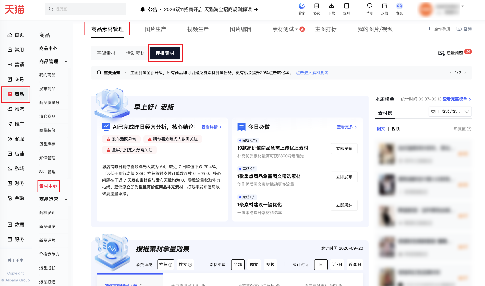
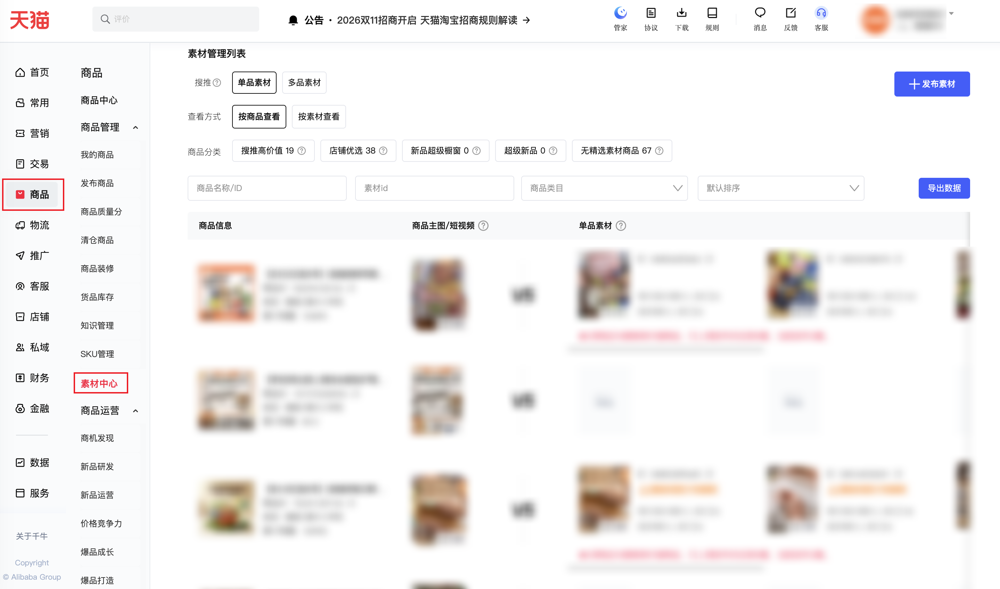

| 属性             | 值                                                                          |
| ---------------- | --------------------------------------------------------------------------- |
| **连接器类型**   | `RPA 连接器`|
| **连接器名称**   | `ODS_商品素材中心搜堆单品素材明细报表(千牛RPA)`|
| **连接器代码**   | `rpa.conn.qianniu.item.material.single.item.report`|
| **操作类型**     | `页面解析`|
| **目标网页**     | `https://myseller.taobao.com/home.htm/material-center/material-management?tab=recommend`|
| **适用场景**     | 采集千牛素材中心—商品素材管理—搜推素材中的单品素材（按商品查看），支持按商品分类、商品名称或ID、素材id、商品类目、排序筛选；自动翻页，最多 100 页、采集条数上限 1～1000|
| **数据表名**     | `ods_rpa_qianniu_item_material_single_item_report_du`|
| **业务表名**     | `ODS_商品素材中心搜堆单品素材明细报表(千牛RPA)`|

### 目标页面

> **取数路径**：千牛商家工作台—商品—素材中心—素材管理—搜推素材—单品素材—按商品查看
>
> **取数链接**：[https://myseller.taobao.com/home.htm/material-center/material-management?tab=recommend](https://myseller.taobao.com/home.htm/material-center/material-management?tab=recommend)





### 业务入参

| 字段 | 中文释义 | 数据类型 | 必填 | 默认值 | 说明 |
| ---- | -------- | -------- | ---- | ------ | ---- |
| `item_categories` | 商品分类 | `String` / `List[String]` | 否 | `-` | 英文逗号分隔或 JSON 数组。不传则不选。允许值：`HIGH_VALUE`（搜推高价值）/ `SHOP_RECOMMEND`（店铺优选）/ `NEW_SUPER_WINDOW`（新品超级橱窗）/ `SUPER_NEW`（超级新品）/ `NO_FEATURED_MATERIAL`（无精选素材商品） |
| `item_id_or_name` | 商品名称/ID | `String` / `List[String]` | 否 | `-` | 商品名称或商品 ID；多个 ID 用英文逗号分隔或 JSON 数组。不传则不填 |
| `material_ids` | 素材id | `String` / `List[String]` | 否 | `-` | 英文逗号分隔或 JSON 数组。不传则不填 |
| `category` | 商品类目 | `String` | 否 | `-` | 须与当前店铺下拉选项全文一致；下拉内搜索后精准匹配，命中多条会失败并在返回 message 中列出名称。不传则不选 |
| `sort` | 排序 | `String` | 否 | `-` | 不传则不改页面排序。允许值：`DEFAULT`（默认排序）/ `TOTAL_SALES_DESC`（总销量降序）/ `TOTAL_SALES_ASC`（总销量升序）/ `LAST_7_DAYS_SALES_DESC`（近7日销量降序）/ `LAST_7_DAYS_SALES_ASC`（近7日销量升序）/ `LAST_30_DAYS_SALES_DESC`（近30日销量降序）/ `LAST_30_DAYS_SALES_ASC`（近30日销量升序）/ `FIRST_SHELF_TIME_DESC`（最初上架时间降序）/ `FIRST_SHELF_TIME_ASC`（最初上架时间升序）/ `MATERIAL_UPDATE_TIME_DESC`（素材更新时间降序） |
| `collect_limit` | 采集条数上限 | `String` | 否 | `-` | 正整数字符串，范围 1～1000（每页 10 条 × 最多 100 页）。不传或空：按接口总条数翻完，最多 100 页。传入：翻页数 = 向上取整(min(采集上限, 总条数) / 10)，仍不超过 100 页。接口实际条数不足时仍成功，不凑条 |

### 入参样例

不传筛选，采 40 条：

```json
{
  "collect_limit": "40"
}
```

搜推高价值 + 总销量降序：

```json
{
  "item_categories": ["HIGH_VALUE"],
  "sort": "TOTAL_SALES_DESC",
  "collect_limit": "20"
}
```

按商品 ID 搜索（逗号串）：

```json
{
  "item_id_or_name": "123456789012",
  "collect_limit": "10"
}
```

按素材 id 搜索（JSON 数组）：

```json
{
  "material_ids": ["123456789012"],
  "collect_limit": "10"
}
```

商品分类逗号串 + 商品类目（类目须换成当前店铺下拉原文）：

```json
{
  "item_categories": "HIGH_VALUE,SHOP_RECOMMEND",
  "category": "包装",
  "collect_limit": "20"
}
```

不传任何入参：沿用页面当前条件，按接口总条数翻完（最多 100 页）。

```json
{}
```

### 入参校验

```json-schema collapsed
{
  "$schema": "https://json-schema.org/draft/2020-12/schema",
  "title": "千牛-商品-素材中心-搜推单品素材明细 - 查询入参",
  "description": "采集千牛素材中心—商品素材管理—搜推素材中的单品素材（按商品查看），支持按商品分类、商品名称或ID、素材id、商品类目、排序筛选；自动翻页，最多 100 页、采集条数上限 1～1000",
  "type": "object",
  "properties": {
    "item_categories": {
      "description": "商品分类；英文逗号分隔或 JSON 数组。不传则不选。允许值：HIGH_VALUE（搜推高价值）/ SHOP_RECOMMEND（店铺优选）/ NEW_SUPER_WINDOW（新品超级橱窗）/ SUPER_NEW（超级新品）/ NO_FEATURED_MATERIAL（无精选素材商品）",
      "anyOf": [
        { "type": "string" },
        {
          "type": "array",
          "items": {
            "type": "string",
            "enum": ["HIGH_VALUE", "SHOP_RECOMMEND", "NEW_SUPER_WINDOW", "SUPER_NEW", "NO_FEATURED_MATERIAL"]
          }
        }
      ]
    },
    "item_id_or_name": {
      "description": "商品名称或商品 ID；多个 ID 用英文逗号分隔或 JSON 数组。不传则不填",
      "anyOf": [
        { "type": "string" },
        { "type": "array", "items": { "type": "string" } }
      ]
    },
    "material_ids": {
      "description": "素材id；英文逗号分隔或 JSON 数组。不传则不填",
      "anyOf": [
        { "type": "string" },
        { "type": "array", "items": { "type": "string" } }
      ]
    },
    "category": {
      "type": "string",
      "description": "商品类目，须与当前店铺下拉选项全文一致；下拉内搜索后精准匹配，命中多条会失败并在返回 message 中列出名称。不传则不选"
    },
    "sort": {
      "type": "string",
      "description": "排序；不传则不改页面排序。允许值：DEFAULT（默认排序）/ TOTAL_SALES_DESC（总销量降序）/ TOTAL_SALES_ASC（总销量升序）/ LAST_7_DAYS_SALES_DESC（近7日销量降序）/ LAST_7_DAYS_SALES_ASC（近7日销量升序）/ LAST_30_DAYS_SALES_DESC（近30日销量降序）/ LAST_30_DAYS_SALES_ASC（近30日销量升序）/ FIRST_SHELF_TIME_DESC（最初上架时间降序）/ FIRST_SHELF_TIME_ASC（最初上架时间升序）/ MATERIAL_UPDATE_TIME_DESC（素材更新时间降序）",
      "enum": ["DEFAULT", "TOTAL_SALES_DESC", "TOTAL_SALES_ASC", "LAST_7_DAYS_SALES_DESC", "LAST_7_DAYS_SALES_ASC", "LAST_30_DAYS_SALES_DESC", "LAST_30_DAYS_SALES_ASC", "FIRST_SHELF_TIME_DESC", "FIRST_SHELF_TIME_ASC", "MATERIAL_UPDATE_TIME_DESC"]
    },
    "collect_limit": {
      "type": "string",
      "description": "采集条数上限，正整数字符串，范围 1～1000（每页 10 条 × 最多 100 页）；不传或空则按接口总条数翻完（最多 100 页）；传入则翻页数=向上取整(min(采集上限, 总条数)/10)，仍不超过 100 页；接口实际不足时仍成功，不凑条",
      "pattern": "^(1000|[1-9]\\d{0,2})$"
    }
  },
  "required": [],
  "additionalProperties": false
}
```

### 数据字段

:::field-tree
@define AIGC权限
| `aijz` | 是否具备爱剪辑权限 | `Boolean` | 否 | 页面解析 | `false` |
| `article` | 是否具备图文权限 | `Boolean` | 否 | 页面解析 | `false` |
| `video` | 是否具备视频权限 | `Boolean` | 否 | 页面解析 | `false` |

@define 类目路径项
| `code` | 类目编码 | `String` | 否 | 页面解析 | `500****316` (已脱敏) |
| `name` | 类目名称 | `String` | 否 | 页面解析 | `咖啡/麦片/冲饮` |

@define 封面
| `height` | 高度 | `Number` | 是 | 页面解析 | `1280` |
| `url` | 封面地址 | `String` | 是 | 页面解析 | `https://img.alicdn.com/****` (已脱敏) |
| `width` | 宽度 | `Number` | 是 | 页面解析 | `720` |

@define 视频
| `duration` | 时长（秒） | `Number` | 是 | 页面解析 | `46` |
| `height` | 高度 | `Number` | 是 | 页面解析 | `1280` |
| `playUrl` | 播放地址 | `String` | 是 | 页面解析 | `https://video-zb.cloudvideocdn.taobao.com/****` (已脱敏) |
| `videoId` | 视频 ID | `Number` | 是 | 页面解析 | `544****437` (已脱敏) |
| `width` | 宽度 | `Number` | 是 | 页面解析 | `720` |

@define 图片
| `url` | 图片地址 | `String` | 否 | 页面解析 | `https://img.alicdn.com/****` (已脱敏) |

@define 默认素材关联商品
| `itemId` | 商品 ID | `Number` | 否 | 页面解析 | `960****165` (已脱敏) |
| `itemTitle` | 商品标题 | `String` | 否 | 页面解析 | `****` (已脱敏) |
| `picUrl` | 商品主图 | `String` | 是 | 页面解析 | `https://img.alicdn.com/****` (已脱敏) |
| `price` | 价格 | `String` | 是 | 页面解析 | `39.0` |
| `targetUrl` | 商品链接 | `String` | 是 | 页面解析 | `https://item.taobao.com/****` (已脱敏) |
| `valid` | 是否有效 | `Boolean` | 是 | 页面解析 | `true` |

@define 默认素材基础信息
| `contentId` | 素材 ID | `Number` | 是 | 页面解析 | `544****437` (已脱敏) |
| `contentType` | 素材类型 | `String` | 否 | 页面解析 | `video` |
| `cover` @封面 | 封面 | `Dict` | 是 | 页面解析 | 见数据样例 |
| `video` @视频 | 视频 | `Dict` | 是 | 页面解析 | 见数据样例 |
| `pictures` @图片 | 图文图片列表 | `List[Dict]` | 是 | 页面解析 | 见数据样例 |

@define 默认素材内容
| `baseInfo` @默认素材基础信息 | 素材基础信息 | `Dict` | 否 | 页面解析 | 见数据样例 |
| `items` @默认素材关联商品 | 关联商品 | `List[Dict]` | 是 | 页面解析 | 见数据样例 |

@define 账号信息
| `accountName` | 账号名称 | `String` | 是 | 页面解析 | `****` (已脱敏) |
| `avatar` | 头像 | `String` | 是 | 页面解析 | `https://img.alicdn.com/****` (已脱敏) |
| `shopPictureUrl` | 店铺图片 | `String` | 是 | 页面解析 | `https://img.alicdn.com/****` (已脱敏) |
| `shopTitle` | 店铺名称 | `String` | 是 | 页面解析 | `****` (已脱敏) |

@define 自产素材基础信息
| `contentId` | 素材 ID | `Number` | 是 | 页面解析 | `548****063` (已脱敏) |
| `contentType` | 素材类型 | `String` | 否 | 页面解析 | `video` |
| `cover` @封面 | 封面 | `Dict` | 是 | 页面解析 | 见数据样例 |
| `createTime` | 创建时间 | `Number` | 是 | 页面解析 | `1767075896370` |
| `pictures` @图片 | 图片列表 | `List[Dict]` | 是 | 页面解析 | 见数据样例 |
| `publishTime` | 发布时间 | `Number` | 是 | 页面解析 | `1767075896370` |
| `qualityLevel` | 质量等级 | `Number` | 是 | 页面解析 | `1` |
| `qualityStatus` | 质量状态 | `Number` | 是 | 页面解析 | `2` |
| `summary` | 素材摘要 | `String` | 是 | 页面解析 | `****` (已脱敏) |
| `title` | 素材标题 | `String` | 是 | 页面解析 | `****` (已脱敏) |
| `video` @视频 | 视频 | `Dict` | 是 | 页面解析 | 见数据样例 |

@define 素材经营数据
| `rcmdExpoUv` | 猜你喜欢曝光人数 | `Number` | 是 | 页面解析 | `2700` |
| `rcmdExpoUvLast7d` | 近 7 日猜你喜欢曝光人数 | `Number` | 是 | 页面解析 | `304` |
| `rcmdLeadPayOrdAmt` | 推荐引导支付金额 | `Number` | 是 | 页面解析 | `28.5` |
| `rcmdLeadPayOrdCnt` | 推荐引导支付订单数 | `Number` | 是 | 页面解析 | `5` |
| `rcmdNdUv` | 推荐全屏页浏览人数 | `Number` | 是 | 页面解析 | `111` |
| `rcmdNdUvLast7d` | 近 7 日推荐全屏页浏览人数 | `Number` | 是 | 页面解析 | `14` |
| `searchExpoUv` | 搜索曝光人数 | `Number` | 是 | 页面解析 | `0` |
| `searchExpoUvLast7d` | 近 7 日搜索曝光人数 | `Number` | 是 | 页面解析 | `0` |
| `searchLeadPayOrdAmt` | 搜索引导支付金额 | `Number` | 是 | 页面解析 | `0` |
| `searchLeadPayOrdCnt` | 搜索引导支付订单数 | `Number` | 是 | 页面解析 | `0` |
| `searchNdUv` | 搜索全屏页浏览人数 | `Number` | 是 | 页面解析 | `0` |
| `searchNdUvLast7d` | 近 7 日搜索全屏页浏览人数 | `Number` | 是 | 页面解析 | `0` |
| `statWindow` | 统计窗口 | `String` | 是 | 页面解析 | `30d` |

@define 全屏页浏览
| `actionLink` | 跳转链接 | `String` | 是 | 页面解析 | `https://sycm.taobao.com/****` (已脱敏) |
| `actionLinkName` | 跳转名称 | `String` | 是 | 页面解析 | `生意参谋-流量-推荐分析` |
| `ds` | 统计日期 | `String` | 是 | 页面解析 | `20260923` |
| `value` | 全屏页浏览人数 | `String` | 是 | 页面解析 | `1` |

@define 互动信息
| `commentCount` | 评论数 | `Number` | 是 | 页面解析 | `95` |
| `likeCount` | 点赞数 | `Number` | 是 | 页面解析 | `0` |
| `ndPv1d` @全屏页浏览 | 全屏页浏览 | `Dict` | 是 | 页面解析 | 见数据样例 |
| `pv1d` | 浏览次数 | `Number` | 是 | 页面解析 | `2` |

@define 自产素材关联商品
| `collectItem` | 是否收藏商品 | `Boolean` | 是 | 页面解析 | `false` |
| `itemId` | 商品 ID | `Number` | 否 | 页面解析 | `960****165` (已脱敏) |
| `itemTitle` | 商品标题 | `String` | 否 | 页面解析 | `****` (已脱敏) |
| `mainItem` | 是否主商品 | `Boolean` | 是 | 页面解析 | `false` |
| `picUrl` | 商品主图 | `String` | 是 | 页面解析 | `https://img.alicdn.com/****` (已脱敏) |
| `price` | 价格 | `String` | 是 | 页面解析 | `39.0` |
| `targetUrl` | 商品链接 | `String` | 是 | 页面解析 | `https://item.taobao.com/****` (已脱敏) |
| `valid` | 是否有效 | `Boolean` | 是 | 页面解析 | `true` |

@define 操作是否可用
| `satisfied` | 是否可操作 | `Boolean` | 否 | 页面解析 | `true` |
| `tips` | 操作提示 | `String` | 是 | 页面解析 | `单个素材只支持编辑1次` |

@define 操作信息
| `delete` @操作是否可用 | 删除 | `Dict` | 是 | 页面解析 | 见数据样例 |
| `edit` @操作是否可用 | 编辑 | `Dict` | 是 | 页面解析 | 见数据样例 |
| `promote` @操作是否可用 | 推广 | `Dict` | 是 | 页面解析 | 见数据样例 |

@define 素材标签
| `code` | 标签编码 | `String` | 是 | 页面解析 | `need_optimize` |
| `description` | 标签说明 | `String` | 是 | 页面解析 | `该商品同店（含千牛、光合、商品素材）已存在相似素材，此素材不会获得流量扶持。建议生产更多原创素材。` |
| `flagName` | 标签文案 | `String` | 是 | 页面解析 | `重复或图片有删除` |
| `topLevelCode` | 上级标签编码 | `String` | 是 | 页面解析 | `need_optimize` |

@define 标签信息
| `tags` @素材标签 | 标签列表 | `List[Dict]` | 是 | 页面解析 | 见数据样例 |

@define 自产单品素材
| `accountInfo` @账号信息 | 账号信息 | `Dict` | 是 | 页面解析 | 见数据样例 |
| `baseInfo` @自产素材基础信息 | 素材基础信息 | `Dict` | 否 | 页面解析 | 见数据样例 |
| `bizData` @素材经营数据 | 经营数据 | `Dict` | 是 | 页面解析 | 见数据样例 |
| `interactiveInfo` @互动信息 | 互动信息 | `Dict` | 是 | 页面解析 | 见数据样例 |
| `items` @自产素材关联商品 | 关联商品 | `List[Dict]` | 是 | 页面解析 | 见数据样例 |
| `operateInfo` @操作信息 | 操作信息 | `Dict` | 是 | 页面解析 | 见数据样例 |
| `tagInfo` @标签信息 | 标签信息 | `Dict` | 是 | 页面解析 | 见数据样例 |
| `taskInfoList` | 任务列表 | `List[Dict]` | 是 | 页面解析 | `[]` |

| 字段 | 中文释义 | 数据类型 | 可为空 | 取数路径 | 示例 |
| ---- | -------- | -------- | ------ | -------- | ---- |
| `aigcPermission` @AIGC权限 | AIGC 权限 | `Dict` | 是 | 页面解析 | 见数据样例 |
| `categoryPath` | 类目路径文案 | `String` | 是 | 页面解析 | `咖啡/麦片/冲饮-速溶咖啡/咖啡豆/粉-速溶咖啡` |
| `categoryPathList` @类目路径项 | 类目路径列表 | `List[Dict]` | 是 | 页面解析 | 见数据样例 |
| `defaultContents` @默认素材内容 | 默认素材内容 | `List[Dict]` | 是 | 页面解析 | 见数据样例 |
| `highQualitySelfCount` | 高质量自产素材数 | `Number` | 是 | 页面解析 | `0` |
| `itemCateList` | 商品分类编码列表 | `List[String]` | 是 | 页面解析 | `["highValue","shopRecommend"]` |
| `itemId` | 商品 ID | `String` | 否 | 页面解析 | `960****165` (已脱敏) |
| `itemPrice` | 商品价格 | `String` | 是 | 页面解析 | `39.0` |
| `itemUrl` | 商品链接 | `String` | 是 | 页面解析 | `https://item.taobao.com/****` (已脱敏) |
| `mainImg` | 主图 | `String` | 是 | 页面解析 | `https://img.alicdn.com/****` (已脱敏) |
| `mainRecommend` | 是否主推 | `Boolean` | 是 | 页面解析 | `true` |
| `maxSlotLimit` | 发布坑位上限 | `Number` | 是 | 页面解析 | `9` |
| `recommendItem` | 是否推荐商品 | `Boolean` | 是 | 页面解析 | `true` |
| `selfContentCount` | 自产素材数 | `Number` | 是 | 页面解析 | `3` |
| `selfContents` @自产单品素材 | 自产单品素材 | `List[Dict]` | 是 | 页面解析 | 见数据样例 |
| `title` | 商品标题 | `String` | 否 | 页面解析 | `****` (已脱敏) |
| `totalSale` | 累计销量 | `Number` | 是 | 页面解析 | `155558` |
| `upShelf` | 是否上架 | `Boolean` | 是 | 页面解析 | `true` |
| `itemTags` | 商品标签 | `List[Dict]` | 是 | 页面解析 | `—` |
| `bizDate` | 业务日期 | `String` | 否 | 附加 | `20260924` |
| `accountId` | 授权 ID | `String` | 否 | 附加 | `1****6` (已脱敏) |
:::

### 数据样例

```json
{
  "aigcPermission": {
    "aijz": false,
    "article": false,
    "video": false
  },
  "categoryPath": "咖啡/麦片/冲饮-速溶咖啡/咖啡豆/粉-速溶咖啡",
  "categoryPathList": [
    {
      "code": "500****316",
      "name": "咖啡/麦片/冲饮"
    },
    {
      "code": "2****5",
      "name": "速溶咖啡/咖啡豆/粉"
    },
    {
      "code": "500****256",
      "name": "速溶咖啡"
    }
  ],
  "defaultContents": [
    {
      "baseInfo": {
        "contentId": 544****437,
        "contentType": "video",
        "cover": {
          "height": 1280,
          "url": "https://img.alicdn.com/****",
          "width": 720
        },
        "video": {
          "duration": 46,
          "height": 1280,
          "playUrl": "https://video-zb.cloudvideocdn.taobao.com/****",
          "videoId": 544****437,
          "width": 720
        }
      },
      "items": [
        {
          "itemId": 960****165,
          "itemTitle": "****",
          "picUrl": "https://img.alicdn.com/****",
          "price": "39.0",
          "targetUrl": "https://item.taobao.com/****",
          "valid": true
        }
      ]
    },
    {
      "baseInfo": {
        "contentId": 544****079,
        "contentType": "video",
        "cover": {
          "height": 1280,
          "url": "https://img.alicdn.com/****",
          "width": 720
        },
        "video": {
          "duration": 27,
          "height": 1280,
          "playUrl": "https://video-sh.cloudvideocdn.taobao.com/****",
          "videoId": 544****079,
          "width": 720
        }
      },
      "items": [
        {
          "itemId": 960****165,
          "itemTitle": "****",
          "picUrl": "https://img.alicdn.com/****",
          "price": "39.0",
          "targetUrl": "https://item.taobao.com/****",
          "valid": true
        }
      ]
    },
    {
      "baseInfo": {
        "contentId": 543****527,
        "contentType": "video",
        "cover": {
          "height": 1280,
          "url": "https://img.alicdn.com/****",
          "width": 720
        },
        "video": {
          "duration": 46,
          "height": 1280,
          "playUrl": "https://video-sh.cloudvideocdn.taobao.com/****",
          "videoId": 543****527,
          "width": 720
        }
      },
      "items": [
        {
          "itemId": 960****165,
          "itemTitle": "****",
          "picUrl": "https://img.alicdn.com/****",
          "price": "39.0",
          "targetUrl": "https://item.taobao.com/****",
          "valid": true
        }
      ]
    },
    {
      "baseInfo": {
        "contentType": "article",
        "cover": {
          "url": "https://img.alicdn.com/****"
        },
        "pictures": [
          { "url": "https://img.alicdn.com/****" },
          { "url": "https://img.alicdn.com/****" },
          { "url": "https://img.alicdn.com/****" },
          { "url": "https://img.alicdn.com/****" },
          { "url": "https://img.alicdn.com/****" }
        ]
      },
      "items": [
        {
          "itemId": 960****165,
          "itemTitle": "****",
          "picUrl": "https://img.alicdn.com/****",
          "price": "39.0",
          "targetUrl": "https://item.taobao.com/****",
          "valid": true
        }
      ]
    }
  ],
  "highQualitySelfCount": 0,
  "itemCateList": ["highValue", "shopRecommend"],
  "itemId": "960****165",
  "itemPrice": "39.0",
  "itemUrl": "https://item.taobao.com/****",
  "mainImg": "https://img.alicdn.com/****",
  "mainRecommend": true,
  "maxSlotLimit": 9,
  "recommendItem": true,
  "selfContentCount": 3,
  "selfContents": [
    {
      "accountInfo": {
        "accountName": "****",
        "avatar": "https://img.alicdn.com/****",
        "shopPictureUrl": "https://img.alicdn.com/****",
        "shopTitle": "****"
      },
      "baseInfo": {
        "contentId": 548****063,
        "contentType": "video",
        "cover": {
          "height": 1440,
          "url": "https://img.alicdn.com/****",
          "width": 1080
        },
        "createTime": 1767075896370,
        "pictures": [],
        "publishTime": 1767075896370,
        "qualityLevel": 1,
        "qualityStatus": 2,
        "summary": "****",
        "title": "****",
        "video": {
          "duration": 27,
          "height": 1920,
          "videoId": 548****063,
          "width": 1080
        }
      },
      "bizData": {
        "rcmdExpoUv": 0,
        "rcmdExpoUvLast7d": 0,
        "rcmdLeadPayOrdAmt": 0,
        "rcmdLeadPayOrdCnt": 0,
        "rcmdNdUv": 0,
        "rcmdNdUvLast7d": 0,
        "searchExpoUv": 0,
        "searchExpoUvLast7d": 0,
        "searchLeadPayOrdAmt": 0,
        "searchLeadPayOrdCnt": 0,
        "searchNdUv": 0,
        "searchNdUvLast7d": 0,
        "statWindow": "30d"
      },
      "interactiveInfo": {
        "commentCount": 95,
        "likeCount": 0,
        "ndPv1d": { "value": "0" },
        "pv1d": 0
      },
      "items": [
        {
          "collectItem": false,
          "itemId": 960****165,
          "itemTitle": "****",
          "mainItem": false,
          "picUrl": "https://img.alicdn.com/****",
          "price": "39.0",
          "targetUrl": "https://item.taobao.com/****",
          "valid": true
        }
      ],
      "operateInfo": {
        "delete": { "satisfied": true },
        "edit": { "satisfied": true, "tips": "单个素材只支持编辑1次" },
        "promote": { "satisfied": false, "tips": "仅精选素材可支持推广" }
      },
      "tagInfo": { "tags": [] },
      "taskInfoList": []
    },
    {
      "accountInfo": {
        "accountName": "****",
        "avatar": "https://img.alicdn.com/****",
        "shopPictureUrl": "https://img.alicdn.com/****",
        "shopTitle": "****"
      },
      "baseInfo": {
        "contentId": 548****478,
        "contentType": "video",
        "cover": {
          "height": 1440,
          "url": "https://img.alicdn.com/****",
          "width": 1080
        },
        "createTime": 1767075879190,
        "pictures": [],
        "publishTime": 1767075879190,
        "qualityLevel": 1,
        "qualityStatus": 2,
        "summary": "****",
        "title": "****",
        "video": {
          "duration": 31,
          "height": 1920,
          "videoId": 548****478,
          "width": 1080
        }
      },
      "bizData": {
        "rcmdExpoUv": 135,
        "rcmdExpoUvLast7d": 61,
        "rcmdLeadPayOrdAmt": 0,
        "rcmdLeadPayOrdCnt": 0,
        "rcmdNdUv": 1,
        "rcmdNdUvLast7d": 0,
        "searchExpoUv": 0,
        "searchExpoUvLast7d": 0,
        "searchLeadPayOrdAmt": 0,
        "searchLeadPayOrdCnt": 0,
        "searchNdUv": 0,
        "searchNdUvLast7d": 0,
        "statWindow": "30d"
      },
      "interactiveInfo": {
        "commentCount": 95,
        "likeCount": 0,
        "ndPv1d": {
          "actionLink": "https://sycm.taobao.com/****",
          "actionLinkName": "生意参谋-流量-推荐分析",
          "ds": "20260923",
          "value": "0"
        },
        "pv1d": 0
      },
      "items": [
        {
          "collectItem": false,
          "itemId": 960****165,
          "itemTitle": "****",
          "mainItem": false,
          "picUrl": "https://img.alicdn.com/****",
          "price": "39.0",
          "targetUrl": "https://item.taobao.com/****",
          "valid": true
        }
      ],
      "operateInfo": {
        "delete": { "satisfied": true },
        "edit": { "satisfied": true, "tips": "单个素材只支持编辑1次" },
        "promote": { "satisfied": false, "tips": "仅精选素材可支持推广" }
      },
      "tagInfo": { "tags": [] },
      "taskInfoList": []
    },
    {
      "accountInfo": {
        "accountName": "****",
        "avatar": "https://img.alicdn.com/****",
        "shopPictureUrl": "https://img.alicdn.com/****",
        "shopTitle": "****"
      },
      "baseInfo": {
        "contentId": 548****319,
        "contentType": "video",
        "cover": {
          "height": 1440,
          "url": "https://img.alicdn.com/****",
          "width": 1080
        },
        "createTime": 1767075861296,
        "pictures": [],
        "publishTime": 1767075861296,
        "qualityLevel": 1,
        "qualityStatus": 2,
        "summary": "****",
        "title": "****",
        "video": {
          "duration": 34,
          "height": 1920,
          "videoId": 548****319,
          "width": 1080
        }
      },
      "bizData": {
        "rcmdExpoUv": 2700,
        "rcmdExpoUvLast7d": 304,
        "rcmdLeadPayOrdAmt": 28.5,
        "rcmdLeadPayOrdCnt": 5,
        "rcmdNdUv": 111,
        "rcmdNdUvLast7d": 14,
        "searchExpoUv": 0,
        "searchExpoUvLast7d": 0,
        "searchLeadPayOrdAmt": 0,
        "searchLeadPayOrdCnt": 0,
        "searchNdUv": 0,
        "searchNdUvLast7d": 0,
        "statWindow": "30d"
      },
      "interactiveInfo": {
        "commentCount": 95,
        "likeCount": 0,
        "ndPv1d": {
          "actionLink": "https://sycm.taobao.com/****",
          "actionLinkName": "生意参谋-流量-推荐分析",
          "ds": "20260923",
          "value": "1"
        },
        "pv1d": 2
      },
      "items": [
        {
          "collectItem": false,
          "itemId": 960****165,
          "itemTitle": "****",
          "mainItem": false,
          "picUrl": "https://img.alicdn.com/****",
          "price": "39.0",
          "targetUrl": "https://item.taobao.com/****",
          "valid": true
        }
      ],
      "operateInfo": {
        "delete": { "satisfied": true },
        "edit": { "satisfied": true, "tips": "单个素材只支持编辑1次" },
        "promote": { "satisfied": false, "tips": "仅精选素材可支持推广" }
      },
      "tagInfo": { "tags": [] },
      "taskInfoList": []
    }
  ],
  "title": "****",
  "totalSale": 155558,
  "upShelf": true,
  "itemTags": null,
  "bizDate": "20260924",
  "accountId": "1****6"
}
```

---
