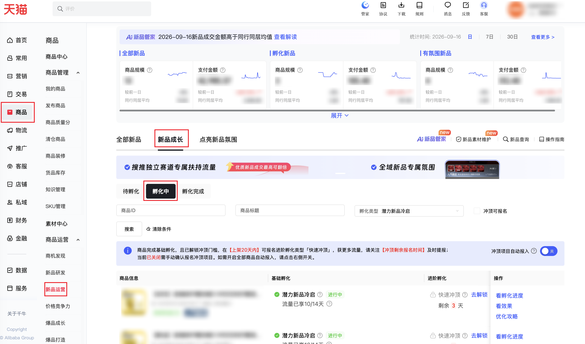

:::warning[页面兼容性说明]
当前连接器目标页面只支持**天猫平台**的店铺，暂不兼容**淘宝C店**，请确认后使用！
:::

| 属性             | 值                                                                          |
| ---------------- | --------------------------------------------------------------------------- |
| **连接器类型**   | `RPA 连接器`|
| **连接器名称**   | `ODS_商品新品运营孵化中商品详情(千牛RPA)`|
| **连接器代码**   | `rpa.conn.qianniu.item.new.incubation.item.detail`|
| **操作类型**     | `页面解析`|
| **目标网页**     | `https://myseller.taobao.com/home.htm/new-product-operation/home?secondTab=ing&firstTab=grow`|
| **适用场景**     | 采集千牛新品运营—新品成长—孵化中商品的孵化进度与资源信息（仅天猫店铺），支持按商品ID、商品标题筛选；可只采列表或同时采集每条优化攻略，自动翻页（只要列表最多 100 页，列表加优化攻略最多 50 条）|
| **数据表名**     | `ods_rpa_qianniu_item_new_incubation_item_detail_du`|
| **业务表名**     | `ODS_商品新品运营孵化中商品详情(千牛RPA)`|

### 目标页面

> **取数路径**：千牛商家工作台—商品—新品运营—新品成长—孵化中
>
> **取数链接**：[https://myseller.taobao.com/home.htm/new-product-operation/home?secondTab=ing&firstTab=grow](https://myseller.taobao.com/home.htm/new-product-operation/home?secondTab=ing&firstTab=grow)



### 业务入参

| 字段 | 中文释义 | 数据类型 | 必填 | 默认值 | 说明 |
| ---- | -------- | -------- | ---- | ------ | ---- |
| `item_ids` | 商品ID | `String` / `List[String]` | 否 | `-` | 英文逗号或字符串数组；不传则不填 |
| `item_title` | 商品标题 | `String` | 否 | `-` | 不传则不填 |
| `fetch_mode` | 采集标识位 | `String` | 否 | `LIST_ONLY` | 允许值：`LIST_ONLY`（只要列表）/ `LIST_AND_STRATEGY`（列表+每条优化攻略） |
| `collect_limit` | 采集条数上限 | `String` | 否 | `-` | 按商品条数计。只要列表（`fetch_mode=LIST_ONLY`）：不填则采全量（每页 10 条、最多 100 页）。列表+每条优化攻略（`fetch_mode=LIST_AND_STRATEGY`）：范围 1~50，超出按 50 条截断；不填则最多 50 条。填了只采到该条数为止，实际不足时按实际条数返回 |

### 入参样例

只要列表：

```json
{
  "item_ids": "",
  "item_title": "",
  "fetch_mode": "LIST_ONLY",
  "collect_limit": "30"
}
```

列表+每条优化攻略：

```json
{
  "item_ids": "1079707230218",
  "item_title": "",
  "fetch_mode": "LIST_AND_STRATEGY",
  "collect_limit": "30"
}
```

### 入参校验

```json-schema collapsed
{
  "$schema": "https://json-schema.org/draft/2020-12/schema",
  "title": "千牛-商品-新品运营-新品成长-孵化中 - 查询入参",
  "description": "采集千牛新品运营—新品成长—孵化中商品的孵化进度与资源信息（仅天猫店铺），支持按商品ID、商品标题筛选；可只采列表或同时采集每条优化攻略，自动翻页（只要列表最多 100 页，列表加优化攻略最多 50 条）",
  "type": "object",
  "properties": {
    "item_ids": {
      "description": "商品ID；英文逗号或字符串数组；不传则不填",
      "anyOf": [
        { "type": "string" },
        { "type": "array", "items": { "type": "string" } }
      ]
    },
    "item_title": {
      "type": "string",
      "description": "商品标题；不传则不填"
    },
    "fetch_mode": {
      "type": "string",
      "description": "采集标识位；允许值：LIST_ONLY（只要列表）/ LIST_AND_STRATEGY（列表+每条优化攻略）",
      "enum": ["LIST_ONLY", "LIST_AND_STRATEGY"],
      "default": "LIST_ONLY"
    },
    "collect_limit": {
      "type": "string",
      "description": "采集条数上限；按商品条数计。只要列表（fetch_mode=LIST_ONLY）：不填则采全量（每页 10 条、最多 100 页）。列表+每条优化攻略（fetch_mode=LIST_AND_STRATEGY）：范围 1~50，超出按 50 条截断；不填则最多 50 条。填了只采到该条数为止，实际不足时按实际条数返回",
      "pattern": "^[1-9]\\d*$"
    }
  },
  "required": [],
  "additionalProperties": false
}
```

### 数据字段

`bizDate` 格式为 `YYYYMMDD`。

:::field-tree
@define 列表操作标签
| `code` | 操作编码 | `String` | 是 | 页面解析 | `OP_LABEL_DATA` |
| `label` | 操作文案 | `String` | 是 | 页面解析 | `看效果` |
| `showTips` | 是否展示提示 | `Boolean` | 是 | 页面解析 | `false` |

@define 孵化资源
| `hatchMode` | 孵化模式 | `String` | 是 | 页面解析 | `potential` |
| `resourceImage` | 资源图片 | `List[String]` | 是 | 页面解析 | `["https://img.alicdn.com/****"]` (已脱敏) |
| `resourceText` | 资源文案 | `List[String]` | 是 | 页面解析 | `["搜推冷启扶持流量"]` |

@define 进阶孵化状态
| `done` | 是否完成 | `Boolean` | 是 | 页面解析 | `false` |
| `lock` | 是否锁定 | `Boolean` | 是 | 页面解析 | `true` |
| `status` | 状态编码 | `String` | 是 | 页面解析 | `WAIT_UNLOCK` |

@define 基础孵化状态
| `color` | 状态颜色 | `String` | 是 | 页面解析 | `green` |
| `done` | 是否完成 | `Boolean` | 是 | 页面解析 | `true` |
| `lock` | 是否锁定 | `Boolean` | 是 | 页面解析 | `false` |
| `status` | 状态编码 | `String` | 是 | 页面解析 | `ING` |
| `text` | 状态文案 | `String` | 是 | 页面解析 | `进行中` |

@define 进阶进度明细
| `applyRemainDays` | 报名剩余天数 | `Number` | 是 | 页面解析 | `3` |
| `hatchMode` | 孵化模式 | `String` | 是 | 页面解析 | `sprint` |
| `hatchName` | 孵化类型名称 | `String` | 是 | 页面解析 | `快速冲顶` |
| `opLabels` @列表操作标签 | 操作标签 | `List[Dict]` | 是 | 页面解析 | 见数据样例 |
| `resource` @孵化资源 | 孵化资源 | `Dict` | 是 | 页面解析 | 见数据样例 |
| `status` @进阶孵化状态 | 进阶状态 | `Dict` | 是 | 页面解析 | 见数据样例 |

@define 基础进度明细
| `applySource` | 报名来源 | `String` | 是 | 页面解析 | `ALGO_APPLY` |
| `endTime` | 结束时间 | `String` | 是 | 页面解析 | `2026-09-22 23:59:59` |
| `hatchDays` | 已孵化天数 | `Number` | 是 | 页面解析 | `10` |
| `hatchMode` | 孵化模式 | `String` | 是 | 页面解析 | `potential` |
| `hatchName` | 孵化类型名称 | `String` | 是 | 页面解析 | `潜力新品冷启` |
| `resource` @孵化资源 | 孵化资源 | `Dict` | 是 | 页面解析 | 见数据样例 |
| `startTime` | 开始时间 | `String` | 是 | 页面解析 | `2026-09-09 00:00:00` |
| `status` @基础孵化状态 | 基础状态 | `Dict` | 是 | 页面解析 | 见数据样例 |
| `totalHatchDays` | 孵化总天数 | `Number` | 是 | 页面解析 | `14` |

@define 身份标签
| `code` | 标签编码 | `String` | 是 | 页面解析 | `POPULAR_NEW_ITEM` |
| `hatchMode` | 孵化模式 | `String` | 是 | 页面解析 | `potential` |
| `resource` @孵化资源 | 孵化资源 | `Dict` | 是 | 页面解析 | 见数据样例 |

@define 攻略操作标签
| `disabled` | 是否禁用 | `Boolean` | 是 | 页面解析 | `false` |
| `label` | 操作文案 | `String` | 是 | 页面解析 | `去设置` |
| `showTips` | 是否展示提示 | `Boolean` | 是 | 页面解析 | `false` |
| `type` | 操作类型 | `String` | 是 | 页面解析 | `LINK` |
| `url` | 跳转链接 | `String` | 是 | 页面解析 | `https://ecrm.taobao.com/****` (已脱敏) |

@define 优化攻略项
| `code` | 攻略编码 | `String` | 是 | 页面解析 | `item_member_coupon` |
| `name` | 攻略名称 | `String` | 是 | 页面解析 | `设置商品专属会员券` |
| `notices` | 提示列表 | `List[String]` | 是 | 页面解析 | `[]` |
| `opLabels` @攻略操作标签 | 操作标签 | `List[Dict]` | 是 | 页面解析 | 见数据样例 |
| `showTips` | 是否展示提示 | `Boolean` | 是 | 页面解析 | `false` |
| `status` | 攻略状态 | `Number` | 是 | 页面解析 | `0` |
| `tips` | 提示文案 | `String` | 是 | 页面解析 | `商品卖点有机会在商品详情页、上新tab等场景透出，有新品特色的卖点将有助于提升商品转化。` |

@define 孵化期优化攻略
| `bizError` | 是否业务错误 | `Boolean` | 是 | 页面解析 | `false` |
| `code` | 结果编码 | `String` | 是 | 页面解析 | `00000` |
| `data` @优化攻略项 | 攻略列表 | `List[Dict]` | 是 | 页面解析 | 见数据样例 |
| `msg` | 结果说明 | `String` | 是 | 页面解析 | `操作成功` |
| `success` | 是否成功 | `Boolean` | 是 | 页面解析 | `true` |
| `sysError` | 是否系统错误 | `Boolean` | 是 | 页面解析 | `false` |
| `type` | 结果类型 | `Number` | 是 | 页面解析 | `0` |

| 字段 | 中文释义 | 数据类型 | 可为空 | 取数路径 | 示例 |
| ---- | -------- | -------- | ------ | -------- | ---- |
| `advanceProgressDetails` @进阶进度明细 | 进阶进度明细 | `List[Dict]` | 是 | 页面解析 | 见数据样例 |
| `basicProgressDetails` @基础进度明细 | 基础进度明细 | `List[Dict]` | 是 | 页面解析 | 见数据样例 |
| `cateId` | 类目 ID | `Number` | 是 | 页面解析 | `500****861` (已脱敏) |
| `cateName` | 类目名称 | `String` | 是 | 页面解析 | `冲饮果汁` |
| `identityTags` @身份标签 | 身份标签 | `List[Dict]` | 是 | 页面解析 | 见数据样例 |
| `itemId` | 商品 ID | `String` | 否 | 页面解析 | `107****218` (已脱敏) |
| `itemPic` | 商品主图 | `String` | 是 | 页面解析 | `https://img.alicdn.com/****` (已脱敏) |
| `itemTitle` | 商品标题 | `String` | 否 | 页面解析 | `****` (已脱敏) |
| `opLabels` @列表操作标签 | 操作标签 | `List[Dict]` | 是 | 页面解析 | 见数据样例 |
| `suggestInspire` | 是否建议启发 | `Boolean` | 是 | 页面解析 | `false` |
| `xcat1Id` | 一级类目 ID | `Number` | 是 | 页面解析 | `999****001` (已脱敏) |
| `xcat1Name` | 一级类目名称 | `String` | 是 | 页面解析 | `美食` |
| `hatchType` | 孵化类型 | `String` | 否 | 页面当前孵化类型 | `潜力新品冷启` |
| `suggestionInHatchPeriod` @孵化期优化攻略 | 孵化期优化攻略 | `Dict` | 是 | `fetch_mode=LIST_AND_STRATEGY` 时有值 | 见数据样例 |
| `bizDate` | 业务日期 | `String` | 否 | 附加 | `20260918` |
| `accountId` | 授权 ID | `String` | 否 | 附加 | `1****6` (已脱敏) |
:::

### 数据样例

```json
{
  "advanceProgressDetails": [
    {
      "applyRemainDays": 3,
      "hatchMode": "sprint",
      "hatchName": "快速冲顶",
      "opLabels": [
        {
          "code": "OP_LABEL_UNLOCK",
          "label": "去解锁",
          "showTips": false
        }
      ],
      "resource": {
        "hatchMode": "sprint",
        "resourceImage": [],
        "resourceText": ["搜索冲顶加码流量"]
      },
      "status": {
        "done": false,
        "lock": true,
        "status": "WAIT_UNLOCK"
      }
    }
  ],
  "basicProgressDetails": [
    {
      "applySource": "ALGO_APPLY",
      "endTime": "2026-09-22 23:59:59",
      "hatchDays": 10,
      "hatchMode": "potential",
      "hatchName": "潜力新品冷启",
      "resource": {
        "hatchMode": "potential",
        "resourceImage": ["https://img.alicdn.com/****"],
        "resourceText": ["搜推冷启扶持流量", "新品期30天内公私域专属氛围&亮标"]
      },
      "startTime": "2026-09-09 00:00:00",
      "status": {
        "color": "green",
        "done": true,
        "lock": false,
        "status": "ING",
        "text": "进行中"
      },
      "totalHatchDays": 14
    }
  ],
  "cateId": "500****861",
  "cateName": "冲饮果汁",
  "identityTags": [
    {
      "code": "SYS_SELECT"
    },
    {
      "code": "POPULAR_NEW_ITEM",
      "hatchMode": "potential",
      "resource": {
        "hatchMode": "potential",
        "resourceImage": ["https://img.alicdn.com/****"],
        "resourceText": ["搜推冷启扶持流量", "新品期30天内公私域专属氛围&亮标"]
      }
    }
  ],
  "itemId": "107****218",
  "itemPic": "https://img.alicdn.com/****",
  "itemTitle": "****",
  "opLabels": [
    {
      "code": "OP_LABEL_SHOW_HATCH_PROGRESS",
      "label": "看孵化进度",
      "showTips": false
    },
    {
      "code": "OP_LABEL_DATA",
      "label": "看效果",
      "showTips": false
    },
    {
      "code": "OP_LABEL_OPTIMIZATION_STRATEGY",
      "label": "优化攻略",
      "showTips": false
    }
  ],
  "suggestInspire": false,
  "xcat1Id": "999****001",
  "xcat1Name": "美食",
  "hatchType": "潜力新品冷启",
  "suggestionInHatchPeriod": {
    "bizError": false,
    "code": "00000",
    "data": [
      {
        "code": "item_member_coupon",
        "name": "设置商品专属会员券",
        "notices": [],
        "opLabels": [
          {
            "disabled": false,
            "label": "去设置",
            "showTips": false,
            "type": "LINK",
            "url": "https://ecrm.taobao.com/****"
          }
        ],
        "showTips": false,
        "status": 0
      },
      {
        "code": "sell_point",
        "name": "维护新品卖点（待维护）",
        "notices": [
          "商品卖点有机会在商品详情页、上新tab等场景透出，有新品特色的卖点将有助于提升商品转化。提交后，审核结果将在3-5个工作日内更新，请及时查看结果。"
        ],
        "opLabels": [
          {
            "disabled": false,
            "label": "去完成",
            "showTips": false,
            "type": "LINK",
            "url": "/****"
          }
        ],
        "showTips": true,
        "status": 0,
        "tips": "商品卖点有机会在商品详情页、上新tab等场景透出，有新品特色的卖点将有助于提升商品转化。"
      }
    ],
    "msg": "操作成功",
    "success": true,
    "sysError": false,
    "type": 0
  },
  "bizDate": "20260918",
  "accountId": "1****6"
}
```

---
