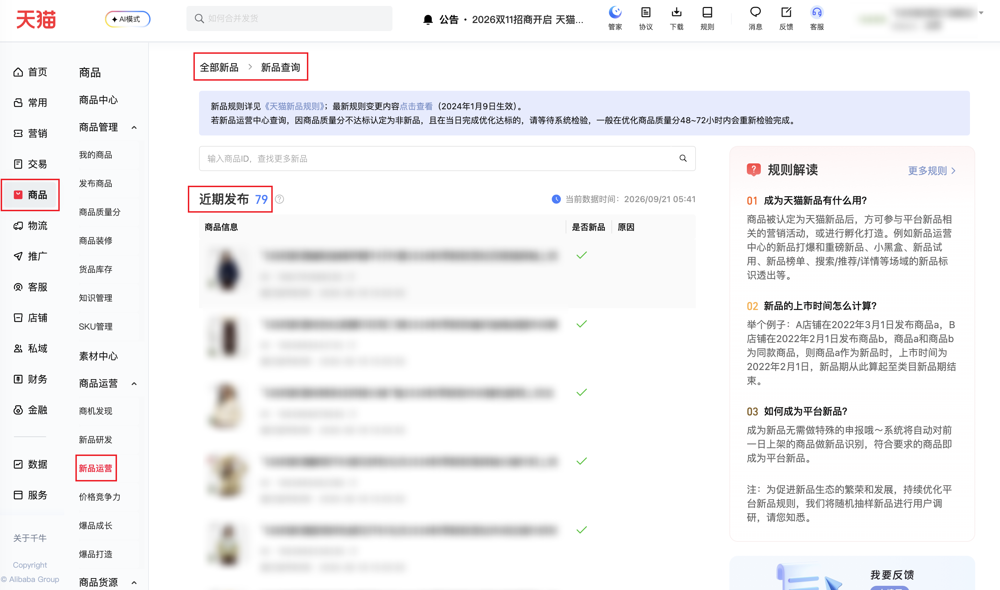

:::warning[页面兼容性说明]
当前连接器目标页面只支持**天猫平台**的店铺，暂不兼容**淘宝C店**，请确认后使用！
:::

| 属性             | 值                                                                          |
| ---------------- | --------------------------------------------------------------------------- |
| **连接器类型**   | `RPA 连接器`|
| **连接器名称**   | `ODS_商品新品运营近期发布明细查询(千牛RPA)`|
| **连接器代码**   | `rpa.conn.qianniu.item.new.publish.detail`|
| **操作类型**     | `页面解析`|
| **目标网页**     | `https://myseller.taobao.com/home.htm/new-product-operation/home/goodsSearch`|
| **适用场景**     | 采集千牛新品运营—新品查询—近期发布商品明细（仅天猫店铺）；无业务筛选项，自动翻页（每页 10 条、最多 100 页）|
| **数据表名**     | `ods_rpa_qianniu_item_new_publish_detail_du`|
| **业务表名**     | `ODS_商品新品运营近期发布明细查询(千牛RPA)`|

### 目标页面

> **取数路径**：千牛商家工作台—商品—新品运营—新品查询—近期发布
>
> **取数链接**：[https://myseller.taobao.com/home.htm/new-product-operation/home/goodsSearch](https://myseller.taobao.com/home.htm/new-product-operation/home/goodsSearch)



### 业务入参

| 字段 | 中文释义 | 数据类型 | 必填 | 默认值 | 说明 |
| ---- | -------- | -------- | ---- | ------ | ---- |
| `collect_limit` | 采集条数上限 | `String` | 否 | `-` | 正整数字符串，范围 1～1000（每页 10 条 × 最多 100 页）。不传或空：按接口 total 翻完，最多 100 页。传入：翻页数 = 向上取整(min(采集上限, total) / 10)，仍不超过 100 页。接口实际条数不足时仍成功，不凑条 |

### 入参样例

不传采集上限（按列表全量，最多 100 页）：

```json
{}
```

限制采集条数：

```json
{
  "collect_limit": "20"
}
```

### 入参校验

```json-schema collapsed
{
  "$schema": "https://json-schema.org/draft/2020-12/schema",
  "title": "千牛-商品-新品运营-新品查询-近期发布 - 查询入参",
  "description": "采集千牛新品运营—新品查询—近期发布商品明细（仅天猫店铺）；无业务筛选项，自动翻页（每页 10 条、最多 100 页）",
  "type": "object",
  "properties": {
    "collect_limit": {
      "type": "string",
      "description": "采集条数上限；正整数字符串，范围 1～1000（每页 10 条 × 最多 100 页）。不传或空：按接口 total 翻完，最多 100 页。传入：翻页数 = 向上取整(min(采集上限, total) / 10)，仍不超过 100 页。接口实际条数不足时仍成功，不凑条",
      "pattern": "^[1-9]\\d*$"
    }
  },
  "required": [],
  "additionalProperties": false
}
```

### 数据字段

:::field-tree
@define 原因明细描述
| `link` | 说明链接 | `String` | 是 | 页面解析 | `https://pages.tmall.com/****` (已脱敏) |
| `linkText` | 链接文案 | `String` | 是 | 页面解析 | `点此查看` |
| `text` | 说明文本 | `String` | 是 | 页面解析 | `新品类目可` |

@define 原因明细
| `checkStatus` | 校验状态 | `Number` | 否 | 页面解析 | `0` |
| `curStatus` | 当前状态说明 | `String` | 否 | 页面解析 | `该类目暂未开放天猫新品识别` |
| `desc` @原因明细描述 | 原因描述 | `Dict` | 是 | 页面解析 | 见数据样例 |
| `rootKey` | 规则根键 | `String` | 否 | 页面解析 | `cate_key` |

| 字段 | 中文释义 | 数据类型 | 可为空 | 取数路径 | 示例 |
| ---- | -------- | -------- | ------ | -------- | ---- |
| `cateId` | 类目ID | `Number` | 否 | 页面解析 | `124****005` (已脱敏) |
| `cateName` | 类目名称 | `String` | 否 | 页面解析 | `有价优惠券` |
| `isNewItem` | 是否新品 | `String` | 否 | 页面解析 | `N` |
| `itemId` | 商品ID | `Number` | 否 | 页面解析 | `108****444` (已脱敏) |
| `itemTitle` | 商品标题 | `String` | 否 | 页面解析 | `****` (已脱敏) |
| `onsTime` | 首次发布时间 | `String` | 否 | 页面解析 | `2026-09-20 15:49:22` |
| `picUrl` | 商品主图 | `String` | 是 | 页面解析 | `https://img.alicdn.com/****` (已脱敏) |
| `ruleDetail` @原因明细 | 原因明细 | `List[Dict]` | 否 | 页面解析 | 见数据样例 |
| `bizDate` | 业务日期 | `String` | 否 | 附加 | `20260921` |
| `accountId` | 授权 ID | `String` | 否 | 附加 | `1****6` (已脱敏) |
:::

### 数据样例

```json
{
  "cateId": "124****005",
  "cateName": "有价优惠券",
  "isNewItem": "N",
  "itemId": "108****444",
  "itemTitle": "****",
  "onsTime": "2026-09-20 15:49:22",
  "picUrl": "https://img.alicdn.com/****",
  "ruleDetail": [
    {
      "checkStatus": 0,
      "curStatus": "该类目暂未开放天猫新品识别",
      "desc": {
        "link": "https://pages.tmall.com/****",
        "linkText": "点此查看",
        "text": "新品类目可"
      },
      "rootKey": "cate_key"
    }
  ],
  "bizDate": "20260921",
  "accountId": "1****6"
}
```

---
