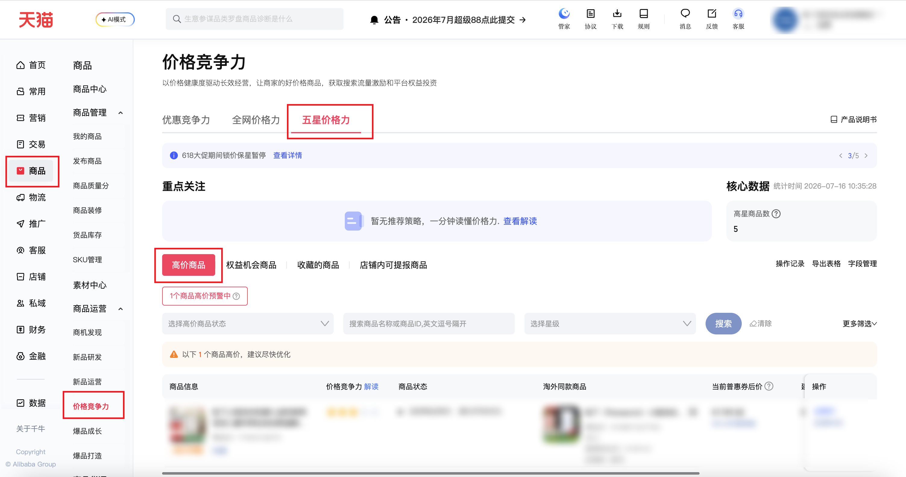
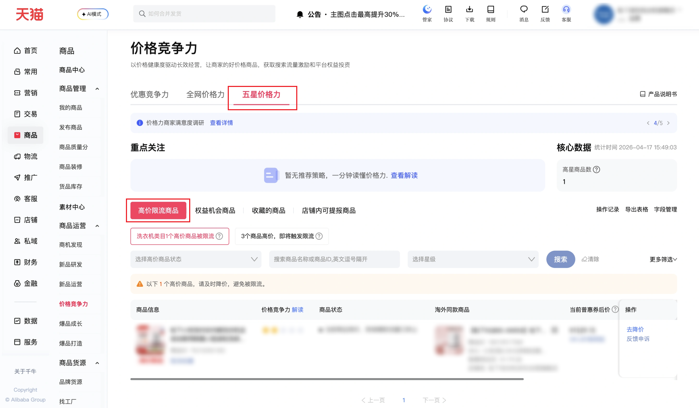

| 属性             | 值                                                                                          |
| ---------------- | ------------------------------------------------------------------------------------------- |
| **连接器类型**   | `RPA 连接器`|
| **连接器名称**   | `ODS_商品高价限流商品明细报表(千牛RPA)`|
| **连接器代码**   | `rpa.conn.qianniu.item.price.flow.limit`|
| **操作类型**     | `文件导出`|
| **目标网页**     | `https://myseller.taobao.com/home.htm/starb/price-home`|
| **适用场景**     | 导出店铺高价商品报表，将原始 XLSX 转为结构化数据|
| **数据表名**     | `ods_rpa_qianniu_item_price_flow_limit_du`|
| **业务表名**     | `ODS_商品高价限流商品明细报表(千牛RPA)`|

### 目标页面

> **取数路径**：千牛后台—商品—商业运营—价格力竞争—五星价格力—高价商品
>
> **取数链接**：[https://myseller.taobao.com/home.htm/starb/price-home](https://myseller.taobao.com/home.htm/starb/price-home)



### 业务入参

| 字段 | 中文释义 | 数据类型 | 必填 | 默认值 | 说明 |
| ---- | -------- | -------- | ---- | ------ | ---- |

### 入参样例

```json
{}
```

### 数据字段

| 字段                | 中文释义         | 数据类型 | 可为空 | 取数路径    | 示例 |
| ------------------- | ---------------- | -------- | ------ | ----------- | ---- |
| `itemName`          | 商品名称         | `String` | 否     | `XLSX.0.0`  | `松下小****一体机` (已脱敏) |
| `itemId`            | 商品 ID          | `Number` | 否     | `XLSX.0.1`  | `752****302` (已脱敏) |
| `starLevel`         | 当前商品星级     | `Number` | 否     | `XLSX.0.2`  | `2` |
| `limitStatus`       | 高价限流状态     | `String` | 否     | `XLSX.0.3`  | `当前商品高价，热销爆款流量已终止` |
| `topCategory`       | 一级类目名称     | `String` | 否     | `XLSX.0.4`  | `大家电` |
| `secondCategory`    | 二级类目名称     | `String` | 否     | `XLSX.0.5`  | `洗衣机` |
| `leafCategory`      | 叶子类目名称     | `String` | 是     | `XLSX.0.6`  | `—` |
| `price`             | 当前普惠券后价   | `String` | 否     | `XLSX.0.7`  | `¥1529.15` |
| `recommendPrice`    | 平台建议价       | `String` | 是     | `XLSX.0.8`  | `—` |
| `discount`          | 需降价幅度       | `String` | 是     | `XLSX.0.9`  | `—` |
| `saleNum`           | 销量             | `Number` | 否     | `XLSX.0.10` | `2438` |
| `compareItemName`   | 同款淘外竞品名称 | `String` | 否     | `XLSX.0.11` | `【松下****评测】` (已脱敏) |
| `compareItemId`     | 同款淘外竞品 ID  | `Number` | 否     | `XLSX.0.12` | `100****584` (已脱敏) |
| `compareItemPrice`  | 同款淘外竞品价格 | `String` | 否     | `XLSX.0.13` | `¥1179.00` |
| `compareItemUrl`    | 同款淘外竞品链接 | `String` | 否     | `XLSX.0.14` | `https://item.jd.com/****` (已脱敏) |
| `bizDate`           | 业务日期         | `String` | 否     | 附加        |  |
| `accountId`         | 授权 ID          | `String` | 否     | 附加        |  |

### 数据样例

```json
[
  {
    "itemName": "松下小****一体机",
    "itemId": "752****302",
    "starLevel": 2,
    "limitStatus": "当前商品高价，热销爆款流量已终止",
    "topCategory": "大家电",
    "secondCategory": "洗衣机",
    "leafCategory": null,
    "price": "¥1529.15",
    "recommendPrice": null,
    "discount": null,
    "saleNum": 2438,
    "compareItemName": "【松下****评测】",
    "compareItemId": "100****584",
    "compareItemPrice": "¥1179.00",
    "compareItemUrl": "https://item.jd.com/****",
    "bizDate": "20260417",
    "accountId": "1****1"
  }
]
```

---

:::changelog{pageSize=5}

@title ### 更新记录

@20260716 取数页面结构改版: 高价限流商品 => 高价商品

**取数链接:** https://myseller.taobao.com/home.htm/starb/price-home

#### 页面变更说明

> 价格竞争力页面二级标签发生改版，原「高价限流商品」已更名为「高价商品」，所属一级标签仍为「五星价格力」。

| 层级 | 改版前 | 改版后 |
| ---- | ------ | ------ |
| 一级标签 | 优惠竞争力 / 全网价格力 / **五星价格力** | 优惠竞争力 / 全网价格力 / **五星价格力**（不变） |
| 二级标签 | **高价限流商品** / 权益机会商品 / 收藏的商品 / 店铺内可提报商品 | **高价商品** / 权益机会商品 / 收藏的商品 / 店铺内可提报商品 |

**页面改版后截图**


#### 变更内容

- 将二级标签定位从 `高价限流商品` 更新为 `高价商品`
- 同步更新文档取数路径、连接器名称/业务表名及页面截图

---

@20260417 取数页面结构改版: 同款价格力 => 五星价格力

**取数链接:** https://myseller.taobao.com/home.htm/starb/price-home

#### 页面变更说明

> 价格竞争力页面一级标签结构发生改版，原「同款价格力」标签已更名为「五星价格力」，二级标签「高价限流商品」归属关系保持不变。

| 层级 | 改版前 | 改版后 |
| ---- | ------ | ------ |
| 一级标签 | 大促优惠竞争力 / **同款价格力** | 优惠竞争力 / 全网价格力 / **五星价格力** |
| 二级标签 | **高价限流商品** / 权益机会商品 / 收藏的商品 / 店铺内可提报商品 | **高价限流商品** / 权益机会商品 / 收藏的商品 / 店铺内可提报商品（不变） |

**页面改版后截图**



#### 变更内容

- 将一级标签定位从 `同款价格力` 更新为 `五星价格力`
- 新增兜底策略：当首选一级标签下找不到目标二级标签时，自动枚举页面所有实际存在的标签元素逐一尝试，不依赖预设文本，降低后续改版影响

:::
