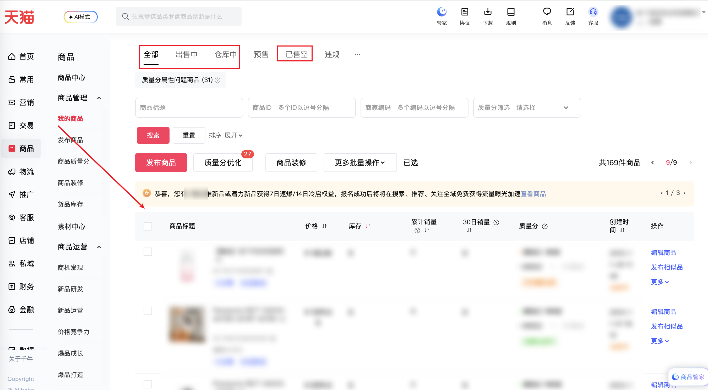

| 属性             | 值                                                                          |
| ---------------- | --------------------------------------------------------------------------- |
| **连接器类型**   | `RPA 连接器`|
| **连接器名称**   | `ODS_店铺商品列表(千牛RPA)`|
| **连接器代码**   | `rpa.conn.qianniu.item.sellmanage.list`|
| **操作类型**     | `页面解析`|
| **目标网页**     | `https://myseller.taobao.com/home.htm/SellManage/all`|
| **适用场景**     | 采集千牛商品管理列表（出售中/仓库中/已售完等状态），支持按标题、商品ID搜索及自定义排序，自动翻页最多100页|
| **数据表名**     | `ods_rpa_qianniu_item_sellmanage_list_du`|
| **业务表名**     | `ODS_店铺商品列表(千牛RPA)`|

### 目标页面

> **取数路径**：千牛商家工作台—商品—商品管理
>
> **取数链接**：[https://myseller.taobao.com/home.htm/SellManage/all](https://myseller.taobao.com/home.htm/SellManage/all)



### 业务入参

| 字段 | 中文释义 | 数据类型 | 必填 | 默认值 | 说明 |
| ---- | -------- | -------- | ---- | ------ | ---- |
| `item_status` | 商品状态 | `string` | 否 | `all` | 可选值：`all`（全部）/`on_sale`（出售中）/`in_stock`（仓库中）/`sold_out`（已售空） |
| `query_title` | 商品标题搜索 | `string` | 否 | `""` | 关键词模糊搜索 |
| `query_item_id` | 商品ID搜索 | `string` | 否 | `""` | 多个ID用中文逗号分隔 |
| `sort_field` | 排序字段 | `string` | 否 | `""` | 可选值：`managerPrice`（价格）/`managerQuantityNew`（库存）/`soldQuantity_m`（累计销量）/`monthlySoldQuantity`（30日销量）/`upShelfDate_m`（创建时间） |
| `sort_order` | 排序方向 | `string` | 否 | `desc` | 可选值：`asc`（升序）/`desc`（降序） |

### 入参样例

```json
{
    "item_status": "on_sale",
    "query_title": "松下",
    "sort_field": "soldQuantity_m",
    "sort_order": "desc"
}
```

### 数据字段

| 字段 | 中文释义 | 数据类型 | 可为空 | 取数路径 | 示例 |
| ---- | -------- | -------- | ------ | -------- | ---- |
| `itemId` | 商品ID | `string` | 否 | `data.result.data.table.dataSource[*].itemId` | `804921098992` |
| `catId` | 类目ID | `number` | 是 | `data.result.data.table.dataSource[*].catId` | `50023725` |
| `itemDesc` | 商品描述信息 | `Dict` | 否 | `data.result.data.table.dataSource[*].itemDesc` | 见数据样例 `itemDesc` |
| `managerPrice` | 价格信息 | `Dict` | 是 | `data.result.data.table.dataSource[*].managerPrice` | 见数据样例 `managerPrice` |
| `managerQuantityNew` | 库存信息 | `Dict` | 是 | `data.result.data.table.dataSource[*].managerQuantityNew` | 见数据样例 `managerQuantityNew` |
| `soldQuantity_m` | 累计销量 | `number` | 是 | `data.result.data.table.dataSource[*].soldQuantity_m` | `101` |
| `monthlySoldQuantity` | 30日销量 | `Dict` | 是 | `data.result.data.table.dataSource[*].monthlySoldQuantity` | 见数据样例 `monthlySoldQuantity` |
| `diagnoseInfoV3` | 诊断/质量分信息 | `Dict` | 是 | `data.result.data.table.dataSource[*].diagnoseInfoV3` | 见数据样例 `diagnoseInfoV3` |
| `upShelfDate_m` | 上架日期与状态 | `Dict` | 是 | `data.result.data.table.dataSource[*].upShelfDate_m` | 见数据样例 `upShelfDate_m` |
| `endDate_m` | 下架时间 | `Dict` | 是 | `data.result.data.table.dataSource[*].endDate_m` | `null` |
| `bizDate` | 业务日期 | `string` | 否 | 附加 |  |
| `accountId` | 授权 ID | `string` | 否 | 附加 |  |
| `taskId` | 任务 ID | `string` | 否 | 附加 |  |

### 数据样例

```json
{
  "itemId": "804921098992",
  "catId": 50023725,
  "itemDesc": {
    "img": "//img.alicdn.com/imgextra/i3/2215841747888/O1CN01Vudmh5288l8BLAM7D_!!0-item_pic.jpg_100x100xz",
    "imgLink": {
      "href": "https://detail.tmall.com/item.htm?id=804921098992",
      "target": "_blank",
      "noParams": true
    },
    "imgStyle": {
      "width": 80,
      "height": 80
    },
    "desc": [
      {
        "uiType": "link",
        "text": "Panasonic/松下壁挂洗衣机专属 拍1元免费上门服务 拍前联系客服",
        "style": {
          "fontSize": 12,
          "fontWeight": "normal",
          "color": "#333333"
        },
        "hasCopy": true,
        "copyText": "Panasonic/松下壁挂洗衣机专属 拍1元免费上门服务 拍前联系客服",
        "copyIcon": "copy",
        "href": "https://detail.tmall.com/item.htm?id=804921098992",
        "target": "_blank"
      },
      {
        "uiType": "text",
        "text": "ID:804921098992",
        "style": {
          "fontSize": 12,
          "fontWeight": "normal",
          "color": "#999999"
        },
        "hasCopy": true,
        "copyText": "804921098992",
        "copyIcon": "copy"
      }
    ],
    "iconList": [
      {
        "uiType": "qrCode",
        "name": "qrCodeDouble",
        "qrCodeImgUrl": "https://sell.publish.tmall.com/tmall/manager/qrcode.do?itemId=804921098992",
        "downloadUrl": "https://sell.publish.tmall.com/tmall/manager/qrcode.do?itemId=804921098992&activity=download",
        "itemUrl": "https://detail.tmall.com/item.htm?id=804921098992"
      }
    ]
  },
  "managerPrice": {
    "currentPrice": "¥ 1.00"
  },
  "managerQuantityNew": {
    "text": 99763
  },
  "soldQuantity_m": 101,
  "monthlySoldQuantity": {
    "value": "11",
    "empty": false
  },
  "diagnoseInfoV3": {
    "ysbTaskStatus": "WHITE"
  },
  "upShelfDate_m": {
    "value": "2024-06-11 14:07",
    "status": {
      "text": "出售中",
      "type": "success"
    }
  },
  "endDate_m": null,
  "bizDate": "20260509",
  "accountId": "101"
}
```

---
