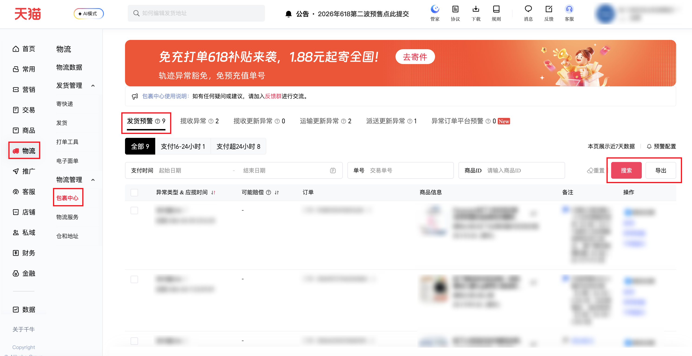

| 属性             | 值                                                                              |
| ---------------- | ------------------------------------------------------------------------------- |
| **连接器类型**   | `RPA 连接器`|
| **连接器名称**   | `ODS_物流包裹中心发货预警明细表(千牛RPA)`|
| **连接器代码**   | `rpa.conn.qianniu.logistics.delivery.warning`|
| **操作类型**     | `文件导出`|
| **目标网页**     | `https://myseller.taobao.com/home.htm/package-center/packageMonitor`|
| **适用场景**     | 导出包裹中心发货预警数据，支持按支付时间范围、运单号/交易单号、商品 ID 筛选|
| **数据表名**     | `ods_rpa_qianniu_logistics_delivery_warning_du`|
| **业务表名**     | `ODS_物流异常包裹监控明细表(千牛RPA)`|

### 目标页面

> **取数路径**：千牛后台—物流—包裹中心—发货预警
>
> **取数链接**：[https://myseller.taobao.com/home.htm/package-center/packageMonitor](https://myseller.taobao.com/home.htm/package-center/packageMonitor)



### 业务入参

| 字段 | 中文释义 | 数据类型 | 必填 | 默认值 | 说明 |
| ---- | -------- | -------- | ---- | ------ | ---- |
| `date_start` | 支付起始时间 | `string` | 否 | `""` | 格式 `YYYYMMDD`、`YYYY-MM-DD` 或 `YYYY-MM-DD HH:mm:ss`；与 `date_end` 必须同时传入；不得早于 30 天前 |
| `date_end` | 支付结束时间 | `string` | 否 | `""` | 格式 `YYYYMMDD`、`YYYY-MM-DD` 或 `YYYY-MM-DD HH:mm:ss`；与 `date_start` 必须同时传入；不得晚于今天 |
| `trade_no` | 运单号/交易单号 | `string` | 否 | `""` | 6–32 位字母或数字 |
| `item_id` | 商品 ID | `string` | 否 | `""` | 6–20 位纯数字 |

### 入参样例

```json
{
    "date_start": "2026-06-01",
    "date_end": "2026-06-11",
    "trade_no": "",
    "item_id": ""
}
```

### 数据字段

`bizDate` 格式为 `YYYYMMDD`。

| 字段 | 中文释义 | 数据类型 | 可为空 | 取数路径 | 示例 |
| ---- | -------- | -------- | ------ | -------- | ---- |
| `trade_no` | 交易单号 | `number` | 否 | `XLSX.0.交易单号` | 5118851054150013638 |
| `sub_trade_no` | 子交易单号 | `number` | 否 | `XLSX.0.子交易单号` | 5118851054150013638 |
| `timeout_type` | 超时类型 | `string` | 否 | `XLSX.0.超时类型` | 支付超24h |
| `pay_time` | 支付时间 | `string` | 否 | `XLSX.0.支付时间` | 2026-06-03 23:16:35 |
| `expected_pickup_time` | 应揽收时间 | `string` | 否 | `XLSX.0.应揽收时间` | 2026-06-05 23:16:35 |
| `exception_type` | 异常类型 | `string` | 否 | `XLSX.0.异常类型` | 支付-发货 |
| `buyer_name` | 买家姓名 | `string` | 否 | `XLSX.0.买家姓名` | 张** |
| `buyer_phone` | 买家电话 | `string` | 否 | `XLSX.0.买家电话` | 1\*\*\*\*\*\*\*\*\*7 |
| `buyer_address` | 买家地址 | `string` | 否 | `XLSX.0.买家地址` | 上海上海市浦东新区川沙新镇 \*\*\*\*\*\*\*\*\*\*\*\*\*\*\*\*\*\* |
| `order_service` | 订单服务 | `string` | 否 | `XLSX.0.订单服务` | 无 |
| `goods_name` | 商品名称 | `string` | 否 | `XLSX.0.商品名称` | Panasonic松下 内衣洗衣液洁净抑菌去血渍洗衣魔球伴侣 |
| `remark` | 备注信息 | `string` | 是 | `XLSX.0.备注信息` | 已登记 程浩楠 6-4 已反馈催促发货【小述｜06-09 缺货 |
| `bizDate` | 业务日期 | `string` | 否 | 附加 |  |
| `accountId` | 授权 ID | `string` | 否 | 附加 |  |

### 数据样例

```json
[
    {
        "trade_no": 5118851054150013638,
        "sub_trade_no": 5118851054150013638,
        "timeout_type": "支付超24h",
        "pay_time": "2026-06-03 23:16:35",
        "expected_pickup_time": "2026-06-05 23:16:35",
        "exception_type": "支付-发货",
        "buyer_name": "张**",
        "buyer_phone": "1*********7",
        "buyer_address": "上海上海市浦东新区川沙新镇 ****************",
        "order_service": "无",
        "goods_name": "Panasonic松下 内衣洗衣液洁净抑菌去血渍洗衣魔球伴侣",
        "remark": "已登记 程浩楠 6-4 已反馈催促发货【小述｜06-09 缺货\n已反馈催促核实多久发出，客户要求明确回复【小述｜06-10 19:13:31】",
        "bizDate": "20260611",
        "accountId": "101"
    }
]
```

---
