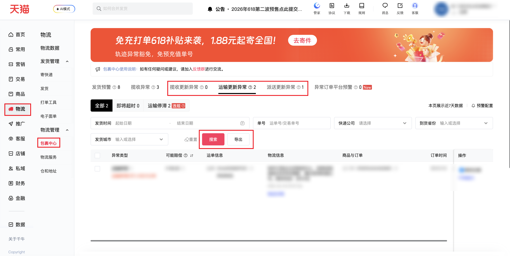

| 属性             | 值                                                                              |
| ---------------- | ------------------------------------------------------------------------------- |
| **连接器类型**   | `RPA 连接器`|
| **连接器名称**   | `ODS_物流包裹中心阶段更新异常明细表(千牛RPA)`|
| **连接器代码**   | `rpa.conn.qianniu.logistics.stage.update.exception`|
| **操作类型**     | `文件导出`|
| **目标网页**     | `https://myseller.taobao.com/home.htm/package-center/packageMonitor`|
| **适用场景**     | 导出包裹中心阶段更新异常数据（揽收/运输/派送更新异常），支持按发货时间范围、运单号/交易单号筛选|
| **数据表名**     | `ods_rpa_qianniu_logistics_stage_update_exception_du`|
| **业务表名**     | `ODS_物流包裹中心阶段更新异常明细表(千牛RPA)`|

### 目标页面

> **取数路径**：千牛后台—物流—包裹中心—阶段更新异常（揽收更新异常 / 运输更新异常 / 派送更新异常）
>
> **取数链接**：[https://myseller.taobao.com/home.htm/package-center/packageMonitor](https://myseller.taobao.com/home.htm/package-center/packageMonitor)



### 业务入参

| 字段 | 中文释义 | 数据类型 | 必填 | 默认值 | 说明 |
| ---- | -------- | -------- | ---- | ------ | ---- |
| `stage_status` | 阶段状态 | `string` | 是 | `—` | 允许值：`pickup_update`（揽收更新异常）、`transport_update`（运输更新异常）、`delivery_update`（派送更新异常） |
| `date_start` | 发货起始时间 | `string` | 否 | `""` | 格式 `YYYYMMDD` 或 `YYYY-MM-DD`；与 `date_end` 必须同时传入；不得早于 30 天前 |
| `date_end` | 发货结束时间 | `string` | 否 | `""` | 格式 `YYYYMMDD` 或 `YYYY-MM-DD`；与 `date_start` 必须同时传入；不得晚于今天 |
| `trade_no` | 运单号/交易单号 | `string` | 否 | `""` | 6–32 位字母或数字 |

### 入参样例

```json
{
    "stage_status": "transport_update",
    "date_start": "2026-05-01",
    "date_end": "2026-06-11",
    "trade_no": ""
}
```

### 数据字段

`bizDate` 格式为 `YYYYMMDD`。

| 字段 | 中文释义 | 数据类型 | 可为空 | 取数路径 | 示例 |
| ---- | -------- | -------- | ------ | -------- | ---- |
| `mail_no` | 运单号 | `string` | 否 | `XLSX.0.运单号` | SN6600088899251 |
| `trade_no` | 主订单号 | `number` | 否 | `XLSX.0.主订单号` | 5118109635696058815 |
| `sub_trade_no` | 子订单号 | `number` | 否 | `XLSX.0.子订单号` | 5118109635696058815 |
| `courier_company` | 快递公司 | `string` | 否 | `XLSX.0.快递公司` | 其他物流 |
| `pickup_city` | 揽收城市 | `string` | 否 | `XLSX.0.揽收城市` | 嘉兴市 |
| `timeout_type` | 超时类型 | `string` | 否 | `XLSX.0.超时类型` | 运输停滞 |
| `exception_type` | 异常类型 | `string` | 否 | `XLSX.0.异常类型` | 运输停滞 |
| `ship_time` | 发货时间 | `string` | 否 | `XLSX.0.发货时间` | 2026-05-30 19:04:24 |
| `pickup_time` | 揽收时间 | `string` | 否 | `XLSX.0.揽收时间` | 2026-05-30 19:07:02 |
| `buyer_name` | 买家姓名 | `string` | 否 | `XLSX.0.买家姓名` | 袁** |
| `buyer_phone` | 买家电话 | `string` | 否 | `XLSX.0.买家电话` | 1\*\*\*\*\*\*\*\*\*8 |
| `buyer_address` | 买家地址 | `string` | 否 | `XLSX.0.买家地址` | 山东省临沂市兰山区柳青街道 \*\*\*\*\*\*\*\*\*\*\*\*\*\*\*\*\*\* |
| `expected_compensation_amount` | 预计赔付金额 | `number` | 否 | `XLSX.0.预计赔付金额` | 100.0 |
| `order_service` | 订单服务 | `string` | 否 | `XLSX.0.订单服务` | 优+订单 |
| `remark` | 备注信息 | `string` | 是 | `XLSX.0.备注信息` | 拦截中【六六｜05-31 23:07:52】此单也拦截成功【六六｜05-31 23:13:00】此单不应该拦截，建工单错误导致误拦，已留言客户，此单菜鸟已下补发单【六六｜05-31 23:26:04】已完结05-31 23:28\nSN6600088901385补发单号【六六｜06-01 19:53:10】 |
| `exception_handling` | 异常处理情况 | `string` | 是 | `XLSX.0.异常处理情况` | — |
| `bizDate` | 业务日期 | `string` | 否 | 附加 |  |
| `accountId` | 授权 ID | `string` | 否 | 附加 |  |

### 数据样例

```json
[
    {
        "mail_no": "SN6600088899251",
        "trade_no": 5118109635696058815,
        "sub_trade_no": 5118109635696058815,
        "courier_company": "其他物流",
        "pickup_city": "嘉兴市",
        "timeout_type": "运输停滞",
        "exception_type": "运输停滞",
        "ship_time": "2026-05-30 19:04:24",
        "pickup_time": "2026-05-30 19:07:02",
        "buyer_name": "袁**",
        "buyer_phone": "1*********8",
        "buyer_address": "山东省临沂市兰山区柳青街道 ******************",
        "expected_compensation_amount": 100.0,
        "order_service": "优+订单",
        "remark": "拦截中【六六｜05-31 23:07:52】此单也拦截成功【六六｜05-31 23:13:00】此单不应该拦截，建工单错误导致误拦，已留言客户，此单菜鸟已下补发单【六六｜05-31 23:26:04】已完结05-31 23:28\nSN6600088901385补发单号【六六｜06-01 19:53:10】",
        "exception_handling": null,
        "bizDate": "20260611",
        "accountId": "101"
    }
]
```

---
