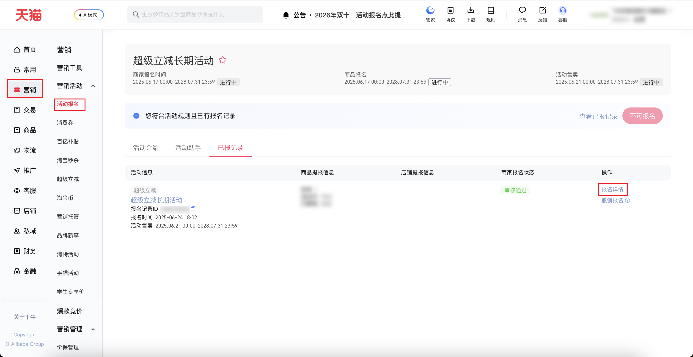
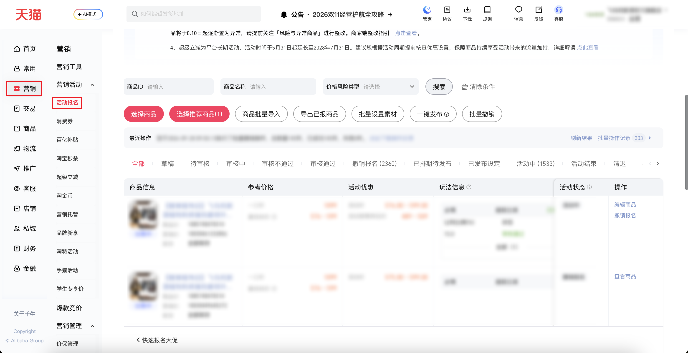

| 属性             | 值                                                                                          |
| ---------------- | ------------------------------------------------------------------------------------------- |
| **连接器类型**   | `RPA 连接器`                                                                                |
| **连接器名称**   | `ODS_营销报名活动商品明细表(千牛RPA)`                                                       |
| **连接器代码**   | `rpa.conn.qianniu.marketing.activity.item.list`                                            |
| **操作类型**     | `页面解析`                                                                                  |
| **目标网页**     | `https://qn.taobao.com/home.htm/starb/tmc-next/sale/seller/activity_detail.htm?activityId=615000960219` |
| **适用场景**     | 采集千牛超级立减长期活动中审核通过的报名记录下的商品明细，多条审核通过时取第一条             |
| **数据表名**     | `ods_rpa_qianniu_marketing_activity_item_list_du`                                           |
| **业务表名**     | `ODS_营销报名活动商品明细表(千牛RPA)`                                                       |

### 目标页面

> **取数路径**：千牛后台—营销—活动报名—超级立减长期活动—已报记录—报名详情
>
> **取数链接**：[https://qn.taobao.com/home.htm/starb/tmc-next/sale/seller/activity_detail.htm?activityId=615000960219](https://qn.taobao.com/home.htm/starb/tmc-next/sale/seller/activity_detail.htm?activityId=615000960219)





### 业务入参

| 字段 | 中文释义 | 数据类型 | 必填 | 默认值 | 说明 |
| ---- | -------- | -------- | ---- | ------ | ---- |
| `item_id` | 商品ID | `String` / `List[String]` | 否 | `-` | 数字。英文逗号分隔或 JSON 数组，最多 10 个。与 `item_name` 只能传入一个。页面一次只能查一个，多个会逐个查询 |
| `item_name` | 商品名称 | `String` | 否 | `-` | 与 `item_id` 只能传入一个 |
| `price_risk_type` | 价格风险类型 | `String` | 否 | `-` | 允许值：`LOW_PRICE_RISK`（超低价风险）/ `SAME_SKU_PRICE_RISK`（多sku同价风险）/ `PRICE_CONTROL_ABNORMAL`（价格管控异常）。不传不选 |
| `item_status` | 报名状态 | `String` | 否 | `ALL` | 允许值：`ALL`（全部）/ `DRAFT`（草稿）/ `PENDING_REVIEW`（待审核）/ `UNDER_REVIEW`（审核中）/ `REVIEW_REJECTED`（审核不通过）/ `REVIEW_APPROVED`（审核通过）/ `CANCELLED`（撤销报名）/ `SCHEDULED`（已排期待发布）/ `PUBLISHED`（已发布设定）/ `IN_ACTIVITY`（活动中）/ `ENDED`（活动结束）/ `EVICTED`（清退）/ `ABNORMAL`（异常） |
| `collect_limit` | 采集条数上限 | `String` | 否 | `-` | 正整数 `1`～`1000`。不传按总数翻完，最多 100 页。传入只采集前 N 条；实际条数不足时仍成功 |

### 入参样例

只采活动中的商品，限制 10 条：

```json
{
  "item_status": "IN_ACTIVITY",
  "collect_limit": "10"
}
```

多个商品 ID，英文逗号：

```json
{
  "item_id": "100000000001,100000000002",
  "item_status": "IN_ACTIVITY",
  "collect_limit": "10"
}
```

商品 ID 用 JSON 数组，并筛选超低价风险：

```json
{
  "item_id": ["100000000001"],
  "price_risk_type": "LOW_PRICE_RISK",
  "item_status": "ALL"
}
```

按商品名称查：

```json
{
  "item_name": "连衣裙",
  "item_status": "IN_ACTIVITY",
  "collect_limit": "5"
}
```

### 入参校验

```json-schema collapsed
{
  "$schema": "https://json-schema.org/draft/2020-12/schema",
  "title": "千牛-超级立减活动商品明细 - 查询入参",
  "description": "采集千牛超级立减长期活动中审核通过的报名记录下的商品明细，多条审核通过时取第一条",
  "type": "object",
  "properties": {
    "item_id": {
      "description": "商品ID。数字。英文逗号或中文逗号分隔，或 JSON 数组，最多 10 个。与 item_name 只能传入一个",
      "oneOf": [
        {
          "type": "string",
          "pattern": "^\\d+(?:[,，]\\d+){0,9}$"
        },
        {
          "type": "array",
          "minItems": 1,
          "maxItems": 10,
          "items": {
            "type": "string",
            "pattern": "^\\d+$"
          }
        }
      ]
    },
    "item_name": {
      "type": "string",
      "description": "商品名称。与 item_id 只能传入一个",
      "minLength": 1
    },
    "price_risk_type": {
      "type": "string",
      "description": "价格风险类型。允许值：LOW_PRICE_RISK（超低价风险）/ SAME_SKU_PRICE_RISK（多sku同价风险）/ PRICE_CONTROL_ABNORMAL（价格管控异常）。不传不选",
      "enum": ["LOW_PRICE_RISK", "SAME_SKU_PRICE_RISK", "PRICE_CONTROL_ABNORMAL"]
    },
    "item_status": {
      "type": "string",
      "description": "报名状态。不传为 ALL（全部）。允许值：ALL（全部）/ DRAFT（草稿）/ PENDING_REVIEW（待审核）/ UNDER_REVIEW（审核中）/ REVIEW_REJECTED（审核不通过）/ REVIEW_APPROVED（审核通过）/ CANCELLED（撤销报名）/ SCHEDULED（已排期待发布）/ PUBLISHED（已发布设定）/ IN_ACTIVITY（活动中）/ ENDED（活动结束）/ EVICTED（清退）/ ABNORMAL（异常）",
      "enum": ["ALL", "DRAFT", "PENDING_REVIEW", "UNDER_REVIEW", "REVIEW_REJECTED", "REVIEW_APPROVED", "CANCELLED", "SCHEDULED", "PUBLISHED", "IN_ACTIVITY", "ENDED", "EVICTED", "ABNORMAL"],
      "default": "ALL"
    },
    "collect_limit": {
      "type": "string",
      "description": "采集条数上限。正整数 1～1000。不传按总数翻完，最多 100 页。传入只采集前 N 条；实际条数不足时仍成功",
      "pattern": "^(?:[1-9]\\d{0,2}|1000)$"
    }
  },
  "required": [],
  "additionalProperties": false,
  "allOf": [
    {
      "if": {
        "required": ["item_id"]
      },
      "then": {
        "not": {
          "required": ["item_name"]
        }
      }
    },
    {
      "if": {
        "required": ["item_name"]
      },
      "then": {
        "not": {
          "required": ["item_id"]
        }
      }
    }
  ]
}
```

### 数据字段

:::field-tree
@define 操作元数据
| `actionurl` | 操作地址 | `String` | 是 | 页面解析 | `https://sale.taobao.com/****` (已脱敏) |
| `itemId` | 商品ID | `Number` | 是 | 页面解析 | `108****432` (已脱敏) |
| `itemName` | 商品名称 | `String` | 是 | 页面解析 | `****` (已脱敏) |
| `juId` | 营销ID | `String` | 是 | 页面解析 | `100****304` (已脱敏) |
| `querier` | 查询器 | `String` | 是 | 页面解析 | `juItemCompositeQuerier` |
| `status` | 状态码 | `Number` | 是 | 页面解析 | `14` |
| `warnMsg` | 操作提示 | `String` | 是 | 页面解析 | `撤销后您将失去参加本次活动的机会` |

@define 操作按钮
| `disabled` | 是否禁用 | `Boolean` | 否 | 页面解析 | `false` |
| `id` | 按钮ID | `Number` | 否 | 页面解析 | `1200` |
| `meta` @操作元数据 | 操作元数据 | `Dict` | 是 | 页面解析 | 见数据样例 |
| `name` | 按钮名称 | `String` | 否 | 页面解析 | `查看商品` |
| `required` | 是否必填 | `Boolean` | 否 | 页面解析 | `false` |
| `simpleName` | 按钮简称 | `String` | 是 | 页面解析 | `查看` |
| `url` | 跳转地址 | `String` | 是 | 页面解析 | `https://sale.taobao.com/****` (已脱敏) |

@define 玩法信息
| `currentFoldableStatus` | 当前是否收起 | `Boolean` | 是 | 页面解析 | `false` |
| `foldable` | 是否可收起 | `Boolean` | 是 | 页面解析 | `false` |
| `playActStatus` | 玩法报名状态码 | `Number` | 是 | 页面解析 | `1` |
| `playActStatusDesc` | 玩法报名状态 | `String` | 是 | 页面解析 | `未报名` |
| `playActivityId` | 玩法活动ID | `Number` | 是 | 页面解析 | `151****972` (已脱敏) |
| `playActivityName` | 玩法活动名称 | `String` | 是 | 页面解析 | `****` (已脱敏) |
| `playId` | 玩法ID | `Number` | 是 | 页面解析 | `106` |
| `relationType` | 关联类型码 | `Number` | 是 | 页面解析 | `2` |
| `relationTypeDesc` | 关联类型 | `String` | 是 | 页面解析 | `必填` |

@define 上级域标识
| `act` | 活动ID | `Number` | 是 | 页面解析 | `615****219` (已脱敏) |
| `icItem` | 商品ID | `Number` | 是 | 页面解析 | `108****432` (已脱敏) |

@define 主题信息
| `domainCode` | 域编码 | `String` | 是 | 页面解析 | `item` |
| `domainId` | 域ID | `Number` | 是 | 页面解析 | `100****304` (已脱敏) |
| `parentDomainCode` | 上级域编码 | `String` | 是 | 页面解析 | `act` |
| `parentDomainId` | 上级域ID | `Number` | 是 | 页面解析 | `615****219` (已脱敏) |
| `parentIdMap` @上级域标识 | 上级标识 | `Dict` | 是 | 页面解析 | 见数据样例 |
| `themisTemplateId` | 模板ID | `Number` | 是 | 页面解析 | `2****2` (已脱敏) |

| 字段 | 中文释义 | 数据类型 | 可为空 | 取数路径 | 示例 |
| ---- | -------- | -------- | ------ | -------- | ---- |
| `activityApplySalePrice` | 报名时券后价 | `String` | 是 | 页面解析 | — |
| `activityApplySalePriceTips` | 报名时券后价说明 | `String` | 是 | 页面解析 | — |
| `activityName` | 活动名称 | `String` | 是 | 页面解析 | `****` (已脱敏) |
| `activityPrice` | 活动价 | `String` | 是 | 页面解析 | `507.00` |
| `activityPriceName` | 活动价名称 | `String` | 是 | 页面解析 | `活动价` |
| `activitySalePrice` | 活动普惠券后价 | `String` | 是 | 页面解析 | — |
| `buttonList` @操作按钮 | 操作 | `List[Dict]` | 是 | 页面解析 | 见数据样例 |
| `bybtGatherInfo` | 百补聚单信息 | `String` | 是 | 页面解析 | — |
| `bybtSupplyPrice` | 百亿补贴供货价 | `String` | 是 | 页面解析 | — |
| `consumerCouponItemType` | 消费券商品类型 | `String` | 是 | 页面解析 | — |
| `couponItemPoolValidType` | 消费券货盘类型 | `String` | 是 | 页面解析 | — |
| `deliveryTime` | 发货时间 | `String` | 是 | 页面解析 | — |
| `enableStructErrorMessage` | 是否支持结构化错误信息 | `Boolean` | 是 | 页面解析 | `false` |
| `hasHostingApplyTag` | 是否托管自动报名 | `Boolean` | 是 | 页面解析 | — |
| `hostingApplyTagName` | 托管自动报名标签 | `String` | 是 | 页面解析 | — |
| `hostingApplyTagTips` | 托管自动报名说明 | `String` | 是 | 页面解析 | — |
| `icStatus` | 商品在售状态码 | `Number` | 是 | 页面解析 | `-2` |
| `icStatusName` | 商品在售状态 | `String` | 是 | 页面解析 | `仓库中` |
| `inventory` | 库存 | `String` | 是 | 页面解析 | `全部库存` |
| `itemChannelName` | 渠道名称 | `String` | 是 | 页面解析 | — |
| `itemGiftFeeRadio` | 礼金费率 | `String` | 是 | 页面解析 | — |
| `itemId` | 商品ID | `Number` | 是 | 页面解析 | `108****432` (已脱敏) |
| `itemLevel` | 商品层级 | `String` | 是 | 页面解析 | — |
| `itemLink` | 商品链接 | `String` | 是 | 页面解析 | `//item.taobao.com/****` (已脱敏) |
| `itemName` | 商品名称 | `String` | 是 | 页面解析 | `****` (已脱敏) |
| `itemPic` | 商品图片 | `String` | 是 | 页面解析 | `//gju1.alicdn.com/****` (已脱敏) |
| `juId` | 营销ID | `String` | 是 | 页面解析 | `100****304` (已脱敏) |
| `lowestMarketPrice` | 最低标价 | `Number` | 是 | 页面解析 | `507` |
| `lowestMarketPriceTips` | 最低标价说明 | `String` | 是 | 页面解析 | `活动商品销售价格要求` |
| `lowestSalePrice` | 最低普惠券后价要求 | `String` | 是 | 页面解析 | — |
| `lowestSalePriceWithDiscountTips` | 券后价校验说明 | `String` | 是 | 页面解析 | — |
| `mainApplyCategoryItemTagName` | 主牵类目商品标签 | `String` | 是 | 页面解析 | — |
| `mainApplyCategoryItemTagTips` | 主牵类目商品说明 | `String` | 是 | 页面解析 | — |
| `materialStatusName` | 素材状态 | `String` | 是 | 页面解析 | `待补充` |
| `msdeRecommendTag` | 推荐切换立减商品标签 | `String` | 是 | 页面解析 | — |
| `originalPrice` | 一口价 | `Number` | 是 | 页面解析 | `769` |
| `playCardData` @玩法信息 | 玩法信息 | `List[Dict]` | 是 | 页面解析 | 见数据样例 |
| `playCompensateSourceTips` | 玩法补贴来源说明 | `String` | 是 | 页面解析 | — |
| `playDiscount` | 官方立减比例 | `String` | 是 | 页面解析 | — |
| `playDiscountActiveStatusTips` | 立减生效说明 | `String` | 是 | 页面解析 | — |
| `playDiscountInactive` | 未生效立减比例 | `String` | 是 | 页面解析 | — |
| `playDiscountTip` | 立减说明 | `String` | 是 | 页面解析 | — |
| `playReduceMoney` | 官方立减金额 | `String` | 是 | 页面解析 | — |
| `referLowestSalePriceLabel` | 最低券后价标签 | `String` | 是 | 页面解析 | — |
| `soldCount` | 销量 | `Number` | 是 | 页面解析 | — |
| `status` | 活动状态码 | `Number` | 是 | 页面解析 | `5` |
| `statusExceptionMessage` | 异常说明 | `String` | 是 | 页面解析 | `商品撤销报名` |
| `statusName` | 活动状态 | `String` | 是 | 页面解析 | `撤销报名` |
| `statusPreheat` | 预热状态 | `String` | 是 | 页面解析 | — |
| `supplyPrice` | 供货价 | `String` | 是 | 页面解析 | — |
| `supplyPriceName` | 供货价名称 | `String` | 是 | 页面解析 | `供货价` |
| `switchedJuItemDefaultName` | 切换后商品名 | `String` | 是 | 页面解析 | — |
| `switchedJuItemEditUrl` | 切换后编辑地址 | `String` | 是 | 页面解析 | — |
| `switchedJuItemNotPassAuditReason` | 切换后未过审原因 | `String` | 是 | 页面解析 | — |
| `taxFree` | 包税 | `String` | 是 | 页面解析 | — |
| `taxPrice` | 含税价 | `String` | 是 | 页面解析 | — |
| `themisInfo` @主题信息 | 主题信息 | `Dict` | 是 | 页面解析 | 见数据样例 |
| `bizDate` | 业务日期 | `String` | 否 | 附加 | `20260928` |
| `accountId` | 授权 ID | `String` | 否 | 附加 | `1****6` (已脱敏) |
:::

### 数据样例

```json
[
  {
    "activityApplySalePrice": null,
    "activityApplySalePriceTips": null,
    "activityName": "****",
    "activityPrice": "507.00",
    "activityPriceName": "活动价",
    "activitySalePrice": null,
    "buttonList": [
      {
        "disabled": false,
        "id": 1200,
        "meta": {
          "itemId": "108****432",
          "itemName": "****",
          "juId": "100****304",
          "querier": "juItemCompositeQuerier",
          "status": 14
        },
        "name": "查看商品",
        "required": false,
        "simpleName": "查看"
      }
    ],
    "bybtGatherInfo": null,
    "bybtSupplyPrice": null,
    "consumerCouponItemType": null,
    "couponItemPoolValidType": null,
    "deliveryTime": null,
    "enableStructErrorMessage": false,
    "hasHostingApplyTag": null,
    "hostingApplyTagName": null,
    "hostingApplyTagTips": null,
    "icStatus": -2,
    "icStatusName": "仓库中",
    "inventory": "全部库存",
    "itemChannelName": null,
    "itemGiftFeeRadio": null,
    "itemId": "108****432",
    "itemLevel": null,
    "itemLink": "//item.taobao.com/****",
    "itemName": "****",
    "itemPic": "//gju1.alicdn.com/****",
    "juId": "100****304",
    "lowestMarketPrice": 507,
    "lowestMarketPriceTips": "活动商品销售价格要求",
    "lowestSalePrice": null,
    "lowestSalePriceWithDiscountTips": null,
    "mainApplyCategoryItemTagName": null,
    "mainApplyCategoryItemTagTips": null,
    "materialStatusName": "待补充",
    "msdeRecommendTag": null,
    "originalPrice": 769,
    "playCardData": [
      {
        "currentFoldableStatus": false,
        "foldable": false,
        "playActStatus": 1,
        "playActStatusDesc": "未报名",
        "playActivityId": "151****972",
        "playActivityName": "****",
        "playId": 106,
        "relationType": 2,
        "relationTypeDesc": "必填"
      }
    ],
    "playCompensateSourceTips": null,
    "playDiscount": null,
    "playDiscountActiveStatusTips": null,
    "playDiscountInactive": null,
    "playDiscountTip": null,
    "playReduceMoney": null,
    "referLowestSalePriceLabel": null,
    "soldCount": null,
    "status": 5,
    "statusExceptionMessage": "商品撤销报名",
    "statusName": "撤销报名",
    "statusPreheat": null,
    "supplyPrice": null,
    "supplyPriceName": "供货价",
    "switchedJuItemDefaultName": null,
    "switchedJuItemEditUrl": null,
    "switchedJuItemNotPassAuditReason": null,
    "taxFree": null,
    "taxPrice": null,
    "themisInfo": {
      "domainCode": "item",
      "domainId": "100****304",
      "parentDomainCode": "act",
      "parentDomainId": "615****219",
      "parentIdMap": {
        "act": "615****219",
        "icItem": "108****432"
      },
      "themisTemplateId": "2****2"
    },
    "bizDate": "20260928",
    "accountId": "1****6"
  }
]
```

---
