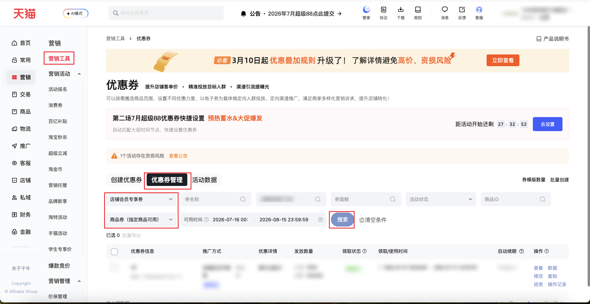

| 属性             | 值                                                                                                  |
| ---------------- | --------------------------------------------------------------------------------------------------- |
| **连接器类型**   | `RPA 连接器`                                                                                        |
| **连接器名称**   | `ODS_营销优惠券商品列表(千牛RPA)`                                                                   |
| **连接器代码**   | `rpa.conn.qianniu.marketing.coupon.item.list`                                                       |
| **操作类型**     | `页面解析`                                                                                          |
| **目标网页**     | `https://qn.taobao.com/home.htm/coupon?isFirst=true&isNew=true&defaultTab=itemCouponList`            |
| **适用场景**     | 按推广方式、商品生效范围、可用时间等条件采集优惠券管理中的商品券列表，完整保留平台返回的活动字段及嵌套结构 |
| **数据表名**     | `ods_rpa_qianniu_marketing_coupon_item_list_du`                                                      |
| **业务表名**     | `ODS_营销优惠券商品列表(千牛RPA)`                                                                   |

### 目标页面

> **取数路径**：千牛后台—营销—营销工具—优惠券—优惠券管理
>
> **取数链接**：[https://qn.taobao.com/home.htm/coupon?isFirst=true&isNew=true&defaultTab=itemCouponList](https://qn.taobao.com/home.htm/coupon?isFirst=true&isNew=true&defaultTab=itemCouponList)



### 业务入参

| 字段 | 中文释义 | 数据类型 | 必填 | 默认值 | 说明 |
| ---- | -------- | -------- | ---- | ------ | ---- |
| `promote_type` | 推广方式 | `String` | 否 | `店铺会员专享券` | 按页面推广方式名称进行包含匹配，且须唯一匹配。页面中没有匹配项时，任务将失败软退出并返回空数据，不写入存储；同时通过 `available_promote_types` 返回页面中的全部可选推广方式。匹配到多个选项时同样失败软退出，并额外通过 `matched_promote_types` 返回匹配项 |
| `item_scope` | 商品生效范围 | `String` | 否 | `ITEM_COUPON` | 可选值：`ITEM_COUPON`（商品券，指定商品可用）、`SHOP_COUPON`（店铺券，全店可用） |
| `custom_start_date` | 可用开始日期 | `String` | 否 | 当天 | 格式：`YYYYMMDD` 或 `YYYY-MM-DD` |
| `custom_end_date` | 可用结束日期 | `String` | 否 | 开始日期后 30 日 | 格式：`YYYYMMDD` 或 `YYYY-MM-DD`；不能早于可用开始日期 |
| `coupon_name` | 券名称 | `String` | 否 | 空字符串 | 按券名称筛选 |
| `coupon_id` | 券 ID | `String` | 否 | 空字符串 | 按券 ID 筛选 |
| `coupon_amount` | 券面额 | `String` | 否 | 空字符串 | 按券面额筛选 |
| `item_id` | 商品 ID | `String` | 否 | 空字符串 | 按商品 ID 筛选 |

### 入参样例

```json
{}
```

### 入参校验

```json-schema collapsed
{
  "$schema": "https://json-schema.org/draft/2020-12/schema",
  "title": "千牛-营销优惠券商品列表 - 查询入参",
  "description": "按推广方式、商品生效范围、可用时间等条件采集优惠券管理中的商品券列表，完整保留平台返回的活动字段及嵌套结构",
  "type": "object",
  "properties": {
    "promote_type": {
      "type": "string",
      "description": "推广方式，按页面推广方式名称进行包含匹配且须唯一匹配；没有匹配项或匹配到多个选项时，任务失败软退出并返回空数据、不写入存储，同时返回页面中的全部可选推广方式",
      "default": "店铺会员专享券"
    },
    "item_scope": {
      "type": "string",
      "description": "商品生效范围",
      "enum": [
        "ITEM_COUPON",
        "SHOP_COUPON"
      ],
      "default": "ITEM_COUPON"
    },
    "custom_start_date": {
      "type": "string",
      "description": "可用开始日期，未提供时默认为任务执行当天，格式为 YYYYMMDD 或 YYYY-MM-DD",
      "pattern": "^(?:\\d{8}|\\d{4}-\\d{2}-\\d{2})$"
    },
    "custom_end_date": {
      "type": "string",
      "description": "可用结束日期，未提供时默认为开始日期后 30 日，格式为 YYYYMMDD 或 YYYY-MM-DD，且不能早于开始日期",
      "pattern": "^(?:\\d{8}|\\d{4}-\\d{2}-\\d{2})$"
    },
    "coupon_name": {
      "type": "string",
      "description": "用于筛选的券名称",
      "default": ""
    },
    "coupon_id": {
      "type": "string",
      "description": "用于筛选的券 ID",
      "default": ""
    },
    "coupon_amount": {
      "type": "string",
      "description": "用于筛选的券面额",
      "default": ""
    },
    "item_id": {
      "type": "string",
      "description": "用于筛选的商品 ID",
      "default": ""
    }
  },
  "required": [],
  "additionalProperties": false
}
```

### 数据字段

连接器完整保留页面返回的活动记录顶层字段；`feature`、`statusDesc`、`optionList`、`renewalInfoDTO` 等嵌套对象或数组保持原结构，不做扁平化。

原商品券列表的八个业务字段均可由当前原始字段直接读取或派生：

| 业务字段 | 原始字段 | 取值说明 |
| -------- | -------- | -------- |
| `coupon_id` | `templateCode` | 直接取优惠券模板代码 |
| `promote_type` | `tagName`、`couponType`、`tagLabel` | 将推广标签名称、优惠券类型中文名和推广标签说明组合为页面展示文案 |
| `discount_detail` | `threshold` | 直接取优惠门槛说明 |
| `claimed_count` | `applyCount` | 直接取已领取数量 |
| `total_count` | `totalCount` | 直接取发放总量 |
| `claim_status` | `statusDesc.label` | 取状态描述中的中文名称 |
| `use_time_text` | `startTime`、`endTime` | 将毫秒时间戳格式化为优惠券使用时间范围 |
| `auto_renewal` | `renewalInfoDTO.autoRenewal`、`renewalInfoDTO.renewalStatus` | 根据续期开关及续期状态映射为自动续期说明 |

> 当前连接器输出保留原始字段名和结构，不再额外生成上述 snake_case 业务字段；下游可按对应关系读取或派生。

| 字段 | 中文释义 | 数据类型 | 可为空 | 取数路径 | 示例 |
| ---- | -------- | -------- | ------ | -------- | ---- |
| `unionCreateDTOList` | 联合创建信息 | `List[Dict]` | 否 | 页面解析 | `[]` |
| `processResult` | 处理结果 | `Dict` | 是 | 页面解析 | `null` |
| `mainAccountId` | 主账号 ID | `String` | 是 | 页面解析 | `null` |
| `operatorId` | 操作人 ID | `String` | 是 | 页面解析 | `null` |
| `enterpriseId` | 企业 ID | `String` | 是 | 页面解析 | `null` |
| `activityId` | 活动 ID | `Number` | 是 | 页面解析 | `null` |
| `detailId` | 活动明细 ID | `Number` | 是 | 页面解析 | `null` |
| `itemId` | 商品 ID | `Number` | 是 | 页面解析 | `null` |
| `skuId` | SKU ID | `Number` | 是 | 页面解析 | `null` |
| `id` | 记录 ID | `Number` | 是 | 页面解析 | `null` |
| `draftId` | 草稿 ID | `Number` | 是 | 页面解析 | `null` |
| `useDraft` | 是否使用草稿 | `Boolean` | 否 | 页面解析 | `false` |
| `templateId` | 模板 ID | `Number` | 是 | 页面解析 | `null` |
| `writeType` | 写入类型 | `Number` | 否 | 页面解析 | `0` |
| `bizCode` | 业务代码 | `String` | 是 | 页面解析 | `null` |
| `sceneCode` | 场景代码 | `String` | 是 | 页面解析 | `null` |
| `name` | 优惠券名称 | `String` | 否 | 页面解析 | `220` |
| `description` | 优惠券描述 | `String` | 是 | 页面解析 | `null` |
| `startTime` | 开始时间戳 | `Number` | 否 | 页面解析 | `1782835200000` |
| `endTime` | 结束时间戳 | `Number` | 否 | 页面解析 | `1785513599000` |
| `warmupStartTime` | 预热开始时间戳 | `Number` | 是 | 页面解析 | `null` |
| `status` | 状态代码 | `Number` | 否 | 页面解析 | `1` |
| `rawStatus` | 原始状态 | `String` | 是 | 页面解析 | `null` |
| `toolCode` | 工具代码 | `String` | 是 | 页面解析 | `null` |
| `promotionName` | 推广名称 | `String` | 是 | 页面解析 | `null` |
| `type` | 类型 | `String` | 是 | 页面解析 | `null` |
| `actChannel` | 活动渠道 | `String` | 是 | 页面解析 | `null` |
| `channel` | 渠道 | `String` | 是 | 页面解析 | `null` |
| `actFlag` | 活动标识 | `String` | 是 | 页面解析 | `null` |
| `wirelessActInfo` | 无线活动信息 | `Dict` | 是 | 页面解析 | `null` |
| `createTime` | 创建时间戳 | `Number` | 否 | 页面解析 | `1782638342000` |
| `modifyTime` | 修改时间戳 | `Number` | 是 | 页面解析 | `null` |
| `promotionLevel` | 推广层级 | `Number` | 是 | 页面解析 | `null` |
| `detailUpdateType` | 明细更新类型 | `String` | 是 | 页面解析 | `null` |
| `crowdId` | 人群 ID | `Number` | 是 | 页面解析 | `null` |
| `crowdType` | 人群类型 | `String` | 是 | 页面解析 | `null` |
| `details` | 活动明细 | `List[Dict]` | 是 | 页面解析 | `null` |
| `processFailDetails` | 处理失败明细 | `List[Dict]` | 是 | 页面解析 | `null` |
| `activityLimitConfigList` | 活动限制配置 | `List[Dict]` | 是 | 页面解析 | `null` |
| `itemIds` | 商品 ID 列表 | `List[String]` | 是 | 页面解析 | `null` |
| `activityType` | 活动类型 | `String` | 是 | 页面解析 | `null` |
| `preCheck` | 预检查信息 | `Dict` | 是 | 页面解析 | `null` |
| `mktJob` | 营销任务 | `Dict` | 是 | 页面解析 | `null` |
| `mktJobConfigDTO` | 营销任务配置 | `Dict` | 是 | 页面解析 | `null` |
| `operationType` | 操作类型 | `String` | 是 | 页面解析 | `null` |
| `options` | 活动选项 | `Dict` | 是 | 页面解析 | `null` |
| `rateHost` | 折扣信息 | `String` | 是 | 页面解析 | `null` |
| `promotionType` | 推广类型 | `String` | 是 | 页面解析 | `null` |
| `participateRange` | 参与范围 | `String` | 是 | 页面解析 | `null` |
| `mktChannel` | 营销渠道 | `String` | 是 | 页面解析 | `null` |
| `mktJobInstanceVO` | 营销任务实例 | `Dict` | 是 | 页面解析 | `null` |
| `fromHSF` | 是否来自 HSF | `Boolean` | 否 | 页面解析 | `false` |
| `feature` | 活动扩展特征 | `Dict` | 否 | 页面解析 | 见数据样例 |
| `operationParam` | 操作参数 | `Dict` | 否 | 页面解析 | `{}` |
| `extra` | 扩展信息 | `Dict` | 否 | 页面解析 | `{}` |
| `errorType` | 错误类型 | `String` | 是 | 页面解析 | `null` |
| `errorMsg` | 错误消息 | `String` | 是 | 页面解析 | `null` |
| `outerReq` | 是否外部请求 | `Boolean` | 否 | 页面解析 | `false` |
| `needFillDetail` | 是否需要补充明细 | `Boolean` | 否 | 页面解析 | `true` |
| `detailSkipActCheck` | 明细是否跳过活动检查 | `Boolean` | 否 | 页面解析 | `false` |
| `onlyProcessAllDetails` | 是否仅处理全部明细 | `Boolean` | 否 | 页面解析 | `false` |
| `skipTagFill` | 是否跳过标签填充 | `Boolean` | 否 | 页面解析 | `false` |
| `templateFileMark` | 模板文件标识 | `String` | 是 | 页面解析 | `null` |
| `wireless` | 是否无线活动 | `Boolean` | 否 | 页面解析 | `false` |
| `recordFlag` | 记录标识 | `Number` | 否 | 页面解析 | `0` |
| `allowParticipateRepeat` | 是否允许重复参与 | `Boolean` | 是 | 页面解析 | `null` |
| `requestFrom` | 请求来源 | `String` | 是 | 页面解析 | `null` |
| `referParam` | 引用参数 | `Dict` | 是 | 页面解析 | `null` |
| `skipOperationLog` | 是否跳过操作日志 | `Boolean` | 是 | 页面解析 | `null` |
| `money` | 金额 | `Number` | 是 | 页面解析 | `null` |
| `count` | 数量 | `Number` | 是 | 页面解析 | `null` |
| `actNotSupportModify` | 活动是否不支持修改 | `Boolean` | 是 | 页面解析 | `null` |
| `forceDelete` | 是否强制删除 | `Boolean` | 是 | 页面解析 | `null` |
| `preCheckNotInterdict` | 预检查是否不中断 | `Boolean` | 是 | 页面解析 | `null` |
| `preCheckNotInterdictAndProcessSuccess` | 预检查不中断且处理成功 | `Boolean` | 是 | 页面解析 | `null` |
| `simplifyCreateResult` | 简化创建结果 | `Dict` | 是 | 页面解析 | `null` |
| `totalCount` | 发放总量 | `Number` | 否 | 页面解析 | `100000` |
| `limit` | 限制信息 | `Dict` | 是 | 页面解析 | `null` |
| `mktSource` | 营销来源 | `String` | 是 | 页面解析 | `null` |
| `immuneRisk` | 是否豁免风险 | `Boolean` | 是 | 页面解析 | `null` |
| `appLockEnable` | 是否启用应用锁 | `Boolean` | 是 | 页面解析 | `null` |
| `needDealSentinelException` | 是否处理限流异常 | `Boolean` | 否 | 页面解析 | `false` |
| `timeoutThrowException` | 超时是否抛出异常 | `Boolean` | 否 | 页面解析 | `false` |
| `uuid` | 唯一标识 | `String` | 否 | 页面解析 | `b9b****3d4` (已脱敏) |
| `templateCode` | 优惠券模板代码 | `Number` | 否 | 页面解析 | `138****949` (已脱敏) |
| `couponType` | 优惠券类型 | `Number` | 否 | 页面解析 | `1` |
| `subType` | 优惠券子类型 | `Number` | 否 | 页面解析 | `0` |
| `personLimit` | 每人限领数量 | `Number` | 否 | 页面解析 | `5` |
| `applyCount` | 已领取数量 | `Number` | 否 | 页面解析 | `0` |
| `businessUnit` | 业务单元 | `String` | 是 | 页面解析 | `null` |
| `spreadStartTime` | 推广开始时间戳 | `Number` | 是 | 页面解析 | `null` |
| `spreadEndTime` | 推广结束时间戳 | `Number` | 是 | 页面解析 | `null` |
| `displayStartTime` | 展示开始时间戳 | `Number` | 是 | 页面解析 | `null` |
| `displayEndTime` | 展示结束时间戳 | `Number` | 是 | 页面解析 | `null` |
| `couponTag` | 优惠券标签 | `String` | 否 | 页面解析 | `942****001` (已脱敏) |
| `amountYuan` | 优惠金额（元） | `String` | 否 | 页面解析 | `220` |
| `startFeeYuan` | 使用门槛（元） | `String` | 否 | 页面解析 | `600` |
| `bizSource` | 业务来源 | `String` | 是 | 页面解析 | `null` |
| `timeMode` | 时间模式 | `String` | 否 | 页面解析 | `0` |
| `effectiveTimeMode` | 生效时间模式 | `String` | 否 | 页面解析 | `FIXED_START_END_TIME` |
| `effectiveInterval` | 生效间隔 | `Number` | 否 | 页面解析 | `0` |
| `effectiveMin` | 生效分钟数 | `Number` | 是 | 页面解析 | `null` |
| `effectiveHour` | 生效小时数 | `Number` | 是 | 页面解析 | `null` |
| `effectiveDay` | 生效天数 | `Number` | 是 | 页面解析 | `null` |
| `lowestDiscount` | 最低折扣 | `Number` | 是 | 页面解析 | `null` |
| `statusDesc` | 状态描述 | `Dict` | 否 | 页面解析 | `{"value":"APPLING","label":"领取中"}` |
| `tagId` | 推广标签 ID | `String` | 否 | 页面解析 | `942****001` (已脱敏) |
| `tagName` | 推广标签名称 | `String` | 否 | 页面解析 | 店铺会员专享券 |
| `tagLabel` | 推广标签说明 | `String` | 否 | 页面解析 | 促转化 |
| `tagColor` | 推广标签颜色 | `String` | 否 | 页面解析 | `#FE8533` |
| `threshold` | 优惠门槛说明 | `String` | 否 | 页面解析 | 满600减220 |
| `optionList` | 可用操作列表 | `List[Dict]` | 否 | 页面解析 | 见数据样例 |
| `activityUrl` | 活动链接 | `String` | 是 | 页面解析 | `null` |
| `itemSize` | 商品数量 | `Number` | 是 | 页面解析 | `null` |
| `unConditional` | 是否无门槛 | `Boolean` | 否 | 页面解析 | `false` |
| `expireRemind` | 到期提醒 | `Dict` | 是 | 页面解析 | `null` |
| `relActivity` | 关联活动 | `Dict` | 是 | 页面解析 | `null` |
| `itemInfoList` | 商品信息列表 | `List[Dict]` | 是 | 页面解析 | `null` |
| `bizTagId` | 业务标签 ID | `String` | 是 | 页面解析 | `null` |
| `fissionActivityId` | 裂变活动 ID | `String` | 是 | 页面解析 | `null` |
| `token` | 令牌 | `String` | 是 | 页面解析 | `null` |
| `couponShareLink` | 优惠券分享链接 | `String` | 是 | 页面解析 | `null` |
| `couponEncrypted` | 优惠券加密信息 | `String` | 是 | 页面解析 | `null` |
| `fissionShape` | 裂变形态 | `String` | 是 | 页面解析 | `null` |
| `renewalInfoDTO` | 自动续期信息 | `Dict` | 否 | 页面解析 | 见数据样例 |
| `promoCode` | 推广代码 | `String` | 是 | 页面解析 | `null` |
| `smartRateHost` | 是否智能折扣 | `Boolean` | 否 | 页面解析 | `false` |
| `innerJobRequest` | 是否内部任务请求 | `Boolean` | 否 | 页面解析 | `false` |
| `batchCreateActivity` | 是否批量创建活动 | `Boolean` | 否 | 页面解析 | `false` |
| `zhaoshang` | 是否招商活动 | `Boolean` | 否 | 页面解析 | `false` |
| `taskId` | 任务 ID | `String` | 否 | 附加 | `dev****296` (已脱敏) |
| `bizDate` | 业务日期 | `String` | 否 | 附加 | `20260716` |
| `accountId` | 授权 ID | `String` | 否 | 附加 | `1****6` (已脱敏) |

### 数据样例

```json
[
  {
    "unionCreateDTOList": [],
    "processResult": null,
    "mainAccountId": null,
    "operatorId": null,
    "enterpriseId": null,
    "activityId": null,
    "detailId": null,
    "itemId": null,
    "skuId": null,
    "id": null,
    "draftId": null,
    "useDraft": false,
    "templateId": null,
    "writeType": 0,
    "bizCode": null,
    "sceneCode": null,
    "name": "220",
    "description": null,
    "startTime": 1782835200000,
    "endTime": 1785513599000,
    "warmupStartTime": null,
    "status": 1,
    "rawStatus": null,
    "toolCode": null,
    "promotionName": null,
    "type": null,
    "actChannel": null,
    "channel": null,
    "actFlag": null,
    "wirelessActInfo": null,
    "createTime": 1782638342000,
    "modifyTime": null,
    "promotionLevel": null,
    "detailUpdateType": null,
    "crowdId": null,
    "crowdType": null,
    "details": null,
    "processFailDetails": null,
    "activityLimitConfigList": null,
    "itemIds": null,
    "activityType": null,
    "preCheck": null,
    "mktJob": null,
    "mktJobConfigDTO": null,
    "operationType": null,
    "options": null,
    "rateHost": null,
    "promotionType": null,
    "participateRange": null,
    "mktChannel": null,
    "mktJobInstanceVO": null,
    "fromHSF": false,
    "feature": {
      "applyPlace": "0",
      "spreadId": "147****132",
      "detailId": "301****316",
      "e_appName": "passport-web",
      "uuid": "b9b****3d4",
      "activityId": "138****949",
      "toolId": "862****001",
      "memberActStart": "1782835200000",
      "options": "19",
      "participateId": "215****896",
      "participateRange": "1",
      "couponCenterTemplateId": "202****171",
      "perLimit": "5",
      "amount": "22000",
      "draftId": "168****869",
      "memberActEnd": "1785513599000",
      "appName": "mkt-shell",
      "memberLevel": "1",
      "calculateLevel": "2",
      "rbac": "true",
      "mbrPerLimit": "5",
      "perLimitType": "0",
      "mkt_source_biz": "$|$|$|$",
      "couponV2": "1",
      "discountFeeMode": "0",
      "memberCardTag": "1",
      "tags": "942****001",
      "goBuyerGeneralLimit": "true",
      "toolCode": "itemCoupon",
      "ump_op": "dec****0",
      "spreadType": "1",
      "bizSource": "",
      "regionId": "",
      "participateType": "3",
      "startFee": "60000",
      "siteId": "",
      "autoRenewal": "false",
      "timeMode": "0",
      "useAt": "0",
      "buyerDriveFlag": "true"
    },
    "operationParam": {},
    "extra": {},
    "errorType": null,
    "errorMsg": null,
    "outerReq": false,
    "needFillDetail": true,
    "detailSkipActCheck": false,
    "onlyProcessAllDetails": false,
    "skipTagFill": false,
    "templateFileMark": null,
    "wireless": false,
    "recordFlag": 0,
    "allowParticipateRepeat": null,
    "requestFrom": null,
    "referParam": null,
    "skipOperationLog": null,
    "money": null,
    "count": null,
    "actNotSupportModify": null,
    "forceDelete": null,
    "preCheckNotInterdict": null,
    "preCheckNotInterdictAndProcessSuccess": null,
    "simplifyCreateResult": null,
    "totalCount": 100000,
    "limit": null,
    "mktSource": null,
    "immuneRisk": null,
    "appLockEnable": null,
    "needDealSentinelException": false,
    "timeoutThrowException": false,
    "uuid": "b9b****3d4",
    "templateCode": "138****949",
    "couponType": 1,
    "subType": 0,
    "personLimit": 5,
    "applyCount": 0,
    "businessUnit": null,
    "spreadStartTime": null,
    "spreadEndTime": null,
    "displayStartTime": null,
    "displayEndTime": null,
    "couponTag": "942****001",
    "amountYuan": "220",
    "startFeeYuan": "600",
    "bizSource": null,
    "timeMode": "0",
    "effectiveTimeMode": "FIXED_START_END_TIME",
    "effectiveInterval": 0,
    "effectiveMin": null,
    "effectiveHour": null,
    "effectiveDay": null,
    "lowestDiscount": null,
    "statusDesc": {
      "value": "APPLING",
      "label": "领取中"
    },
    "tagId": "942****001",
    "tagName": "店铺会员专享券",
    "tagLabel": "促转化",
    "tagColor": "#FE8533",
    "threshold": "满600减220",
    "optionList": [
      {
        "text": "查看",
        "url": null,
        "enable": true,
        "order": null,
        "type": "view",
        "action": null,
        "supportStatus": [
          "APPLING",
          "IN_USE",
          "APPLY_FINISH",
          "NOT_USE",
          "TO_END",
          "FINISH"
        ]
      },
      {
        "text": "数据",
        "url": null,
        "enable": true,
        "order": null,
        "type": "data",
        "action": null,
        "supportStatus": [
          "APPLING",
          "IN_USE",
          "APPLY_FINISH",
          "NOT_USE",
          "TO_END",
          "FINISH"
        ]
      },
      {
        "text": "修改",
        "url": null,
        "enable": true,
        "order": null,
        "type": "modify",
        "action": null,
        "supportStatus": [
          "APPLING",
          "IN_USE",
          "APPLY_FINISH",
          "NOT_USE",
          "TO_END"
        ]
      },
      {
        "text": "复制",
        "url": null,
        "enable": true,
        "order": null,
        "type": "copy",
        "action": null,
        "supportStatus": [
          "APPLING",
          "IN_USE",
          "APPLY_FINISH",
          "NOT_USE",
          "TO_END",
          "FINISH"
        ]
      },
      {
        "text": "推广",
        "url": null,
        "enable": false,
        "order": null,
        "type": "getLink",
        "action": null,
        "supportStatus": [
          "APPLING",
          "IN_USE",
          "APPLY_FINISH",
          "NOT_USE",
          "TO_END"
        ]
      },
      {
        "text": "推广",
        "url": null,
        "enable": false,
        "order": null,
        "type": "getLink",
        "action": null,
        "supportStatus": [
          "APPLING",
          "IN_USE",
          "APPLY_FINISH",
          "TO_END"
        ]
      },
      {
        "text": "结束",
        "url": null,
        "enable": true,
        "order": null,
        "type": "end",
        "action": null,
        "supportStatus": [
          "APPLING",
          "IN_USE",
          "APPLY_FINISH",
          "NOT_USE",
          "TO_END"
        ]
      }
    ],
    "activityUrl": null,
    "itemSize": null,
    "unConditional": false,
    "expireRemind": null,
    "relActivity": null,
    "itemInfoList": null,
    "bizTagId": null,
    "fissionActivityId": null,
    "token": null,
    "couponShareLink": null,
    "couponEncrypted": null,
    "fissionShape": null,
    "renewalInfoDTO": {
      "autoRenewal": null,
      "renewalStatus": "UNSUPPORTED_RENEWAL",
      "unsupportedReasonMap": {
        "COUPON_RENEWAL_UNSUPPORT_CHANNEL": "当前券类型不支持开启自动续期"
      },
      "canNotSetReasonMap": {},
      "renewalTemplateId": null,
      "renewalFailReason": null
    },
    "promoCode": null,
    "smartRateHost": false,
    "innerJobRequest": false,
    "batchCreateActivity": false,
    "zhaoshang": false,
    "bizDate": "20260716",
    "accountId": "1****6",
    "taskId": "dev****296"
  }
]
```

---
